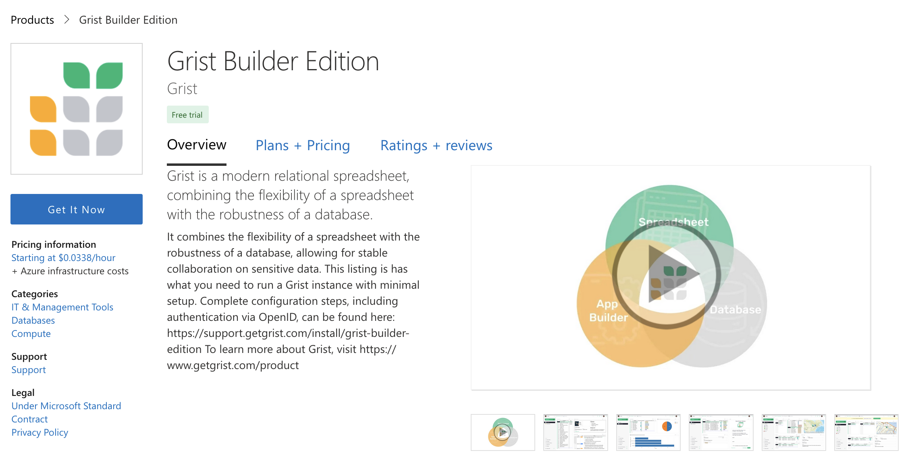
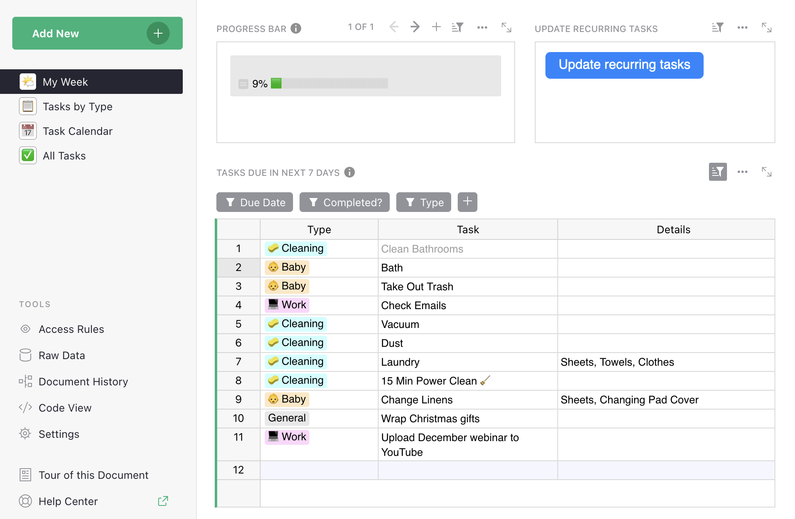
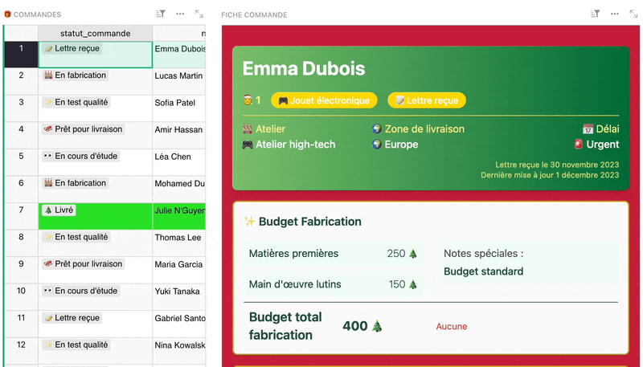
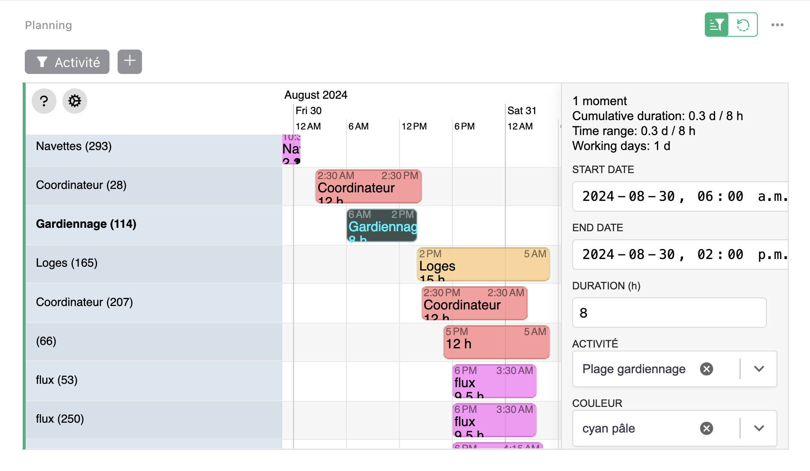
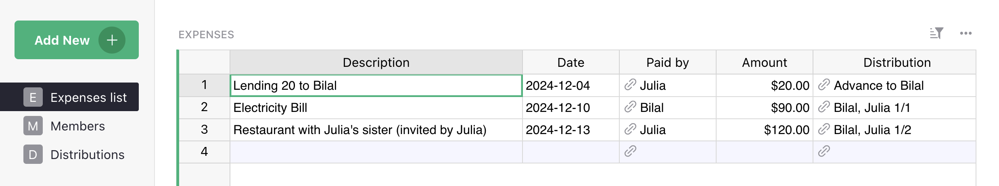

# December 2024 Newsletter

<table class="header" cellpadding="0" cellspacing="0" border="0"><tr>
  <td class="header-text">
    <table class="header-top"><tr>
      <td class="header-image">
        
      </td>
      <td class="header-top-text">
        
Grist for the Mill

        
December 2024
          &#8226; <a href="https://www.getgrist.com/">getgrist.com</a>

      </td>
    </tr></table>
    

      Welcome to our monthly newsletter of updates and tips for Grist users.
    

  </td>
</tr></table>

## What's old

{:target="\_blank"}

Check out our [annual retrospective](https://www.getgrist.com/blog/grist-2024-year-in-review/){:target="\_blank"} to see what changed with Grist over the past twelve months, including underrated features and a community contributions collage.

## What's new

### Run Grist on Azure

Last month we mentioned that Grist is now [available on the AWS marketplace](https://aws.amazon.com/marketplace/pp/prodview-tew3ygop5xxy4?sr=0-1&ref_=beagle&applicationId=AWSMPContessa){:target="\_blank"}. This month, we get to announce that you can also find Grist on the [Azure marketplace](https://azuremarketplace.microsoft.com/en-us/marketplace/apps/grist.grist-builder-edition){:target="\_blank"}. The easiest way to set up a self-hosted instance, just got... another option.

### Security update

On December 17th we released a build with several bugfixes found during a security audit. If you're using Grist at getgrist.com, rest easy – the bugfixes have been patched. Self-hosters are recommended to update to `grist-core` version 1.3.2 as soon as possible.

Release notes: [https://github.com/gristlabs/grist-core/releases/tag/v1.3.2](https://github.com/gristlabs/grist-core/releases/tag/v1.3.2){:target="\_blank"}

### Grist Paris Summit

*Pictured: CTO Paul, software engineer Jarek, and co-CEOs Anais & Dmitry*

On December 3rd, we were lucky enough to take part in the first [Grist Summit in Paris](https://lasuite.numerique.gouv.fr/grist-paris-summit-2024){:target="\_blank"}, co-organized by DINUM’s Grist Gouv team, La Suite numérique, and ANCT. A hearty thanks to all organizers and attendees for a successful event!

Expect more from this event in the new year, but Dmitry posted a [comprehensive roundup](https://www.linkedin.com/feed/update/urn:li:activity:7270578128572366849/){:target="\_blank"} and a [summary of shared Grist use cases](https://www.linkedin.com/feed/update/urn:li:activity:7272962732570660864/){:target="\_blank"} on LinkedIn which are worth a look! Also, Paul and Jarek were nice enough to repeat their [well-attended talk on Grist’s custom widget builder widget](https://www.getgrist.com/webinars/custom-widget-builder/){:target="\_blank"}.

### New template - Recurring tasks ♻️

We’ve just released a [new template](https://www.getgrist.com/templates/recurring-tasks/){:target="\_blank"} which shows how to track TODOs that repeat, so you can mark them complete, and then reset them for another cycle. A task tracker’s work is never done! 

### SCIM in Grist

Early support for SCIM ([System for Cross-domain Identity Management](https://scim.cloud/){:target="\_blank"}) has been added to Grist, for any self-hosters who manage users across multiple services. Unfortunately, this very useful feature does not lend itself well to a neat-looking screenshot. 😔

Learn more about it in our [Help Center](https://support.getgrist.com/install/scim/#scim){:target="\_blank"}.

## Community highlights

It’s no coincidence that this month’s highlights are full of custom widgets. The [new custom widget builder custom widget](https://community.getgrist.com/t/new-community-widget-custom-widget-builder/6803){:target="\_blank"} has had a hand in making custom widget-making handier. Say that ten times fast!

* celine_delval shared a [beautiful custom widget](https://community.getgrist.com/t/tutorial-building-santas-workshop-dashboard-with-custom-widget-builder-a-step-by-step-guide-to-advanced-visualization-in-grist/7478){:target="\_blank"} (built using the aforementioned builder) just in time for Santa’s season, though I’m sure there are countless non-yule applications. 🎅

* Raphael_Guinot shared (and updated) his [ambitious timeline widget](https://community.getgrist.com/t/ws-timeline-timeline-widget/7424/10){:target="\_blank"}, replete with custom shortcuts, a Gantt tool, and PDF exporting (!).

* Edouard_Gomez-Vaez solved a frequent issue of multiparty cost splitting with his simple yet powerful [shared expenses widget](https://community.getgrist.com/t/shared-expenses-template/7592){:target="\_blank"}.

* Jordi (who works at Grist), shared a peek at his custom sunburst graph built using the builder to visualize his NES collection/shopping list.

Working on something cool with Grist? Let us know by posting in the [Showcase forum](https://community.getgrist.com/c/showcase/8){:target="\_blank"} or our [#grist-showcase Discord channel](https://discord.gg/MYKpYQ3fbP){:target="\_blank"}!

## Learning Grist

### Webinar - Migrating data from Excel to Grist: Team Expenses

Say goodbye to spreadsheet chaos! Join us to see how Grist improves upon Excel-based expense tracking. We’ll show you how to import data from Excel and Google Sheets, set up dashboards, and manage access control.

**Thursday, January 23 at 3:00pm US Eastern Time.**

{:target="\_blank"}

[SIGN UP FOR JANUARY'S WEBINAR](https://www.getgrist.com/webinars/migrating-data-from-excel-to-grist-team-expenses/?utm_source=support-newsletter&utm_medium=internal&utm_campaign=build-webinar&utm_term=january-2025){:target="\_blank"}
{: .grist-button}

### Building custom widgets w/ Paul and Jarek

Couldn't make it to the Grist Summit in Paris? No worries! Watch our December webinar to see Grist Labs' very own CTO Paul and developer Jarek present their talk on Grist's custom widget builder. Learn from the devs themselves how to create your own custom widget, step-by-step!

[WATCH DECEMBER'S RECORDING](https://www.getgrist.com/webinars/custom-widget-builder/){:target="\_blank"}
{: .grist-button}

## Help spread the word
If you’re interested in helping Grist grow, consider leaving a review on product review sites. Here’s a short list where your review could make a big impact. Thank you! 🙏

* [AlternativeTo](https://alternativeto.net/software/grist/about/){:target="\_blank"}
* [Capterra](https://www.capterra.com/p/232821/Grist/){:target="\_blank"}
* [G2](https://www.g2.com/products/grist){:target="\_blank"}
* [TrustRadius](https://www.trustradius.com/products/grist/){:target="\_blank"}

## We are here to support you

**Professional services.** Grist often surprises people with its capabilities. Schedule a **free** call to assess your needs and help connect you with a Grist expert. [Learn more.](https://www.getgrist.com/professional-services/){:target="\_blank"}

**Have questions, feedback, or need help?** Search our [Help Center](../index.md), [watch video
tutorials](https://www.youtube.com/channel/UCx0ioQrrC-bIrkmZ7ZULr0g/playlists), share ideas in our
[Community Forum](https://community.getgrist.com), or contact us at <support@getgrist.com>.