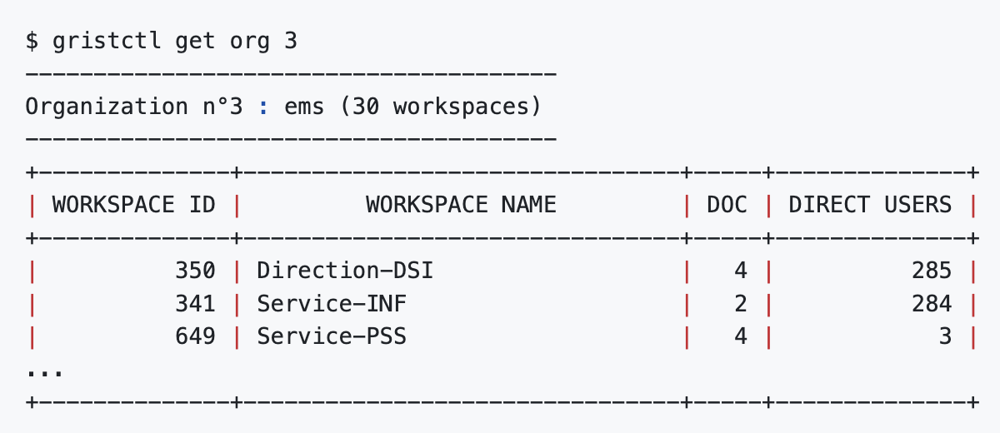
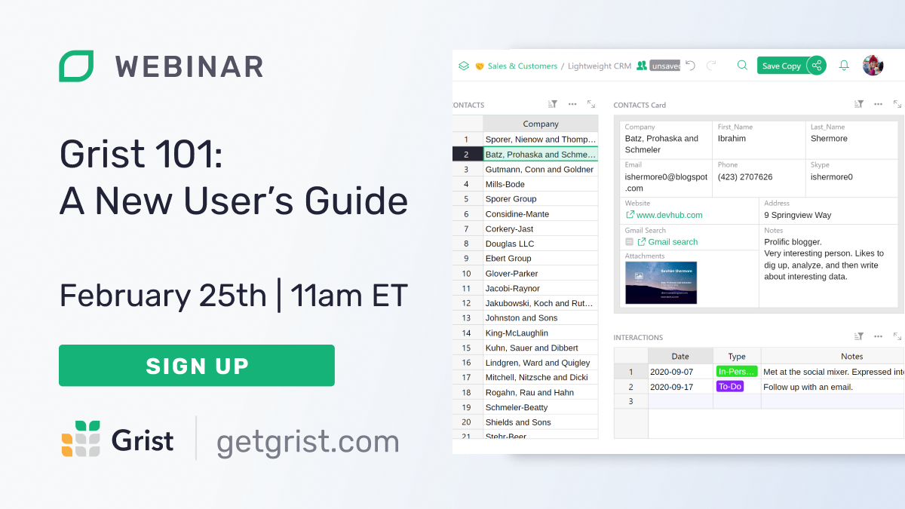

# January 2025 Newsletter

<table class="header" cellpadding="0" cellspacing="0" border="0"><tr>
  <td class="header-text">
    <table class="header-top"><tr>
      <td class="header-image">
        
      </td>
      <td class="header-top-text">
        
Grist for the Mill

        
January 2025
          &#8226; <a href="https://www.getgrist.com/">getgrist.com</a>

      </td>
    </tr></table>
    

      Welcome to our monthly newsletter of updates and tips for Grist users.
    

  </td>
</tr></table>

## What's new

### Dedicated servers

Want to self-host Grist, but can't spare the resources to set-up and maintain your own server? We can help! [Get in touch](https://www.getgrist.com/contact/){:target="\_blank"} if you’d like to chat about your self-hosting needs and how we can help get you up and running on a dedicated server.

### Nicer document list

We’ve refreshed the layout and look of the document list, letting you assign an icon color and emoji for visual pop. 🌟

### Special webinar – Integrating an open-source solution into a national digital strategy

<iframe width="100%" height="400" src="https://www.youtube.com/embed/FdA0b-EnQUE?si=9i0k5BVwEIDl04lQ&amp;controls=0" title="YouTube video player" frameborder="0" allow="accelerometer; autoplay; clipboard-write; encrypted-media; gyroscope; picture-in-picture; web-share" referrerpolicy="strict-origin-when-cross-origin" allowfullscreen></iframe>

This week we had the pleasure of chatting with Vincent Viers of [DINUM](https://www.numerique.gouv.fr/dinum/){:target="\_blank"} and Nicolas Imbert of [ANCT](https://agence-cohesion-territoires.gouv.fr/){:target="\_blank"}, who present how Grist fits into [La Suite Numérique](https://lasuite.numerique.gouv.fr/){:target="\_blank"} - France’s ambitious, fully open-source toolchain used by thousands of public servants. This 30 minute webinar is the best peek into self-hosted Grist at a national scale. 

### Grist on Puter.com!

[Puter](https://puter.com/){:target="\_blank"} is a free, open-source and self-hostable “internet OS”. It’s a whole computer in your browser, and now Grist is available in its app center as the default app for opening .xlsx and .grist files (and an option for CSVs). 👩‍💻

### Understanding access rules and permissions in Grist

Access rules are one of Grist’s key features, allowing you to keep your data in one place and maintain effective collaboration, even across departments and with outside parties. Such power requires a bit more than the standard CRUD, so we’ve put together a [new blog post](https://www.getgrist.com/blog/building-collaborative-databases-without-data-security-compromises/){:target="\_blank"} and video to help explain Grist’s approach.

<iframe width="100%" height="400" src="https://www.youtube.com/embed/fG6x9AXWojM?si=IVWaevuYE_QnlwON&amp;controls=0" title="YouTube video player" frameborder="0" allow="accelerometer; autoplay; clipboard-write; encrypted-media; gyroscope; picture-in-picture; web-share" referrerpolicy="strict-origin-when-cross-origin" allowfullscreen></iframe>

In rather *fetching* style, `grist-core` has been [updated to v1.3.3](https://github.com/gristlabs/grist-core/releases/tag/v1.3.3){:target="\_blank"}. Click through for release notes. Thank you to our first-time contributors! 

## Community highlights

* Heloise_Ouvry of the city of Strasbourg has shared a [robust command line interface based on the Grist API](https://community.getgrist.com/t/grist-ctl-a-cli-tool-to-interact-with-grist-api/7887){:target="\_blank"} which handles a powerful suite of high-level commands, has a cute logo and sports some really sharp ASCII terminal tables. 🥹

* Riccardo Polignieri has continued is superb work on [Pygrister](https://community.getgrist.com/t/pygrister-a-python-client-for-the-grist-api/5015/13){:target="\_blank"}, adding [sessions support](https://pygrister.readthedocs.io/en/latest/misc.html#using-requests-sessions-in-pygrister){:target="\_blank"} for the eminent [Requests library](https://github.com/psf/requests){:target="\_blank"}.

* Amandine_Dugrain has shared a nifty [batch email composer custom widget](https://community.getgrist.com/t/new-custom-widget-batch-email-composer-with-bcc-management/7992){:target="\_blank"} that supports automatically adding recipients as BCC and opens in your default email client.

Working on something cool with Grist? Let us know by posting in the [Showcase forum](https://community.getgrist.com/c/showcase/8){:target="\_blank"} or our [#grist-showcase Discord channel](https://discord.gg/MYKpYQ3fbP){:target="\_blank"}!

## Learning Grist

### Webinar - Grist 101: A New User’s Guide

Join us for an introductory webinar designed to help new users navigate the basics of Grist. This session will provide you with the essential tools and knowledge to get started. We'll cover key features and best practices to maximize your productivity. Perfect for beginners, this webinar will set you on the path to becoming a Grist pro. Don't miss out—reserve your spot today!

**Tuesday February 25 at 11:00am US Eastern Time.**

**To our regular attendees:** Please note that the time and day of the week for this webinar is different than usual!

{:target="\_blank"}

[SIGN UP FOR FEBRUARY'S WEBINAR](https://www.getgrist.com/webinars/grist-101-a-new-users-guide/?utm_source=support-newsletter&utm_medium=internal&utm_campaign=build-webinar&utm_term=february-2025){:target="\_blank"}
{: .grist-button}

### Migrating data from Excel to Grist: Team Expenses

In January, we said goodbye to spreadsheet chaos and demonstrated how Grist improves upon Excel-based expense tracking. Watch as we walk through importing data from Excel and Google Sheets, setting up intuitive dashboards, and managing access control with ease.

[WATCH JANUARY'S RECORDING](https://www.getgrist.com/webinars/migrating-data-from-excel-to-grist-team-expenses/){:target="\_blank"}
{: .grist-button}

## Help spread the word
If you’re interested in helping Grist grow, consider leaving a review on product review sites. Here’s a short list where your review could make a big impact. Thank you! 🙏

* [AlternativeTo](https://alternativeto.net/software/grist/about/){:target="\_blank"}
* [Capterra](https://www.capterra.com/p/232821/Grist/){:target="\_blank"}
* [G2](https://www.g2.com/products/grist){:target="\_blank"}
* [TrustRadius](https://www.trustradius.com/products/grist/){:target="\_blank"}

## We are here to support you

**Professional services.** Grist often surprises people with its capabilities. Schedule a **free** call to assess your needs and help connect you with a Grist expert. [Learn more.](https://www.getgrist.com/professional-services/){:target="\_blank"}

**Have questions, feedback, or need help?** Search our [Help Center](../index.md), [watch video
tutorials](https://www.youtube.com/channel/UCx0ioQrrC-bIrkmZ7ZULr0g/playlists), share ideas in our
[Community Forum](https://community.getgrist.com), or contact us at <support@getgrist.com>.