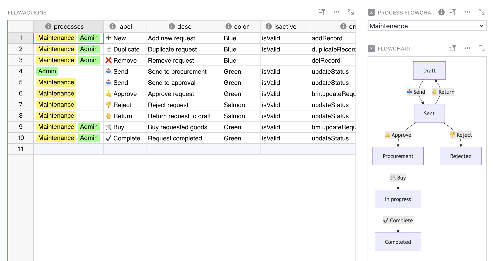

# February 2025 Newsletter

<table class="header" cellpadding="0" cellspacing="0" border="0"><tr>
  <td class="header-text">
    <table class="header-top"><tr>
      <td class="header-image">
        
      </td>
      <td class="header-top-text">
        
Grist for the Mill

        
February 2025
          &#8226; <a href="https://www.getgrist.com/">getgrist.com</a>

      </td>
    </tr></table>
    

      Welcome to our monthly newsletter of updates and tips for Grist users.
    

  </td>
</tr></table>

## What's new

### Spreadsheet Makeover

<iframe width="100%" height="400" src="https://www.youtube.com/embed/D2tuTdUVx3k?si=OetCRxTeB_NYnzIW&amp;controls=0" title="YouTube video player" frameborder="0" allow="accelerometer; autoplay; clipboard-write; encrypted-media; gyroscope; picture-in-picture; web-share" referrerpolicy="strict-origin-when-cross-origin" allowfullscreen></iframe>
 
We like to think we’ve improved many a spreadsheet here at Grist, but none more than our co-CEO Anais. Now she’s started a series where she helps those in need get a spreadsheet glow-up – and maybe Grist factors into the solution. You’ll have to watch to find out!

Anais’ makeovers are a fun look at common spreadsheet pitfalls, but also a great example of why we believe so much in Grist!

### External attachment storage

Previously, files in [attachment columns](https://support.getgrist.com/col-types/#attachment-columns){:target="\_blank"} exist in Grist documents as blobs (which is the technical term, by the way). Now self-hosters or those on a dedicated server Enterprise plan can host attachments externally in an S3-compatible store. 

This means that your `.grist` files can remain small even with large attachments, and that attachments have less of an impact on general and snapshot performance. More details can be found in the [Help Center](https://support.getgrist.com/document-settings/#external-attachments){:target="\_blank"}.

A huge thanks to [DINUM](https://www.numerique.gouv.fr/dinum/){:target="\_blank"} for roadmap sponsoring this feature!

### Nicer link previews

If there’s one thing we love, it’s people sharing Grist documents. This has been made lovelier thanks to a recent PR that updates the look of shared link previews from getgrist.com. Not only does it look nice, it’s much more informative and descriptive than the previous preview, which we decline to share or remind anyone of. 👍

There have been *three* `grist-core` releases in the last month, but here are the notable changes present in the [most recent v1.4.2 release](https://github.com/gristlabs/grist-core/releases/tag/v1.4.2){:target="\_blank"}.

* Externally-stored attachments are now available. 
* There is a new interface for managing Enterprise subscriptions.
* In an effort to prevent certain kinds of malicious activity, there is now a limit to the number of invitations pending acceptance that a user may send.
* Added `GRIST_MAX_NEW_USER_INVITES_PER_ORG` env variable.

Full changelogs are visible on our [releases page](https://github.com/gristlabs/grist-core/releases){:target="\_blank"}. 

### Other news

* We’ve officially announced the upcoming end of Python 2 support. Check out Paul’s [full post on the Community Forum](https://github.com/gristlabs/grist-core/releases){:target="\_blank"} for more details and migration tips.
* Natalie has written up an [excellent summary](https://community.getgrist.com/t/using-previous-for-cumulative-totals/8292){:target="\_blank"} of the very powerful `PREVIOUS()` function, particularly helpful with running/cumulative totals.
* We’ve added a small tooltip to help describe the very cool [“view as” functionality](https://support.getgrist.com/access-rules/#view-as-another-user){:target="\_blank"} that is extremely helpful when testing access rules.

## Community highlights

* Sylvain_Page has shared an exciting [Excalidraw custom widget](https://community.getgrist.com/t/custom-widget-excalidraw-grist-a-nice-combo/8552){:target="\_blank"} (with image support!). We also appreciate the very flattering demo chart he created, which we eagerly share below.

* Heloise_Ouvry is looking for potential contributors to a [community hub](https://community.getgrist.com/t/gristhub-your-new-hub-for-templates-and-widgets/8456){:target="\_blank"} for widgets and templates. Take a look if you’re interested!

* Based on nikobako’s [initial work](https://community.getgrist.com/t/mermaid-charts-integration/6938){:target="\_blank"}, Emanuele Gissi shared his version of a [simple Mermaid.js chart viewer](https://github.com/emanuelegissi/my-grist-widget?tab=readme-ov-file#mermaid-viewer-widget){:target="\_blank"} using Vue.js. Check out his example with a very nice [approval workflow](https://docs.getgrist.com/iFLERrF5h1rd/Approval-workflow/p/5){:target="\_blank"}. 😍

Working on something cool with Grist? Let us know by posting in the [Showcase forum](https://community.getgrist.com/c/showcase/8){:target="\_blank"} or our [#grist-showcase Discord channel](https://discord.gg/MYKpYQ3fbP){:target="\_blank"}!

## Learning Grist

### Webinar - Access Rules for Distributed Organizations

Access rules, accidents drool!

Join us for Access Rules for Distributed Organizations, where we’ll cover how to secure and manage data across multiple locations—without the headaches. Whether you're a retailer with multiple stores, a business operating in multiple regions, or a team managing client projects with different access levels, you'll learn how to lock down tables, columns, and rows to keep sensitive info in the right hands.

**Tuesday March 20 at 11:00am US Eastern Time.**

**To our regular attendees:** Please note that the time and day of the week for this webinar is different than usual!

{:target="\_blank"}

[SIGN UP FOR MARCH'S WEBINAR](https://www.getgrist.com/webinars/access-rules-for-distributed-organizations/?utm_source=support-newsletter&utm_medium=internal&utm_campaign=build-webinar&utm_term=march-2025){:target="\_blank"}
{: .grist-button}

### Migrating data from Excel to Grist: Team Expenses

In February, Natalie hosted an introductory webinar designed to help new users navigate the basics of Grist. This session provided users with the essential tools and knowledge to get started. We covered key features and best practices to maximize your productivity. Perfect for beginners!

[WATCH FEBRUARY'S RECORDING](https://www.getgrist.com/webinars/grist-101-new-users-guide-august-2024/){:target="\_blank"}
{: .grist-button}

## Help spread the word
If you’re interested in helping Grist grow, consider leaving a review on product review sites. Here’s a short list where your review could make a big impact. Thank you! 🙏

* [AlternativeTo](https://alternativeto.net/software/grist/about/){:target="\_blank"}
* [Capterra](https://www.capterra.com/p/232821/Grist/){:target="\_blank"}
* [G2](https://www.g2.com/products/grist){:target="\_blank"}
* [TrustRadius](https://www.trustradius.com/products/grist/){:target="\_blank"}

## We are here to support you

**Professional services.** Grist often surprises people with its capabilities. Schedule a **free** call to assess your needs and help connect you with a Grist expert. [Learn more.](https://www.getgrist.com/professional-services/){:target="\_blank"}

**Have questions, feedback, or need help?** Search our [Help Center](../index.md), [watch video
tutorials](https://www.youtube.com/channel/UCx0ioQrrC-bIrkmZ7ZULr0g/playlists), share ideas in our
[Community Forum](https://community.getgrist.com), or contact us at <support@getgrist.com>.