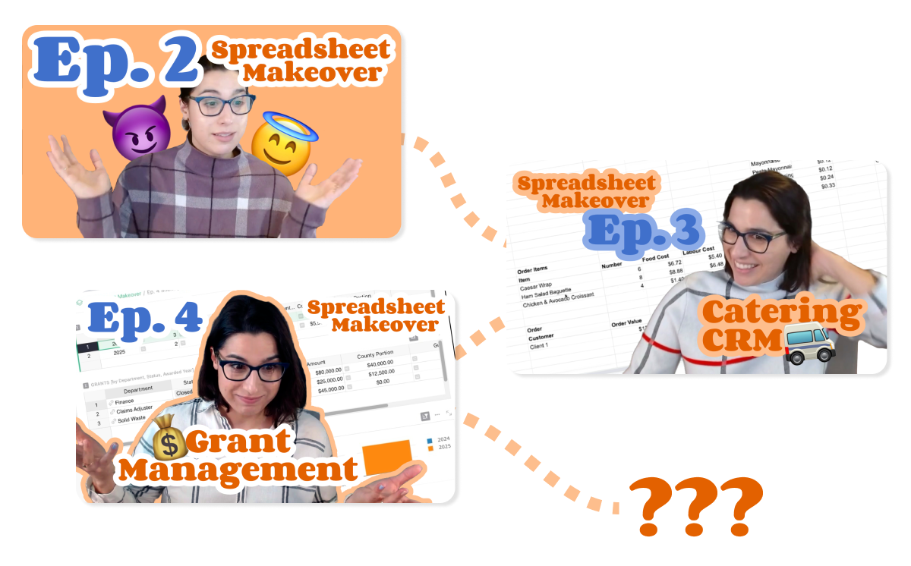

# March 2025 Newsletter

<table class="header" cellpadding="0" cellspacing="0" border="0"><tr>
  <td class="header-text">
    <table class="header-top"><tr>
      <td class="header-image">
        
      </td>
      <td class="header-top-text">
        
Grist for the Mill

        
March 2025
          &#8226; <a href="https://www.getgrist.com/">getgrist.com</a>

      </td>
    </tr></table>
    

      Welcome to our monthly newsletter of updates and tips for Grist users.
    

  </td>
</tr></table>

## What's new

### Introducing F O C U S  M O D E

Working with spreadsheets can be overwhelming. In this modern age, we’re overwhelmed with an overwhelming amount of information. Sometimes, we need to zoom in on what’s really important to make the most of our productivity. Introducing Grist’s F O C U S  M O D E, a new way of viewing and working with spreadsheets that eliminates unwanted distractions and visual noise, letting you make the most of your data: one cell at a time.

<iframe width="100%" height="400" src="https://www.youtube.com/embed/qrohjlHIE74?si=UdxKntqs4u45RsNk" title="YouTube video player" frameborder="0" allow="accelerometer; autoplay; clipboard-write; encrypted-media; gyroscope; picture-in-picture; web-share" referrerpolicy="strict-origin-when-cross-origin" allowfullscreen></iframe>

### Grist Enterprise - Admin Controls

A new suite of user management features have been added to Grist Enterprise. [Installation administrators](https://support.getgrist.com/self-managed/#what-is-the-administrative-account){:target="\_blank"} will be able to access the new controls, whose functions include:

* Viewing users, organizations, workspaces and documents in tabular form
* Removing users
* Modifying sharing settings for organizations, workspaces and documents

Learn more in our [Help Center](https://support.getgrist.com/admin-controls/#admin-controls){:target="\_blank"}!

### Spreadsheet Makeover - 3 new episodes!

If you haven’t been following Grist co-CEO Anais’ adventures over at [Spreadsheet Makeover](https://www.youtube.com/@SpreadsheetMakeover){:target="\_blank"}, you’ll want to check out the latest episodes, including:

* Revamping a [donor database & relationship tracker](https://www.youtube.com/watch?v=tseVNfpdgmo){:target="\_blank"} for a children’s charity
* Building a [complex catering CRM/profit calculator/hour tracker](https://www.youtube.com/watch?v=USMODjJQRmo){:target="\_blank"} from disconnected spreadsheets
* Taking an existing [grant management solution](https://www.youtube.com/watch?v=Y8KCzmxZ2WI){:target="\_blank"} built in Grist and working through some common Grist pitfalls

The latter is especially informative for any Grist beginner struggling with references or overcoming “spreadsheet brain”. More to come!

`grist-core` as been updated to [version 1.5.0](https://github.com/gristlabs/grist-core/releases/tag/v1.5.0){:target="\_blank"}. Lots of new stuff for self-hosters, so be sure to check out the release notes. Thank you to our first-time contributors! 

### More updates

* There are now endpoints for downloading attachments as .zip and .tar archives. For external attachments, there is also an endpoint for reconnecting attachments via .tar archives. Technical endpoint documentation can be found in our [API reference](https://support.getgrist.com/api/#tag/attachments){:target="\_blank"}.
* [Grist Desktop](https://github.com/gristlabs/grist-desktop/releases/tag/v0.3.2){:target="\_blank"} has been updated, with a few desktop-specific bugs squashed.

## Community highlights

* From the French Grist forum (*le forum Grist*), audezu shares a [cool trigger formula](https://forum.grist.libre.sh/t/log-historique-modifications-des-donnees-dans-une-colonne/835){:target="\_blank"} that tracks historical changes to a column. 

* In a similar vein, Varamil has shared an [in-row chat-like widget](https://community.getgrist.com/t/simple-in-row-chat-like-widget/8834){:target="\_blank"} that they use for collaboration.

* Quentin Leroy has shared [an adapter for Apache Superset](https://www.linkedin.com/feed/update/urn:li:activity:7307531066372730880/?actorCompanyId=5267440){:target="\_blank"} enabling SQL querying of documents using the Grist API.
* Another very cool showcase from audezu in *le forum Grist* – an [access rule setup](https://forum.grist.libre.sh/t/autoriser-la-modification-dune-colonne-seulement-si-une-autre-colonne-est-remplie/887){:target="\_blank"} that limits users to editing columns only if another column is filled. That may sound odd or extremely specific, but seeing it in action shows how useful it could be on teams with varying permissions. Access rules!
* lshalon on GitHub has added [detailed documentation](https://github.com/gristlabs/grist-core?tab=readme-ov-file#using-grist-with-openrouter-for-model-agnostic-and-claude-support){:target="\_blank"} on how to use OpenRouter to enable other models for [Grist’s AI Formula Assistant](https://www.getgrist.com/ai-formula-assistant/){:target="\_blank"}.

Working on something cool with Grist? Let us know by posting in the [Showcase forum](https://community.getgrist.com/c/showcase/8){:target="\_blank"} or our [#grist-showcase Discord channel](https://discord.gg/MYKpYQ3fbP){:target="\_blank"}!

## Learning Grist

### Webinar - Creating Custom Invoices

Today is April 1st, but creating custom invoices in Grist is no joke!

Join us as we create and customize invoices right in Grist with the Invoice custom widget. You’ll learn how to set up your document to generate printable invoices for customers, and we'll even show you how to update colors and add images to reflect your brand. Whether you’re starting from scratch or refining an existing invoice, this session will walk through how to create professional, tailored invoices for almost any organization.

**Thursday April 24 at 11:00am US Eastern Time.**

{:target="\_blank"}

[SIGN UP FOR APRIL'S WEBINAR](https://www.getgrist.com/webinars/creating-custom-invoices/?utm_source=support-newsletter&utm_medium=internal&utm_campaign=build-webinar&utm_term=april-2025){:target="\_blank"}
{: .grist-button}

### Access Rules for Distributed Organizations

In March, we explored how to secure and manage data across multiple locations — without the headaches. We covered strategies for controlling access to tables, columns, and rows, ensuring sensitive information stays in the right hands.

[WATCH MARCH'S RECORDING](https://www.getgrist.com/webinars/access-rules-for-distributed-organizations/){:target="\_blank"}
{: .grist-button}

## Help spread the word
If you’re interested in helping Grist grow, consider leaving a review on product review sites. Here’s a short list where your review could make a big impact. Thank you! 🙏

* [AlternativeTo](https://alternativeto.net/software/grist/about/){:target="\_blank"}
* [Capterra](https://www.capterra.com/p/232821/Grist/){:target="\_blank"}
* [G2](https://www.g2.com/products/grist){:target="\_blank"}
* [TrustRadius](https://www.trustradius.com/products/grist/){:target="\_blank"}

## We are here to support you

**Professional services.** Grist often surprises people with its capabilities. Schedule a **free** call to assess your needs and help connect you with a Grist expert. [Learn more.](https://www.getgrist.com/professional-services/){:target="\_blank"}

**Have questions, feedback, or need help?** Search our [Help Center](../index.md), [watch video
tutorials](https://www.youtube.com/channel/UCx0ioQrrC-bIrkmZ7ZULr0g/playlists), share ideas in our
[Community Forum](https://community.getgrist.com), or contact us at <support@getgrist.com>.