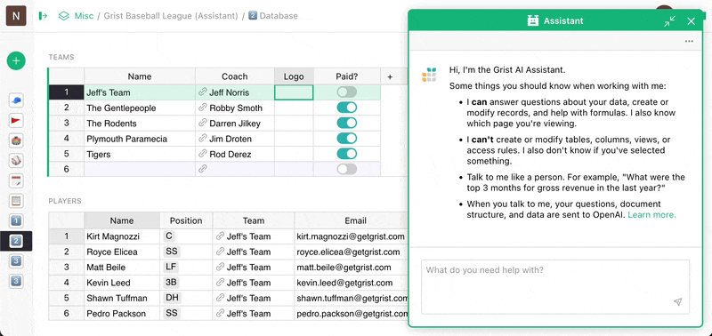
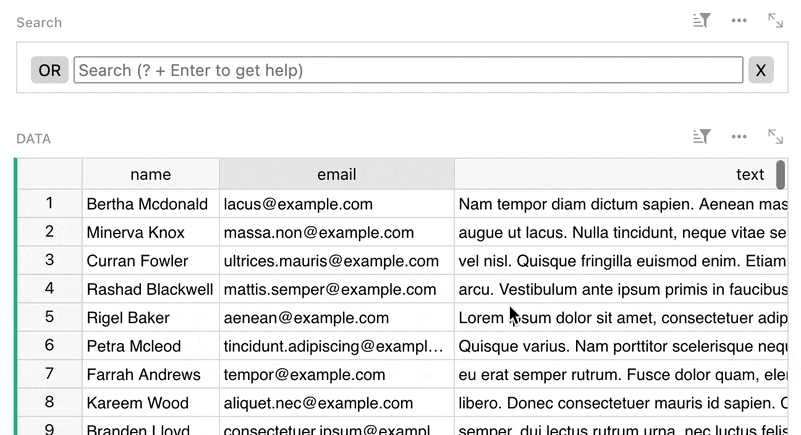
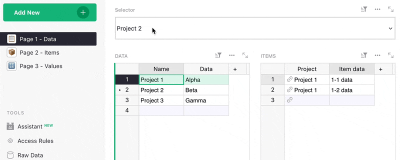
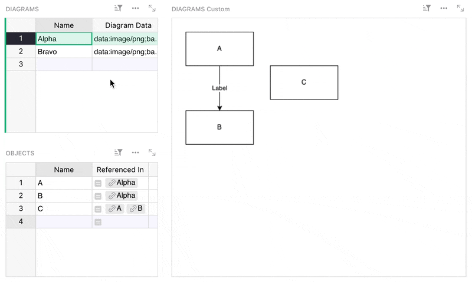
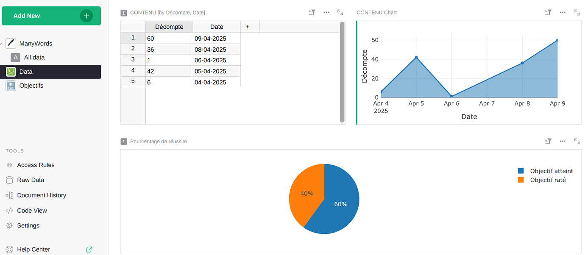
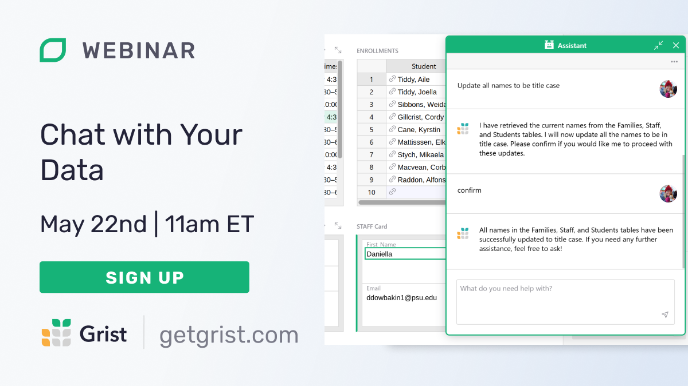

# April 2025 Newsletter

<table class="header" cellpadding="0" cellspacing="0" border="0"><tr>
  <td class="header-text">
    <table class="header-top"><tr>
      <td class="header-image">
        
      </td>
      <td class="header-top-text">
        
Grist for the Mill

        
April 2025
          &#8226; <a href="https://www.getgrist.com/">getgrist.com</a>

      </td>
    </tr></table>
    

      Welcome to our monthly newsletter of updates and tips for Grist users.
    

  </td>
</tr></table>

## What's new

### Grist AI Assistant

Last year we launched an AI-powered formula assistant, focused on chatlike Python and Excel formula support. The next version of this approach is the Grist Assistant, going beyond formulas. Despite the similar name, this Assistant greatly expands what you’re able to do with AI in Grist, with a focus on being maximally useful while maintaining data integrity:

* Answer questions about your formulas and your data
* Create or modify records and formulas, with 'undo' support

This new power comes with a couple caveats: 1) when you submit a query, your data is shared with OpenAI and 2) the Assistant can’t make structural changes (table/column/widget modification, access rule changes). We’re excited to see how you use these new capabilities and have our eyes open for future improvements. 

The new Grist Assistant is available on getgrist.com and for self-hosters on the Enterprise plan, with the legacy Formula Assistant remaining for all other users. For more information, check out our [Help Center documentation](https://support.getgrist.com/assistant/){:target="\_blank"}.

### Other

* Spreadsheet Makeover episode 6 is out! This one tackles one of the big differences between Grist and normal spreadsheets, the combination of the view and data layers. [Watch on YouTube.](https://www.youtube.com/watch?v=W_kLswSXOss){:target="\_blank"}
* Hurricane season is approaching, and our Support Engineer Natalie has created a [hurricane readiness template](https://templates.getgrist.com/uXMbETLdfriM/Hurricane-Preparedness){:target="\_blank"} to help you stay prepared.

There has been a new `grist-core` release (v1.5.2). Hop on over to GitHub for the [full release notes](https://github.com/gristlabs/grist-core/releases){:target="\_blank"}.

## Community highlights

* Huge thanks to Manu for his major [theme refactoring](https://github.com/gristlabs/grist-core/pull/1340){:target="\_blank"}, which puts themes for Grist on a more solid basis. There’s also a [migration guide](https://github.com/gristlabs/grist-core/blob/main/static/custom.css){:target="\_blank"} for users who built themes with the previous structure.
* Simon Mulquin has been sharing lots of neat Grist experiments, including one that shows live, in-context translations from table data. It even supports in-context data linking, where you click on a rendered HTML string in the widget and it selects that record in the table. Check out his [demo video](https://www.youtube.com/watch?v=B_0RMhJWLRQ){:target="\_blank"} for an overview.
* Varamil’s modestly named [simple filter widget](https://community.getgrist.com/t/simple-filter-widget/9356){:target="\_blank"} is indeed simple, but also incredibly useful and [well-documented](https://github.com/Varamil/grist-widget/tree/main/simplefilter#grist-simple-filer-widget){:target="\_blank"}! It takes a second of testing to see its power:.

* Varamil has also blessed us with a [widget that synchronizes widgets and views](https://community.getgrist.com/t/update-of-drop-down-widget-for-multi-page-synchronization/9384){:target="\_blank"} *across pages*. That’s right, you select a value in the dropdown and it remains selected on other pages, even updating any widget linking already in place. 

* Following up on Sylvain_Page’s [Excalidraw widget](https://support.getgrist.com/newsletters/2025-02/#community-highlights){:target="\_blank"} from earlier this year, LGDan has released his very own [draw.io viewer and editor](https://community.getgrist.com/t/draw-io-viewer-and-editor-custom-widget/9362){:target="\_blank"}, which is also [excellently documented](https://github.com/LGDan/grist-widget-drawio?tab=readme-ov-file#grist-widget-drawio){:target="\_blank"}. As a bonus, the widget can extract XML data from the generated PNGs, which lets you do lots of cool things such as row/entity lookups and even constraint validation à la systems engineering. 🤯

* For a change of pace, take a look at Dynnammo’s [ManyWords proof-of-concept widget](https://community.getgrist.com/t/building-a-750words-open-source-alternative-with-grist/9407){:target="\_blank"}, which is inspired by 750words and aims to get you writing every day.

Working on something cool with Grist? Let us know by posting in the [Showcase forum](https://community.getgrist.com/c/showcase/8){:target="\_blank"} or our [#grist-showcase Discord channel](https://discord.gg/MYKpYQ3fbP){:target="\_blank"}!

## Learning Grist

### Webinar - Chat with Your Data

Join us for a live demo of Grist's powerful new AI Assistant. We'll show you how to use it to analyze data, generate formulas, and clean up messy fields — all with natural language prompts. Perfect for anyone looking to work smarter in Grist.

**Thursday May 22 at 11:00am US Eastern Time.**

{:target="\_blank"}

[SIGN UP FOR MAY'S WEBINAR](https://www.getgrist.com/webinars/chat-with-your-data/?utm_source=support-newsletter&utm_medium=internal&utm_campaign=build-webinar&utm_term=may-2025){:target="\_blank"}
{: .grist-button}

### Access Rules for Distributed Organizations

In April, we walked through how to set up a document that generates printable invoices using the Invoice custom widget. We also showed how to customize colors and add images to reflect your brand. Whether you're starting from scratch or refining an existing invoice, this webinar covers how to create professional, tailored invoices for almost any organization.

[WATCH APRIL'S RECORDING](https://www.getgrist.com/webinars/creating-custom-invoices/){:target="\_blank"}
{: .grist-button}

## Help spread the word
If you’re interested in helping Grist grow, consider leaving a review on product review sites. Here’s a short list where your review could make a big impact. Thank you! 🙏

* [AlternativeTo](https://alternativeto.net/software/grist/about/){:target="\_blank"}
* [Capterra](https://www.capterra.com/p/232821/Grist/){:target="\_blank"}
* [G2](https://www.g2.com/products/grist){:target="\_blank"}
* [TrustRadius](https://www.trustradius.com/products/grist/){:target="\_blank"}

## We are here to support you

**Solutions.** Grist often surprises people with its capabilities. Schedule a **free** call to assess your needs and help connect you with a Grist expert. [Learn more.](https://www.getgrist.com/solutions/){:target="\_blank"}

**Have questions, feedback, or need help?** Search our [Help Center](../index.md), [watch video tutorials](https://www.youtube.com/channel/UCx0ioQrrC-bIrkmZ7ZULr0g/playlists), share ideas in our [Community Forum](https://community.getgrist.com), or contact us at <support@getgrist.com>.