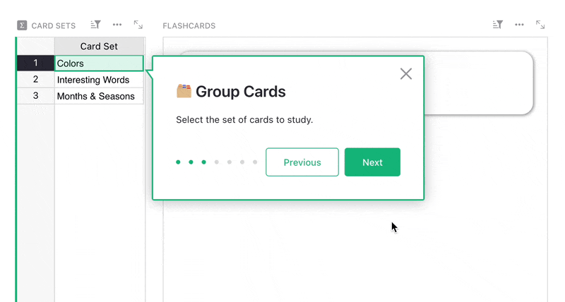
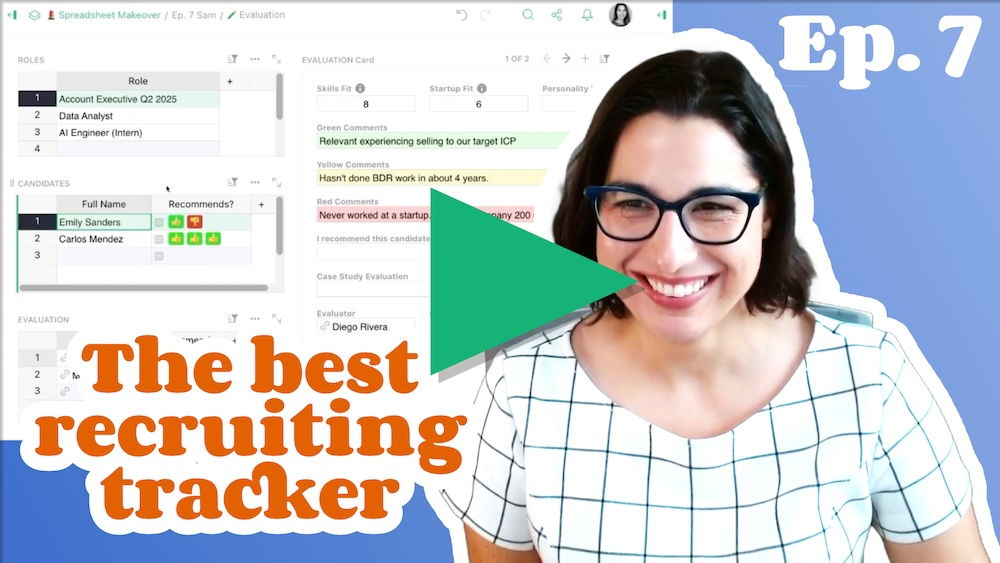
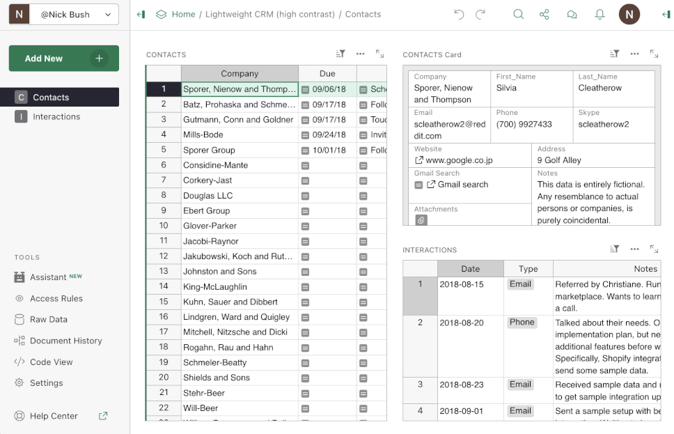
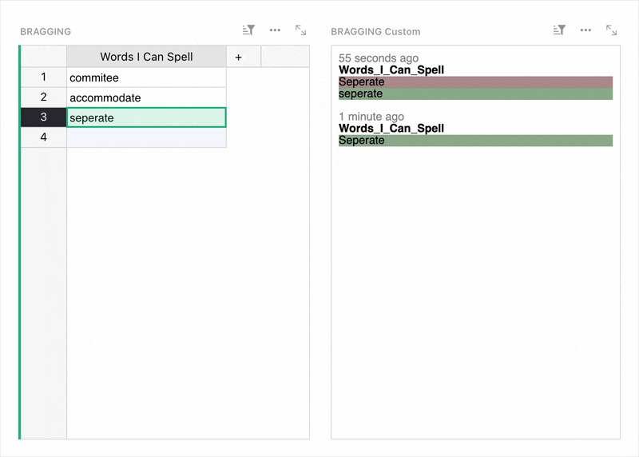
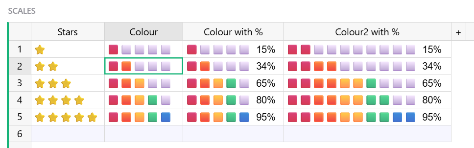
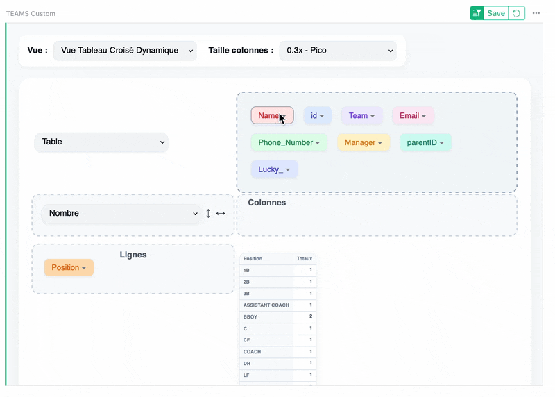
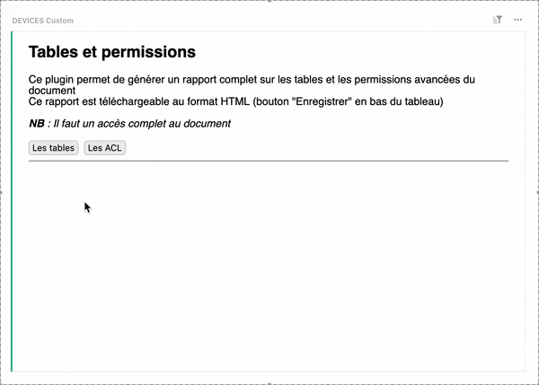
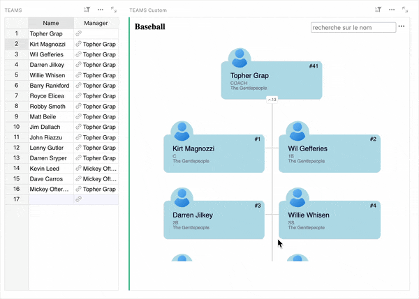
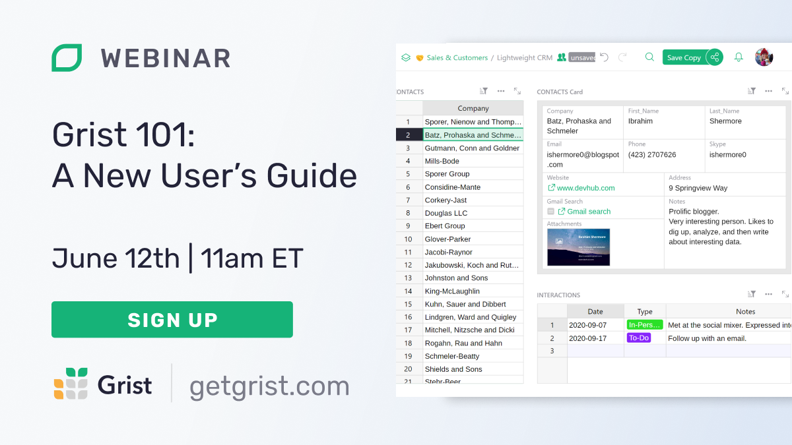

# May 2025 Newsletter

<table class="header" cellpadding="0" cellspacing="0" border="0"><tr>
  <td class="header-text">
    <table class="header-top"><tr>
      <td class="header-image">
        
      </td>
      <td class="header-top-text">
        
Grist for the Mill

        
May 2025
          &#8226; <a href="https://www.getgrist.com/">getgrist.com</a>

      </td>
    </tr></table>
    

      Welcome to our monthly newsletter of updates and tips for Grist users.
    

  </td>
</tr></table>

## What's new

### Grist Partner program

Do you provide Grist services for others? Did you even know that was a thing? It is! We’re formalizing our partner program to help Grist experts make the most of their expertise, with a few perks along the way. 💫

Learn more and apply to be a Grist Partner [here](https://www.getgrist.com/partners/){:target="\_blank"}.

### Grist Partner program

If you’ve tried one of our templates – take [Travel Planning](https://templates.getgrist.com/ruCnQuXD25ok/Travel-Planning/){:target="\_blank"} for example – you’ve likely experienced a document tour. Did you know you can make these for your own documents?! They can be great onboarding tools for getting new users familiar with a workflow, even jumping to specific locations in a complex document. 

Keep in mind that this *is* a beta feature and perhaps even a bit clunky, but it works! Check out our [new tutorial](https://support.getgrist.com/document-tours/){:target="\_blank"} to start making your own document tours.

### Email notifications for Enterprise self-hosters

We’ve updated how Grist sends email notifications for document sharing invites, now using [Nodemailer](https://nodemailer.com/){:target="\_blank"}. See the [full documentation](https://support.getgrist.com/self-managed/#how-do-i-set-up-email-notifications){:target="\_blank"} to set it up on your Grist server.

### Spreadsheet Makeover: Airtable + Access Rules = 👍

{:target="\_blank"}

This week, Anais finally had a more-or-less straightforward time with a makeover. Could it be because the subject was an Airtable base unable to take advantage of granular access rules? [Watch on YouTube](https://www.youtube.com/watch?v=KA0u4p2rt38&feature=youtu.be){:target="\_blank"} to find out!

`grist-core` has been updated to v1.6.0. Thanks to our first time contributors for their hard work! See the release notes [on GitHub](https://github.com/gristlabs/grist-core/releases/tag/v1.6.0){:target="\_blank"}.

## Community highlights

### High contrast theme

Emmanuel Pelletier has been working hard to make Grist more accessible, and has added a new **Light (High Contrast)** theme that is part of the [new release](https://github.com/gristlabs/grist-core/releases/tag/v1.6.0){:target="\_blank"} (and should be rolling out to users on getgrist.com shortly). It improves color contrast ratios of the default light theme in order to pass WCAG level AA requirements, with the aim of making the UI easier to understand for people with low vision or impaired contrast perception.

### Custom widgets

This month was quite spectacular for custom Grist widgets from the community. And on that note we have one thing to say: keep them coming! We’re actively looking for ways to better support such contributions.

* First up, ben-pr-p has shared a very cool project called Grist Artifacts, which essentially enables integrated AI-powered React apps embedded directly into Grist. The best way to see what is possible is by watching the excellent demo videos that show off such power. Note: this custom widget requires that you run a server.
* In a similar vein, nic01asFr has shared code for a Grist MCP (Model Context Protocol) server, which lets LLMs like Claude interact with Grist’s API. 
* There have been several changelog trigger formulas mentioned in this newsletter, but Stef_Dunlap went one further and added a nice custom widget to visualize tracked changes.

* David_Hawley shared some tricks to get cheery emoji-laden color scales working with a Python formula.

* On *le forum Grist*, Arthur_Panckoucke has shared [an excellent pivot table custom widget](https://forum.grist.libre.sh/t/custom-widget-tableau-croise-dynamique-en-francais/1252){:target="\_blank"} based on [pivottable.js](https://pivottable.js.org/examples/){:target="\_blank"}, with a lovely full-screen mode that looks like regular Grist. 😍

* Also on *le forum*, jta87 shared several of [their custom widgets](https://forum.grist.libre.sh/t/custom-widget-quelques-widgets-grist/1007){:target="\_blank"}, which include one that generates an HTML report of document tables and access rules:

As well as one that generates an interactive org chart based on related data:

Working on something cool with Grist? Let us know by posting in the [Showcase forum](https://community.getgrist.com/c/showcase/8){:target="\_blank"} or our [#grist-showcase Discord channel](https://discord.gg/MYKpYQ3fbP){:target="\_blank"}!

## Learning Grist

### Webinar - Grist 101: A New User’s Guide

Join us for an introductory webinar designed to help new users navigate the basics of Grist. This session will provide you with the essential tools and knowledge to get started. We'll cover key features and best practices to maximize your productivity. Perfect for beginners, this webinar will set you on the path to becoming a Grist pro. Don't miss out – reserve your spot today!

**Thursday June 12 at 11:00am US Eastern Time.**

{:target="\_blank"}

[SIGN UP FOR JUNE'S WEBINAR](https://www.getgrist.com/webinars/grist-101-new-users-guide-june-2025/?utm_source=support-newsletter&utm_medium=internal&utm_campaign=build-webinar&utm_term=june-2025){:target="\_blank"}
{: .grist-button}

### Chat with Your Data

In May, we gave a live demo of Grist's powerful new AI Assistant. We showed you how to use it to analyze data, generate formulas, and clean up messy fields – all with natural language prompts. Perfect for anyone looking to work smarter in Grist.

[WATCH MAY'S RECORDING](https://www.getgrist.com/webinars/chat-with-your-data/){:target="\_blank"}
{: .grist-button}

## Help spread the word
If you’re interested in helping Grist grow, consider leaving a review on product review sites. Here’s a short list where your review could make a big impact. Thank you! 🙏

* [AlternativeTo](https://alternativeto.net/software/grist/about/){:target="\_blank"}
* [Capterra](https://www.capterra.com/p/232821/Grist/){:target="\_blank"}
* [G2](https://www.g2.com/products/grist){:target="\_blank"}
* [TrustRadius](https://www.trustradius.com/products/grist/){:target="\_blank"}

## We are here to support you

**Solutions.** Grist often surprises people with its capabilities. Schedule a **free** call to assess your needs and help connect you with a Grist expert. [Learn more.](https://www.getgrist.com/solutions/){:target="\_blank"}

**Have questions, feedback, or need help?** Search our [Help Center](../index.md), [watch video tutorials](https://www.youtube.com/channel/UCx0ioQrrC-bIrkmZ7ZULr0g/playlists), share ideas in our [Community Forum](https://community.getgrist.com), or contact us at <support@getgrist.com>.