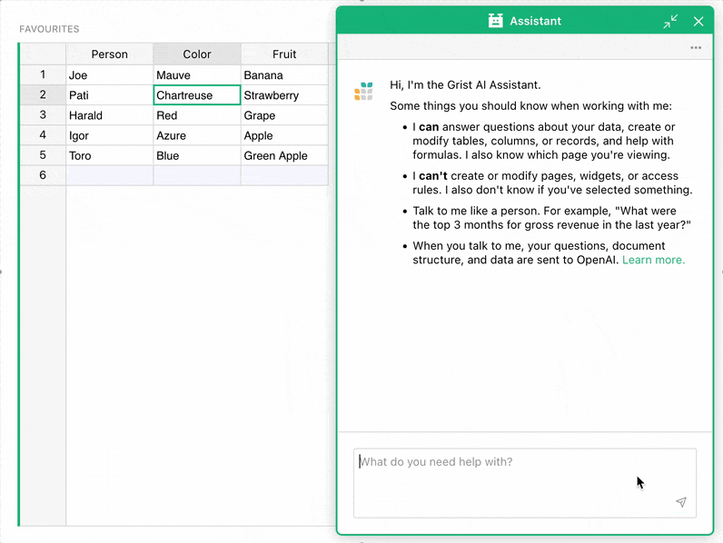
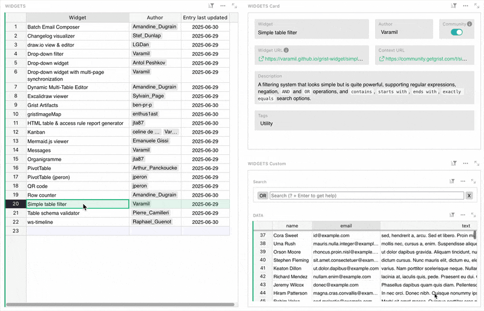
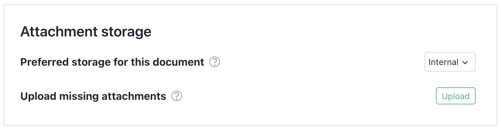
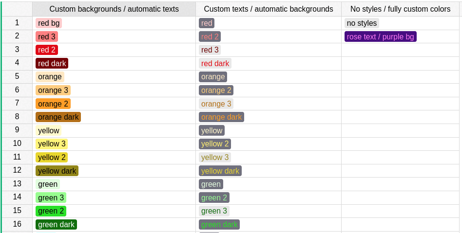
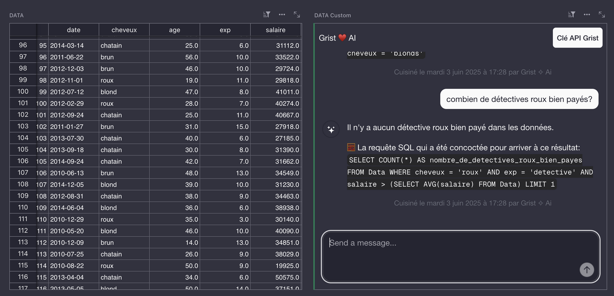
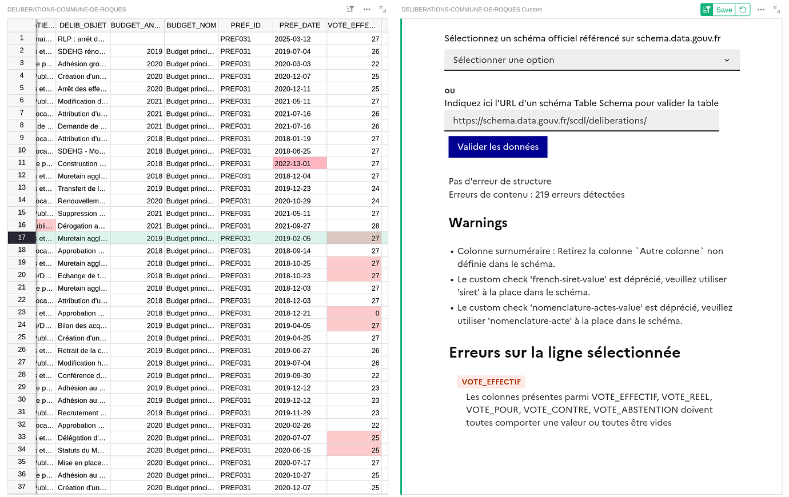
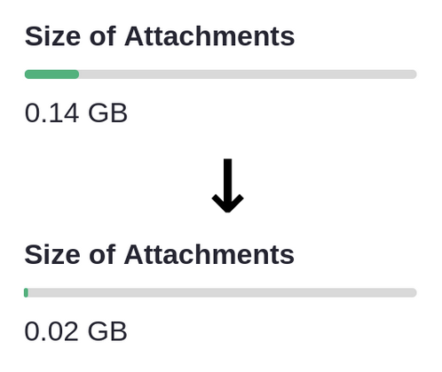
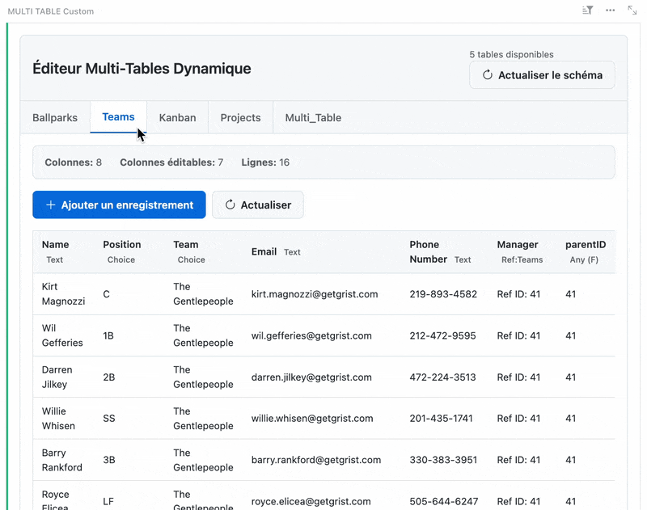
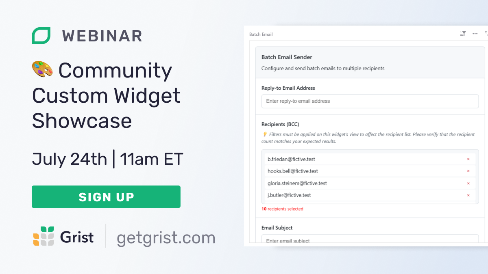

# June 2025 Newsletter

<table class="header" cellpadding="0" cellspacing="0" border="0"><tr>
  <td class="header-text">
    <table class="header-top"><tr>
      <td class="header-image">
        
      </td>
      <td class="header-top-text">
        
Grist for the Mill

        
June 2025
          &#8226; <a href="https://www.getgrist.com/">getgrist.com</a>

      </td>
    </tr></table>
    

      Welcome to our monthly newsletter of updates and tips for Grist users.
    

  </td>
</tr></table>

## What's new

### GristCon 2025  - save the date!

We’ll have more to share soon, but we’re hosting a community-focused **virtual, one-day event on Thursday, September 18, 2025**. We’re still ironing out the details, but you can look forward to sessions from Grist Labs’ best and brightest, and maybe even a peek behind the curtain. 🫣

Our community regularly impresses us with cool custom widgets, templates, and workflows. Have something you'd like to showcase? We'd love to have you present! Register [here](https://www.getgrist.com/gristcon-2025/){:target="\_blank"}.

### Weekly Grist 101 webinars starting July 9th

Our Grist 101 webinars have quickly become our most popular, and in response we’ve started hosting more and more of them. But that’s still not enough, so now we’re hosting **weekly Grist 101 webinars** that will feature live chat with Natalie. These sessions will also run at more times of day and days of the week than we’ve been able to previously, so if you’ve been unable to join one of our sessions, check our upcoming schedule and sign up [here](https://www.getgrist.com/webinars/grist-101-new-users-guide/){:target="\_blank"}.

### Assistant updates!

We’ve updated [Grist’s AI Assistant](https://www.getgrist.com/ai-assistant/){:target="\_blank"}, giving it even more power when working with Grist’s *own* powerful, yet unique, structure. It can now:

* Set column header and default cell styles (text, fill, font)
* Set cell formatting for Text, Numeric, Integer, and Toggle columns, including things like currency, min/max decimals, and date formats
* Modify choices (values and formatting)
* Wrap columns and set text alignment
* ...and more – with more to come in the future

### Community widget tracker

{:target="\_blank"}

Hi, Nick here. I write the newsletter and get to play around with all the new widgets people share. Recently, Heloise_Ouvry shared a [community-led document](https://community.getgrist.com/t/gristhub-your-new-hub-for-templates-and-widgets/8456/7){:target="\_blank"} collecting existing custom widgets, which is a great idea. In the *very same week*, I was working on sharing Grist Labs’ own collection of community contributions, which you can now find [here](https://grist-marketing.getgrist.com/oHQcp1bG7DS8/Community-Widgets/p/4){:target="\_blank"}. Please take a look, and feel free to submit your own widgets in the linked form!

### External attachments for all

We released external attachments [back in February](https://support.getgrist.com/newsletters/2025-02/#external-attachment-storage){:target="\_blank"} for self-hosters, but it’s now available for all users! Learn all about external attachments in the [Help Center](https://support.getgrist.com/document-settings/#external-attachments){:target="\_blank"}. 

### More!

* Last month we shared a walkthrough of how to create [document tours](https://support.getgrist.com/document-tours/){:target="\_blank"}, and now Natalie has provided everyone with a brand new tutorial on how to create [document tutorials](https://support.getgrist.com/document-tutorials/){:target="\_blank"}, just like the one new users get when they first sign up! Bespoke onboarding is within your grasp.
* Having relationship problems? No, not that kind – data relationship problems. Anais is here to help, with a brand new, **mega-sized spreadsheet makeover** which is the best example yet of how Grist can make the most of relations and references. [Watch on YouTube](https://www.youtube.com/watch?v=D0mWeWe5GBI&feature=youtu.be){:target="\_blank"}, and like and subscribe if you’re so inclined. 

There’s a new `grist-core` release, and its name is [v1.6.1](https://github.com/gristlabs/grist-core/releases/tag/v1.6.1){:target="\_blank"}. Selected notes:

* Grist now automatically checks for upgrades by default on the `gristlabs/grist` and `gristlabs/grist-ee` Docker images.
* Python 2 support is gone for good. 🥲 The smiling-with-tear emote is appropriate – it was a good run.

## Community highlights

* Emmanuel Pelletier has completed another very useful [accessibility change](https://github.com/gristlabs/grist-core/pull/1529){:target="\_blank"}, addressing choice token colors on both light and dark themes.

* La Suite hosted [Hack Days 2025](https://hackdays.numerique.gouv.fr/){:target="\_blank"}, a 50+ team hackathon that featured some impressive Grist-related entries, including:
  - [AirGrist](https://github.com/reedery/airgrist){:target="\_blank"}, a tool designed to help migrate Airtable bases to Grist. It even features a classic step-by-step wizard! 🧙‍♂️
  - [Grist ❤️ AI](https://github.com/suitenumerique/hackdays2025/tree/main/submissions/grist-3-ia){:target="\_blank"} (pictured below), an AI chatbot implementation in Grist using La Suite’s [Albert AI API](https://alliance.numerique.gouv.fr/albert/){:target="\_blank"}.

* Pierre_Camilleri shared an impressive [table schema validator custom widget](https://community.getgrist.com/t/new-widget-for-table-schema-validation-in-grist-beta/10213){:target="\_blank"} that can take a JSON schema and highlight invalid cells while providing error messages. Not a simple task!

* This month QazCetelic surprised us with a custom Rust API-powered [Grist Image Optimizer](https://github.com/QazCetelic/grist-image-optimizer){:target="\_blank"}, which is a tool that does exactly what it sounds like. It converts large image attachments into more efficient formats (WEBP) to dramatically reduce image size (at the cost of some detail, naturally). Just look:

{: .screenshot-half }

* As part of his very useful work on [Pygrister](https://community.getgrist.com/t/pygrister-a-python-client-for-the-grist-api/5015/16){:target="\_blank"}, Riccardo_Polignieri has also created a Python Grist CLI tool he delightfully calls [Gry](https://github.com/ricpol/pygrister?tab=readme-ov-file#gry-the-grist-cli-tool){:target="\_blank"}. The tool is very welcome as a Python counterpart to [GristCTL](https://github.com/Ville-Eurometropole-Strasbourg/grist-ctl){:target="\_blank"} (written in Go), but it also lets you think and say the word “Gry”. Gry gry gry gry gry.
* Arthur’s thread on [Advanced Monitoring in the Community Forum](https://community.getgrist.com/t/advanced-monitoring-for-grist-core/10265){:target="\_blank"} is a superbly detailed look at a handcrafted Grist monitoring solution for a specific use case.
* One of the new widgets discovered in updating the [new widget tracking document](https://grist-marketing.getgrist.com/oHQcp1bG7DS8/Community-Widgets/p/4){:target="\_blank"} was this all-in-one interface for managing table data, fittingly called the [Dynamic Multi-Table Editor](https://github.com/gristgouv/mae-custom-widgets/tree/main/multi-table-editor){:target="\_blank"}. Thanks to Amandine_Dugrain from the French Ministry of Foreign Affairs!

Working on something cool with Grist? Let us know by posting in the [Showcase forum](https://community.getgrist.com/c/showcase/8){:target="\_blank"} or our [#grist-showcase Discord channel](https://discord.gg/MYKpYQ3fbP){:target="\_blank"}!

## Learning Grist

### Webinar - Community Custom Widget Showcase

Our smart and talented community has shared excellent custom widgets in Grist, and it’s about time we showed them off! In this webinar, we’ll demo some particularly deep and/or interesting examples, such as the [HTML table & access rule report generator](https://forum.grist.libre.sh/t/custom-widget-quelques-widgets-grist/1007){:target="\_blank"}, [draw.io viewer & editor](https://community.getgrist.com/t/draw-io-viewer-and-editor-custom-widget/9362){:target="\_blank"} and a [Batch Email Composer](https://community.getgrist.com/t/new-custom-widget-batch-email-composer-with-bcc-management/7992){:target="\_blank"}. Get a behind-the-scenes look at how these widgets extend Grist in useful and surprising ways – perfect for anyone curious about what you can build with Grist.

**Thursday July 24 at 11:00am US Eastern Time.**

{:target="\_blank"}

[SIGN UP FOR JULY'S WEBINAR](https://www.getgrist.com/webinars/community-custom-widget-showcase/?utm_source=support-newsletter&utm_medium=internal&utm_campaign=build-webinar&utm_term=july-2025){:target="\_blank"}
{: .grist-button}

### Grist 101

In June, Natalie hosted an introductory webinar designed to help new users navigate the basics of Grist. This session provided users with the essential tools and knowledge to get started. We covered key features and best practices to maximize your productivity. Perfect for beginners!

[WATCH JUNE'S RECORDING](https://www.getgrist.com/webinars/grist-101-new-users-guide-june-2025/){:target="\_blank"}
{: .grist-button}

## Help spread the word
If you’re interested in helping Grist grow, consider leaving a review on product review sites. Here’s a short list where your review could make a big impact. Thank you! 🙏

* [AlternativeTo](https://alternativeto.net/software/grist/about/){:target="\_blank"}
* [Capterra](https://www.capterra.com/p/232821/Grist/){:target="\_blank"}
* [G2](https://www.g2.com/products/grist){:target="\_blank"}
* [TrustRadius](https://www.trustradius.com/products/grist/){:target="\_blank"}

## We are here to support you

**Solutions.** Grist often surprises people with its capabilities. Schedule a **free** call to assess your needs and help connect you with a Grist expert. [Learn more.](https://www.getgrist.com/solutions/){:target="\_blank"}

**Have questions, feedback, or need help?** Search our [Help Center](../index.md), [watch video tutorials](https://www.youtube.com/channel/UCx0ioQrrC-bIrkmZ7ZULr0g/playlists), share ideas in our [Community Forum](https://community.getgrist.com), or contact us at <support@getgrist.com>.