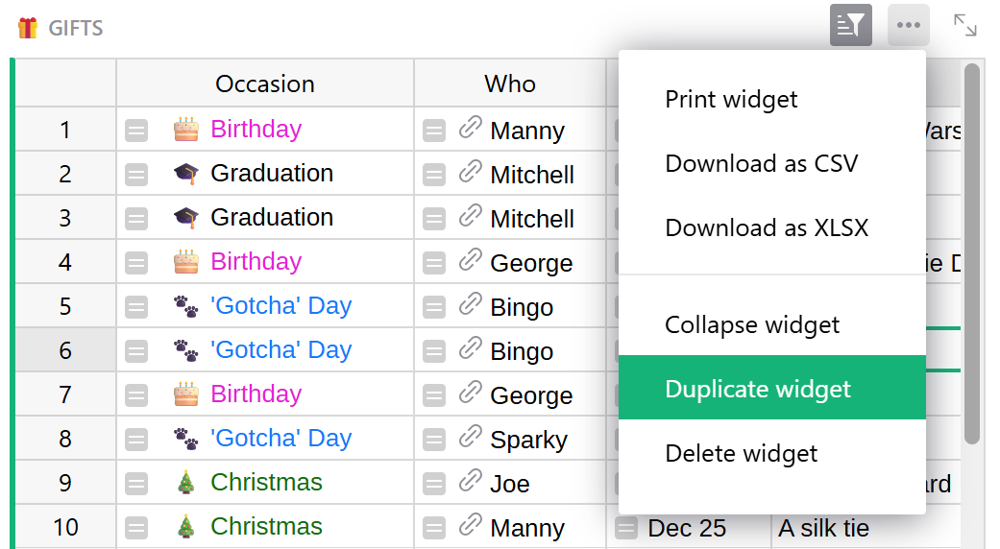
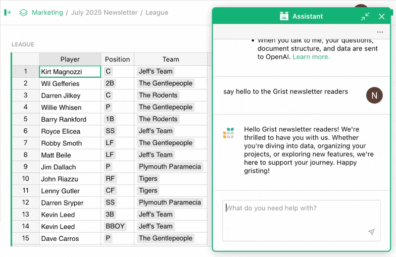
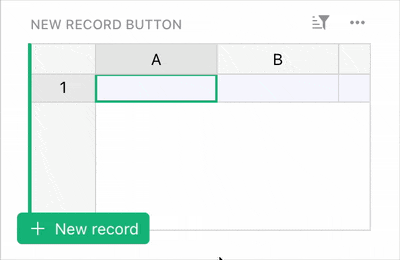
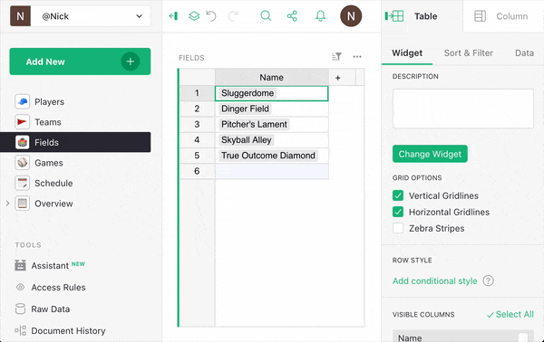
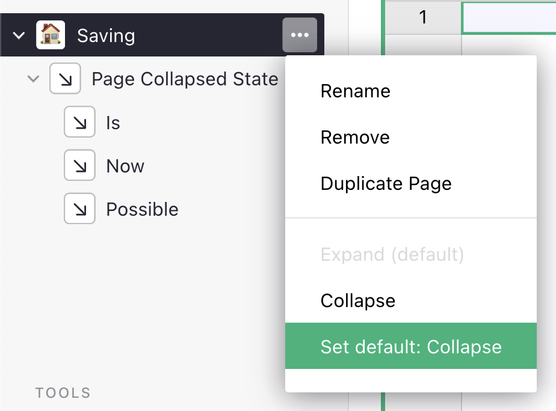
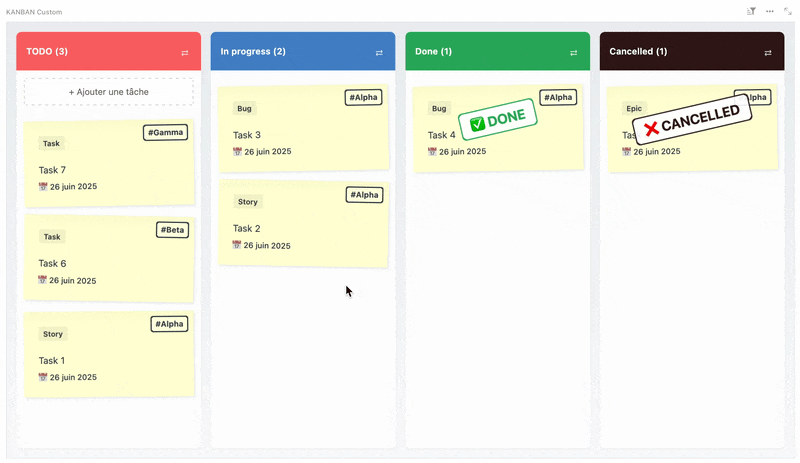
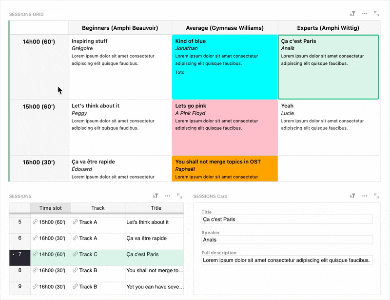

# July 2025 Newsletter

<table class="header" cellpadding="0" cellspacing="0" border="0"><tr>
  <td class="header-text">
    <table class="header-top"><tr>
      <td class="header-image">
        
      </td>
      <td class="header-top-text">
        
Grist for the Mill

        
July 2025
          &#8226; <a href="https://www.getgrist.com/">getgrist.com</a>

      </td>
    </tr></table>
    

      Welcome to our monthly newsletter of updates and tips for Grist users.
    

  </td>
</tr></table>

## What's new

### GristCon speakers and sessions announced!

Have you signed up for GristCon yet? Our one-day virtual community conference is quickly approaching – Thursday, September 18, 2025 – and we’ve just released [details on the 10 planned sessions](https://www.getgrist.com/gristcon-2025/#agenda){:target="\_blank"}, hosted by Grist Labs employees *and* members of the community from all over the world. Take a look – we’re sure there’s something that will catch your eye.

[REGISTER NOW FOR FREE](https://www.getgrist.com/gristcon-2025/){:target="\_blank"}
{: .grist-button}

### Duplicating widgets

At Grist Labs we remain [DRY](https://en.wikipedia.org/wiki/Don%27t_repeat_yourself){:target="\_blank"} at all times. We *hate* duplicating data so much we built a bunch of software designed around not doing it! Thankfully, duplicating widgets – which you can now do – does not duplicate data, but instead saves you time having to recreate layouts and formatting.

### Increased Assistant functionality

There’s been another round of updates to the [Grist AI Assistant](https://www.getgrist.com/ai-assistant/){:target="\_blank"}. It can now:

* Create, rename, or remove pages, as well as add, update, and remove most widgets in pages.
* Add custom widgets by URL.
* Create [summary tables](https://support.getgrist.com/summary-tables/){:target="\_blank"} from specified `GROUP BY` columns for new widgets.
* Link widgets on the same page.

### More Grist updates

* There’s an experimental (and quite minor) “Add new record” button that is always visible and makes it easier to add new records. You can test this button out by appending the URL parameter `?experiment=newRecordButton`. Let us know if you have feedback!
  
* Emmanuel Pelletier’s accessibility work continues to improve Grist, and this month we welcome a handful of shortcuts to make keyboard navigation useful outside of tables: `Ctrl/Cmd + O`, `Ctrl/Cmd + Shift + O` and `Alt + Ctrl/Cmd + O`.
  
* If you’re self-hosting, you can now [add extra truthy/falsy values](https://github.com/gristlabs/grist-core/pull/1719){:target="\_blank"} to your Grist instance using the delightfully-named environment variables `GRIST_TRUTHY_VALUES` and `GRIST_FALSY_VALUES`! You control the fabric of reality – use this power wisely!

The new 1.7.0 release of grist-core includes a very handy change that will be live on Grist everywhere soon: saving page collapsed state!

{: .screenshot-half }

See the full release notes [on GitHub](){:target="\_blank"}.

## Community highlights

* Thanks to scytacki for adding the `NETWORKDAYS()` function (“net workdays” not “network days”) and string support to `DATEDIF()` in their [recent PR](https://github.com/gristlabs/grist-core/pull/1661){:target="\_blank"}.
* If you’re interested in generating PDF reports in Grist, be sure to check out aude’s [detailed walkthrough](https://community.getgrist.com/t/generate-custom-pdfs-with-the-markdown-widget/10667){:target="\_blank"} of how they generate elegant French letterhead with table data and nothing else.
* Varamil has shared an update to their full-featured Kanban widget.
  
* Over on *le forum Grist*, raphael has shared a very nice looking [Grid custom widget](https://forum.grist.libre.sh/t/custom-widget-grid-une-grille-croisee-navigable/1485){:target="\_blank"} which acts as a simple display-only pivot table with support for linking!
  
* Edouard_Morin adds to the list of Grist API packages with a very welcome addition: R! Check out their [post in the Community Forum](https://community.getgrist.com/t/gristapi-r-package-for-easily-using-the-grist-api/10810){:target="\_blank"} for more info.

Working on something cool with Grist? Let us know by posting in the [Showcase forum](https://community.getgrist.com/c/showcase/8){:target="\_blank"} or our [#grist-showcase Discord channel](https://discord.gg/MYKpYQ3fbP){:target="\_blank"}!

## Learning Grist

### Ongoing Grist 101 webinars

New to Grist? We continue to run frequent Grist 101 webinars with a live chat to help you get up and running or answer questions. 

[SIGN UP FOR A GRIST 101 WEBINAR](https://www.getgrist.com/webinars/grist-101-new-users-guide/){:target="\_blank"}
{: .grist-button}

### Webinar - Grist Secrets 🤫

Think you know everything about Grist? Think again!

Whether you’re a beginner or a seasoned user, you’re bound to discover something new in this month's webinar where we dive into corners of Grist that are as helpful as they are obscure. From handy shortcuts that save you time, to underused features for customizing Grist even further!

Join us to uncover the not-so-secret secrets of Grist!

**Thursday August 21 at 11:00am US Eastern Time.**

{:target="\_blank"}

[SIGN UP FOR AUGUST'S WEBINAR](https://www.getgrist.com/webinars/grist-secrets/?utm_source=support-newsletter&utm_medium=internal&utm_campaign=build-webinar&utm_term=august-2025){:target="\_blank"}
{: .grist-button}

### Grist 101

In June, Natalie showcased some of the custom widgets shared by our smart and talented community. We took a look at the [HTML table & access rule report generator](https://forum.grist.libre.sh/t/custom-widget-quelques-widgets-grist/1007){:target="\_blank"}, [draw.io viewer & editor](https://community.getgrist.com/t/draw-io-viewer-and-editor-custom-widget/9362){:target="\_blank"} and a [Batch Email Composer](https://community.getgrist.com/t/new-custom-widget-batch-email-composer-with-bcc-management/7992){:target="\_blank"}. Get a behind-the-scenes look at how these widgets extend Grist in useful and surprising ways – perfect for anyone curious about what you can build with Grist.

[WATCH JULY'S RECORDING](https://www.getgrist.com/webinars/community-custom-widget-showcase/){:target="\_blank"}
{: .grist-button}

## Help spread the word
If you’re interested in helping Grist grow, consider leaving a review on product review sites. Here’s a short list where your review could make a big impact. Thank you! 🙏

* [AlternativeTo](https://alternativeto.net/software/grist/about/){:target="\_blank"}
* [Capterra](https://www.capterra.com/p/232821/Grist/){:target="\_blank"}
* [G2](https://www.g2.com/products/grist){:target="\_blank"}
* [TrustRadius](https://www.trustradius.com/products/grist/){:target="\_blank"}

## We are here to support you

**Solutions.** Grist often surprises people with its capabilities. Schedule a **free** call to assess your needs and help connect you with a Grist expert. [Learn more.](https://www.getgrist.com/solutions/){:target="\_blank"}

**Have questions, feedback, or need help?** Search our [Help Center](../index.md), [watch video tutorials](https://www.youtube.com/channel/UCx0ioQrrC-bIrkmZ7ZULr0g/playlists), share ideas in our [Community Forum](https://community.getgrist.com), or contact us at <support@getgrist.com>.