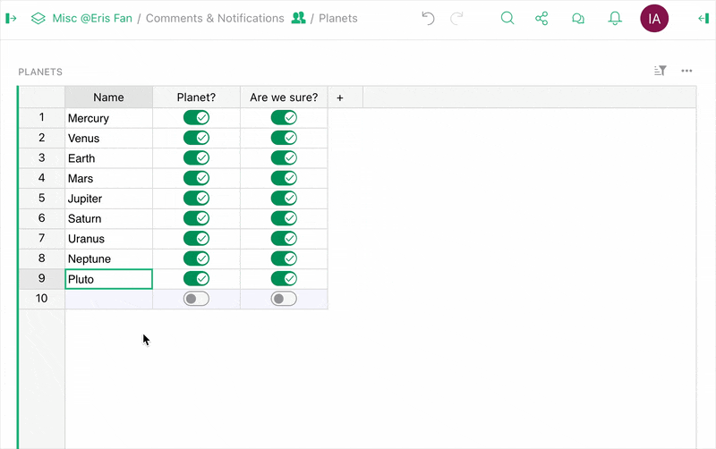
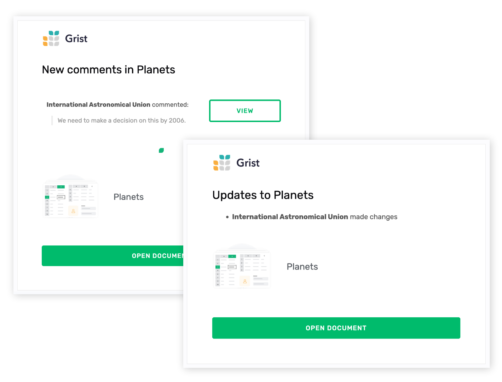
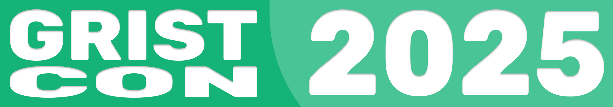
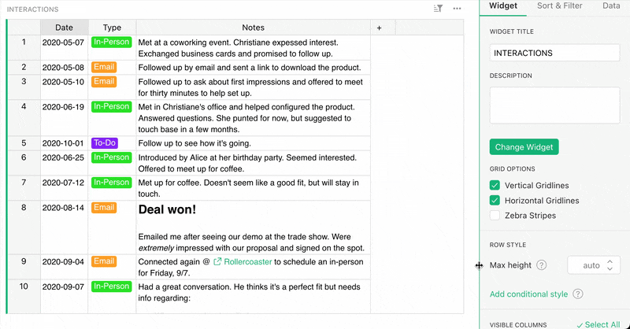
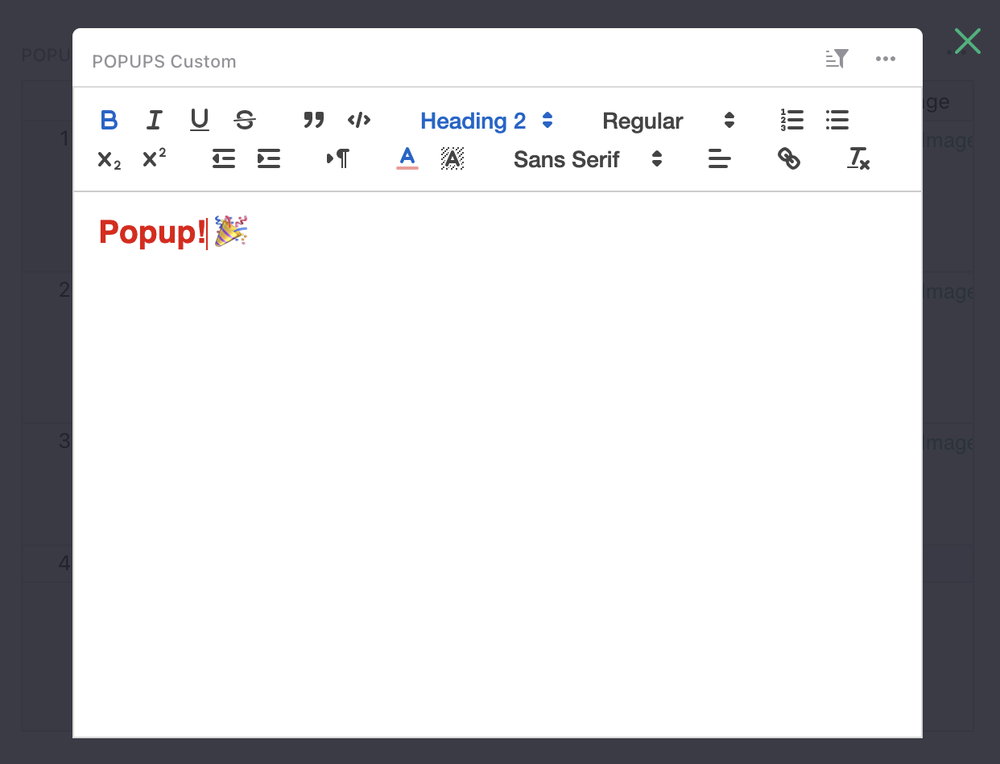
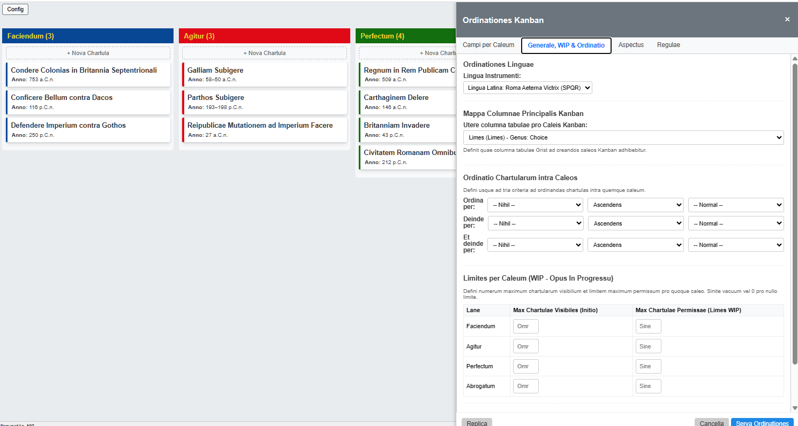
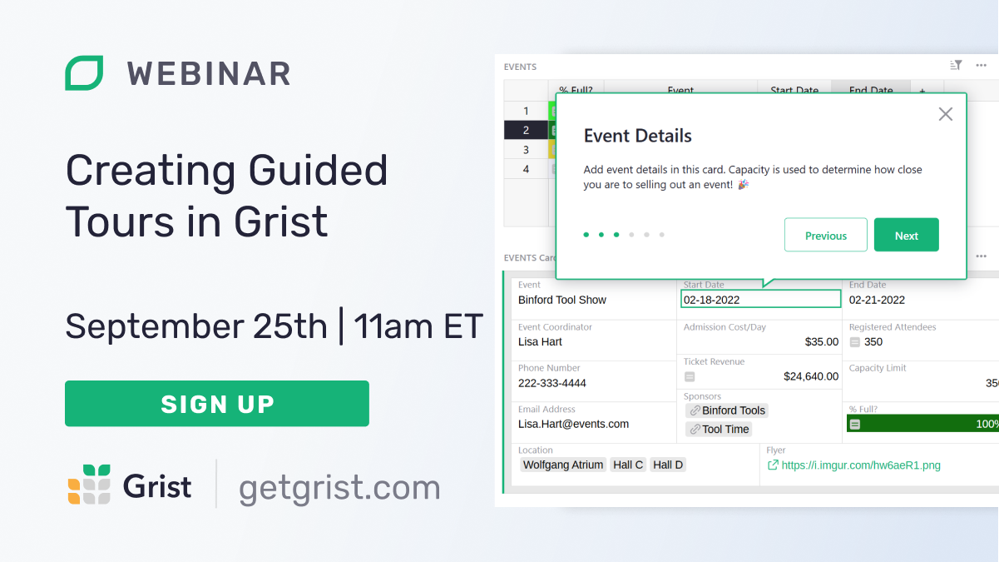

# August 2025 Newsletter

<table class="header" cellpadding="0" cellspacing="0" border="0"><tr>
  <td class="header-text">
    <table class="header-top"><tr>
      <td class="header-image">
        
      </td>
      <td class="header-top-text">
        
Grist for the Mill

        
August 2025
          &#8226; <a href="https://www.getgrist.com/">getgrist.com</a>

      </td>
    </tr></table>
    

      Welcome to our monthly newsletter of updates and tips for Grist users.
    

  </td>
</tr></table>

## What’s new

### Comments 💬

When collaborating on a spreadsheet, sometimes you want to flag specific data or start a discussion with other members of your team. Sometimes you see a cell in a spreadsheet and just want to let it know how valuable it is by attaching a nice personal message. Now you can do both!

You can add comments to cells, reply to threads, and even @-mention specific users. There’s also a new panel on the right side of the screen showing all comments (with filters!). See the full documentation [here](https://support.getgrist.com/sharing/#comments){:target="\_blank"}.

But there’s more – comments are made extra useful with this next new feature...

### Email notifications 📧

Previously, the only document-related emails you would receive from Grist were sharing invites. Now, you can enable per-document notifications for document changes and comments from other users!

If you’re using the Grist SaaS at getgrist.com, you will automatically start getting notifications for @-mentions and replies to your comments. You can change your email notification preferences in [Document Settings](https://support.getgrist.com/document-settings/#notifications){:target="\_blank"}. If you’re self-hosting, email notifications are limited to Grist Enterprise. But for self-hosters, there’s even more – read the next announcement...

### Free Grist Enterprise for qualifying self-hosters

To enable email notifications, self-hosted instances will need to be on Grist Enterprise – which is **free for qualifying self-hosters.** How do you know if you qualify? Basically, if your organization has total finances of <$1M per year. For complete details, see this [FAQ answer](https://www.getgrist.com/pricing/#faq-free-self-hosted-enterprise){:target="\_blank"}.

To set up email notifications on an Enterprise self-hosted instance, see [this article](https://support.getgrist.com/self-managed/#how-do-i-set-up-email-notifications){:target="\_blank"}.

[REQUEST ACTIVATION KEY](https://gristlabs.getgrist.com/forms/j39DedsXj1WvLptJkTtRLi/4){:target="\_blank"}
{: .grist-button}

### GristCon - new sessions added!

{:target="\_blank"}

In addition to the [excellent sessions announced last month](https://www.getgrist.com/gristcon-2025/#agenda){:target="\_blank"}, we’ve added two more sessions to the stacked GristCon 2025 slate:

1. *Unlock the power of SQL to query Grist documents and visualize them seamlessly in Apache Superset - Quentin Leroy*

    When we think of SQL we don’t always think of visualizations. We can also forget that Grist is an actual database. Join Quentin in exploring how to use open-source data explorer [Apache Superset](https://superset.apache.org/){:target="\_blank"} to explore data from Grist with his custom-built API adapter. Come explore!
    
2. *Off the grid: how anyone can build custom visualizations with custom widgets - Evan Buxton*

    One of the strengths of Grist's relational structure is that your data *has* structure. This means that if you dare to dream beyond the spreadsheet, you're starting from a solid foundation. Join Evan as he creates dynamic dashboards for interactive projects with the help of AI and GitHub pages – some for himself, some for the wider team, and some to be handed off for further refinement, development and design. 

### Row height controls!

This feature is so new that it’s currently *undocumented*. Now you can set the maximum height for a row, or ensure that all rows are the same height regardless of column contents.  

### Grist secret: Popups

Customer engineer Natalie, by way of Grist developer Jarek, wrote a post detailing a handy trick covered in our recent [Grist Secrets webinar](https://www.getgrist.com/webinars/grist-secrets/){:target="\_blank"} - widget popups. With this – admittedly circuitous – trick you can open up a widget/view in an editable lightbox, like an image. Everyone likes popups!

### More updates

* Thanks to a [PR from mrdev023](https://github.com/gristlabs/grist-core/pull/1655){:target="\_blank"}, you can now add attachment fields to forms!
* If you’re a self-hoster who has [customized styling](https://support.getgrist.com/self-managed/#how-do-i-customize-styling){:target="\_blank"}, it now applies also to forms.

There is a new `grist-core` release: 1.7.3. Check out the [release notes](https://github.com/gristlabs/grist-core/releases/tag/v1.7.3){:target="\_blank"} for some extra tidbits as to what’s included.

##  Community highlights

Grist community regular and [recent case study feature](https://www.getgrist.com/case-studies/how-grist-became-a-construction-companys-swiss-army-saas/){:target="\_blank"} Rogerio released his [Ultra Kanban Widget](https://community.getgrist.com/t/release-of-ultra-kanban-widget/10925){:target="\_blank"}, which is loaded with features, including lane-specific card layouts, automation rules, and multiple translations... including latin! 𝕍𝕃𝕋ℝ𝔸 𝔹𝕆ℕ𝕍𝕄!

## Learning Grist

### Ongoing Grist 101 webinars

New to Grist? We continue to run frequent Grist 101 webinars with a live chat to help you get up and running or answer questions. 

[SIGN UP FOR A GRIST 101 WEBINAR](https://www.getgrist.com/webinars/grist-101-new-users-guide/){:target="\_blank"}
{: .grist-button}

### Webinar: Creating Guided Tours in Grist

Ever shared a Grist doc and worried your team might miss something important? With [Document Tours](https://support.getgrist.com/document-tours/){:target="\_blank"} and [Tutorials](https://support.getgrist.com/document-tutorials/){:target="\_blank"}, you can guide users through the doc exactly the way you intended. This webinar will cover how to craft interactive walk-throughs, embed instructions right where users need them, and make onboarding seamless. Perfect for anyone building docs to share with teammates, clients, or a broader audience.

**Thursday September 25 at 11:00am US Eastern Time.**

{:target="\_blank"}

[SIGN UP FOR SEPTEMBER'S WEBINAR](https://www.getgrist.com/webinars/creating-guided-tours-in-grist/?utm_source=support-newsletter&utm_medium=internal&utm_campaign=build-webinar&utm_term=september-2025){:target="\_blank"}
{: .grist-button}

### Grist Secrets

In August, Natalie shared some not-so-secret secrets of Grist! Whether you’re a beginner or a seasoned user, you’re bound to discover something new in this webinar where we dove into corners of Grist that are as helpful as they are obscure. From handy shortcuts that save you time, to underused features for customizing Grist even further!

[WATCH AUGUST'S RECORDING](https://www.getgrist.com/webinars/grist-secrets/){:target="\_blank"}
{: .grist-button}

## Help spread the word
If you’re interested in helping Grist grow, consider leaving a review on product review sites. Here’s a short list where your review could make a big impact. Thank you! 🙏

* [AlternativeTo](https://alternativeto.net/software/grist/about/){:target="\_blank"}
* [Capterra](https://www.capterra.com/p/232821/Grist/){:target="\_blank"}
* [G2](https://www.g2.com/products/grist){:target="\_blank"}
* [TrustRadius](https://www.trustradius.com/products/grist/){:target="\_blank"}

## We are here to support you

**Solutions.** Grist often surprises people with its capabilities. Schedule a **free** call to assess your needs and help connect you with a Grist expert. [Learn more.](https://www.getgrist.com/solutions/){:target="\_blank"}

**Have questions, feedback, or need help?** Search our [Help Center](../index.md), [watch video tutorials](https://www.youtube.com/channel/UCx0ioQrrC-bIrkmZ7ZULr0g/playlists), share ideas in our [Community Forum](https://community.getgrist.com), or contact us at <support@getgrist.com>.