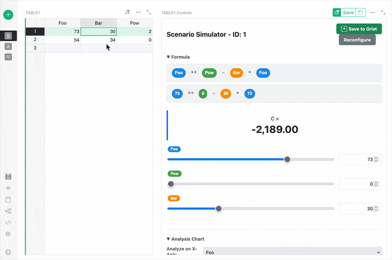
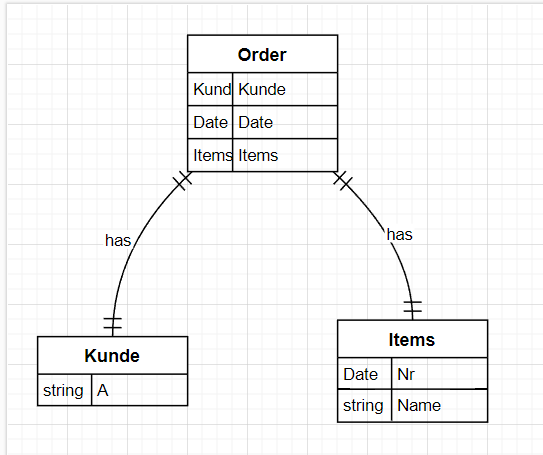
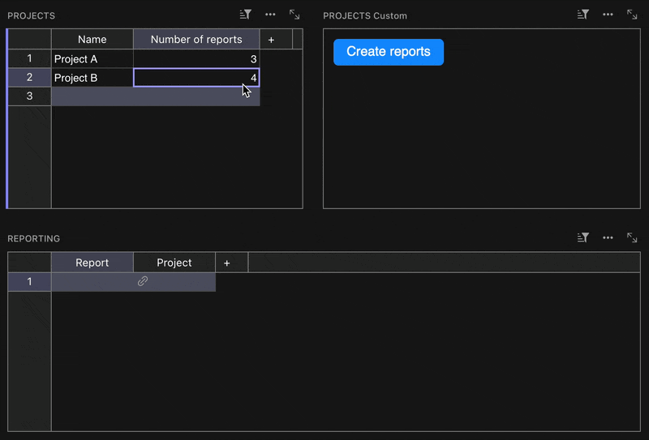
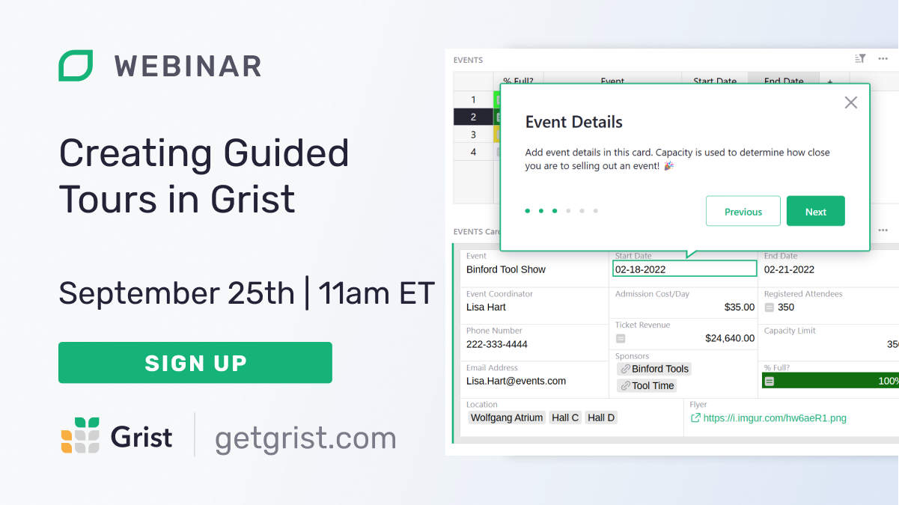

# September 2025 Newsletter

<table class="header" cellpadding="0" cellspacing="0" border="0"><tr>
  <td class="header-text">
    <table class="header-top"><tr>
      <td class="header-image">
        
      </td>
      <td class="header-top-text">
        
Grist for the Mill

        
September 2025
          &#8226; <a href="https://www.getgrist.com/">getgrist.com</a>

      </td>
    </tr></table>
    

      Welcome to our monthly newsletter of updates and tips for Grist users.
    

  </td>
</tr></table>

## What’s new

This month saw a flurry of community activity, which is often best displayed with animated GIFs showing Grist at work. Make sure to check out the **Community highlights** below for some exciting visuals. 👇

### GristCon recordings available!

Our first-ever [GristCon](https://www.getgrist.com/gristcon-2025/){:target="\_blank"} happened last week, and the recordings are already available to [watch on YouTube](https://www.youtube.com/playlist?list=PL3Q9Tu1JOy_6lEAL5J-PU6R69df8sE8C0){:target="\_blank"}. If you haven’t yet, take a look at some of the sessions for a peek into what’s going on with Grist inside *and* outside Grist Labs.

### User presence

At Grist Labs, we’re all about connecting data. People aren’t data, but we want to connect them as well, when appropriate. That’s why we’ve added [user presence indicators](https://support.getgrist.com/sharing/#real-time-user-presence){:target="\_blank"}. Now you can finally see who is loitering on which document, a feature that pairs well with the recently-launched [user comments](https://support.getgrist.com/sharing/#comments){:target="\_blank"}.

### Enterprise workshops

We’re now offering educational workshops aimed at organizations kicking off Grist deployments. The basics:

1. A multi-day curriculum covering fundamentals, data modeling, dashboards, reporting, and governance.
2. A Grist expert works alongside your team to turn ideas into production-ready workflows.

**Note:** In addition to teams on the Enterprise plan (and for a limited time), we’re also offering workshops to teams on the Business plan with at least 5 workshop attendees. Reach out via our [Contact page](https://www.getgrist.com/contact/){:target="\_blank"} if you’re interested!

### Accessibility modal

There will soon be a new options modal designed to show off and help make visible all the new accessibility features in Grist – thanks to the tireless accessibility work by Emmanuel Pelletier!

There’s a new release available: [v1.7.4](https://github.com/gristlabs/grist-core/releases/tag/v1.7.4){:target="\_blank"}. Click through for the full notes, but note a breaking change related to the `DELETE /api/orgs/:orgId` endpoint. Also note that the AI Assistant can now explain access rules used in a document!

##  Community highlights

* Rogerio has created a fascinating custom widget which enables ["interactive scenario simulation"](https://community.getgrist.com/t/interactive-scenario-simulator-with-sliders/){:target="\_blank"}. What is that? It’s best shown off in action:

* Have you ever needed a quick way to view an attachment? Steven_Summers shared a [quick custom widget](https://community.getgrist.com/t/attachment-viewer-widget-needed/){:target="\_blank"} (built with the [builder](https://community.getgrist.com/t/new-community-widget-custom-widget-builder/6803){:target="\_blank"}) that does just that. **Note:** just make sure to use the amended code in the discussion thread!

* Paragrimm shared initial work on a [barebones Grist API client](https://github.com/Paragrimm/ApiGrist){:target="\_blank"} for Godot! We just know there are some powerful workflows out there for Grist in games, and this is a great start for Godot users.

* Following up a [fantastic GristCon presentation](https://youtu.be/al4DOBONu8Y?si=Vth9h-psVnAgHKMu){:target="\_blank"}, Aude has shared the full document used: a full-blown [Orders and Invoice template!](https://community.getgrist.com/t/orders-and-invoices-template/11704){:target="\_blank"} This not only lets you dive deeper into a real-world example shared at GristCon, but is a great showcase of how custom widgets and advanced techniques combine into a complete workflow ([Batch Email Composer](https://community.getgrist.com/t/new-custom-widget-batch-email-composer-with-bcc-management/7992){:target="\_blank"}, [PDF generation with the Markdown widget](https://community.getgrist.com/t/generate-custom-pdfs-with-the-markdown-widget/10667){:target="\_blank"}).

* We’ve seen [a mermaid.js viewer](https://community.getgrist.com/t/mermaid-charts-integration/6938/5){:target="\_blank"} before, but PWI has created a Python script that can take a Grist document’s schema (from [Code View](https://support.getgrist.com/formulas/#code-viewer){:target="\_blank"}) and turn it into a [visual relationship diagram using mermaid.js](https://community.getgrist.com/t/relationship-in-er-diagram-from-exported-grist-file/1471/13?u=nick){:target="\_blank"}! Could someone automate this process so that it runs full in Grist using a custom widget? Stranger things have happened...

* The venerable and powerful [Vega-Lite interactive graphics grammar](https://vega.github.io/vega-lite/){:target="\_blank"} is now usable in Grist via a [custom widget](https://community.getgrist.com/t/new-widget-for-advanced-charts-with-vega-lite/11888){:target="\_blank"} created by our friends at multi.coop! Read the community post for a link to a demo document and documentation.

* Over on *le forum,* Enro shared an [action button setup](https://forum.grist.libre.sh/t/creer-automatiquement-le-nombre-de-lignes-voulu/1925){:target="\_blank"} that automatically creates bulk rows according to specific parameters, which could be supremely helpful in certain use cases.

## Learning Grist

### Ongoing Grist 101 webinars

New to Grist? We continue to run frequent Grist 101 webinars with a live chat to help you get up and running or answer questions. 

[SIGN UP FOR A GRIST 101 WEBINAR](https://www.getgrist.com/webinars/grist-101-new-users-guide/){:target="\_blank"}
{: .grist-button}

### Webinar: How Grist uses Grist

{:target="\_blank"}

We're always asking people “How do you use Grist?” So we thought we’d flip it around and ask ourselves: how do we use it? In this session, we'll give you the answer by walking through real documents from Grist employees – business, personal, and everything in between – so you can see how we use (and perhaps misuse) Grist and even pick up ideas and inspiration for your own workflows.

**Thursday October 23rd at 11:00am US Eastern Time.**

[SIGN-UP FOR OCTOBER'S WEBINAR](https://www.getgrist.com/webinars/how-grist-uses-grist/?utm_source=support-newsletter&utm_medium=internal&utm_campaign=build-webinar&utm_term=october-2025){:target="\_blank"}
{: .grist-button}

In September, Natalie showed us how [Document Tours](https://support.getgrist.com/document-tours/){:target="\_blank"} and [Tutorials](https://support.getgrist.com/document-tutorials/){:target="\_blank"} make sharing Grist documents more seamless than ever. We learned how to craft interactive walk-throughs to guide our users through documents. Perfect for anyone building documents to share with teammates, clients, or a broader audience.

[WATCH SEPTEMBER'S RECORDING](https://www.getgrist.com/webinars/creating-guided-tours-in-grist//){:target="\_blank"}
{: .grist-button}

## Help spread the word
If you’re interested in helping Grist grow, consider leaving a review on product review sites. Here’s a short list where your review could make a big impact. Thank you! 🙏

* [AlternativeTo](https://alternativeto.net/software/grist/about/){:target="\_blank"}
* [Capterra](https://www.capterra.com/p/232821/Grist/){:target="\_blank"}
* [G2](https://www.g2.com/products/grist){:target="\_blank"}
* [TrustRadius](https://www.trustradius.com/products/grist/){:target="\_blank"}

## We are here to support you

**Solutions.** Grist often surprises people with its capabilities. Schedule a **free** call to assess your needs and help connect you with a Grist expert. [Learn more.](https://www.getgrist.com/solutions/){:target="\_blank"}

**Have questions, feedback, or need help?** Search our [Help Center](../index.md), [watch video tutorials](https://www.youtube.com/channel/UCx0ioQrrC-bIrkmZ7ZULr0g/playlists), share ideas in our [Community Forum](https://community.getgrist.com), or contact us at <support@getgrist.com>.