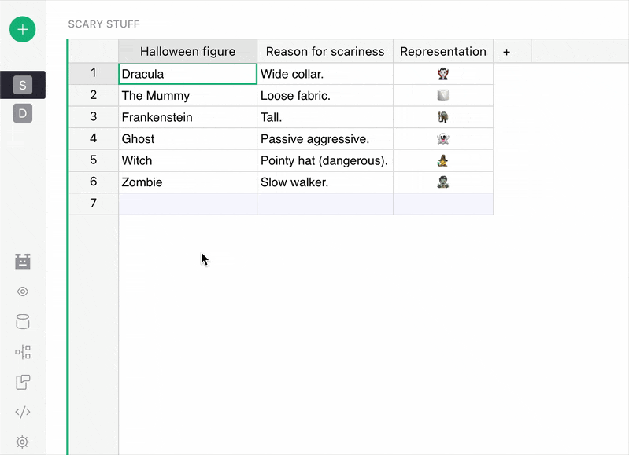
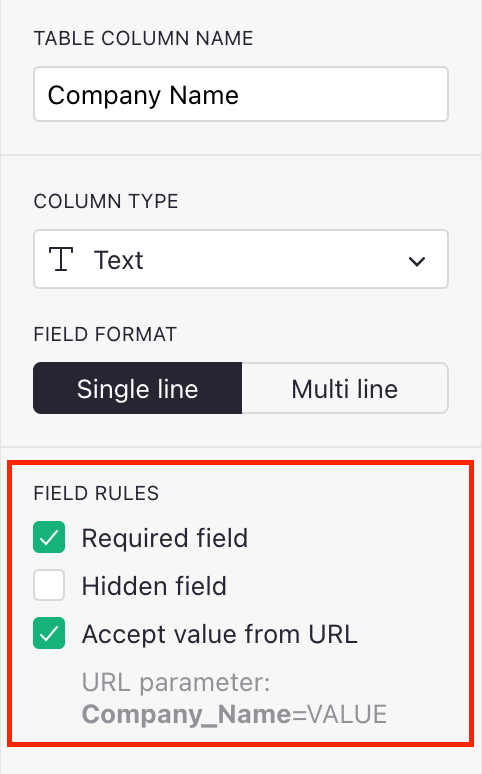
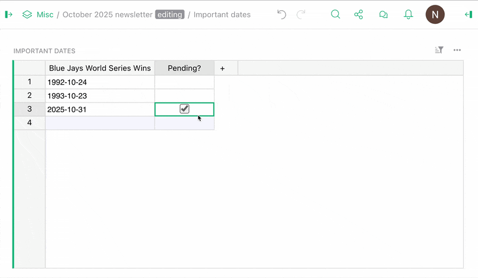
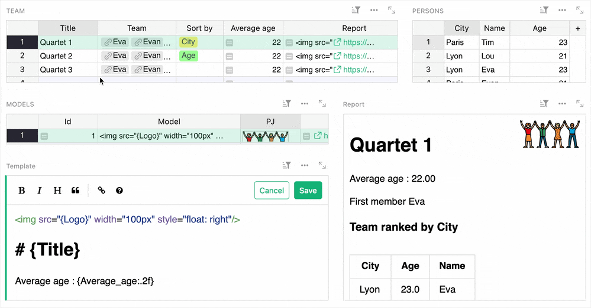
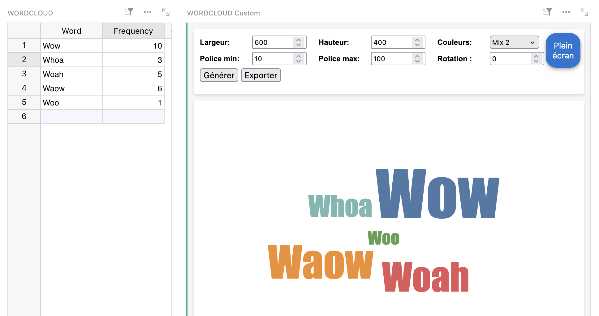
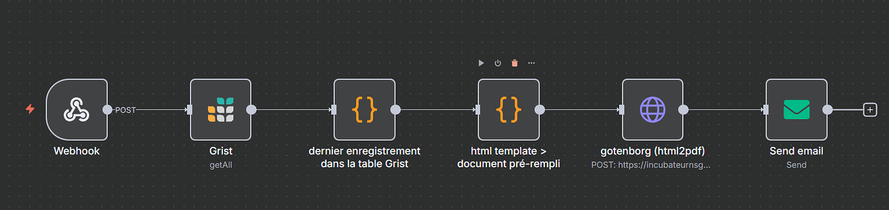
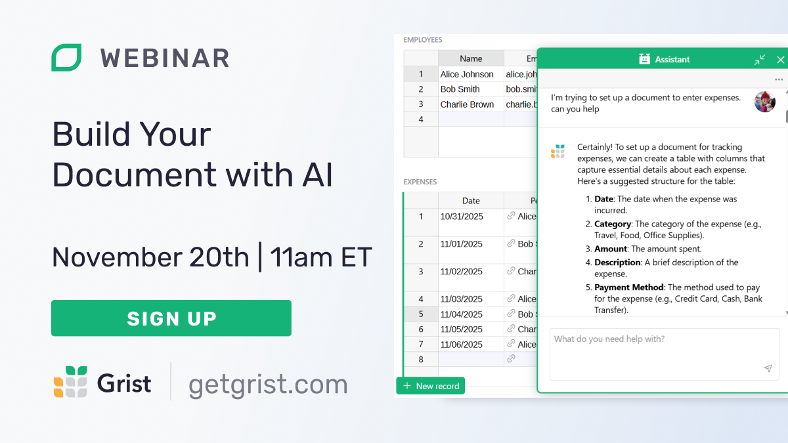

# October 2025 Newsletter

<table class="header" cellpadding="0" cellspacing="0" border="0"><tr>
  <td class="header-text">
    <table class="header-top"><tr>
      <td class="header-image">
        
      </td>
      <td class="header-top-text">
        
Grist for the Mill

        
October 2025
          &#8226; <a href="https://www.getgrist.com/">getgrist.com</a>

      </td>
    </tr></table>
    

      Welcome to our monthly newsletter of updates and tips for Grist users.
    

  </td>
</tr></table>

## What’s new

### Experiment: Suggestions

Some of the largest and [most notable](https://bsky.app/profile/tas.bot/post/3ljqmi5hwbc2p) Grist documents are thanks to crowdsourcing. Working with many collaborators on a spreadsheet/database can be tricky, and we’ve launched an experiment to see if we can make it better: suggestions. Inspired by version control, suggestions add a distinct review phase to document editing.

In their initial (and quite limited) form, people can suggest changes that document Owners can review and approve. To enable suggestions (and to read more about their features and peculiarities) check out our [experimental documentation](https://support.getgrist.com/sharing/#suggestions). If you do give them a shot, please let us know what you think by emailing [support@getgrist.com](mailto:support@getgrist.com) or reaching out on our [Discord server](https://discord.gg/MYKpYQ3fbP).

### Forms: hidden fields and prefilled variables via URL parameters

{: .screenshot-half }

We’ve added two new form features: hidden fields and passthrough URL parameters. These mostly work in tandem – for example, you can prefill certain values through a link and then hide those fields from user input, which is useful for surveys.

### More formula shortcuts for working with dates!

There’s a famous saying that goes: “Never work with dates.” Unfortunately, our temporal consciousness requires us to demarcate existence *somehow,* so dates creep into our data. Thankfully, Grist now makes working with dates a little bit easier by providing many (so many!) formula shortcuts for calculating and displaying dates and intervals, such as:

* Going from `2025-10-29 00:00:00-04:00` to `Wednesday`. 
* Calculating the days/months/years since or until a date.
* Returning the closest start or end of a week/month/year to a date.
* Finding out if a date is a weekend or not (we’ve all been there).

Read more about these handy shortcuts in the [Help Center](https://support.getgrist.com/dates/#displaying-days-weeks-years-and-intervals). 

### Self-hosted Grist: Service accounts API

Ever wanted to limit what your Grist API key could do, or have many keys without creating many user accounts? Self-hosters can now do that with service accounts, developed by DINUM's Grégoire Cutzach. Each user can have many service accounts, each with access to different documents, each with its own distinct API key. For now, service accounts themselves are configured via the API. Check out [the PR on GitHub](https://github.com/gristlabs/grist-core/pull/1699) for more information.

Another month, another release. This one brings with it lots of new stuff beyond the above features, such as new API endpoints for enabling/disabling users, timeout environment vars, an attachment copy/pasting fix, lots of accessibility updates and more! Check out the [full release notes for v1.7.5](https://github.com/gristlabs/grist-core/releases/tag/v1.7.5) for more!

##  Community highlights

* This newsletter has documented Emmanuel Pelletier’s amazing work over the last year, but it’s no substitute for his [thorough summary of the past, present and future of Grist’s accessibility](https://docs.numerique.gouv.fr/docs/dd22823c-5fa9-4d5f-b09c-08b6e693d9ce/). See also [Dmitry’s comments](https://www.linkedin.com/posts/dsagal_docs-activity-7386749971032862720-0oer/?utm_source=share&utm_medium=member_desktop&rcm=ACoAABU4rcUBgiDDCl33ZX_67NMrHqsZzO7CR68) on this initiative. 
    * On that note, Emmanuel has done even more work: such as improving [menu highlights](https://github.com/gristlabs/grist-core/pull/1876) and [pie charts](https://github.com/gristlabs/grist-core/pull/1872).
* Over on the French forum, RaphaelG has shared a great setup for [building templatable and exportable Markdown reports](https://forum.grist.libre.sh/t/mini-generateur-pour-mettre-en-forme-vos-donnees-avec-un-modele/1940/2).

* Heloise_Ouvry has shared another helpful widget that [creates a custom wordcloud](https://community.getgrist.com/t/wordcloud-widget/12218) based on Grist data. It includes lots of features, and is built for display and export.

* There’s been an [update to grist-ctl](https://community.getgrist.com/t/grist-ctl-a-cli-tool-to-interact-with-grist-api/7887/7) (Grist API CLI) that adds new features for working with organizations/team sites. 
* [GristCon](https://www.getgrist.com/gristcon-2025/) attendees will know that working with PDFs and emails is a vital workflow for many, and n8n is often part of it. Check out Maxime_Lacoste’s [overview of his process](https://community.getgrist.com/t/how-to-generate-and-send-by-email-a-sum-up-pdf-after-the-completion-of-a-form-with-n8n-and-gotenborg/12284) that also uses [Gotenberg](https://gotenberg.dev/) to generate and email PDFs using Grist data.

## Learning Grist

### Ongoing Grist 101 webinars

New to Grist? We continue to run frequent Grist 101 webinars with a live chat to help you get up and running or answer questions. 

[SIGN UP FOR A GRIST 101 WEBINAR](https://www.getgrist.com/webinars/grist-101-new-users-guide/){:target="\_blank"}
{: .grist-button}

### Webinar: Build Your Document with AI

{:target="\_blank"}

We have a lot of Grist templates, but we'll never be able to build one for everything. Generating the basics is something that AI does really well – join us as we start with a blank page and end with a custom foundation for a specific use case, with Grist's [Assistant](https://support.getgrist.com/assistant/) doing all of the heavy lifting. A simple, live look at what AI can (and can't) do with relational spreadsheets.

**Thursday November 20th at 11:00am US Eastern Time.**

[SIGN-UP FOR NOVEMBER'S WEBINAR](https://www.getgrist.com/webinars/build-your-document-with-ai/?utm_source=support-newsletter&utm_medium=internal&utm_campaign=build-webinar&utm_term=november-2025){:target="\_blank"}
{: .grist-button}

### How Grist uses Grist

We're always asking people “How do you use Grist?” So we thought we’d flip it around and ask ourselves: how do *we* use it? In October, Natalie shared the answer by walking through real documents from Grist employees – business, personal, and everything in between – so you can see how we use (and perhaps misuse) Grist and even pick up ideas and inspiration for your own workflows.

[WATCH OCTOBER'S RECORDING](https://www.getgrist.com/webinars/how-grist-uses-grist/){:target="\_blank"}
{: .grist-button}

## Help spread the word
If you’re interested in helping Grist grow, consider leaving a review on product review sites. Here’s a short list where your review could make a big impact. Thank you! 🙏

* [AlternativeTo](https://alternativeto.net/software/grist/about/){:target="\_blank"}
* [Capterra](https://www.capterra.com/p/232821/Grist/){:target="\_blank"}
* [G2](https://www.g2.com/products/grist){:target="\_blank"}
* [TrustRadius](https://www.trustradius.com/products/grist/){:target="\_blank"}

## We are here to support you

**Solutions.** Grist often surprises people with its capabilities. Schedule a **free** call to assess your needs and help connect you with a Grist expert. [Learn more.](https://www.getgrist.com/solutions/){:target="\_blank"}

**Have questions, feedback, or need help?** Search our [Help Center](../index.md), [watch video tutorials](https://www.youtube.com/channel/UCx0ioQrrC-bIrkmZ7ZULr0g/playlists), share ideas in our [Community Forum](https://community.getgrist.com), or contact us at <support@getgrist.com>.