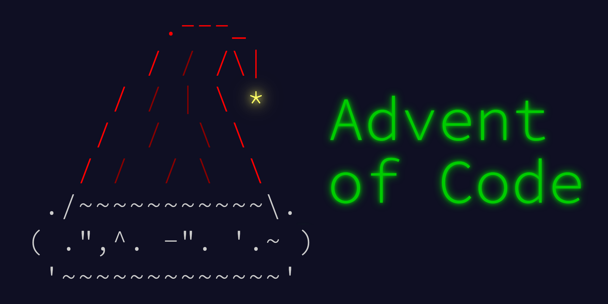
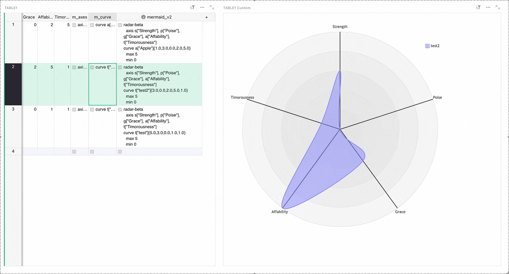

# November 2025 Newsletter

<table class="header" cellpadding="0" cellspacing="0" border="0"><tr>
  <td class="header-text">
    <table class="header-top"><tr>
      <td class="header-image">
        
      </td>
      <td class="header-top-text">
        
Grist for the Mill

        
November 2025
          &#8226; <a href="https://www.getgrist.com/">getgrist.com</a>

      </td>
    </tr></table>
    

      Welcome to our monthly newsletter of updates and tips for Grist users.
    

  </td>
</tr></table>

## What’s new

### 10,000 stars

At Grist we’ve always said “shoot for the moon (by building an open-source collaborative spreadsheet-database), because even if you miss you’ll land among the GitHub stars”. We’re still in the [process of shooting](https://github.com/gristlabs/grist-core){:target="\_blank"}, but at least the last part seems to be true! Thank you to everyone for your stellar support. 💫

### Advent of Code 2025

Grist was happy to sponsor [Advent of Code](https://adventofcode.com/2025/about){:target="\_blank"} back in 2023, and we’re back for the 2025 edition! Join us in trying to solve twelve small programming puzzles, and maybe even doing so completely in Grist.

Join the special [#advent-of-code Discord channel](https://discord.gg/hUytXhvP){:target="\_blank"} to share and discuss solutions! Or just commiserate and complain if the problems are too hard! But don’t forget to join Grist’s private leaderboard using the code `3407095-fca1f1e6`.

### Miscellaneous updates

* We made a bunch of capitalization changes for consistency in the Grist UI. This is something that no one at Grist Labs is opinionated about, especially not the person who writes the newsletter. 
* [Document history](https://support.getgrist.com/document-history/#activity){:target="\_blank"} now shows a hint if an update is censored due to Access Rules.
* Self-hosters: [installation administrators](https://support.getgrist.com/self-managed/#what-is-the-administrative-account){:target="\_blank"} can now disable [documents](https://support.getgrist.com/api/#tag/docs/operation/disableDoc){:target="\_blank"} and [users](https://support.getgrist.com/api/#tag/users/paths/~1users~1%7BuserId%7D~1disable/post){:target="\_blank"} via an API endpoint. When a document is disabled, so are all of its Grist forms. This can useful for temporary access changes, such as a document that needs to be disabled until you can communicate with the owner. 

On November 13th, there was a security advisory release [v1.7.7](https://github.com/gristlabs/grist-core/releases/tag/v1.7.7){:target="\_blank"}. Since then, we’ve also released a regular build [v1.7.8](https://github.com/gristlabs/grist-core/releases/tag/v1.7.8){:target="\_blank"} with minor fixes and enhancements. We urge users to update to at least 1.7.7 as soon as possible.

##  Community highlights

* Heloise_Ouvry has updated jperon’s [QR code custom widget](https://community.getgrist.com/t/qr-code-custom-widget/1965/2){:target="\_blank"} with extra functionality.

* Elodie from the Dycazo team has shared a simple and simple-to-customize [kanban widget](https://forum.grist.libre.sh/t/custom-widget-kanban-leger-et-personnalisable/2148){:target="\_blank"} on the French Grist forum.

* For SQL and/or algebra fans, Antonin_P has shared an [interesting write-up](https://community.getgrist.com/t/cartesian-product-outer-join-self-join-compute-all-pairs-its-possible-in-grist/12556){:target="\_blank"} of computing the cartesian product of two tables in Grist. Summary tables (and their limitations) make an appearance!
* An R client library has been added to the [list of community-created API clients](https://support.getgrist.com/rest-api/#api-clients){:target="\_blank"}!
* Last month we released a [service accounts API](https://support.getgrist.com/newsletters/2025-10/#self-hosted-grist-service-accounts-api){:target="\_blank"}, and now they are well-documented in [our API reference](https://support.getgrist.com/api/#tag/service-accounts){:target="\_blank"} (thanks again to Grégoire Cutzach).
* It’s important to share our failures, especially when the newsletter writer is the one doing the failing. Maxime_Lacoste asked if there was a way to create spider/radar charts in Grist. [Attempts were made](https://community.getgrist.com/t/radar-spider-chart/12646){:target="\_blank"}, but we’re still not quite there. Maybe you can help?

* Celine has shared a very neat [combination of trigger and regular formulas](https://community.getgrist.com/t/who-did-what-and-when-full-audit-trail-in-grist/12825){:target="\_blank"} that lets you track and explore edit history. As usual, the best example of this in practice is by tracking a metamorphosing butterfly. Can any lepidopterists identify two errors in the below animation?

## Learning Grist

### Grist 101

New to Grist? Check out our webinar designed to get you up to speed on essential features and helpful tricks.

[WATCH GRIST 101 WEBINAR](https://www.getgrist.com/webinars/grist-101-new-users-guide/){:target="\_blank"}
{: .grist-button}

### Webinar: Grist 2025 - Year in Review

{:target="\_blank"}

Close out the year with us as we look back at everything Grist delivered in 2025. We’ll highlight new features and updates over what was yet another long and lively year in the software world. Did you know we added [comments](https://support.getgrist.com/sharing/#comments){:target="\_blank"}? Experimental [suggestions](https://support.getgrist.com/sharing/#suggestions){:target="\_blank"}? Catch up with Grist and perhaps even get a look at what to expect in 2026.

**Thursday December 4th at 11:00am US Eastern Time.**

[SIGN-UP FOR DECEMBER'S WEBINAR](https://www.getgrist.com/webinars/2025-year-in-review/?utm_source=support-newsletter&utm_medium=internal&utm_campaign=build-webinar&utm_term=december-2025){:target="\_blank"}
{: .grist-button}

### Build Your Document with AI

We have a lot of Grist templates, but we'll never be able to build one for everything. Generating the basics is something that AI does really well. We began with a blank page and ended with a custom foundation for a specific use case, with Grist's [Assistant](https://support.getgrist.com/assistant/){:target="\_blank"} doing all of the heavy lifting. A simple, practical look at what AI can (and can't) do with relational spreadsheets.

[WATCH NOVEMBER'S RECORDING](https://www.getgrist.com/webinars/build-your-document-with-ai/){:target="\_blank"}
{: .grist-button}

## Help spread the word
If you’re interested in helping Grist grow, consider leaving a review on product review sites. Here’s a short list where your review could make a big impact. Thank you! 🙏

* [AlternativeTo](https://alternativeto.net/software/grist/about/){:target="\_blank"}
* [Capterra](https://www.capterra.com/p/232821/Grist/){:target="\_blank"}
* [G2](https://www.g2.com/products/grist){:target="\_blank"}
* [TrustRadius](https://www.trustradius.com/products/grist/){:target="\_blank"}

## We are here to support you

**Solutions.** Grist often surprises people with its capabilities. Schedule a **free** call to assess your needs and help connect you with a Grist expert. [Learn more.](https://www.getgrist.com/solutions/){:target="\_blank"}

**Have questions, feedback, or need help?** Search our [Help Center](../index.md), [watch video tutorials](https://www.youtube.com/channel/UCx0ioQrrC-bIrkmZ7ZULr0g/playlists), share ideas in our [Community Forum](https://community.getgrist.com), or contact us at <support@getgrist.com>.