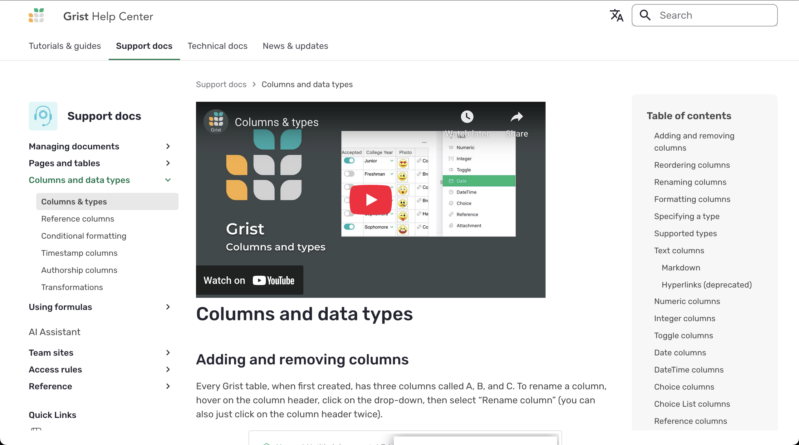
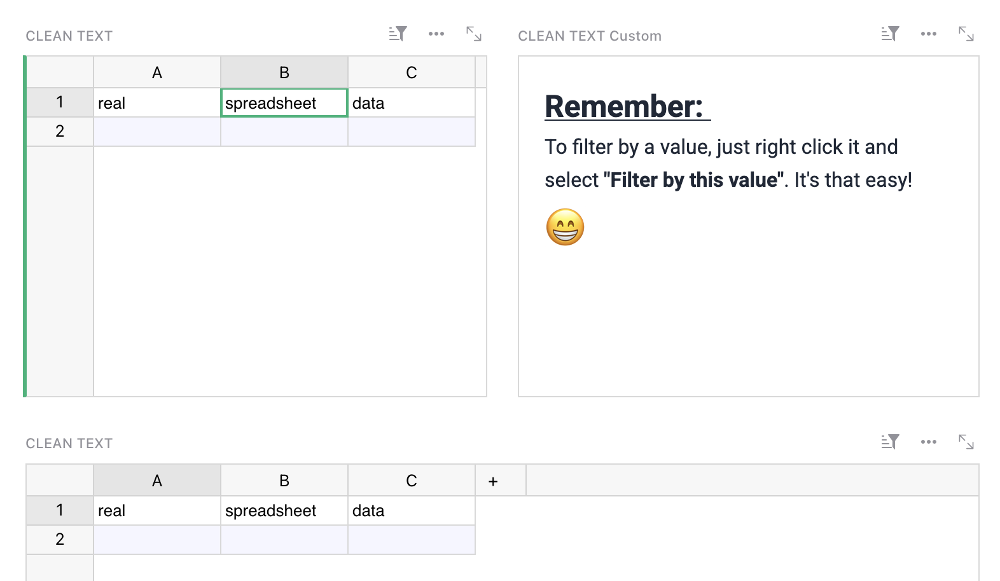
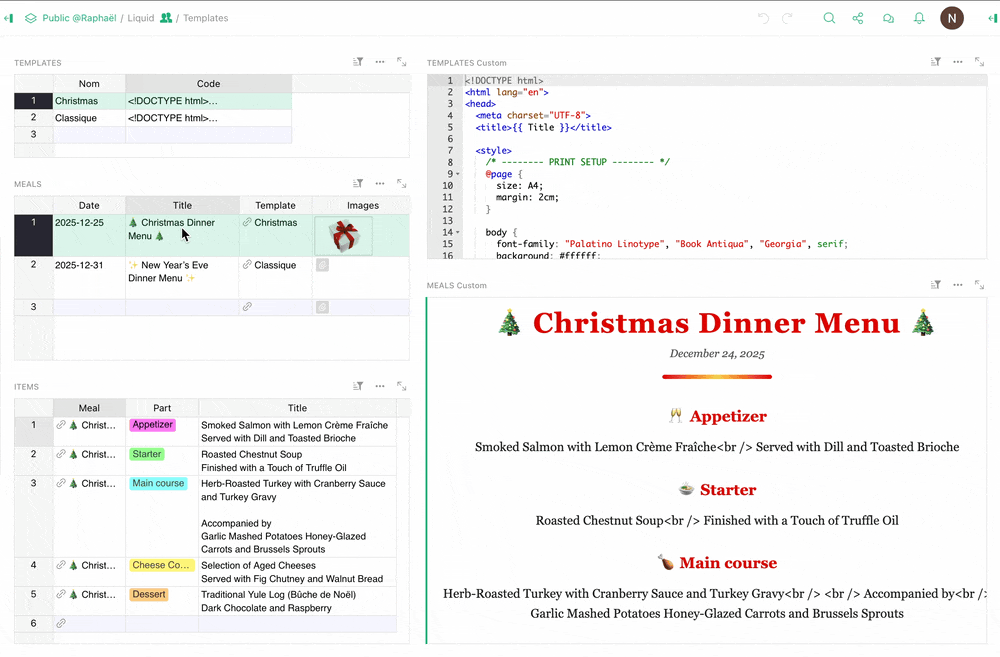
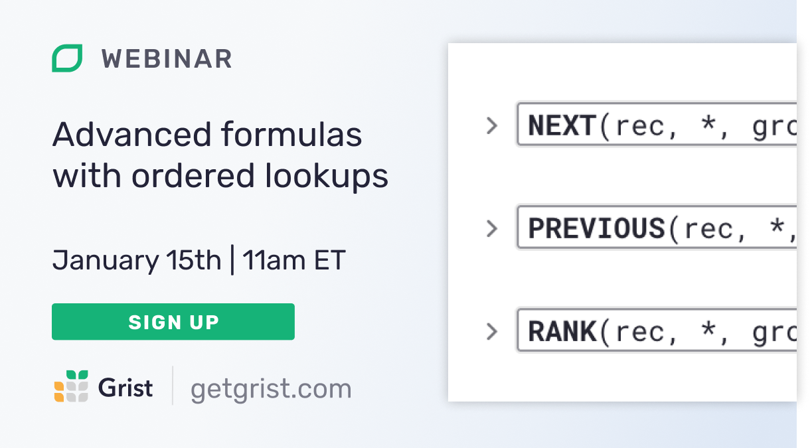

# December 2025 Newsletter

<table class="header" cellpadding="0" cellspacing="0" border="0"><tr>
  <td class="header-text">
    <table class="header-top"><tr>
      <td class="header-image">
        
      </td>
      <td class="header-top-text">
        
Grist for the Mill

        
December 2025
          &#8226; <a href="https://www.getgrist.com/">getgrist.com</a>

      </td>
    </tr></table>
    

      Welcome to our monthly newsletter of updates and tips for Grist users.
    

  </td>
</tr></table>

## What’s new

### 2025 is over!

Check out our [end-of-year write-up](https://www.getgrist.com/blog/grist-2025-year-in-review/){:target="\_blank"} covering 2025’s highlights: new features, makeovers, a virtual conference, and our deepest secrets.

### Help Center redesign

We’ve done a significant redesign of the [Grist Help Center](https://support.getgrist.com/){:target="\_blank"}, home to our support and developer documentation. This has been another productive collaboration with [Emmanuel Pelletier](https://github.com/manuhabitela){:target="\_blank"}!

### GrainJS

We’ve also done some work on the [documentation for GrainJS](https://gristlabs.github.io/grainjs/){:target="\_blank"}, a light web framework upon which Grist is built. [GrainJS](https://github.com/gristlabs/grainjs){:target="\_blank"} has always been there, but now you can better understand the frontend powering your spreadsheets – only 30kb and dependency-free!

### Miscellaneous

* We’ve made the operations an Editor (as opposed to an Owner – learn more about roles [here](https://support.getgrist.com/team-sharing/#roles){:target="\_blank"}) can perform on a resource more consistent across team sites, workspaces, and documents. Specifically:
  * An Editor can no longer rename or delete an organization, only an Owner can.
  * An Editor can no longer rename, delete, or undelete a workspace, only an Owner can.
* We’ve implemented several [improvements to RecordSet handling](https://github.com/gristlabs/grist-core/pull/1992){:target="\_blank"}. 
* There’s also a new [Grist Desktop release](https://github.com/gristlabs/grist-desktop/releases/tag/v0.3.7){:target="\_blank"} with core updates and a few fixes.

## Community highlights

* Thanks to everyone who participated in the Grist-sponsored [Advent of Code](https://adventofcode.com/){:target="\_blank"} this year, especially those who shared their solutions on Discord and commiserated with those who received many many many RecursionErrors.
* User dtnth on Discord shared a utility that transforms your Grist document’s code view to a TypeScript-ready API interface. Check it out [here](https://dt.in.th/GristTypeGenerator){:target="\_blank"}, in all its Comic Mono glory.
  * If you use n8n with Grist, you may also be interested in dtnth’s [pending PR](https://github.com/n8n-io/n8n/pull/18067){:target="\_blank"} for adding support for the upsert operation. If you don’t use n8n or make database queries regularly, you probably learned a new term (upsert), which is a melding of “update” and “insert”. Kind of like “grid” and “list”!
* Antonin Peronnet has shared a few [handy widgets](https://github.com/rambip/grist-attachment-widgets){:target="\_blank"} that deal with attachments:
  * A simple image/PDF viewer
  * A way to generate attachment URLs for in-document display (like in the Markdown or HTML widget)
  * A formula that allows self-hosters to generate attachment URLs for external websites

* Riccardo_Polignieri has updated [Pygrister](https://community.getgrist.com/t/pygrister-a-python-client-for-the-grist-api/5015/17){:target="\_blank"} – a Grist Python client – which quickly approaches a 1.0 release.
* Over on *le forum*, Aude shared a [simple widget](https://forum.grist.libre.sh/t/custom-widget-clean-text-afficher-du-texte-avec-de-jolies-police-dont-marianne/2365){:target="\_blank"} to display configurable text in a widget pane whose data is stored in the widget configuration itself rather than table data. Voila:

* If you’re cartographically-inclined and have a MapBox account, you can try out nic01asFr’s [custom widget](https://forum.grist.libre.sh/t/widget-grist-mapbox/2426){:target="\_blank"} that lets you import and visualize geographic data, configure styles from Grist data, and export to GeoJSON.

* nic01asFr also shared a [trifecta of useful project management custom widgets](https://forum.grist.libre.sh/t/kaban-gantt-calendar-suite-de-widgets-pour-la-gestion-de-taches/2337){:target="\_blank"}: kanban, Gantt, and the classic calendar.
* Raphael_Guenot has shared [two custom widgets](https://community.getgrist.com/t/liquid-templates/13136){:target="\_blank"} that enable easy client-side templating using [LiquidJS](https://liquidjs.com/){:target="\_blank"}. Importantly, the custom viewer has a dedicated “Print” button for easy PDF export.

## Learning Grist

### Grist 101

New to Grist? Check out our webinar designed to get you up to speed on essential features and helpful tricks.

[WATCH GRIST 101 WEBINAR](https://www.getgrist.com/webinars/grist-101-new-users-guide/){:target="\_blank"}
{: .grist-button}

### Webinar: Advanced formulas with ordered lookups

{:target="\_blank"}

Sometimes you want to mosey down a table, row by row, and and get a running total. Or you need a formula in the current record to use the previous one, or to find the last record before a certain date, or the first event of the next month. With Grist’s ordered lookups and functions such as `PREVIOUS()`, you can do cumulative calculations, nearest matches, and more. Join their implementor and co-CEO Dmitry for a deep dive on Grist functionality that goes under the radar, but serves as a perfect and efficient tool for a range of data workflows.

**Thursday January 15th at 11:00am US Eastern Time.**

[SIGN-UP FOR JANUARY'S WEBINAR](https://www.getgrist.com/webinars/advanced-formulas-with-ordered-lookups/?utm_source=support-newsletter&utm_medium=internal&utm_campaign=build-webinar&utm_term=january-2025){:target="\_blank"}
{: .grist-button}

### 2025 Year in Review webinar

Last month, we took a look back at everything Grist delivered in 2025. We focused on new features and updates over what was yet another long and lively year in the software world. Did you know we added [comments](https://support.getgrist.com/sharing/#comments){:target="\_blank"}? Experimental [suggestions](https://support.getgrist.com/sharing/#suggestions){:target="\_blank"}? Catch up with Grist and perhaps even get a look at what to expect in 2026.

[WATCH DECEMBER'S RECORDING](https://www.getgrist.com/webinars/2025-year-in-review/){:target="\_blank"}
{: .grist-button}

## Help spread the word
If you’re interested in helping Grist grow, consider leaving a review on product review sites. Here’s a short list where your review could make a big impact. Thank you! 🙏

* [AlternativeTo](https://alternativeto.net/software/grist/about/){:target="\_blank"}
* [Capterra](https://www.capterra.com/p/232821/Grist/){:target="\_blank"}
* [G2](https://www.g2.com/products/grist){:target="\_blank"}
* [TrustRadius](https://www.trustradius.com/products/grist/){:target="\_blank"}

## We are here to support you

**Solutions.** Grist often surprises people with its capabilities. Schedule a **free** call to assess your needs and help connect you with a Grist expert. [Learn more.](https://www.getgrist.com/solutions/){:target="\_blank"}

**Have questions, feedback, or need help?** Search our [Help Center](../index.md), [watch video tutorials](https://www.youtube.com/channel/UCx0ioQrrC-bIrkmZ7ZULr0g/playlists), share ideas in our [Community Forum](https://community.getgrist.com), or contact us at <support@getgrist.com>.