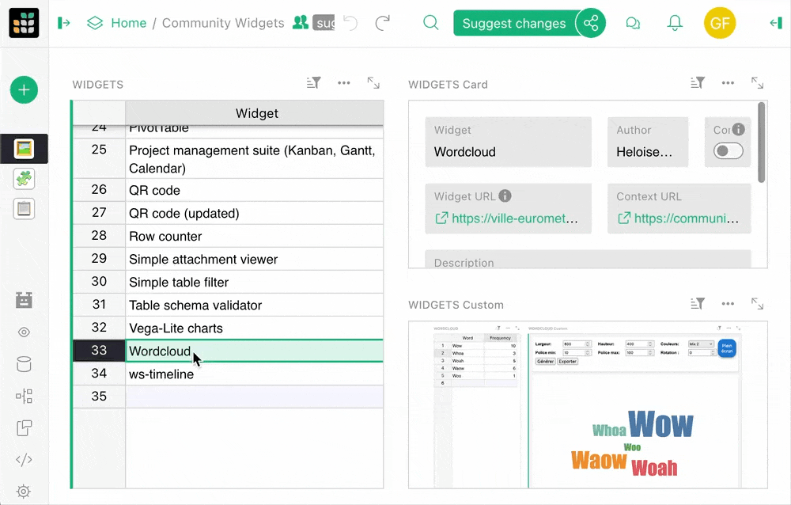
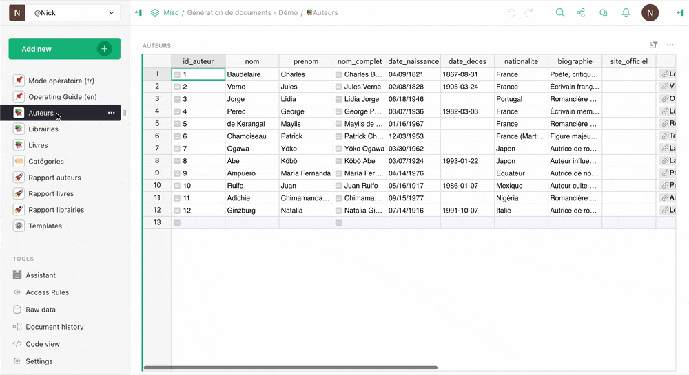

# January 2026 Newsletter

<table class="header" cellpadding="0" cellspacing="0" border="0"><tr>
  <td class="header-text">
    <table class="header-top"><tr>
      <td class="header-image">
        
      </td>
      <td class="header-top-text">
        
Grist for the Mill

        
January 2026
          &#8226; <a href="https://www.getgrist.com/">getgrist.com</a>

      </td>
    </tr></table>
    

      Welcome to our monthly newsletter of updates and tips for Grist users.
    

  </td>
</tr></table>

## What’s new

### Suggestions improvements

We’ve been working hard on suggestions. Since our initial announcement, we’ve added a new [diff visualization](https://github.com/gristlabs/grist-core/pull/1977){:target="\_blank"} that handles additional column types, as well as a [counter](https://github.com/gristlabs/grist-core/pull/1960){:target="\_blank"} that shows how many suggestions you’ve been making. 

We’ve also written up a [blog post](https://www.getgrist.com/blog/spreadsheet-suggestions/){:target="\_blank"} going over our thoughts on the feature and some examples we find particularly satisfying. We’ve *also* put together a [video](https://www.youtube.com/watch?v=INwOdBzDMrQ){:target="\_blank"} walking through these examples.

Have you played around with suggestions yet? Please drop us a line and let us know what you think.

### Self-hosters: sign in with getgrist.com

When you’re setting up a self-hosted instance of Grist, authentication has often been a stumbling block. You can now use getgrist.com as an authentication provider, which is the simplest way to set up authentication. Basically, this means that users use a Grist account (on getgrist.com, managed by Grist Labs) to sign in to your own server, with no other external dependencies or services required. Authentication via getgrist.com is free and your documents and data stay on your server, as always. To set this up, check out our updated [documentation](https://support.getgrist.com/install/sign-in-with-grist/){:target="\_blank"}.

Note: this feature works for Grist with a single team site (`GRIST_SINGLE_ORG` set to your team site). If you use multiple team sites, hold on just a little longer – we plan to offer a solution for this mode soon.

### New access rules flow

We’ve improved the flow of getting started with access rules. Now, documents either have access rules enabled or disabled. Pretty simple, but it makes for better defaults when you need to restrict access. It comes with a few changes to the [special rules](https://support.getgrist.com/access-rules/#special-rules){:target="\_blank"} to account for viewing access rules, restricting copying/downloading, and allowing full copying for templates. Our [documentation](https://support.getgrist.com/access-rules/#access-rules){:target="\_blank"} has been updated and expanded to reflect these changes.

### Go off the grid with Evan

At last year’s GristCon, Evan Buxton gave a [great talk](https://www.youtube.com/watch?v=0e3wc5u2mSw&list=PL3Q9Tu1JOy_6lEAL5J-PU6R69df8sE8C0&index=12){:target="\_blank"} about building custom widgets with AI assistance. We’ve since turned it into [a case study](https://www.getgrist.com/case-studies/how-one-agency-went-from-spreadsheet-to-custom-dashboard-with-ai/){:target="\_blank"} detailing his work unearthing unused data with bespoke dashboards. 

We’re always on the lookout for new case studies or potential talks for future events. Please reach out if you have something to show off!

Two new `grist-core` releases this month: [1.7.9](https://github.com/gristlabs/grist-core/releases/tag/v1.7.9){:target="\_blank"} and a hotfix ([1.7.10](https://github.com/gristlabs/grist-core/releases/tag/v1.7.10){:target="\_blank"}). 

**Important:** A security review identified a vulnerability in the "pyodide" sandboxing method that is available in Grist. You can check if you are affected in the sandboxing section of the Admin Panel of your instance. If you see "gvisor" there, then you are not affected. If you see "pyodide", then it is important to update to version 1.7.9 or later.

##  Community highlights

* tochi_bedford shared a [very cool trick](https://community.getgrist.com/t/run-grist-desktop-as-a-local-lan-server-on-macos-script/13176){:target="\_blank"} that allows Grist Desktop to operate as a local LAN server for medical outreach in eastern Nigeria. A simple solution for setups that require completely offline operation. 
* The team at Dycazo (who previously shared their [kanban widget](https://grist-marketing.getgrist.com/oHQcp1bG7DS8/Community-Widgets/p/4#a1.s26.r42.c2){:target="\_blank"}) are back with a full-blown document generation engine that uses dynamic templates to output PDF-exportable artifacts completely within Grist. Check out the demo with bilingual documentation [here](https://grist.dycazo.fr/of2gXRBXy4M9/Generation-de-documents-Demo/p/11){:target="\_blank"}.

* enthus1ast (of [gristImageMap](https://community.getgrist.com/t/gristimagemap-show-text-on-images-like-on-a-map/2019){:target="\_blank"} fame) is back with an equally cool tool: [Gristar](https://community.getgrist.com/t/gristar-a-a-command-line-utility-to-list-and-extract-attachments-from-grist-database-files/13427){:target="\_blank"}. This is a command line utility that lets you view, extract and stream attachments from `.grist` database files. It is not, however, a Grist-influenced 2D platformer based on the classic Sega Game Gear title [Ristar](https://www.youtube.com/watch?v=Hjd4XVDU_Ss){:target="\_blank"}.
* Antonin_P has shared a [detailed guide](https://community.getgrist.com/t/a-complete-guide-for-useractions-and-the-action-button-widget/13484){:target="\_blank"} to using the mysterious yet useful Action Button on the community forum. 
* But Antonin_P doesn’t stop there – they’ve also shared a very cool custom widget that [enables Marimo Python notebooks](https://community.getgrist.com/t/marimo-widget-run-python-notebooks-inside-grist/13611){:target="\_blank"} within Grist, similar to Jupyter.

* Grist is now available on [Cloudron](https://forum.cloudron.io/topic/14941/grist-is-now-available){:target="\_blank"}, a cloud self-hosting provider. Another fine addition to our roster:

* Frequent contributor aude has shared a [simple custom widget](https://community.getgrist.com/t/upload-attachment-from-custom-widget/13612){:target="\_blank"} that shows off how you can upload attachments *from* a custom widget.

## Learning Grist

### Grist 101

New to Grist? Check out our webinar designed to get you up to speed on essential features and helpful tricks.

[WATCH GRIST 101 WEBINAR](https://www.getgrist.com/webinars/grist-101-new-users-guide/){:target="\_blank"}
{: .grist-button}

### Webinar: How to migrate from Airtable to Grist

{:target="\_blank"}

There are two types of Airtable users: those who want to bring their data into Grist, and those who don’t... *yet.* This webinar is for both. Join us to learn about the brand new upcoming way to import Airtable bases into Grist, and see how this preserves relationships, formatting, and even attachments. We’ll also look at examples and examine the benefits of bringing your Airtable data into Grist.

**Tuesday February 24th at 1:00pm US Eastern Time.**

**Note:** this month’s webinar is a different day/time than usual!

[SIGN-UP FOR FEBRUARY'S WEBINAR](https://www.getgrist.com/webinars/migrate-airtable-to-grist-webinar/?utm_source=support-newsletter&utm_medium=internal&utm_campaign=build-webinar&utm_term=february-2026){:target="\_blank"}
{: .grist-button}

### Advanced formulas with ordered lookups

Sometimes you want to mosey down a table, row by row, and get a running total. Or you need a formula in the current record to use the previous one, or to find the last record before a certain date, or the first event of the next month. With Grist’s ordered lookups and functions such as `PREVIOUS()`, you can do cumulative calculations, nearest matches, and more. Join Dmitry, their implementor and Grist’s co-CEO, for a deep dive on Grist functionality that goes under the radar, but serves as a perfect and efficient tool for a range of data workflows.

[WATCH JANUARY'S RECORDING](https://www.getgrist.com/webinars/advanced-formulas-with-ordered-lookups/){:target="\_blank"}
{: .grist-button}

## Help spread the word
If you’re interested in helping Grist grow, consider leaving a review on product review sites. Here’s a short list where your review could make a big impact. Thank you! 🙏

* [AlternativeTo](https://alternativeto.net/software/grist/about/){:target="\_blank"}
* [Capterra](https://www.capterra.com/p/232821/Grist/){:target="\_blank"}
* [G2](https://www.g2.com/products/grist){:target="\_blank"}
* [TrustRadius](https://www.trustradius.com/products/grist/){:target="\_blank"}

## We are here to support you

**Solutions.** Grist often surprises people with its capabilities. Schedule a **free** call to assess your needs and help connect you with a Grist expert. [Learn more.](https://www.getgrist.com/solutions/){:target="\_blank"}

**Have questions, feedback, or need help?** Search our [Help Center](../index.md), [watch video tutorials](https://www.youtube.com/channel/UCx0ioQrrC-bIrkmZ7ZULr0g/playlists), share ideas in our [Community Forum](https://community.getgrist.com), or contact us at <support@getgrist.com>.