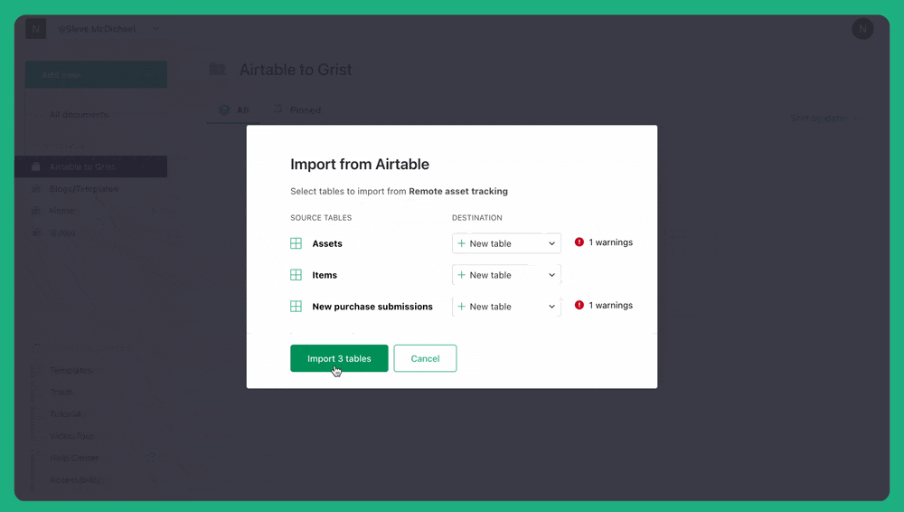
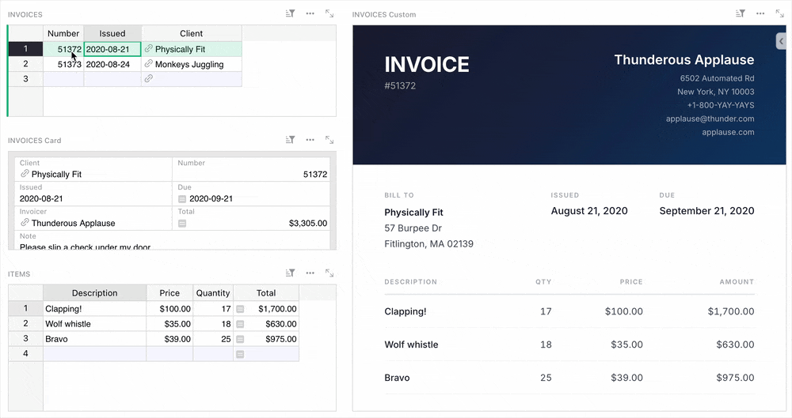
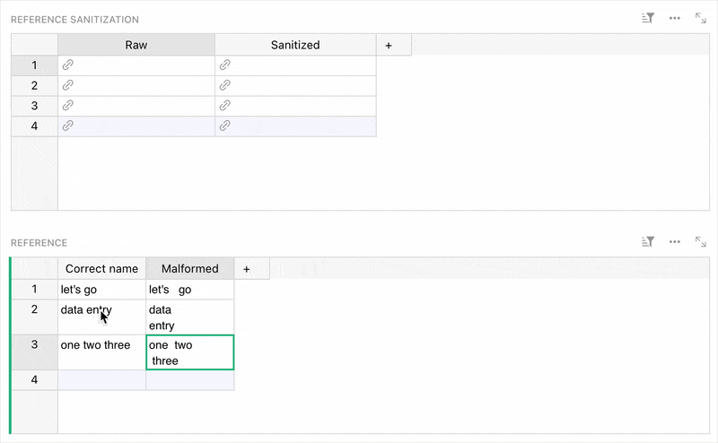

# February 2026 Newsletter

<table class="header" cellpadding="0" cellspacing="0" border="0"><tr>
  <td class="header-text">
    <table class="header-top"><tr>
      <td class="header-image">
        
      </td>
      <td class="header-top-text">
        
Grist for the Mill

        
February 2026
          &#8226; <a href="https://www.getgrist.com/">getgrist.com</a>

      </td>
    </tr></table>
    

      Welcome to our monthly newsletter of updates and tips for Grist users.
    

  </td>
</tr></table>

## What’s new

### Import from Airtable

We’re very excited to announce the you can now [Import from Airtable](https://support.getgrist.com/imports/#import-from-airtable){:target="\_blank"}! This new feature preserves the full contents of your base (including attachments) and the relationships between them. We’ve even tested it on an attachment-heavy base that turned into a reasonably-performant 5GB Grist doc.

You can start importing right now, and be sure to check out our [webinar recording](https://www.getgrist.com/webinars/migrate-airtable-to-grist-webinar/){:target="\_blank"} that goes through three advanced examples of why going from Airtable to Grist can be, dare we say, joyous. At the very least skip to 14:30 to see Amandine’s real world example of event management.

### Vibe View

As previewed in last month’s webinar, co-CEO Dmitry has shared his own custom widget called [Vibe View](https://github.com/gristlabs/vibe-view-widget){:target="\_blank"}. There’s been a wave of widgets created with the help of AI, and this one is focused specifically on creating a read-only view of Grist data using a single [LiquidJS](https://liquidjs.com/tutorials/intro-to-liquid.html){:target="\_blank"} HTML template. The widget even provides the prompt for you to use in your chatbot of choice, with copy/paste being the only other tool required.

Check out the [sample document](https://public.getgrist.com/7UTeRka3jcr3/Invoicing/p/1){:target="\_blank"} to see a printable invoice generator created using Vibe View, and you can use the widget yourself by adding it from the [custom widget gallery](https://support.getgrist.com/widget-custom/#premade-custom-widgets){:target="\_blank"}. 

Two new releases to talk about:

* v1.7.11 for `grist-core`.
* v0.3.10 for `grist-desktop`.

## Community highlights

* It’s been a while since the last translation update, but a huge thanks for endsho’s contributions to Indonesian, and martin.thure’s Swedish translation! If you’re interested in helping translate Grist, check out [this thread.](https://community.getgrist.com/t/translating-grist/2086){:target="\_blank"}

* C0M-R3D shared a [mind map widget](https://community.getgrist.com/t/custom-widget-mind-map-ported-from-obsidian/13655/4){:target="\_blank"} based on lynchjames’ Obsidian plugin. The widget uses Markmap to render Markdown as a tree, but C0M-R3D shared a [detailed example document](https://docs.getgrist.com/eNQthwssqbkc/MindMapWidget/p/4){:target="\_blank"} showing how a simple Python formula can format Grist data to be shown as a map.

* Former Grister and forever Grist star Jordi fielded a request on Discord for an [ABC musical notation custom widget](https://grist.jordigh.com/o/docs/d6V1MxE5LiD5/ABC-musical-notation-custom-widget){:target="\_blank"} using [abcjs](https://github.com/paulrosen/abcjs){:target="\_blank"}!
* Frequent contributor jperon is back with [“poor man’s self-hosted Grist”](https://community.getgrist.com/t/poor-man-s-self-hosted-grist/13710){:target="\_blank"} – essentially a Docker Compose package for first-time self-hosters. Compared to Grist Omnibus, it uses an OpenResty reverse proxy and contains a user management endpoint.

* On the French Grist forum, there’s a [neat discussion](https://forum.grist.libre.sh/t/formule-dinitialisation-pour-nettoyer-les-erreurs-de-saisie-sur-une-colonne-de-reference/3005/7){:target="\_blank"} on sanitizing reference column inputs using a trigger formula. This can help avoid errors from problematic characters or malformed spaces, as in the example above.

* fcuignet has shared an [OpenStreetMap widget](https://github.com/fcuignet/GristOSM){:target="\_blank"} (on the right in the screenshot above) made with the custom widget builder. It just works!

## Learning Grist

### Grist 101

New to Grist? Check out our webinar designed to get you up to speed on essential features and helpful tricks.

[WATCH GRIST 101 WEBINAR](https://www.getgrist.com/webinars/grist-101-new-users-guide/){:target="\_blank"}
{: .grist-button}

### Webinar: How to set up Grist automations with n8n

Curious about setting up workflow automations with Grist? We were as well! We did an internal deep dive and are happy to share some helpful examples of Grist automations with n8n. We’ll start by going over the absolute basics (getting and updating data, responding to webhooks), and then by looking at some more advanced examples that take and transform Grist data with AI integrations and other services.

**March 19th at 11:00am US Eastern Time.**

[SIGN-UP FOR MARCH'S WEBINAR](https://www.getgrist.com/webinars/how-to-set-up-grist-automations-with-n8n/?utm_source=newsletter&utm_medium=email&utm_campaign=build-webinar&utm_term=march-2026){:target="\_blank"}
{: .grist-button}

### How to migrate from Airtable to Grist

There are two types of Airtable users: those who want to bring their data into Grist, and those who don’t… *yet.* This webinar is for both. Join us to learn about the brand new upcoming way to import Airtable bases into Grist, and see how this preserves relationships, formatting, and even attachments. We’ll also look at examples and examine the benefits of bringing your Airtable data into Grist.

[WATCH JANUARY'S RECORDING](https://www.getgrist.com/webinars/migrate-airtable-to-grist-webinar/){:target="\_blank"}
{: .grist-button}

## Help spread the word
If you’re interested in helping Grist grow, consider leaving a review on product review sites. Here’s a short list where your review could make a big impact. Thank you! 🙏

* [AlternativeTo](https://alternativeto.net/software/grist/about/){:target="\_blank"}
* [Capterra](https://www.capterra.com/p/232821/Grist/){:target="\_blank"}
* [G2](https://www.g2.com/products/grist){:target="\_blank"}
* [TrustRadius](https://www.trustradius.com/products/grist/){:target="\_blank"}

## We are here to support you

**Solutions.** Grist often surprises people with its capabilities. Schedule a **free** call to assess your needs and help connect you with a Grist expert. [Learn more.](https://www.getgrist.com/solutions/){:target="\_blank"}

**Have questions, feedback, or need help?** Search our [Help Center](../index.md), [watch video tutorials](https://www.youtube.com/channel/UCx0ioQrrC-bIrkmZ7ZULr0g/playlists), share ideas in our [Community Forum](https://community.getgrist.com), or contact us at <support@getgrist.com>.