# March 2026 Newsletter

<table class="header" cellpadding="0" cellspacing="0" border="0"><tr>
  <td class="header-text">
    <table class="header-top"><tr>
      <td class="header-image">
        
      </td>
      <td class="header-top-text">
        
Grist for the Mill

        
March 2026
          &#8226; <a href="https://www.getgrist.com/">getgrist.com</a>

      </td>
    </tr></table>
    

      Welcome to our monthly newsletter of updates and tips for Grist users.
    

  </td>
</tr></table>

## What’s new

### Automations

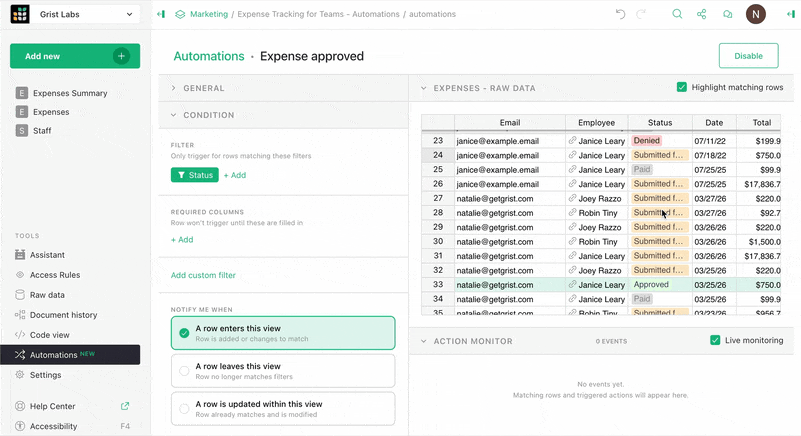

As teased in [last month’s webinar](https://www.getgrist.com/webinars/how-to-set-up-grist-automations-with-n8n/){:target="\_blank"}, we are excited to announce **Grist automations**. This tool is accessible in the left-hand navigation panel and lets you build automations triggered from changes in row-level data. You can create custom filters and conditions and monitor executions right within Grist.

Currently, these automations trigger two sets of actions:

* Dynamic email notifications to collaborators, which send customized Markdown-based emails pulling variable data from your Grist document. 
* Webhooks, which can do [lots of things](https://support.getgrist.com/webhooks/){:target="\_blank"}!

Automations are available on the Business plan for hosted users, and the full Grist edition for self-hosters. Try it for free for 30 days on either plan! Learn all about automations in our [Help Center](https://support.getgrist.com/automations/){:target="\_blank"}.

### Suggestions improvements

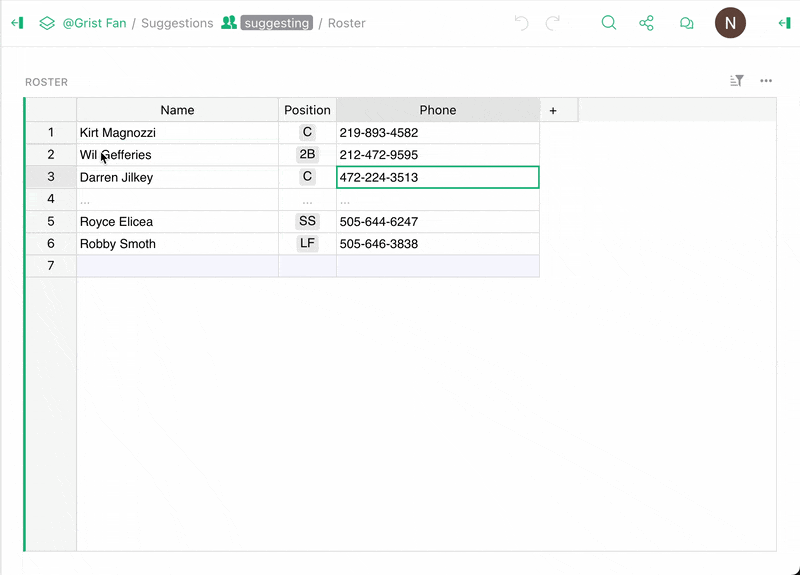

You’ll now see comparison highlighting automatically in [suggestion mode](https://support.getgrist.com/sharing/#suggestions){:target="\_blank"}, as well as several other improvements and bugfixes.

### Other updates

* Manu and Florent have contributed more [accessibility](https://github.com/gristlabs/grist-core/pull/2164){:target="\_blank"} [improvements](https://github.com/gristlabs/grist-core/pull/2167){:target="\_blank"}, this time making dropdowns and the undo/redo buttons more usable with screen readers.
* Vortezz added a [max length for text inputs](https://github.com/gristlabs/grist-core/pull/2097){:target="\_blank"}.
* We’ve introduced `cellFormat=typed` for both the REST API and the Custom Widget API. [Relevant commit.](https://github.com/gristlabs/grist-core/commit/757059d){:target="\_blank"}

Check out the full release notes for new builds of `grist-core` ([v1.7.12](https://github.com/gristlabs/grist-core/releases/tag/v1.7.12){:target="\_blank"}) and [Grist Desktop](https://github.com/gristlabs/grist-desktop/releases/tag/v0.3.11){:target="\_blank"}.

## Community highlights

Get ready, this month’s a big one.

* Last month, we shared an ABC notation widget, and co-CEO Dmitry decided he’d vibe his way to [synchronized playback](https://public.getgrist.com/kkZtgjYucrGA/Sheet-Music-using-ABC-Notation/m/fork){:target="\_blank"}:
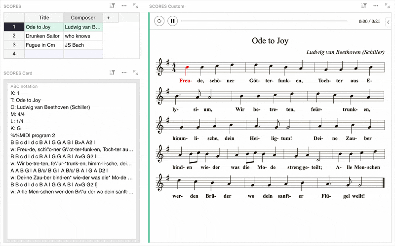
* Are you scientist, mathematician, statistician, or PDF enthusiast? David Fabijan shared a simple [Typst](https://typst.app/) widget that allows you to render out PDFs from cell data, or even an entire table. [Demo.](https://docs.getgrist.com/4SSvVPQjHJKK/Typst-widget/p/3){:target="\_blank"}
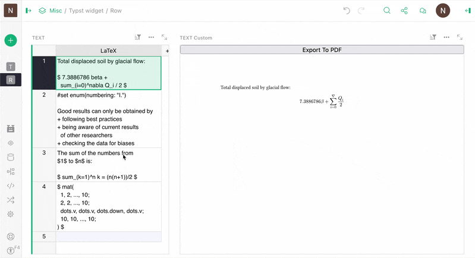
* Continuing on the theme, David Fabijan also shared a [SheetJS](https://sheetjs.com/){:target="\_blank"} widget, if you ever have the need to merely view a “traditional” spreadsheet document instead of importing it into Grist and unlocking its power. We’re told this can be useful. [Demo.](https://docs.getgrist.com/riwmqLBenjLJ/SheetJS-widget/p/2){:target="\_blank"}
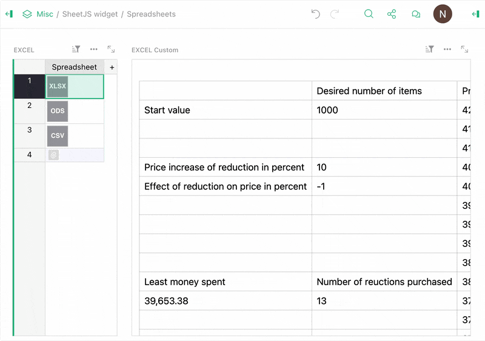
* Let’s take a break from the GIFs to talk about [a very interesting post](https://community.getgrist.com/t/creating-auto-incrementing-sequential-identifiers/13741){:target="\_blank"} from Dmitry about creating auto-incrementing, sequential IDs in Grist. His solution is more than a simple ++, supporting grouping for added flexibility. 
* [On Discord](https://discord.com/channels/1176642613022044301/1176646309223075860/1479005699416653975){:target="\_blank"}, BillM shared a lovely example of [Vibe View](https://support.getgrist.com/newsletters/2026-02/#vibe-view){:target="\_blank"}: an [interactive grant management visualization](https://billexamples.getgrist.com/h6hvPrpnz1gr/Vibe-Example/m/fork/p/15){:target="\_blank"} using Leaflet and GeoJSON.
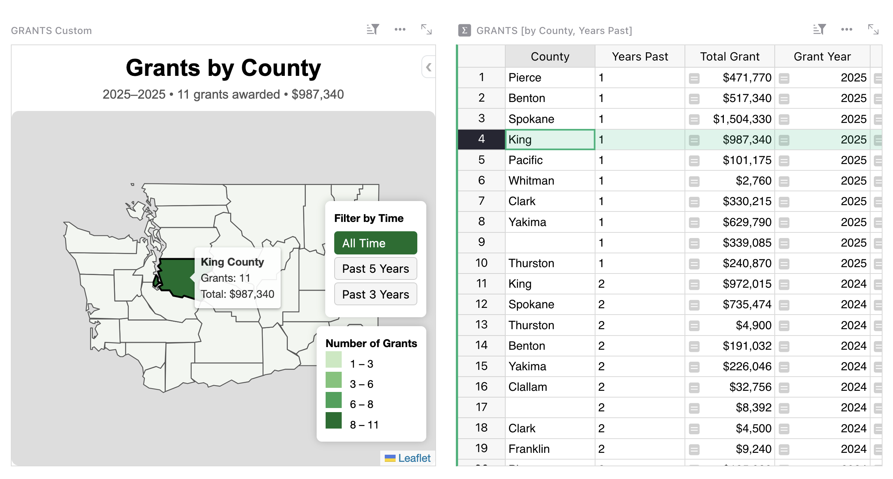
* Now this is neat – over on the French Grist forum arnoP shared an [HTML-based document generator](https://forum.grist.libre.sh/t/generateur-de-document-depuis-donnees-grist-html/3187){:target="\_blank"} that has a clever way of reusing “content blocks”: references! It defines reusable blocks of a document (header, body, footer, etc.) in a special table, and then lets you build up different document templates by adding and arranging references in a reference list column! It’s a bit hard to describe, and all in French, but you can get the gist of it by looking at the demo [here](https://grist.numerique.gouv.fr/o/ap-testing/1KYYNE9EYRhK/Generateur-de-document/p/5){:target="\_blank"}.
* Maxime_Lacoste [reports back successfully](https://community.getgrist.com/t/radar-charts-widget-for-grist-student-assessment-profiles/13759){:target="\_blank"} with a way to build proper radar charts using Chart.js.
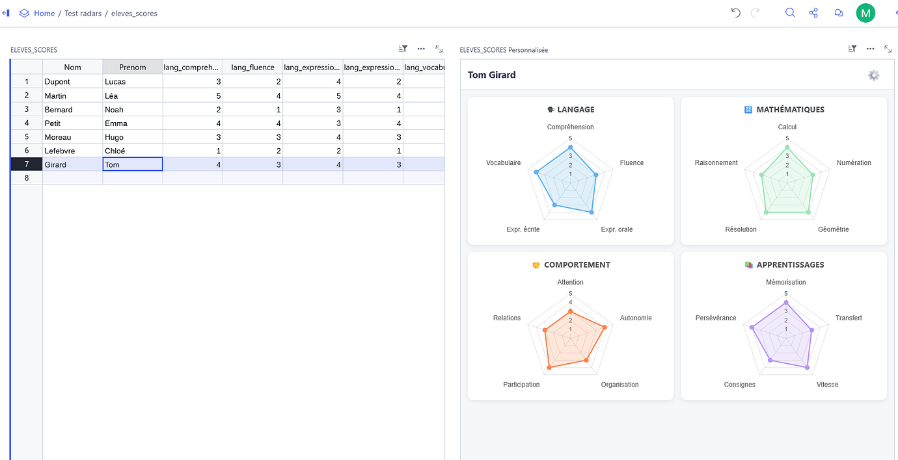
* Maxime also shared a widget that lets you [collapse grouped rows](https://community.getgrist.com/t/collapsible-grouped-view-based-on-column-values-custom-widget/13789){:target="\_blank"}, similar to other software (like Airtable, which you can now [import directly from](https://support.getgrist.com/imports/#import-from-airtable){:target="\_blank"}!).
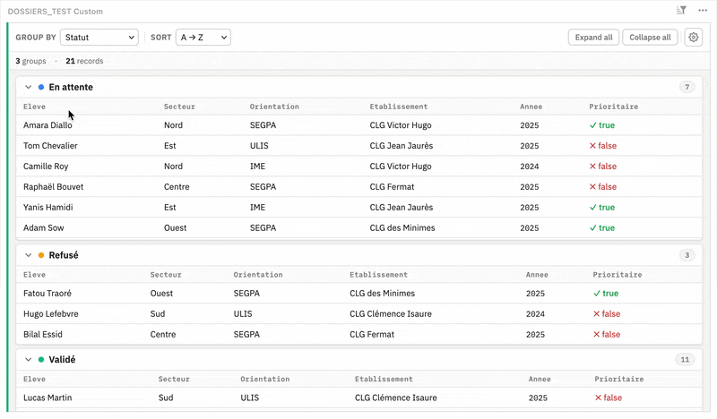
* Riccardo_Polignieri raises another specific but interesting problem: how to display banded row colors based on an arbitrarily sorted column. He comes with [a solution](https://community.getgrist.com/t/coloring-table-rows-by-arbitrary-bands/13760){:target="\_blank"}, and a challenge for others.
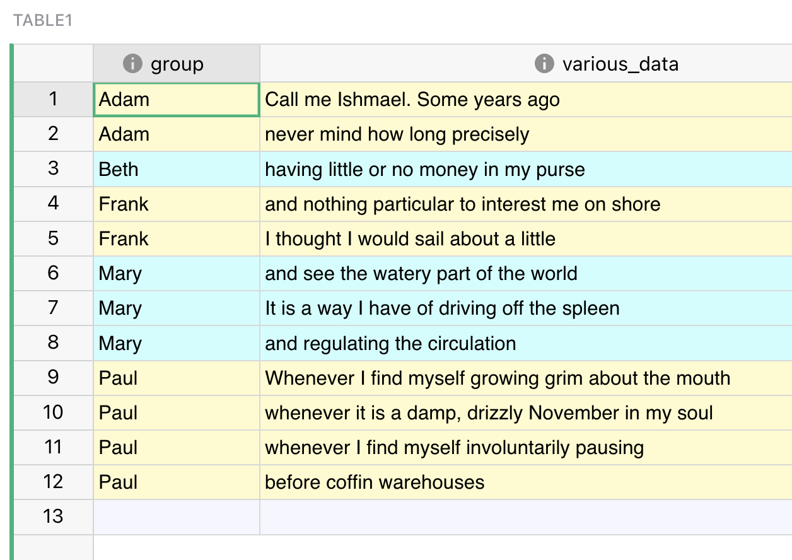
* Lionel_Maziere documented [several fixes](https://community.getgrist.com/t/widget-calendar-improvements-for-european-non-us-locales/13756){:target="\_blank"} to Grist’s calendar widget for non-US locales, for which they’ve also submitted PRs.
* Frequent contributor TomNit is back with a big one, which is *actually* a big three: 
    * Version 2.0 of their [Reusable User Code document](https://community.getgrist.com/t/ruc-2-0-is-here/13769){:target="\_blank"}, which shares “ready-made formulas for getting advanced stuff done in Grist”.
    * A Monaco Editor [custom widget](https://community.getgrist.com/t/widget-monaco-code-editor/13773){:target="\_blank"} for writing code in Grist.
    * The [Playground widget](https://community.getgrist.com/t/widget-playground/13775){:target="\_blank"}, which does a lot, but is mainly an autoreloading widget-building environment.
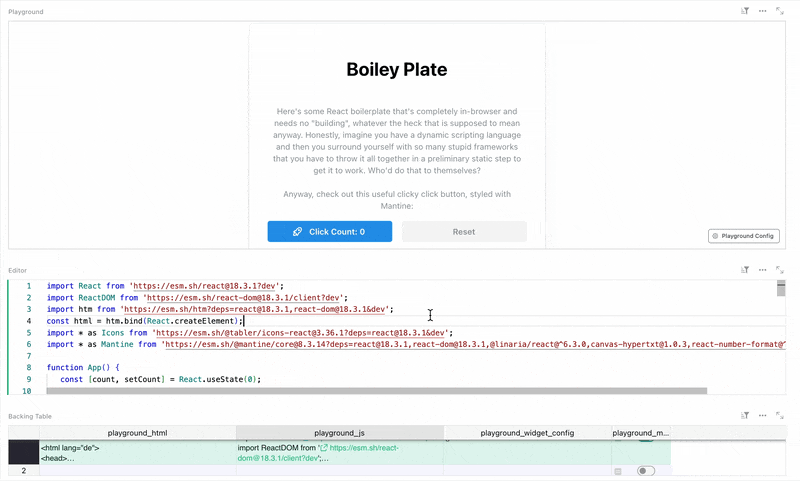
* Ich shared a [syncing solution](https://community.getgrist.com/t/pushing-events-from-grist-to-radicale/13809){:target="\_blank"} that connects Grist to [Radicale](https://github.com/Kozea/Radicale){:target="\_blank"} (a CalDAV server) using webhooks. 
* Finally, we’ve [spied](https://www.linkedin.com/posts/ugcPost-7436459286748168193-NQoU/?utm_source=share&utm_medium=member_desktop&rcm=ACoAAAyk9F0BD50gbQSRj2xuEwEzfmgsOeJt6N8){:target="\_blank"} the construction of a PowerPoint-like presentation builder and viewer created entirely in Grist – even with a full-screen mode! Take a peek over [here](https://grist.numerique.gouv.fr/o/docs/bSo93SYBwUpN/Diap?utm_id=share-doc){:target="\_blank"}.
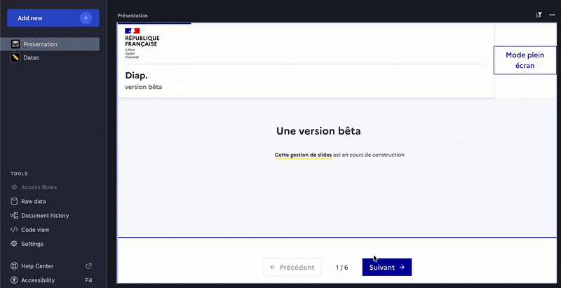

That’s it. Wow!

## Learning Grist

### Grist 101

New to Grist? Check out our webinar designed to get you up to speed on essential features and helpful tricks.

[WATCH GRIST 101 WEBINAR](https://www.getgrist.com/webinars/grist-101-new-users-guide/){:target="\_blank"}
{: .grist-button}

### Webinar: Automations – The Beginning

[Automations](https://support.getgrist.com/automations/){:target="\_blank"} are here! In this webinar, we'll introduce Grist automations and show you how to set up row-level email notifications that fire automatically when your data changes. Join us to see how automations can save your team time and keep everyone in the loop. 

[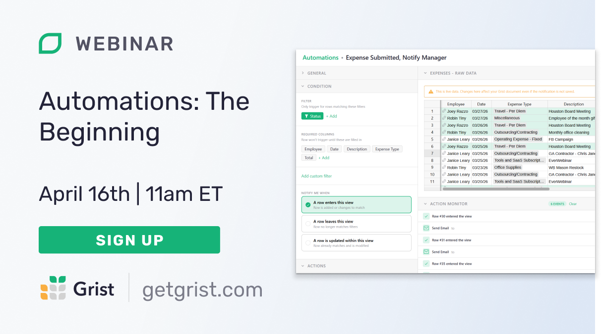](https://www.getgrist.com/webinars/automations-the-beginning/?utm_source=support-newsletter&utm_medium=internal&utm_campaign=build-webinar&utm_term=april-2026)

**Thursday April 16th at 11:00am US Eastern Time.**

[SIGN-UP FOR APRIL'S WEBINAR](https://www.getgrist.com/webinars/automations-the-beginning/?utm_source=support-newsletter&utm_medium=internal&utm_campaign=build-webinar&utm_term=april-2026){:target="\_blank"}
{: .grist-button}

### How to set up Grist automations with n8n

Curious about setting up workflow automations with Grist? We were as well! In March, we did an internal deep dive and are happy to share some helpful examples of Grist automations with n8n. We’ll start by going over the absolute basics (getting and updating data, responding to webhooks), and then by looking at some more advanced examples that take and transform Grist data with AI integrations and other services.

[WATCH MARCH'S RECORDING](https://www.getgrist.com/webinars/how-to-set-up-grist-automations-with-n8n/){:target="\_blank"}
{: .grist-button}

## Help spread the word
If you’re interested in helping Grist grow, consider leaving a review on product review sites. Here’s a short list where your review could make a big impact. Thank you! 🙏

* [AlternativeTo](https://alternativeto.net/software/grist/about/){:target="\_blank"}
* [Capterra](https://www.capterra.com/p/232821/Grist/){:target="\_blank"}
* [G2](https://www.g2.com/products/grist){:target="\_blank"}
* [TrustRadius](https://www.trustradius.com/products/grist/){:target="\_blank"}

## We are here to support you

**Solutions.** Grist often surprises people with its capabilities. Schedule a **free** call to assess your needs and help connect you with a Grist expert. [Learn more.](https://www.getgrist.com/solutions/){:target="\_blank"}

**Have questions, feedback, or need help?** Search our [Help Center](../index.md), [watch video tutorials](https://www.youtube.com/channel/UCx0ioQrrC-bIrkmZ7ZULr0g/playlists), share ideas in our [Community Forum](https://community.getgrist.com), or contact us at <support@getgrist.com>.