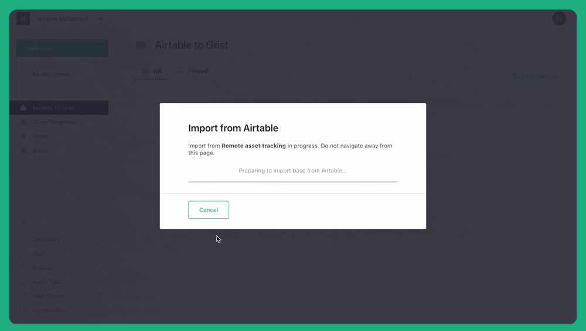
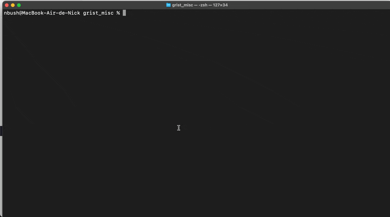
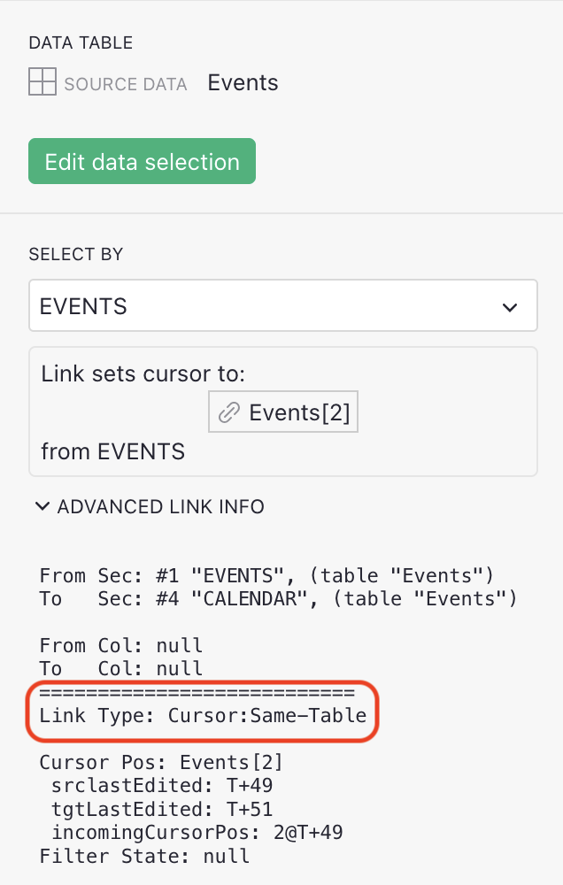
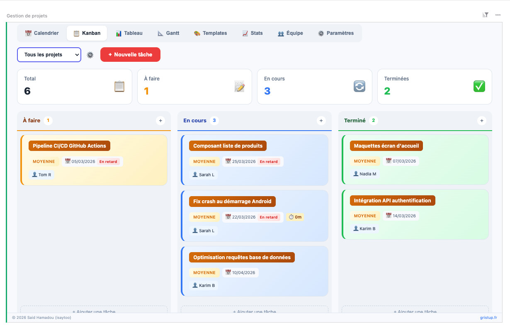
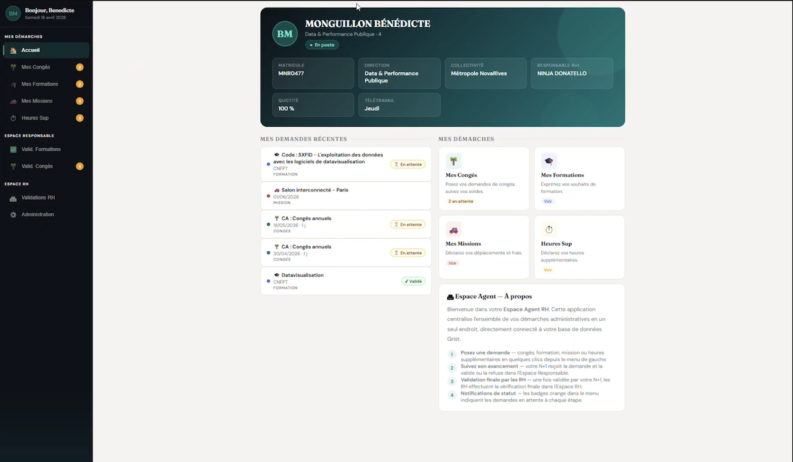
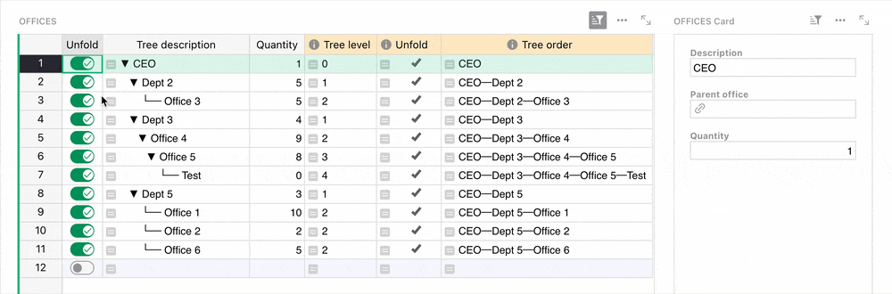
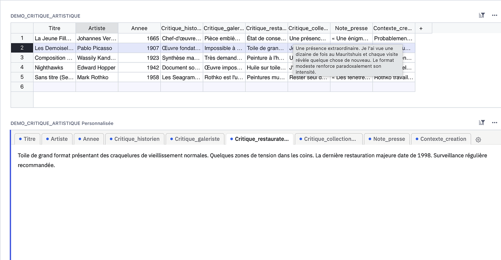
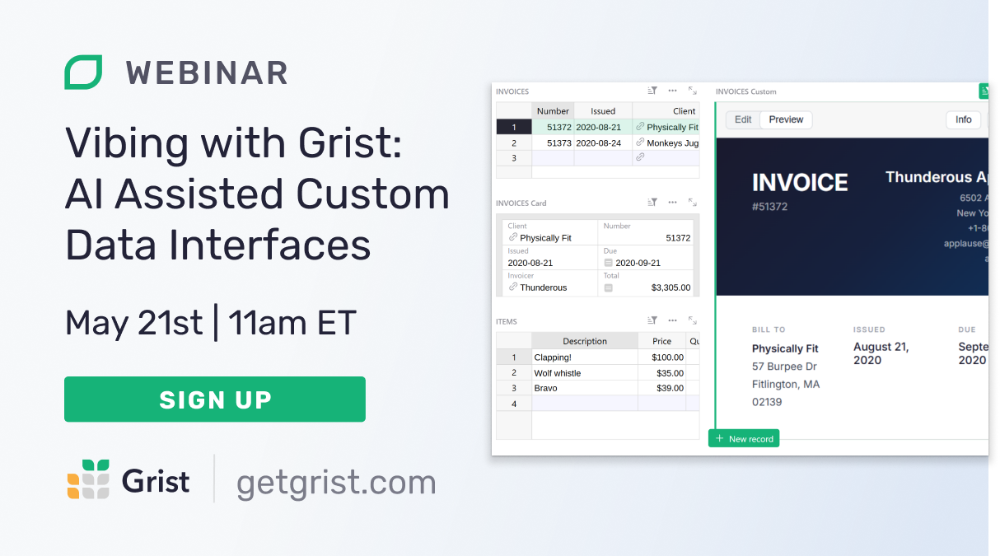

# April 2026 Newsletter

<table class="header" cellpadding="0" cellspacing="0" border="0"><tr>
  <td class="header-text">
    <table class="header-top"><tr>
      <td class="header-image">
        
      </td>
      <td class="header-top-text">
        
Grist for the Mill

        
April 2026
          &#8226; <a href="https://www.getgrist.com/">getgrist.com</a>

      </td>
    </tr></table>
    

      Welcome to our monthly newsletter of updates and tips for Grist users.
    

  </td>
</tr></table>

## What’s new

### Grist Labs update: the evolution of leadership

We’re very excited to share some news that will help push Grist forward into the “sovereignty moment” that we’re experiencing worldwide. We think Grist is an excellent piece of software, but it's also uniquely placed to provide real data ownership to the increasing number of organizations who are looking for it. We’ve made some leadership changes to make the most of this opportunity and reach these users:

* **Anais Concepcion** is now CEO, after co-leading Grist Labs for the last five years.
* Co-founder **Dmitry Sagalovskiy** is now Head of Product.
* **Stefano Maffulli** (former ED of Open Source Initiative) is joining as Chief Revenue Officer.
* **Dipalie Mehta** is joining as Head of Marketing.

Read our official [press release](https://www.getgrist.com/blog/a-new-chapter-for-grist-labs-scaling-for-the-era-of-sovereignty/){:target="\_blank"} for full details, including notes on seed funding and our path to Europe. 

### Airtable import improvements

If you still have data sitting in an Airtable base that’s itching to move to Grist, there’s no better time to [migrate](https://support.getgrist.com/imports/#import-from-airtable){:target="\_blank"}. We’ve made some improvements to the automatic process, including:

* Formula columns with field references are imported as better comments (accurate table and column names).
* Airtable "Select" field colors are now properly mapped to Grist choice colors.
* Single record link fields are imported as Reference (vs Reference List) columns.
* Imports now use the `/tables` endpoint for better availability.
* Imports now target the current org and workspace.
* A nicer message is shown when Airtable OAuth integration isn't configured.

### grist-console

CTO Paul has resurrected Grist Labs Labs for an experiment for those familiar with a CLI. It’s very fun and surprisingly functional! You can try it right now, in fact: `npm install grist-console -g`

Features:

* Multi-pane page layouts
* Table and card view
* Functional linking (!)
* Editing, adding and deleting rows
* Multiple themes
* ...and lots more, somehow. See the full breakdown [on GitHub](https://github.com/paulfitz/grist-console){:target="\_blank"}.

### More updates

* Fixed opaque `Origin` handling for CORS requests. ([PR](https://github.com/gristlabs/grist-core/pull/2299){:target="\_blank"})
    * This tightens up the parsing of the `Origin` header, forcing the Opaque Origin (`"null"`) to be handled explicitly, as well as falling back on it for invalid origin values. Helps when using an `https://` custom widget in an `http://` hosted site (e.g. local development).
* Custom widgets now receive Link Type for better initial state handling. ([PR](https://github.com/gristlabs/grist-core/pull/2259){:target="\_blank"})
    * Every custom widget now receives linking status information to help answer questions such as: is my cursor being moved by some other section? are my records filtered by some other section? is my cursor moving some other section? 
        
        If you’re in a widget and would like behaviour to be conditional based on whether you’re linked to something, you can now do it. For example, if a calendar widget is unlinked it can default to showing today’s date.
        
        This is the Link Type field from the Advanced Link Info section in the Creator Panel:
        
**
{: .screenshot-half }

* Searching within a document is now accent-insensitive. ([PR](https://github.com/gristlabs/grist-core/pull/2221){:target="\_blank"})
* [Suggestions](https://support.getgrist.com/sharing/#suggestions){:target="\_blank"} counter has been replaced by a status dot to remove counting ambiguity. I just think it’s neat.

**
{: .screenshot-half }

A new version of `grist-core` has been released – v1.7.13 – and if you’re curious about the full release notes head [over here](https://github.com/gristlabs/grist-core/releases/tag/v1.7.13){:target="\_blank"}.

##  Community highlights

* On [Discord](https://discord.com/channels/1176642613022044301/1176646309223075860/1488477292186570752){:target="\_blank"}, wrightwells shared their [Grist Finance API connector](https://github.com/wrightwells/Bank_API_Connector_for_Grist){:target="\_blank"}, described as “scaffolding for importing finance data from external APIs into a self-hosted Grist instance.” It features sync scheduling, though currently only supports Starling Bank as a source.
* dtinth created some useful docs covering [service accounts](https://dt.in.th/GristServiceAccounts){:target="\_blank"} and [upserting via n8n](http://dt.in.th/GristUpsertN8n){:target="\_blank"} (valid until their n8n [PR](https://github.com/n8n-io/n8n/pull/18067){:target="\_blank"} is accepted, at least!).
* Two examples of project management suites being built in Grist that really show its flexibility. You *can* just do things.
    * Isaytoo’s example shared on the [French forum](https://forum.grist.libre.sh/t/widget-gestion-de-projet/3381){:target="\_blank"} with custom calendar, Kanban, Gantt, and more.
    
    * Benedicte Monguillon’s in-progress [human resources app](https://forum.grist.libre.sh/t/outil-de-gestion-rh/3559){:target="\_blank"} which uses Grist as a relational data store and has completely custom UI.
    
* There’s a new experimental [Grist MCP option](https://gitlab.cerema.fr/mcp/gristcoder_mcp){:target="\_blank"} from Cerema Méditerranée with extensive documentation.
* One of our favorite custom widgets just got updated: [Varamil’s simple filter](https://community.getgrist.com/t/simple-filter-widget/9356/16){:target="\_blank"}. Click that link to see the full release notes.
* Speaking of favorites: Emanuele Gissi shared a fascinating native Grist pseudo-widget [on Discord](https://discord.com/channels/1176642613022044301/1498326842946359419/1498326848143102064){:target="\_blank"}, implementing collapsing tree hierarchies in a self-referencing table using toggles and formulas. 🤯 

* Maxime Lacoste is back with a custom widget that creates a [tabular representation of a record](https://forum.grist.libre.sh/t/widget-visionneur-de-champs-texte-longs-avec-onglets-multifield-viewer/3491){:target="\_blank"} to help view long text fields. Will also appeal to Firefox users circa the early 2000s. 

## Learning Grist

### Grist 101

New to Grist? Check out our webinar designed to get you up to speed on essential features and helpful tricks.

[WATCH GRIST 101 WEBINAR](https://www.getgrist.com/webinars/grist-101-new-users-guide/){:target="\_blank"}
{: .grist-button}

### Webinar – Vibing with Grist: AI Assisted Custom Data Interfaces

Have an idea of exactly how you want to view or interact with data, but not sure how to bring it to life? Grist has two easy ways to do so, made even easier with AI. Join us as we build dynamic visualizations with the [Vibe View custom widget](https://support.getgrist.com/newsletters/2026-02/#vibe-view){:target="\_blank"}, and then an interactive custom widget with the [custom widget builder](https://support.getgrist.com/newsletters/2024-10/#custom-widget-builder-widget){:target="\_blank"}.

**Thursday May 21st at 11:00am US Eastern Time.**

[SIGN-UP FOR MAY'S WEBINAR](https://www.getgrist.com/webinars/vibing-with-grist-ai-assisted-custom-data-interfaces/?utm_source=support-newsletter&utm_medium=internal&utm_campaign=build-webinar&utm_term=may-2026){:target="\_blank"}
{: .grist-button}

### Automations: The Beginning

[Automations](https://support.getgrist.com/automations/){:target="\_blank"} are here — and this is just the beginning. In April, we introduced Grist’s new Automations feature and showed you how to set up row-level email notifications that fire automatically when your data changes. Watch to see how automations can save your team time and keep everyone in the loop.

[WATCH APRIL'S RECORDING](https://www.getgrist.com/webinars/automations-the-beginning/){:target="\_blank"}
{: .grist-button}

## Help spread the word
If you’re interested in helping Grist grow, consider leaving a review on product review sites. Here’s a short list where your review could make a big impact. Thank you! 🙏

* [AlternativeTo](https://alternativeto.net/software/grist/about/){:target="\_blank"}
* [Capterra](https://www.capterra.com/p/232821/Grist/){:target="\_blank"}
* [G2](https://www.g2.com/products/grist){:target="\_blank"}
* [TrustRadius](https://www.trustradius.com/products/grist/){:target="\_blank"}

## We are here to support you

**Solutions.** Grist often surprises people with its capabilities. Schedule a **free** call to assess your needs and help connect you with a Grist expert. [Learn more.](https://www.getgrist.com/solutions/){:target="\_blank"}

**Have questions, feedback, or need help?** Search our [Help Center](../index.md), [watch video tutorials](https://www.youtube.com/channel/UCx0ioQrrC-bIrkmZ7ZULr0g/playlists), share ideas in our [Community Forum](https://community.getgrist.com), or contact us at <support@getgrist.com>.