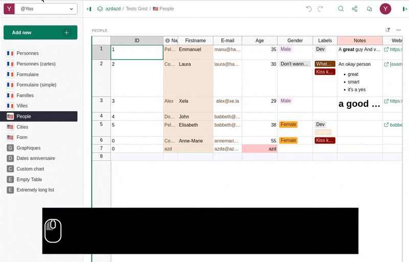
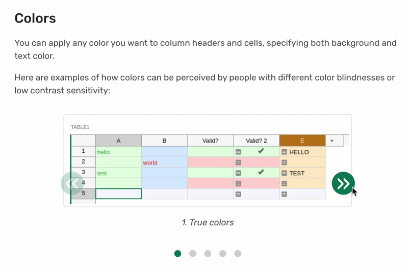
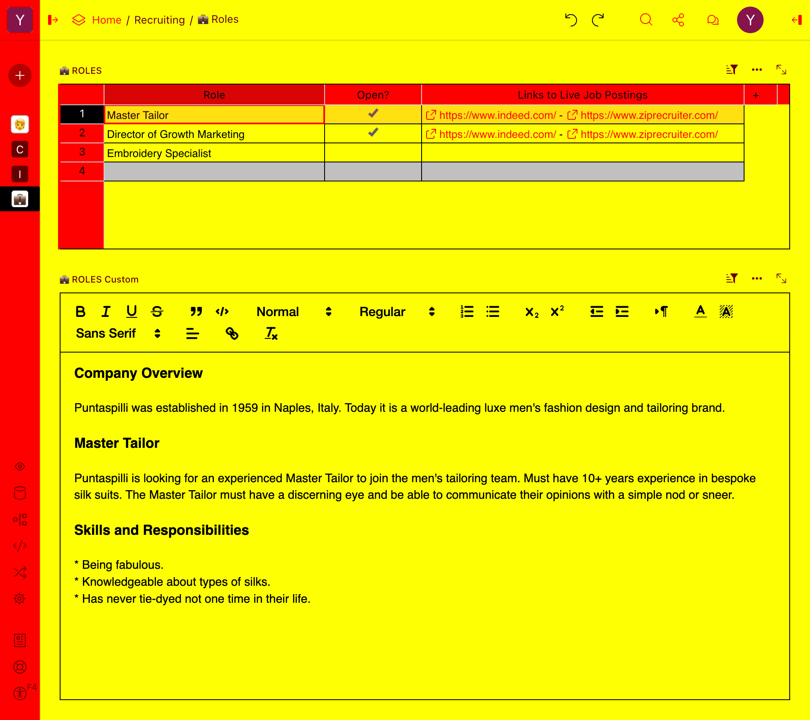
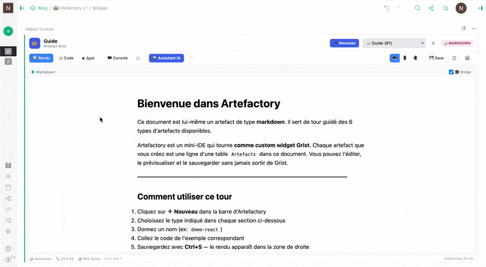
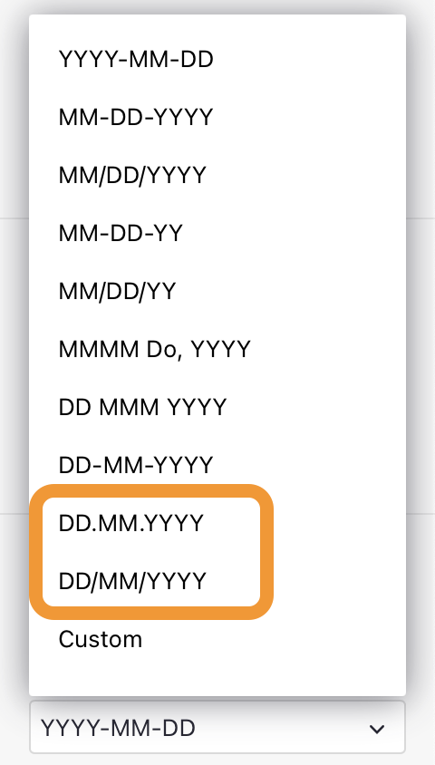
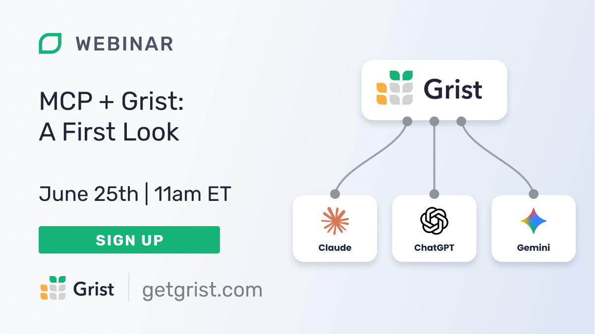

# May 2026 Newsletter

<table class="header" cellpadding="0" cellspacing="0" border="0"><tr>
  <td class="header-text">
    <table class="header-top"><tr>
      <td class="header-image">
        
      </td>
      <td class="header-top-text">
        
Grist for the Mill

        
May 2026
          &#8226; <a href="https://www.getgrist.com/">getgrist.com</a>

      </td>
    </tr></table>
    

      Welcome to our monthly newsletter of updates and tips for Grist users.
    

  </td>
</tr></table>

## What’s new

### New self-hosting setup flow

Self-hosting is important, but it shouldn’t be hard. There’s now a new flow for setting up a self-hosted instance that passes the “Grist Labs newsletter author test” – meaning that even the person who writes the newsletters can manage it without trouble. Check out the full documentation [here](https://support.getgrist.com/install/first-run-setup/){:target="\_blank"}, and you can access the quick setup wizard at any time from the Admin Panel.

In fact, the flow is so good that someone on Reddit cited it as an [example of good UI](https://www.reddit.com/r/LocalLLaMA/comments/1tiunzw/comment/ongq5fz/?context=3){:target="\_blank"} even before it was properly launched! Thank you to whomever that was.

### Accessibility

Lots to share on the accessibility front this month – as always led by Emmanuel Pelletier. 

* There is now screen reader support in grid/table views.
* You can use keyboard shortcuts to open the row and column menus from grid views.
  * Column menu: Ctrl+Shift+Enter or Ctrl+Shift+F10 
  * Row menu: Ctrl+Option+Enter or Alt+Shift+F10
* The widget picker now works with keyboard input and screen readers, meaning you can add widgets using only the keyboard. Look at this combo:

We’ve also begun properly documenting Grist’s accessibility in our [Help Center](https://support.getgrist.com/accessibility/){:target="\_blank"}, including a guide on [creating accessible documents](https://support.getgrist.com/accessible-content/){:target="\_blank"} that is valuable beyond Grist. For example, a demonstration of how colors can be perceived:

### Custom CSS in widgets

Speaking of color, if you have [custom CSS](https://support.getgrist.com/self-managed/#how-do-i-customize-styling){:target="\_blank"} in you self-hosted instance, it now gets injected to widgets. ([PR](https://github.com/gristlabs/grist-core/pull/2089){:target="\_blank"})

As a purely practical example, here’s a hypothetical hot dog-based enterprise looking to hire some new employees, with their custom styling intact:

Two new releases this month: [Grist Desktop](https://github.com/gristlabs/grist-desktop/releases/tag/v0.3.12){:target="\_blank"} and the regular [core release](https://github.com/gristlabs/grist-core/releases/tag/v1.7.14){:target="\_blank"}. We’ve expanded the release notes for `grist-core` versions, so please click through to see *everything* that goes into a regular update, especially credit to all of our code and localization contributors. 

##  Community highlights

When it comes to using AI to develop custom interfaces, the cat is definitely out of the bag. We think Grist is the best place for your unique, valuable and often *extremely specific* data. It makes sense for your interfaces to be just as unique. We’ve created [Vibe View](https://support.getgrist.com/newsletters/2026-02/#vibe-view){:target="\_blank"} and the [custom widget builder](https://community.getgrist.com/t/new-community-widget-custom-widget-builder/6803){:target="\_blank"} to help bring these interfaces to life in Grist with AI’s help – check out [last month’s webinar](https://www.getgrist.com/webinars/vibing-with-grist-ai-assisted-custom-data-interfaces/){:target="\_blank"} that covers both in detail – and we’re seeing a deluge of examples in the wild. 

One very ambitious example (from frequent contributor nic01asFr) is called [Artefactory](https://forum.grist.libre.sh/t/artefactory-un-mini-ide-pour-creer-ses-widgets-grist-depuis-un-doc-grist/3712){:target="\_blank"}. It’s a custom widget (in French only at the moment) that lets you build and preview custom widgets and other artifacts (React/JSX, HTML, SVG, Mermaid, Markdown) with Grist as the backend – each artifact is stored as a simple record. Kind of like a mini-IDE, powered by whatever AI model you supply (using webhooks).

On the other hand, we had a great example of a [concise code contribution](https://github.com/gristlabs/grist-core/pull/2347){:target="\_blank"} that adds two new date formats. A big win for DD/MM/YYYY champions. The balance of power is shifting...

## Learning Grist

### Grist 101

New to Grist? Check out our webinar designed to get you up to speed on essential features and helpful tricks.

[WATCH GRIST 101 WEBINAR](https://www.getgrist.com/webinars/grist-101-new-users-guide/){:target="\_blank"}
{: .grist-button}

### Webinar – MCP + Grist: A First Look

Join Grist Labs co-founder Stan for a sneak peek at the upcoming Grist MCP server. If you're new to AI workflows, Model Context Protocol (MCP) is a standard that makes it easier for AI models to access external data. We'll explore how the integration unlocks new and more advanced ways to leverage AI tools.

**Thursday June 25th at 11:00am US Eastern Time.**

[SIGN-UP FOR JUNE'S WEBINAR](https://www.getgrist.com/webinars/mcp-grist-a-first-look/?utm_source=support-newsletter&utm_medium=internal&utm_campaign=build-webinar&utm_term=june-2026){:target="\_blank"}
{: .grist-button}

### Vibing with Grist: AI Assisted Custom Data Interfaces

Have an idea of exactly how you want to view or interact with data, but not sure how to bring it to life? In May, Natalie showed us two easy ways to do so in Grist, made even easier with AI. Watch as we build dynamic visualizations with the [Vibe View custom widget](https://support.getgrist.com/newsletters/2026-02/#vibe-view){:target="\_blank"}, and then an interactive custom widget with the [Custom Widget Builder](https://support.getgrist.com/newsletters/2024-10/#custom-widget-builder-widget){:target="\_blank"}.

[WATCH MAY'S RECORDING](https://www.getgrist.com/webinars/vibing-with-grist-ai-assisted-custom-data-interfaces/){:target="\_blank"}
{: .grist-button}

## Help spread the word
If you’re interested in helping Grist grow, consider leaving a review on product review sites. Here’s a short list where your review could make a big impact. Thank you!

* [AlternativeTo](https://alternativeto.net/software/grist/about/){:target="\_blank"}
* [Capterra](https://www.capterra.com/p/232821/Grist/){:target="\_blank"}
* [G2](https://www.g2.com/products/grist){:target="\_blank"}
* [TrustRadius](https://www.trustradius.com/products/grist/){:target="\_blank"}

## We are here to support you

**Solutions.** Grist often surprises people with its capabilities. Schedule a **free** call to assess your needs and help connect you with a Grist expert. [Learn more.](https://www.getgrist.com/solutions/){:target="\_blank"}

**Have questions, feedback, or need help?** Search our [Help Center](../index.md), [watch video tutorials](https://www.youtube.com/channel/UCx0ioQrrC-bIrkmZ7ZULr0g/playlists), share ideas in our [Community Forum](https://community.getgrist.com), or contact us at <support@getgrist.com>.