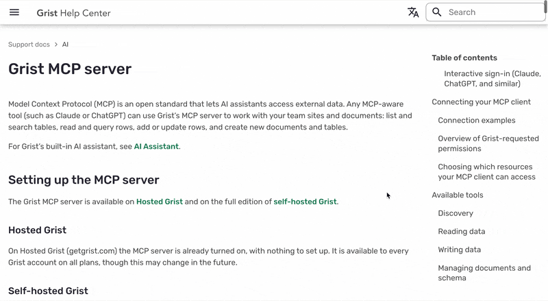
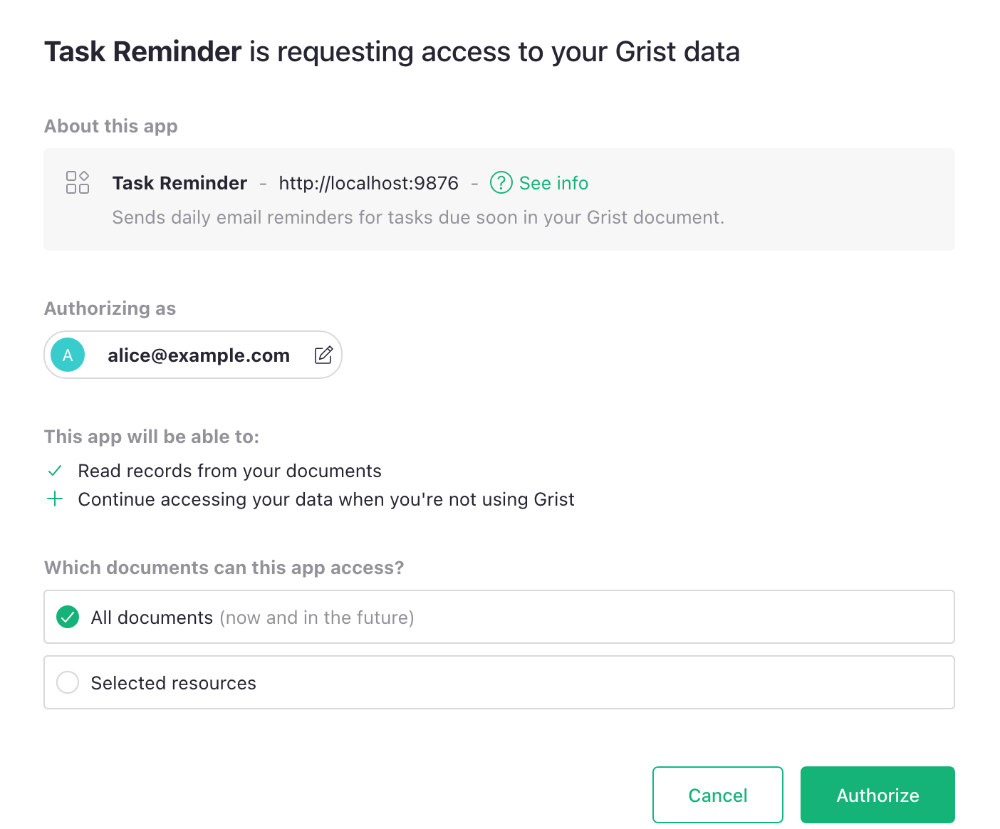
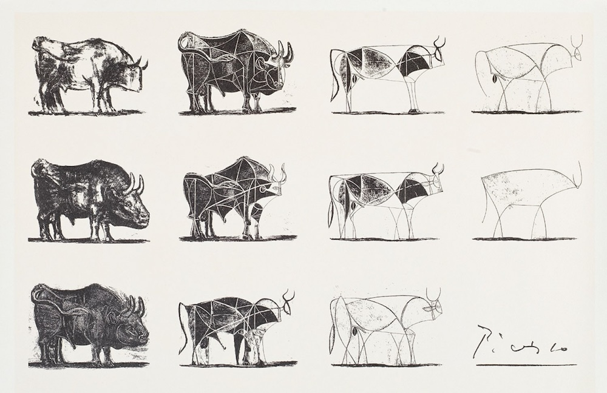
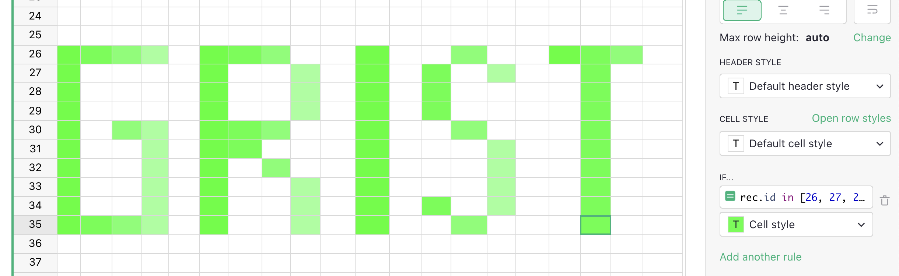
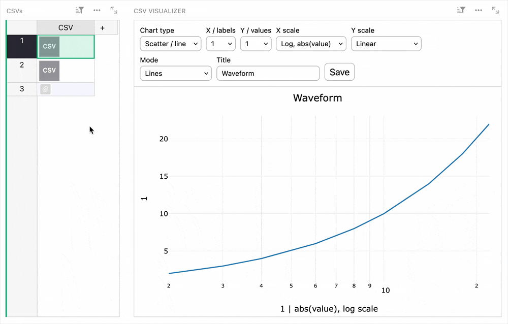
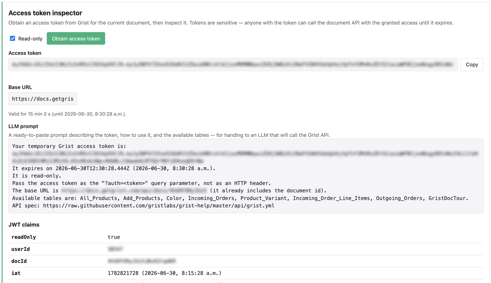

# June 2026 Newsletter

<table class="header" cellpadding="0" cellspacing="0" border="0"><tr>
  <td class="header-text">
    <table class="header-top"><tr>
      <td class="header-image">
        
      </td>
      <td class="header-top-text">
        
Grist for the Mill

        
June 2026
          &#8226; <a href="https://www.getgrist.com/">getgrist.com</a>

      </td>
    </tr></table>
    

      Welcome to our monthly newsletter of updates and tips for Grist users.
    

  </td>
</tr></table>

## What’s new

### MCP server now live

Grist’s official MCP server is now live, and you can do one of three things:

1. If you don’t know what an MCP server is but want to learn, watch our [recent webinar](https://www.getgrist.com/webinars/mcp-grist-a-first-look/){:target="\_blank"} that covers the basics in minutes.
2. If you *do* know what an MCP server is, but aren't sure how you'd use it with Grist in production, you can also watch our [recent webinar](https://www.getgrist.com/webinars/mcp-grist-a-first-look/){:target="\_blank"}. The second demo is a live showcase of how to combine Grist, GitHub, and AI agents to automatically triage PRs based on incident data stored in a Grist document.
3. If you know what an MCP server is *and* how you’d use it with Grist, you can do so right now. You can find the documentation [here](https://support.getgrist.com/mcp/){:target="\_blank"}.

As always, another thing you can do is [send us feedback](https://www.getgrist.com/contact/){:target="\_blank"}! Nearly every day we're surprised with a new use case or workflow using AI with Grist, and we want our tools to be as useful and general purpose as Grist itself.

### OAuth-based connected apps 

**
{: .screenshot-half }

Our new MCP implementation is also the first example of a [connected app](https://support.getgrist.com/connected-apps/){:target="\_blank"} using Grist’s new OAuth support. 

Until now, letting a connected app (a tool, script or AI agent, for example) act on your Grist data meant sharing an API key that grants your account’s full permissions. With OAuth, such apps must instead ask for access. You can also limit an app's access to specific documents, workspaces, or organizations and revoke it at any time. Your credentials stay yours, and existing access rules still apply.

On the full edition of self-hosted Grist, the OAuth server runs on your infrastructure – including token issuance, validation and revocation. If you’re interested in building your own connected app or for more information on Grist’s OAuth-enabled tools, check out our [developer documentation](https://support.getgrist.com/oauth-apps/){:target="\_blank"}.

### Upcoming changes to free team sites

Later this summer we’ll be adjusting our free plans. In particular, free [team sites](https://support.getgrist.com/teams/){:target="\_blank"} will be limited to 10 users. A free tier is a balancing act for any product. The upcoming changes are balanced to primarily affect larger organizations deriving the most value from Grist, leaving individuals and smaller teams with limited use cases to continue to enjoy our free plans.

### Special webinar - How Dotphoton built a fully traceable QA system for the European Space Agency

{:target="\_blank"}

We were thrilled to have Bruno Sanguinetti, co-founder of Dotphoton, join us to show how his team built a full QA and requirements traceability system in Grist that runs on-premises. If you’ve ever been curious if Grist can meet the high standards expected by an extraterrestrial engineering organization, this one’s for you. Watch it [here](https://www.getgrist.com/webinars/how-dotphoton-built-a-fully-traceable-qa-system-for-the-european-space-agency/){:target="\_blank"}.

You’ll also learn: 

* What requirements traceability actually is.
* Why Dotphoton chose Grist over IBM Doors, Notion, Excel, and Word.
* What Picasso’s depiction of a bull can teach us about system design.

**
{: .screenshot-half }

*Pictured: how to build a scalable Grist document.*
{: .screenshot-half }

## More updates

* For self-hosters, there are two new startup checks: 
    * An "are my outgoing requests locked down?" check which reports on user-triggered outgoing HTTP requests (`REQUEST()`, webhooks, "Import from URL"). ([PR](https://github.com/gristlabs/grist-core/pull/2294){:target="\_blank"})
    * A "will my data survive a restart?" check which detects and warns when documents and the home DB are ephemeral (a common-enough self-hosting pitfall). ([PR](https://github.com/gristlabs/grist-core/pull/2396){:target="\_blank"})
* Thanks to some MCP work, the AI Assistant can now change conditional styles. So you don’t have to manually write your own cell ID arrays to do this:

Two releases in the last month. Click through for full release notes: [v1.7.15](https://github.com/gristlabs/grist-core/releases/tag/v1.7.15){:target="\_blank"} and [v1.7.16](https://github.com/gristlabs/grist-core/releases/tag/v1.7.16){:target="\_blank"}.

##  Community highlights

* A [trio of widgets](https://community.getgrist.com/t/three-small-widgets-for-dealing-with-attachments-and-new-records/13987){:target="\_blank"} from David Fabijan: one that easily creates indexed rows, one that lets you download the an attachment column as a single .zip file, and one that lets you create simple plots from attached CSV files. This let's you visualize tabular data at a glance without storing a bunch of extra rows:

* Wiktor Pyk shared a [barcode scanner custom widget](https://github.com/wiktorpyk/grist-barcode-scanner-widget){:target="\_blank"} that let's a phone running the open source [Binary Eye](https://github.com/markusfisch/BinaryEye){:target="\_blank"} app write scanned values directly into a Grist table, or even jump to a matched row. Requires a lightweight companion server.
* Repeat contributor dtinth shared a [custom widget](https://dt.in.th/GristAccessToken){:target="\_blank"} that creates 15-minute [access tokens](https://support.getgrist.com/code/interfaces/grist_plugin_api.AccessTokenResult/){:target="\_blank"} along with a prompt for letting AI agents get to work. Helpful for one-off read-only automated inspections of data where you'd prefer access to be temporary.

## Learning Grist

### Grist 101

New to Grist? Check out our webinar designed to get you up to speed on essential features and helpful tricks.

[WATCH GRIST 101 WEBINAR](https://www.getgrist.com/webinars/grist-101-new-users-guide/){:target="\_blank"}
{: .grist-button}

### July's webinar - To be announced.

We have another great webinar lined up for July and are going to announce more details soon. Keep an eye out for registration and don't miss it!

### Last month's webinar – MCP + Grist: A First Look

Special guest and Grist Labs co-founder Stan gave us a sneak peek at the new Grist MCP server. The webinar starts with a quick demo that shows the simplicity and power of a basic MCP implementation, and then dives into an integration with Grist, GitHub, and AI agents to help deal with COE (correction of error) in software workflows.

[WATCH JUNE'S RECORDING](https://www.getgrist.com/webinars/mcp-grist-a-first-look/){:target="\_blank"}
{: .grist-button}

## Help spread the word
If you’re interested in helping Grist grow, consider leaving a review on product review sites. Here’s a short list where your review could make a big impact. Thank you!

* [AlternativeTo](https://alternativeto.net/software/grist/about/){:target="\_blank"}
* [Capterra](https://www.capterra.com/p/232821/Grist/){:target="\_blank"}
* [G2](https://www.g2.com/products/grist){:target="\_blank"}
* [TrustRadius](https://www.trustradius.com/products/grist/){:target="\_blank"}

## We are here to support you

**Solutions.** Grist often surprises people with its capabilities. Schedule a **free** call to assess your needs and help connect you with a Grist expert. [Learn more.](https://www.getgrist.com/solutions/){:target="\_blank"}

**Have questions, feedback, or need help?** Search our [Help Center](../index.md){:target="\_blank"}, [watch video tutorials](https://www.youtube.com/channel/UCx0ioQrrC-bIrkmZ7ZULr0g/playlists){:target="\_blank"}, share ideas in our [Community Forum](https://community.getgrist.com){:target="\_blank"}, or contact us at <support@getgrist.com>.