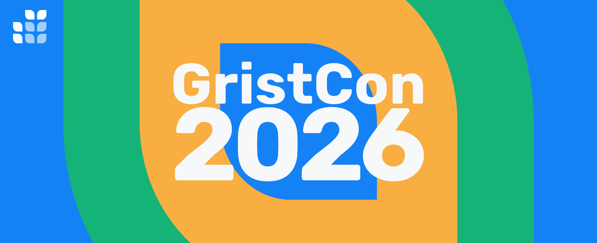
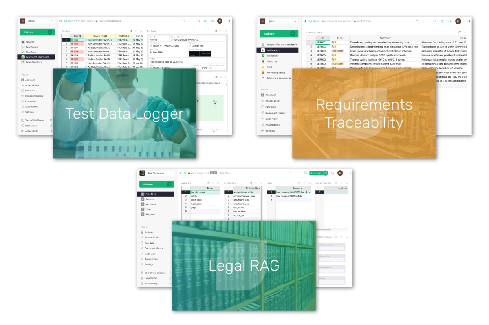
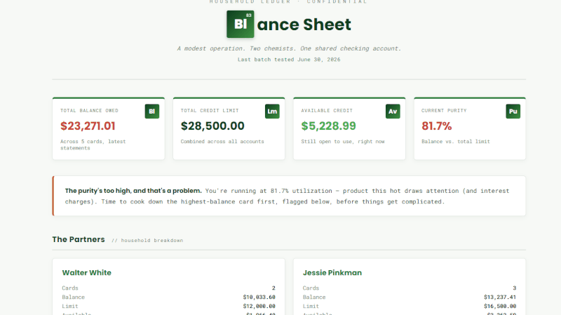
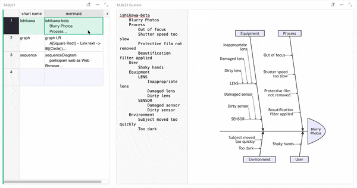
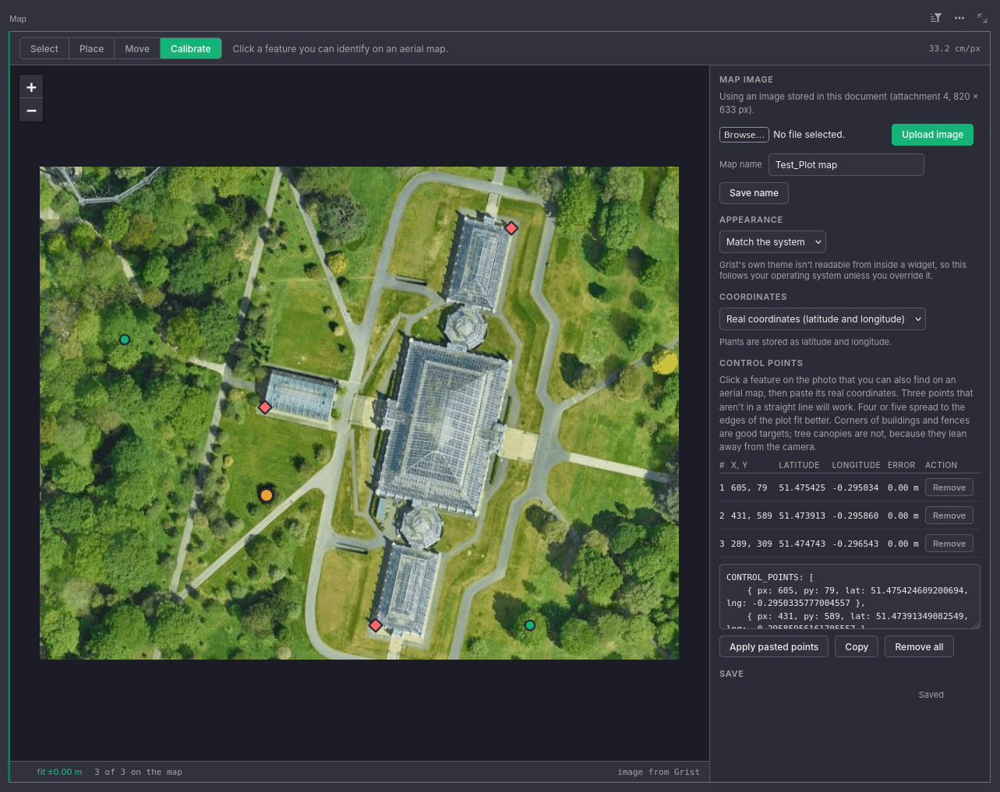
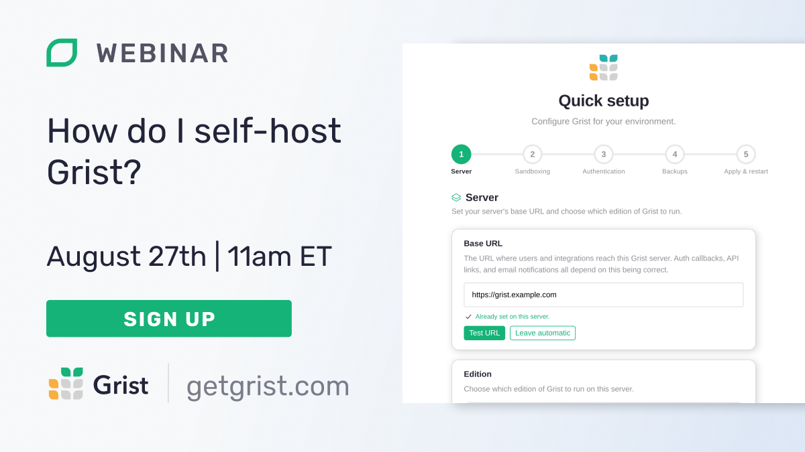

# July 2026 Newsletter

<table class="header" cellpadding="0" cellspacing="0" border="0"><tr>
  <td class="header-text">
    <table class="header-top"><tr>
      <td class="header-image">
        
      </td>
      <td class="header-top-text">
        
Grist for the Mill

        
July 2026
          &#8226; <a href="https://www.getgrist.com/">getgrist.com</a>

      </td>
    </tr></table>
    

      Welcome to our monthly newsletter of updates and tips for Grist users.
    

  </td>
</tr></table>

## What’s new

### GristCon 2026 is happening October 1st!

Last year’s [GristCon](https://www.getgrist.com/gristcon-2025/) showcased many fascinating things Grist users get up to, and also how willing they are to share their work. Over the past year we’ve referenced many of the [sessions](https://www.youtube.com/playlist?list=PL3Q9Tu1JOy_6lEAL5J-PU6R69df8sE8C0) for inspiration, education, and proof that Grist is powerful in the real world.

Let’s do it again. Registration is now open for GristCon 2026, and **we’re looking for session proposals.** Have a workflow or widget you’d like to share with the community? Indicate your interest when you register and we’ll get in touch.

[REGISTER FOR GRISTCON 2026](https://www.getgrist.com/gristcon-2026/){:target="\_blank"}
{: .grist-button}

### Multi-server support with Grist Fleet

There is now an easy way to deploy multiple Grist servers, which can help larger instances scale horizontally. This feature is included in self-hosted Enterprise plans, and if you’ve been looking for multi-server Grist support you likely know who you are. Reach out to [success@getgrist.com](mailto:success@getgrist.com) for information on how to enable Grist Fleet on your instance.

### Free team site changes

We're making some changes to the limits applied to our free plans, effective **August 31st**:

* Maximum of 10 members per team.
* API access limited to 3,000 calls per month, per team. This includes standard REST calls and MCP tool calls.

We'll notify any teams affected by the new member limit before changes take effect. No users will be removed automatically. If you have any plan-related questions, please reach out at [success@getgrist.com](mailto:success@getgrist.com).

### Three new templates

We’ve added three new templates to the library, with two being pulled directly from recent webinars:

* [Data logger template](https://www.getgrist.com/templates/test-data-logger-template/)
* [Requirements traceability template](https://www.getgrist.com/templates/requirements-traceability-template/) (from June’s Dotphoton webinar)
* Legal RAG template (from our recent Epoch8 webinar) 

## More updates

* The `grist-core` [database documentation](https://github.com/gristlabs/grist-core/blob/main/documentation/database.md) is back in sync with the current schema, with a regenerated home DB diagram. Thanks [Florent](https://github.com/fflorent)!
* Self-hosters can now enable the full edition of Grist from the Admin Panel. 
* When you preview an attachment or export a document while using ["View as"](https://support.getgrist.com/access-rules/#view-as-another-user), it will now respect the simulated access rules rather than the document owner’s (i.e. yours).

A new release has been... released: [v1.7.17](https://github.com/gristlabs/grist-core/releases/tag/v1.7.17). Click the link for a detailed changelog.

## Community highlights

We’re excited about GristCon in October, but July was the month of GristKAM: seven (!) templates contributed on the community forum/Discord:

1. [A credit card/debt tracker](https://community.getgrist.com/t/showcasing-credit-card-debt-tracker/14018)
2. [A monthly cash flow tracker](https://community.getgrist.com/t/showcasing-monthly-cash-flow-tracker/14032)
3. [A Breaking Bad-themed financial dashboard](https://community.getgrist.com/t/breaking-bad-themed-financial-dashboard-vibe-view/14037)
4. [A Teenage Mutant Ninja Turtle-themed financial dashboard](https://community.getgrist.com/t/tmnt-financial-dashboards-vibe-view/14047)
5. [A real estate investment template](https://community.getgrist.com/t/real-estate-investment-template/14062)
6. [A Super Mario Bros.-themed videogame collection showcase](https://community.getgrist.com/t/videogame-collection-showcase/14068)
7. [...and a double entry accounting template](https://community.getgrist.com/t/double-entry-accounting-system/14039)

These are great jumping off points for personal finance, and also evidence of the flexibility gained when pairing generative tools with the [Vibe View widget](https://github.com/gristlabs/vibe-view-widget).

DISCLAIMER: Grist Labs does not condone producing and distributing crystal meth, and there is no element with the symbol “Bl”, and if there were it still wouldn’t spell “Balance”. If it was intended to be element with the atomic number 83 (Bismuth) it would produce the even less sensical “Biance”, which isn’t even a city in Italy.

Sylvain_Page shared an [updated Mermaid diagram viewer](https://community.getgrist.com/t/mermaid-charts-integration/6938/8) with Ishikawa/fishbone diagrams, pan & zoom and a live edit section for easier tweaks.

A famous software developer once said there were three perfect words in the English language: plant map widget. Mathias-g has shared a [custom widget](https://github.com/Mathias-g/grist-plant-map-widget) that lets you upload a map upon which you can place calibrated plant locations. You can georeference using control points and work in real lengths or pixel coords. Of course you can even link the plant and map data for the full Grist experience.

## Learning Grist

### Grist 101

New to Grist? Check out our webinar designed to get you up to speed on essential features and helpful tricks.

[WATCH GRIST 101 WEBINAR](https://www.getgrist.com/webinars/grist-101-new-users-guide/){:target="\_blank"}
{: .grist-button}

### Webinar: How do I self-host Grist?

Self-hosting is important, but it shouldn’t be hard. Join Grist developer, George, as he shows off our new setup wizard that makes self-hosting something anyone can do. Is it possible to balance simplicity with the wide range of configurations often required when running software on your own infrastructure? You'll have to join and see...

**Thursday August 27th at 11:00am US Eastern Time.**

[SIGN-UP FOR AUGUST'S WEBINAR](https://www.getgrist.com/webinars/how-do-i-self-host-grist/?utm_source=support-newsletter&utm_medium=internal&utm_campaign=build-webinar&utm_term=august-2026){:target="\_blank"}
{: .grist-button}

### How Epoch8 uses Grist to make AI agents query client databases accurately

When the AI agent gets a query wrong, most teams add more prompt engineering and pray it holds. Here's how Epoch8 built the metadata layer instead.

[WATCH JULY'S RECORDING](https://www.getgrist.com/webinars/how-epoch8-uses-grist-to-make-ai-agents-query-client-databases-accurately/){:target="\_blank"}
{: .grist-button}

## Help spread the word
If you’re interested in helping Grist grow, consider leaving a review on product review sites. Here’s a short list where your review could make a big impact. Thank you!

* [AlternativeTo](https://alternativeto.net/software/grist/about/){:target="\_blank"}
* [Capterra](https://www.capterra.com/p/232821/Grist/){:target="\_blank"}
* [G2](https://www.g2.com/products/grist){:target="\_blank"}
* [TrustRadius](https://www.trustradius.com/products/grist/){:target="\_blank"}

## We are here to support you

**Solutions.** Grist often surprises people with its capabilities. Schedule a **free** call to assess your needs and help connect you with a Grist expert. [Learn more.](https://www.getgrist.com/solutions/){:target="\_blank"}

**Have questions, feedback, or need help?** Search our [Help Center](../index.md){:target="\_blank"}, [watch video tutorials](https://www.youtube.com/channel/UCx0ioQrrC-bIrkmZ7ZULr0g/playlists){:target="\_blank"}, share ideas in our [Community Forum](https://community.getgrist.com){:target="\_blank"}, or contact us at <support@getgrist.com>.