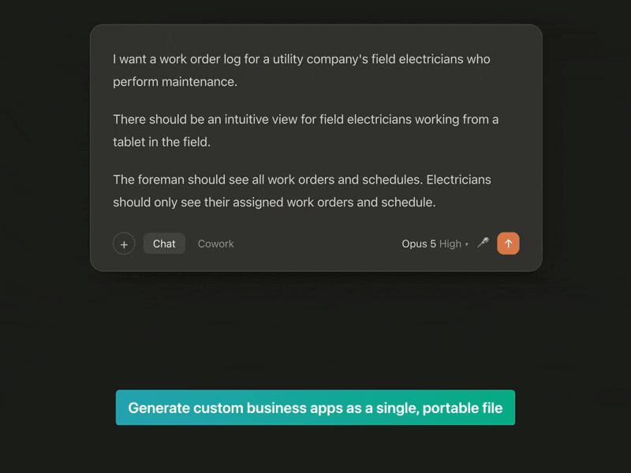
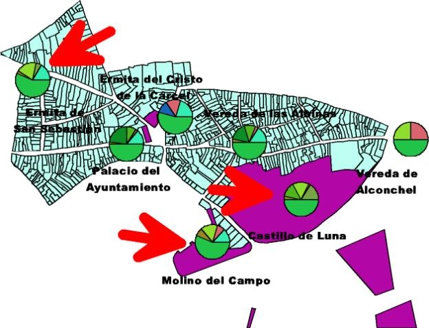
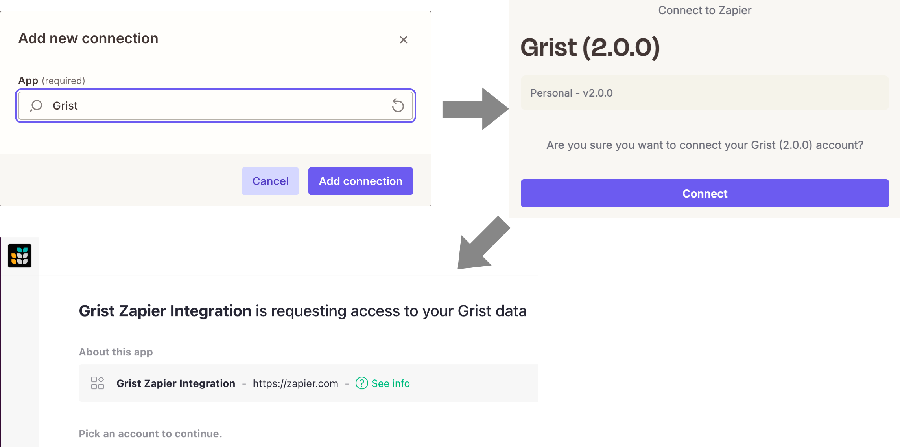
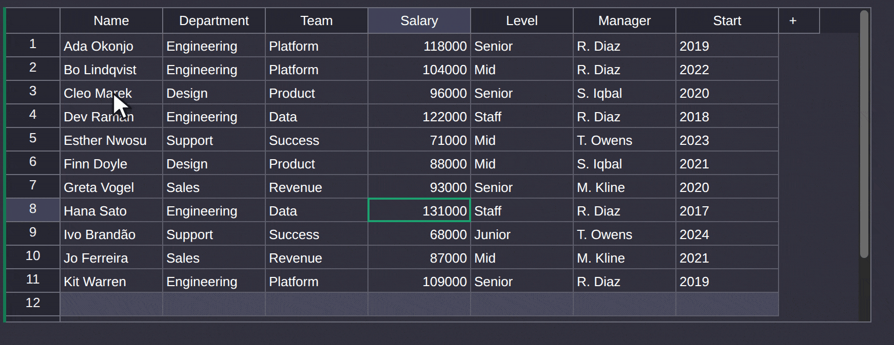
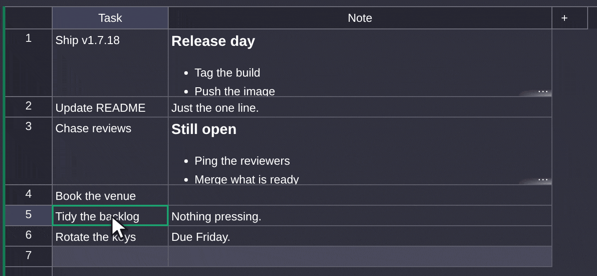
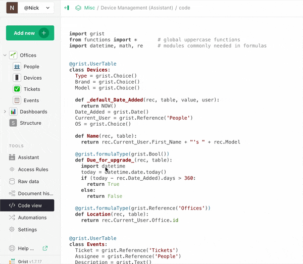
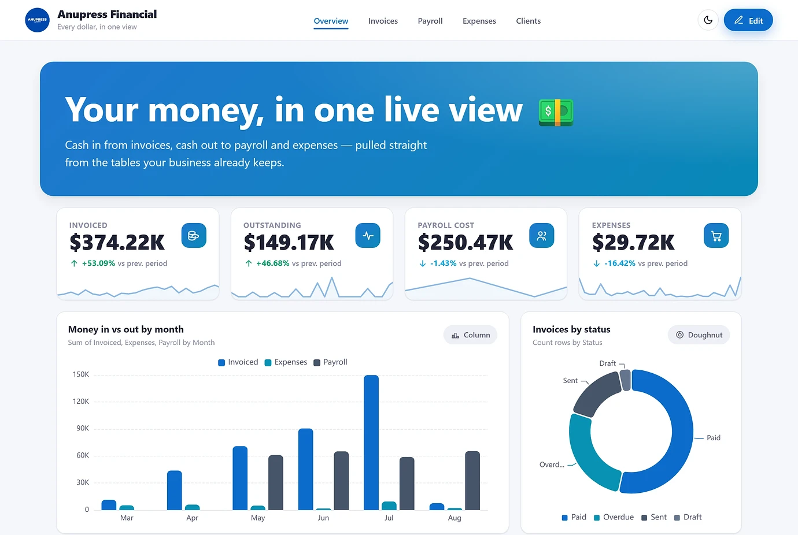
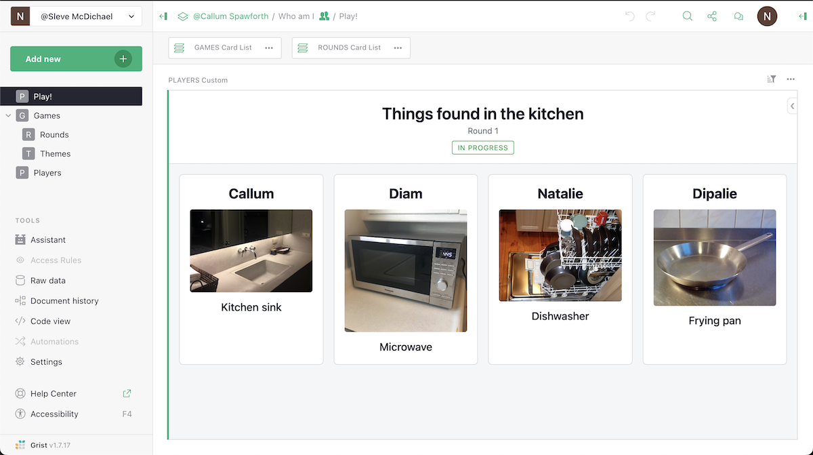
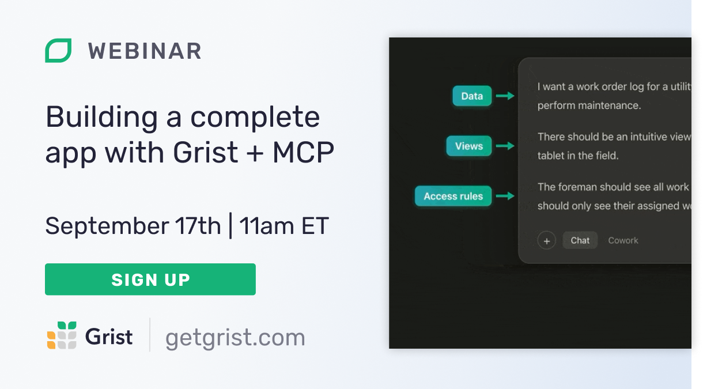

# August 2026 Newsletter

<table class="header" cellpadding="0" cellspacing="0" border="0"><tr>
  <td class="header-text">
    <table class="header-top"><tr>
      <td class="header-image">
        
      </td>
      <td class="header-top-text">
        
Grist for the Mill

        
August 2026
          &#8226; <a href="https://www.getgrist.com/">getgrist.com</a>

      </td>
    </tr></table>
    

      Welcome to our monthly newsletter of updates and tips for Grist users.
    

  </td>
</tr></table>

## What’s new

### MCP and custom widget building improvements

Grist’s new [MCP server](https://support.getgrist.com/newsletters/2026-06/#mcp-server-now-live) is continuing to evolve and expand. Using it on internal demos and projects has inspired a [blog post](https://www.getgrist.com/blog/why-is-grist-an-ideal-vibe-coding-platform-its-file-format/), because the intersection of structured data and LLM tool use is feeling more and more natural and effective. Stan’s [first look webinar](https://www.getgrist.com/webinars/mcp-grist-a-first-look/) showed how accurate even small, fast and cheap models like Haiku and Codex Mini can be when applied to Grist, and our [upcoming webinar](https://www.getgrist.com/webinars/building-a-complete-app-with-grist-mcp/) has Anais building a complete app. See a tiny preview below:

On the dev side, there are four new tools in the MCP server’s toolbelt:

* `get_custom_widget_settings` and `set_custom_widget_settings` read and write a widget's access level and column mapping.
* `get_custom_widget_options` and `set_custom_widget_options` read and write the widget's own options, merging on write so one key can change without dropping the rest.

Also, a custom widget can now declare the columns it needs in its manifest, not only in `grist.ready()`. Old widgets keep working as before, but for new widgets it lets the server know what the widget needs before it runs. This means that the Assistant, for example, can add a map widget and properly map columns on its own. See more fixes and updates in [the commit](https://github.com/gristlabs/grist-core/commit/dadcb247).

### Memory optimizations

Dmitry dove into Grist’s Python data engine and emerged with some [memory optimizations](https://github.com/gristlabs/grist-core/commit/18653743) for lookups and summary tables. Notably, we’ve seen a 30% memory reduction on larger documents, partly by reusing existing structures rather than building separate indices for each lookup.

### On the blog

Caption: Stefano’s map of Mairena del Alcor highlighting the local monuments and funding sources. Made with ArcView pulling data entered from Microsoft Access. [Read the blog post to learn more.](https://www.getgrist.com/blog/why-microsoft-access-survived-and-what-replaces-it/)
Some new posts have gone up recently:

* Anais posits that [Grist is ideal for vibe-coding](https://www.getgrist.com/blog/why-is-grist-an-ideal-vibe-coding-platform-its-file-format/)... because of its file format!
* Speaking of files, Anais also explains the [security gaps between Excel and Grist](https://www.getgrist.com/blog/why-can-grist-secure-a-spreadsheet-when-excel-cant-it-governs-the-field-not-just-the-file/).
* We dive into [structured RAG](https://www.getgrist.com/blog/why-rag-hits-a-wall-on-structured-data/) and how Grist can be part of a hybrid approach, based on the work [Epoch8 is doing](https://www.getgrist.com/webinars/how-epoch8-uses-grist-to-make-ai-agents-query-client-databases-accurately/).
* Stefano digs up the past to ponder [why Microsoft Access survived](https://www.getgrist.com/blog/why-microsoft-access-survived-and-what-replaces-it/).

### Update on OIDC/SAML support

As of this month, Grist Labs will only officially support SSO via OIDC/SAML on the full edition of Grist on new installations. Any existing OIDC/SAML core installations will continue to work, and you can upgrade without concern. Going forward, we'd like new installers who want to use OIDC/SAML to use full Grist.

Individuals and small orgs with total finances less than US $1 million may apply for a free activation key for the full version of Grist. More about the free key program: https://www.getgrist.com/free-grist-activation-key-faq/

### Improved Zapier integration

Connecting [Zapier](https://zapier.com/apps/grist/integrations) to Grist used to mean copying and pasting an API key. Now, there’s literally a single Connect button. Sign in to Grist, choose which documents to share, and Zapier gets access to just those documents. The connection shows up on your [Authorized apps](https://support.getgrist.com/connected-apps/) page which can be revoked it at any time.

This is the [OAuth support](https://support.getgrist.com/newsletters/2026-06/#oauth-based-connected-apps) we introduced in June that also connects AI tools to Grist over MCP. For self-hosters, the new [Grist (API key)](https://zapier.com/apps/grist-api-key/integrations) integration retains the familiar key-based connection. The full edition supports creating a one-click Zapier integration for your instance, as documented  [here](https://support.getgrist.com/install/integrations/zapier/).

### Free team site changes

A final reminder that the [aforementioned changes](https://support.getgrist.com/newsletters/2026-07/#free-team-site-changes) to free team site limits take effect today. All affected users should have been notified via email, but please [contact us](https://www.getgrist.com/contact/) with any questions.

### More updates

* We’ve updated how [access rules memos](https://support.getgrist.com/access-rules/#access-rule-memos) are explained. They’re now marked with a lock or a lightbulb: a reason (the rule that blocked you) or a remedy (a rule that would have granted access), respectively.

* Markdown cells now show an ellipsis if its contents exceed the max row height, as other cell types already did.

### GristCon 2026 is a month away!

If you haven’t already, sign up for this year’s [GristCon](https://www.getgrist.com/gristcon-2026/) happening virtually on **October 1st**. Also, if you have an pitch for a session of your own, we still have some last-minute slots available. Just sign up and indicate your interest and speaking and we’ll take it from there. 

Also, we took a trip down memory lane and took a look at all that’s changed since the [last GristCon](https://www.getgrist.com/blog/a-year-of-grist-seen-through-gristcon-2025-highlights/), including highlighting speakers who were ahead of the curve.

There’s a `grist-core` release: [v1.7.18](https://github.com/gristlabs/grist-core/releases/tag/v1.7.18). Click through for full release notes.

## Community highlights

* Thomas Guillet created a [custom widget](https://community.getgrist.com/t/relationship-in-er-diagram-from-exported-grist-file/1471/15) that visualizes a Grist document’s structure using Mermaid.js. 

* Anupress updated their [no-code dashboard custom widget](https://community.getgrist.com/t/showcase-new-advanced-charts-a-no-code-dashboard-widget-for-grist-by-anupress/13998/3) with new block types and templates. It takes a bit of configuration within Grist to set up, but if your use case aligns with their dashboards it may be helpful.

* Sometimes we play games at Grist Labs, and Callum whipped up a [new template + custom widget](https://grist-marketing.getgrist.com/vVh6R5bnkhiH/Who-am-I-Template/p/9) that let us play a Heads Up!-like game over video call. Tip: “things found in kitchen” sounds like a boring category but it’s surprisingly varied with a globally-distributed group! 

## Learning Grist

### Grist 101

New to Grist? Check out our webinar designed to get you up to speed on essential features and helpful tricks.

[WATCH GRIST 101 WEBINAR](https://www.getgrist.com/webinars/grist-101-new-users-guide/){:target="\_blank"}
{: .grist-button}

### Webinar: How do I self-host Grist?

We really think Grist is the [best vibe-coding platform](https://www.getgrist.com/blog/why-is-grist-an-ideal-vibe-coding-platform-its-file-format/), so why don't we prove it? Join Anais as she wields Grist's MCP server to create a full-blown data application in a single session. She'll demonstrate how easy it is, but more importantly: how secure and sustainable AI workflows are on top of Grist's stable structure.

{:target="\_blank"}

**Thursday September 17th at 11:00am US Eastern Time.**

[SIGN-UP FOR SEPTEMBER'S WEBINAR](https://www.getgrist.com/webinars/building-a-complete-app-with-grist-mcp/?utm_source=support-newsletter&utm_medium=internal&utm_campaign=build-webinar&utm_term=september-2026){:target="\_blank"}
{: .grist-button}

### How do I self-host Grist?

Self-hosting is important, but it shouldn’t be hard. Watch Grist developer, George, as he shows off our new setup wizard that makes self-hosting something anyone can do. Is it possible to balance simplicity with the wide range of configurations often required when running software on your own infrastructure? You'll have to watch and see...

[WATCH AUGUST'S RECORDING](https://www.getgrist.com/webinars/how-do-i-self-host-grist/){:target="\_blank"}
{: .grist-button}

## Help spread the word
If you’re interested in helping Grist grow, consider leaving a review on product review sites. Here’s a short list where your review could make a big impact. Thank you!

* [AlternativeTo](https://alternativeto.net/software/grist/about/){:target="\_blank"}
* [Capterra](https://www.capterra.com/p/232821/Grist/){:target="\_blank"}
* [G2](https://www.g2.com/products/grist){:target="\_blank"}
* [TrustRadius](https://www.trustradius.com/products/grist/){:target="\_blank"}

## We are here to support you

**Solutions.** Grist often surprises people with its capabilities. Schedule a **free** call to assess your needs and help connect you with a Grist expert. [Learn more.](https://www.getgrist.com/solutions/){:target="\_blank"}

**Have questions, feedback, or need help?** Search our [Help Center](../index.md){:target="\_blank"}, [watch video tutorials](https://www.youtube.com/channel/UCx0ioQrrC-bIrkmZ7ZULr0g/playlists){:target="\_blank"}, share ideas in our [Community Forum](https://community.getgrist.com){:target="\_blank"}, or contact us at <support@getgrist.com>.