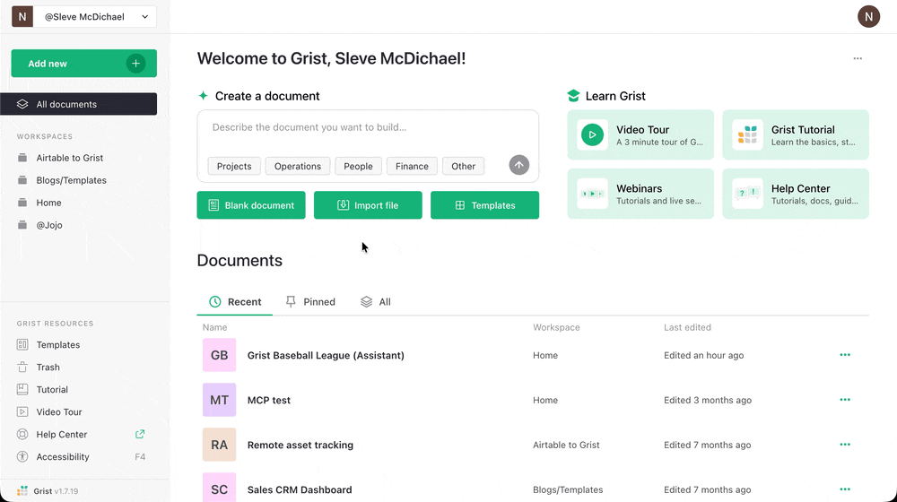
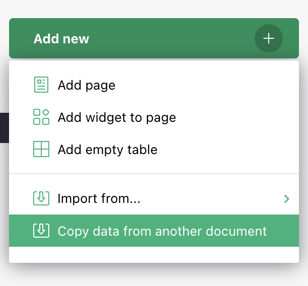
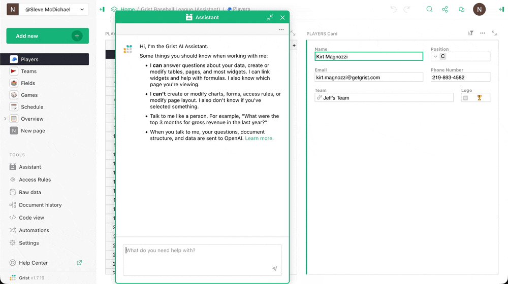
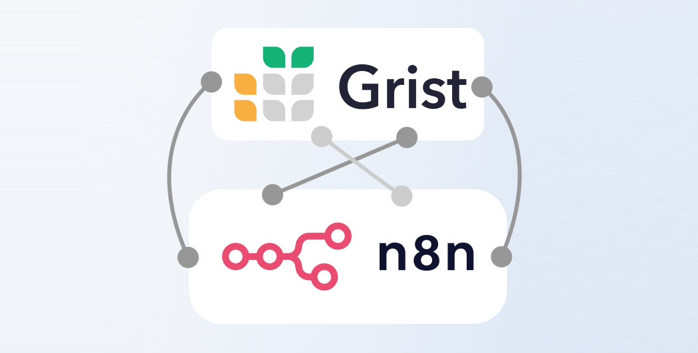
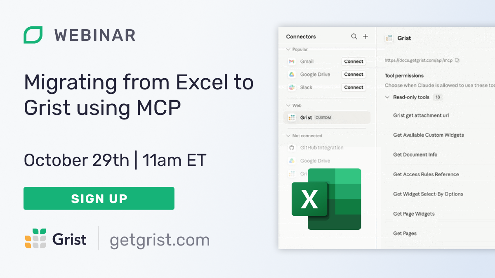

# September 2026 Newsletter

<table class="header" cellpadding="0" cellspacing="0" border="0"><tr>
  <td class="header-text">
    <table class="header-top"><tr>
      <td class="header-image">
        
      </td>
      <td class="header-top-text">
        
Grist for the Mill

        
September 2026
          &#8226; <a href="https://www.getgrist.com/">getgrist.com</a>

      </td>
    </tr></table>
    

      Welcome to our monthly newsletter of updates and tips for Grist users.
    

  </td>
</tr></table>

## What’s new

### GristCon is tomorrow – check out the full agenda

Join us **tomorrow** for [GristCon 2026](https://www.getgrist.com/gristcon-2026/), a full day of sessions showing off the wild and wonderful ways people use Grist in real life. You’ll see furnace control systems and picnic planners *in the same talk.* You’ll see high level Grist implementation strategies based on backend/interface modularity, as well as operational models for easy tenant deployments. You’ll learn about traceable randomness and agentic confidence scores. All in one day!

This is a virtual event held on our [Discord server](https://discord.gg/MYKpYQ3fbP){:target="\_blank"} and is free to join. If you’re new to Discord, check out our [quick instructions](https://www.getgrist.com/gristcon-2026/#instructions){:target="\_blank"} for watching the sessions.

### Grist homepage redesign

When you log into Grist, you’ll see a fresh design and can generate a new document with a pre-selected or custom prompt. If you want to hide this section, you can do so with the three dot menu at the top right.

### Copying data from another document

**
{: .screenshot-half }

Users on the Business plan and full edition self-hosters can now [copy data from another document](https://support.getgrist.com/copying-docs/#copying-data-from-another-document){:target="\_blank"}, including column types, formulas, references, and formatting. This does not include attachments, pages, or widgets.

### Grist Fleet in the Admin Panel

You can now configure Grist Fleet from the Admin Panel. What is Grist Fleet? It allows you to run several identical servers as one installation, scaling Grist horizontally for organizations that have outgrown a single server. Check out our [full documentation](https://support.getgrist.com/install/fleet/#grist-fleet){:target="\_blank"} for the detailed benefits and requirements, and [contact us](https://www.getgrist.com/contact/){:target="\_blank"} about having Fleet added to your installation.

### New AI tools: arrange page and card layouts

The Grist AI Assistant and MCP-connected agents now have a bunch of new tools that let them change how data is displayed: `get_page_layout`, `set_page_layout`, `get_card_layout`, `set_card_layout`, `get_widget_options`, and `set_widget_options`. 

Also, MCP agents will now build summary tables when appropriate – a lesson we all learn at some point in our "Gristucation".

### Grist + n8n: automation improvements and see you in Berlin 

If you’re in Berlin the 13-14th of October, we’ll be at n8n’s [In the Loop conference](https://n8n.io/intheloop/){:target="\_blank"} with a booth and two human beings. Come by and say hello!

Code-wise, a few key Grist-related changes were accepted and merged by n8n recently:

1. One that enables OAuth2 as an authentication option ([PR](https://github.com/n8n-io/n8n/pull/34798){:target="\_blank"})
2. One authored by community contributor dtinth that adds the upsert operation ([PR](https://github.com/n8n-io/n8n/pull/18067){:target="\_blank"})

There’s also a version 2 of the Grist node [in the works](https://github.com/n8n-io/n8n/pull/39553){:target="\_blank"}, with document and table pickers and a column mapper.

If you’re new to n8n, don’t forget to check out our [multiple video walkthroughs](https://support.getgrist.com/integrators/#example-updating-multiple-tables-from-a-form-submission){:target="\_blank"} that show you how to build n8n automations and include the sample Grist and n8n templates to get you started.

### Grist on NixOS

Declarative distro NixOS has been in the news lately, with the [Dutch government basing their new OS DAWO on it](https://boingboing.net/2026/09/25/dutch-government-to-replace-microsoft-windows-with-nixos-based-operating-system.html){:target="\_blank"}, not to mention France’s [SécurixOS](https://github.com/cloud-gouv/securix/){:target="\_blank"}. We’ve been aware of Grist as part of [Mijn Bureau](https://minbzk.github.io/mijn-bureau-infra/){:target="\_blank"} (DAWO’s productivity suite), but are happy to see Grist being [added as a package](https://github.com/NixOS/nixpkgs/pull/566754){:target="\_blank"} to the official NixOS repo.

Any Nix users/developers out there? Please get in touch!

## Security advisory for Grist versions < 1.7.19

Release v1.7.19 addressed an RCE vulnerability documented [here](https://github.com/gristlabs/grist-core/security/advisories/GHSA-9x4j-4rw5-3vmq){:target="\_blank"}.

## More updates

* A couple of formula fixes went live:
    * Clicking a column in another table while editing a formula inserts its name, without `$`, for easier lookups. ([PR](https://github.com/gristlabs/grist-core/pull/2547){:target="\_blank"})
    * Autocomplete added for column names inside `lookupOne()` and `lookupRecords()`. ([PR](https://github.com/gristlabs/grist-core/pull/2530){:target="\_blank"})
* For self-hosters, there are five new [docker-compose examples](https://github.com/gristlabs/grist-core/tree/main/docker-compose-examples){:target="\_blank"} – from minimal local testing to a full setup with HTTPS, Keycloak, PostgreSQL, Redis, and RustFS (replacing MinIO, which is no longer maintained).
    * We’ve updated [our documentation](https://support.getgrist.com/install/cloud-storage/#choosing-an-s3-compatible-store){:target="\_blank"} to cover other MinIO alternatives.
* Docker now offers a [hardened image of Grist](https://hub.docker.com/hardened-images/catalog/dhi/grist){:target="\_blank"}, which we think is kind of neat. 

Two releases this month: [v1.7.19](https://github.com/gristlabs/grist-core/releases/tag/v1.7.19){:target="\_blank"} and [v1.7.20](https://github.com/gristlabs/grist-core/releases/tag/v1.7.20){:target="\_blank"}. Click through for complete release notes. [Grist Desktop](https://github.com/gristlabs/grist-desktop/releases/tag/v0.3.16){:target="\_blank"} has also been updated.

## Learning Grist

### Grist 101

New to Grist? Check out our webinar designed to get you up to speed on essential features and helpful tricks.

[WATCH GRIST 101 WEBINAR](https://www.getgrist.com/webinars/grist-101-new-users-guide/){:target="\_blank"}
{: .grist-button}

### Webinar: Migrating from Excel to Grist using MCP

It’s time to move on from that critical spreadsheet that keeps existing despite its many problems and frustrations. Thankfully, it’s never been easier to do so. Join Anais as she walks through migrating a complex Excel document to Grist with the help of AI, keeping the good data, eliminating the frustrations, and improving the structure for long-term iteration and improvement.

{:target="\_blank"}

**Thursday October 29th at 11:00am US Eastern Time.**

[SIGN-UP FOR OCTOBER'S WEBINAR](https://www.getgrist.com/webinars/migrating-from-excel-to-grist-using-mcp/?utm_source=support-newsletter&utm_medium=internal&utm_campaign=build-webinar&utm_term=october-2026){:target="\_blank"}
{: .grist-button}

### **Building a complete app with Grist + MCP**

We really think Grist is the [best vibe-coding platform](https://www.getgrist.com/blog/why-is-grist-an-ideal-vibe-coding-platform-its-file-format/), so why don't we prove it? Join Anais as she wield's Grist's MCP server to create a full-blown data application in a single session. She'll demonstrate how easy it is, but more importantly: how secure and sustainable AI workflows are on top of Grist's stable structure.

[WATCH SEPTEMBER'S RECORDING](https://www.getgrist.com/webinars/building-a-complete-app-with-grist-mcp/){:target="\_blank"}
{: .grist-button}

## Help spread the word
If you’re interested in helping Grist grow, consider leaving a review on product review sites. Here’s a short list where your review could make a big impact. Thank you!

* [AlternativeTo](https://alternativeto.net/software/grist/about/){:target="\_blank"}
* [Capterra](https://www.capterra.com/p/232821/Grist/){:target="\_blank"}
* [G2](https://www.g2.com/products/grist){:target="\_blank"}
* [TrustRadius](https://www.trustradius.com/products/grist/){:target="\_blank"}

## We are here to support you

**Solutions.** Grist often surprises people with its capabilities. Schedule a **free** call to assess your needs and help connect you with a Grist expert. [Learn more.](https://www.getgrist.com/solutions/){:target="\_blank"}

**Have questions, feedback, or need help?** Search our [Help Center](../index.md){:target="\_blank"}, [watch video tutorials](https://www.youtube.com/channel/UCx0ioQrrC-bIrkmZ7ZULr0g/playlists){:target="\_blank"}, share ideas in our [Community Forum](https://community.getgrist.com){:target="\_blank"}, or contact us at <support@getgrist.com>.