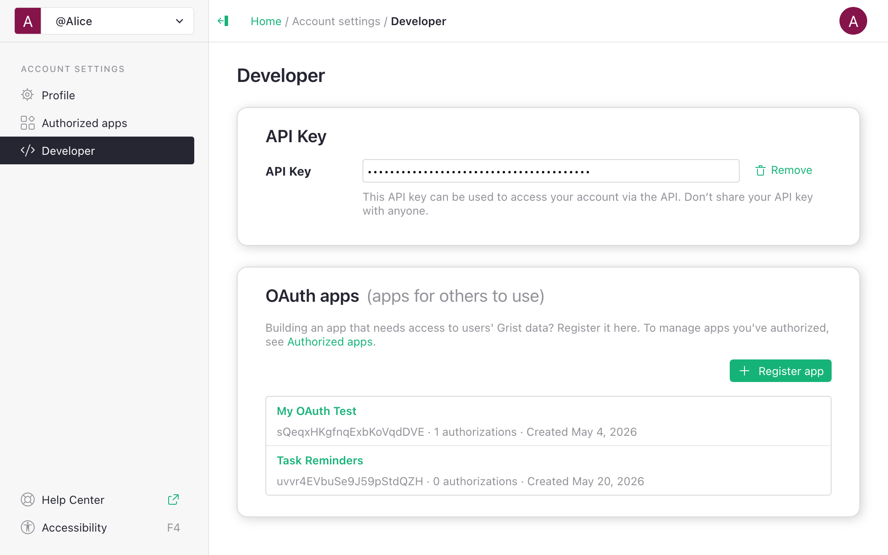
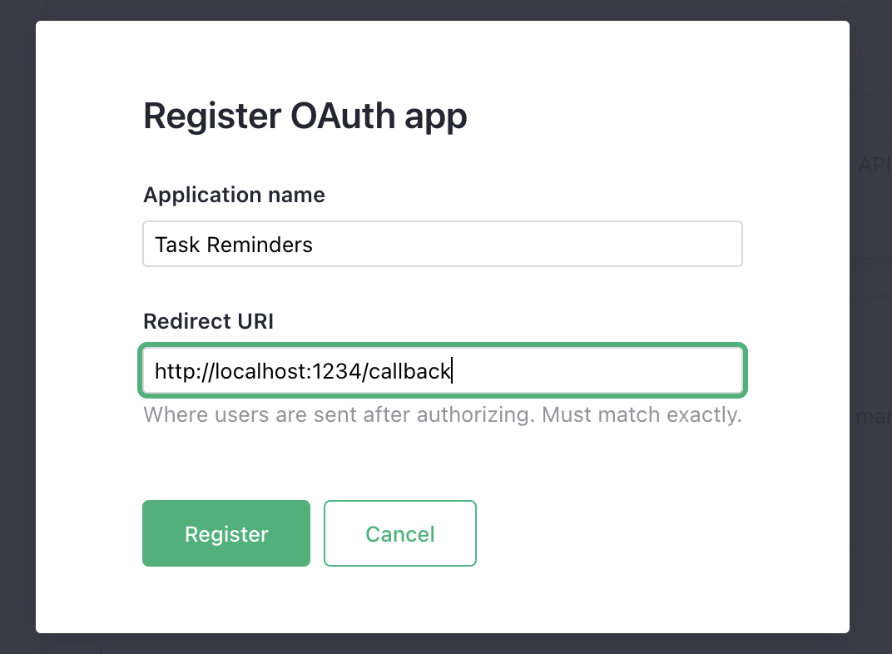
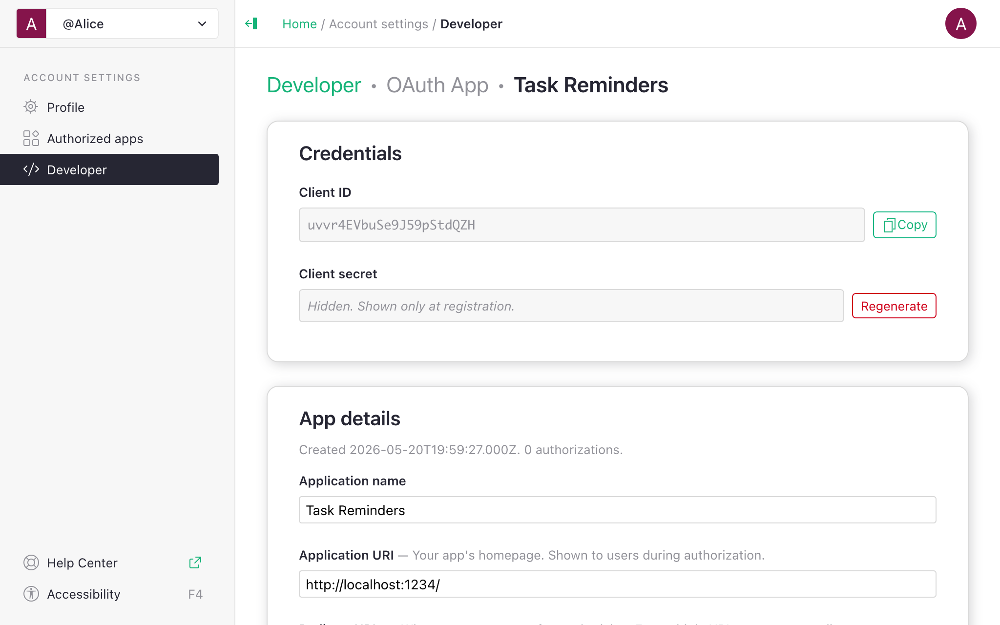

# OAuth apps

OAuth apps let an external tool, AI agent, or partner application act on a
Grist user's data on their behalf, with permissions and document scope the
user controls.

This page is reference material for building such tools or registering existing OAuth-enabled
tools with Grist.

Grist's OAuth server supports standard OAuth 2.0 authorization code flow with PKCE.
For the protocol itself, see [oauth.net](https://oauth.net/2/) and [RFC
6749](https://datatracker.ietf.org/doc/html/rfc6749).

For the end-user view of the same feature, see [Connected apps](connected-apps.md), which covers
what users see when they authorize an app, and how they can manage their authorized apps.

!!! note "Availability"
    For self-hosted installations, OAuth apps are part of the full Grist edition.
    The OAuth server runs on your infrastructure, with token issuance, authorization, and
    validation all happening on systems you control.

## When OAuth fits better than an API key

A Grist [API key](rest-api.md#authentication) carries a user's full account access. It is simpler
for scripts and integrations you run yourself. Prefer OAuth when:

- **You are building tools or integrations for someone else to use.** Each user connects it under
  their own permissions and attribution. This is more secure and more convenient for the user
  than asking users to paste their own API keys.
- **You are connecting an OAuth-enabled system to act as each user.** Third-party systems
  that support OAuth can be connected to Grist to allow each user to authorize and act with the
  user's permission. This is more secure than using an API key for a special "master" account with
  wide access.

## Discovery

```
// For getgrist.com
GET https://login.getgrist.com/.well-known/oauth-authorization-server

// For your self-hosted server
GET https://<your-grist-server>/.well-known/oauth-authorization-server
```

This returns a standard JSON discovery document, which lists the authorization, token, and
revocation endpoints, plus supported scopes, grant types, and PKCE methods. Most OAuth client
libraries support using such a discovery endpoint instead of hardcoding paths.

## Register an app

For an app that connects to getgrist.com, visit your [Account settings →
Developer](https://docs.getgrist.com/account/developer) page. For self-hosted installations, you
can find 'Account settings' under your [user menu](glossary.md#user-menu). The 'OAuth apps'
section lists the OAuth apps you are a maintainer for, and lets you register new ones.



Click "Register app" and fill in:

- **Application name** — shown on the consent screen.
- **Redirect URI** — where users return after authorizing. Must use
  `https://` protocol, but `http://` is allowed for the `localhost` domain.
- **Scopes** -- what permissions your app is allowed to request. This lets you apply the
  principle of least privilege and limit what the app can do even if it's compromised.

<span class="screenshot-large">**</span>
{: .screenshot-half}

These are the minimum properties needed to register an app. After registering, copy the **client
ID** and **client secret**. The secret is shown once.

After this first step, you are taken to the app's settings page, where you can configure other
properties of the app:

- **Application URI** -- the app URL shown to users. It defaults to the origin of the 'Redirect
  URI'.
- **Redirect URIs** -- you may set additional redirect URIs, entering one per line. When your app
  starts the flow, the redirect URI must match one of these exactly.
- **Contact email** and **Description** -- informational fields to explain to users what app they
  are authorizing and how to get support for it.
- **Scopes** -- you can change the scopes you originally set. You may enable all scopes, or any
  subset, but you must include at least one.



If you make changes, don't forget to save using the 'Save changes' button at the bottom.

## Scopes

| Scope | Grants |
|---|---|
| `doc:read` | Read records, schema, and document structure. |
| `doc:write` | Create, update, and delete records. |
| <nobr>`doc.schema:write`</nobr> | Update document structure and formulas. |
| `doc:download` | Download the full document. |
| `doc:webhooks` | Manage [webhooks](webhooks.md). |
| <nobr>`user.profile:read`</nobr> | See the user's name, email address, and profile info. |
| <nobr>`offline_access`</nobr> | Issue a refresh token. Requires `prompt=consent` on the authorization request. |

[Access rules](access-rules.md) still apply in all cases: an authorized app sees and changes only
what the authorizing user can see and change. Scopes allow limiting that further.

Note that `doc.schema:write` permission is equivalent to the **Structure** permission in [access
rules](access-rules.md), which is very powerful. By enabling formula editing, it allows obtaining
any data in the document, regardless of access rules. One of the security advantages of OAuth apps
is that you can limit them to data changes only even if the authorizing user has the permission to
change structure.

## Endpoints for OAuth tokens

The scopes above give access to the following endpoints, curated for what's typically needed by
integrations. Endpoints not listed are not available to use with OAuth tokens.

| Path | Scopes to read | Scopes to update |
|---|---|---|
| `/api/docs/{docId}/tables` | `doc:read` | `doc.schema:write` |
| <nobr>`/api/docs/{docId}/tables/{tableId}/columns*`</nobr> | `doc:read` | `doc.schema:write` |
| <nobr>`/api/docs/{docId}/tables/{tableId}/records*`</nobr> | `doc:read` | `doc:write` |
| `/api/docs/{docId}/attachments*` | `doc:read` | `doc:write` |
| <nobr>`/api/docs/{docId}/download/*` (csv, xlsx, ...)</nobr> | `doc:read` | — |
| `/api/docs/{docId}/download` | `doc:download` | — |
| `/api/docs/{docId}/webhooks*` | `doc:webhooks` | `doc:webhooks` |
| `/api/orgs` | `doc*` | — |
| `/api/orgs/{orgId}/workspaces` | `doc*` | — |
| `/api/workspaces/{wsId}/docs` | — | `doc:write` + `doc.schema:write` |
| `/api/profile/user` | `user.profile:read` | — |

Any doc-level scope is enough to list orgs (personal and team sites) and to list the contents of
the org (workspace and documents). If the user granted access to a limited set of resources, the
app will only see those.

Note that the endpoints for exporting in tabular format (CSV, XLSX, etc.) respect access rules and
only require `doc:read` scope. The endpoint to download the full `.grist` document file allows a
document owner to bypass access rules, and so requires a separate scope. It may be useful for
automating offsite backups.

## Managing the app

Grist only supports "confidential clients", i.e. those that use a client secret. The secret is
only shown once when the app is registered. If you forgot to copy it, or need the secret again
later, you always have the option to regenerate the secret from the app configuration page.

Regenerating the secret will break existing integrations that still use the old secret,
including any background tasks relying on refresh tokens.

If the app is no longer used, you may use 'Delete app' button to delete it.

## Resource selections

When the user authorizes your app, they may choose 'All documents' or pick
specific documents, workspaces, or orgs. The selection is enforced
on every API call: a request for a document outside the grant returns
`403`, even if the user themselves can access that document. Your app
does not need to do anything to support this.

If your app needs a document the user didn't grant, the user can adjust
the selection from their 'Authorized apps' page (see
[Connected apps](connected-apps.md)), or you can prompt them to
re-authorize.

## Tokens

| | Access token | Refresh token |
|---|---|---|
| Prefix | `grist_at_` | `grist_rt_` |
| Format | Opaque | Opaque |
| Default TTL | 1 hour | 60 days |
| Rotation | -- | Rotated when used past a fraction of its lifetime. If the refresh response includes a new `refresh_token`, replace your stored refresh token with it. |

The underlying grant persists until the user revokes it. A job that
refreshes at least once every 30 days keeps working indefinitely.

Revoke a token per [RFC 7009](https://datatracker.ietf.org/doc/html/rfc7009):
`POST /oidc/revocation` accepts either an access or refresh token. Users can also revoke from
their 'Authorized apps' page; doing so invalidates every token issued under that grant.

## Grist-specific constraints

- **PKCE is required** for every client, S256 recommended.
- **Confidential clients only.** Every registered app has a client
  secret; `token_endpoint_auth_method=none` is not supported. Keep the
  secret on a server, not in a browser or mobile app.
- **`offline_access` requires `prompt=consent`** on the authorization
  request. Without it the request fails with
  `invalid\_request: offline\_access scope requires prompt=consent`.
- **Resource indicators (RFC 8707) are not used.**
  Per-document selection happens on the consent screen and is enforced server-side; clients
  request scopes only.
- **Not all REST endpoints accept OAuth tokens.** The [list of supported scopes and
  endpoints](#endpoints-for-oauth-tokens) is curated for what's typically needed by integrations.

## Flow example

A minimal end-to-end flow, using `curl`:

```sh
# Fill these in (from the app's settings page):
SERVER=https://login.getgrist.com  # Or your self-hosted Grist server
CLIENT_ID=...
CLIENT_SECRET=...
REDIRECT_URI=http://localhost:8000/oauth2/callback

# 1. Send the user to the authorization URL.
STATE=...  # Random CSRF token
PKCE_VERIFIER=...  # PKCE verifier value
PKCE_CHALLENGE=...  # PKCE challenge value

echo "$SERVER/oidc/auth?response_type=code&client_id=$CLIENT_ID\
&redirect_uri=$REDIRECT_URI&scope=doc:read+offline_access&state=$STATE\
&code_challenge=$PKCE_CHALLENGE&code_challenge_method=S256&prompt=consent"

# 2. The user returns to $REDIRECT_URI?code=...&state=...
#    Verify state matches, then exchange the received code for a token:
CODE=...  # code parameter from the URL

curl -u "$CLIENT_ID:$CLIENT_SECRET" "$SERVER/oidc/token" \
  -d grant_type=authorization_code \
  -d code="$CODE" \
  -d redirect_uri="$REDIRECT_URI" \
  -d code_verifier="$PKCE_VERIFIER"
# This request returns
# { access_token, refresh_token, expires_in, token_type: "Bearer", scope }

# 3. Call the API the same way as with an API key:
ACCESS_TOKEN=grist_at_...
DOC_ID=...
TABLE_ID=...

curl -H "Authorization: Bearer $ACCESS_TOKEN" \
  "$SERVER/api/docs/$DOC_ID/tables/$TABLE_ID/records"

# 4. Refresh later:
REFRESH_TOKEN=grist_rt_...
curl -u "$CLIENT_ID:$CLIENT_SECRET" "$SERVER/oidc/token" \
  -d grant_type=refresh_token -d refresh_token="$REFRESH_TOKEN"
```

Errors follow the OAuth 2.0 format: an HTTP 4xx with a JSON body containing `error` and
`error_description` properties.

## Related

- [Connected apps](connected-apps.md) — end-user view of the same feature.
- [REST API usage](rest-api.md) — calling Grist with an access token uses
  the same endpoints as an API key. See [Endpoints for OAuth tokens](#endpoints-for-oauth-tokens).
- [API reference](api.md) — full list of endpoints.
