<iframe width="560" height="315" src="https://www.youtube.com/embed/vTfOUEFR73Y?rel=0" frameborder="0" allow="accelerometer; autoplay; encrypted-media; gyroscope; picture-in-picture" allowfullscreen></iframe>

## Pages & widgets {: data-toc-label='' }

Unlike traditional spreadsheets, in Grist you can create multiple views of the same data, and
display multiple data sets on one page. This allows you to create useful dashboards and custom
applications tailored to your needs.

## Pages

In Grist, you organize your document into "pages". These are listed in the left panel, with collapsible
groups. You may rearrange and group pages in the left panel by dragging them to suit your needs.

*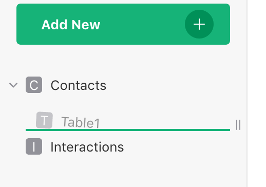*
{: .screenshot-half }

You can rename, remove, or duplicate pages using the three-dots menu next to the page name in the list. 

*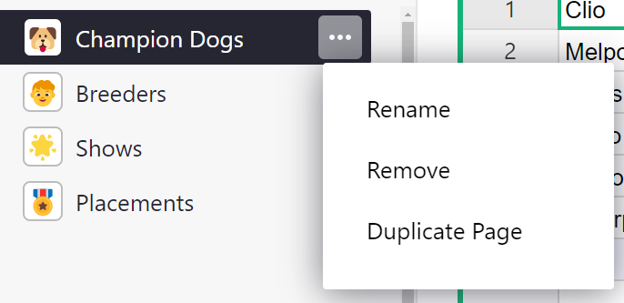*
{: .screenshot-half }

* **Renaming** the page does not edit data tables' names or widget titles. See [changing widget](page-widgets.md#changing-widget-or-its-data) below to learn how to edit table and widget names.
* **Duplicating** a page duplicates *views* of data and does not duplicate the data itself.
* **Removing** a page does not delete data. When removing the last view of data, you will be asked if you want to delete only the view, but not the data itself; or if you want to delete both the page and the underlying data table(s). Learn more about your document's data in the [raw data page](raw-data.md).

*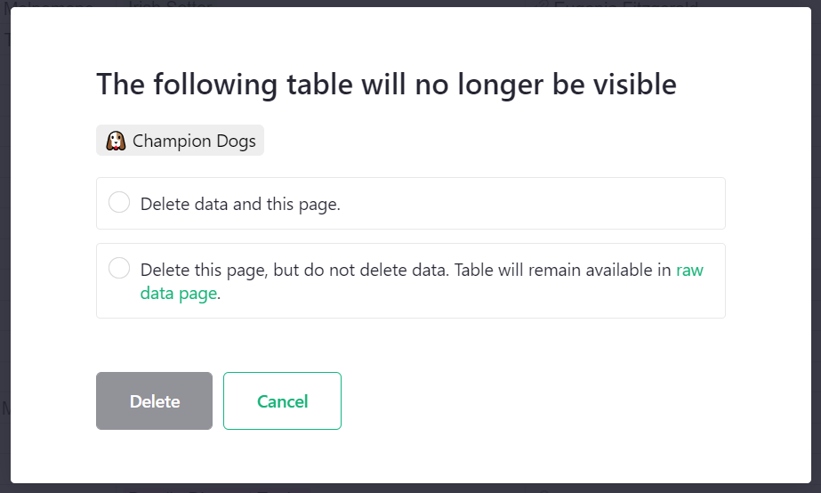*

Note that pages can also be renamed by clicking the page name on top of the screen. 

*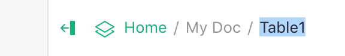*
{: .screenshot-half }

Using the opener icon ()
near the top of the left panel, you can collapse the panel to show only the initials of each page,
leaving more screen space to view your data.

To add a new page, use the "Add New" button, and click "Add Page". At that point, you'll get to
choose the page widget to include in the new page.

!!! note "Using Emojis in Page and Widget Names"
    You can add any emoji to a Page or Widget name. The keyboard shortcut to open the emoji keyboard is `Windows Logo` + `.` (period) on PC or `Command` + `Control` + `Space` on Mac. You can also copy/paste an online source like [Emojipedia](https://emojipedia.org/). 
    
    When a Page name starts with an emoji, it will replace the page icon.

    *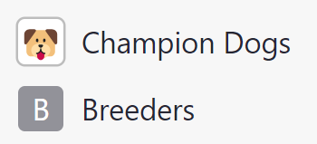*
    {: .screenshot-half }

## Page widgets

A page contains sections, such as tables or charts, which we call "page widgets". Each page widget
shows data from one table. A page may contain more than one page widget, and you can arrange and
link them to create useful layouts.

Here are the supported kinds of page widgets. The salient features of each one are described
on separate pages.

- [Table](widget-table.md): similar to the spreadsheet grid and a good way to see many records at once.
- [Card](widget-card.md): shows a single record in a form-like layout which you can customize.
- [Card List](widget-card.md): uses the same layout options as a card, displays a scrollable list of records.
- [Chart](widget-chart.md): plots data on a chart with support for several different chart types.
- [Calendar](widget-calendar.md): displays event data in a calendar view.
- [Custom](widget-custom.md): inserts a custom webpage, optionally granting it access to the document's data.

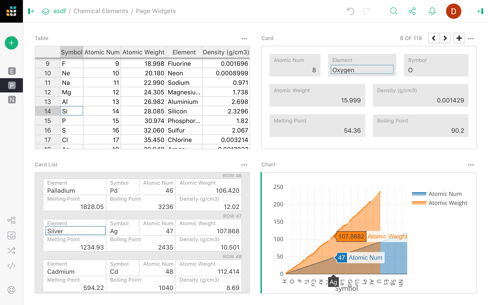

There is a special page called [raw data](raw-data.md) that lists all data tables in your document and summarizes your document's usage statistics. Navigate to the raw data page by clicking on the Raw Data link in the bottom left of the pages menu.

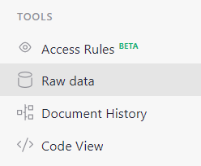

## Widget picker

The menu opened by the "Add New" button has options "Add Page" and "Add Widget to Page". In either
case, you'll see the "page widget picker" where you can choose your desired widget:

*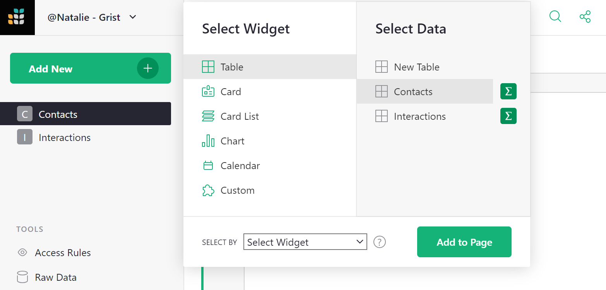*

You can select the type of widget and the table of data to show (or "New Table" to create a new
table). The "summary" icon ()
allows you to [summarize data](summary-tables.md).

When adding a widget to an _existing_ page, you'll also see a "Select By" option, which allows
linking this widget to another one already on the page. This process is described in greater
detail in [Linking widgets](linking-widgets.md).

Once you've added widgets, they can be moved around and resized, as described in [Custom
Layouts](custom-layouts.md).

## Changing widget or its data

If you'd like to change a widget or the data it displays after it's added, you may do so. Click
the three-dots button on the top right of your widget, and select "Widget options". This opens the
right-side panel. Click on "Change Widget".

*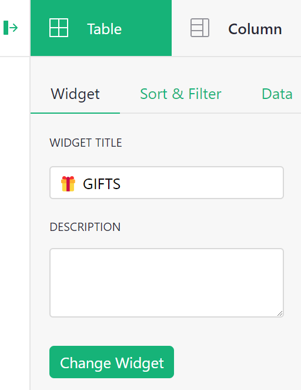*
{: .screenshot-half }

You can then use the widget picker to change the widget or the data it displays. You may also edit the widget's title or add a description. 

## Renaming widgets

You can rename widgets in several ways. We saw in the section above that you can edit a widget's title or add a description from the Widget tab of the Creator Panel.

Another way is to click on the widget title above a widget. From here, you can edit the widget's title, the underlying data table's name or add a description. By default, the widget title is the data table's name. To override this, enter a new title under 'Widget Title'. Learn more about data tables in the [raw data page](raw-data.md).

*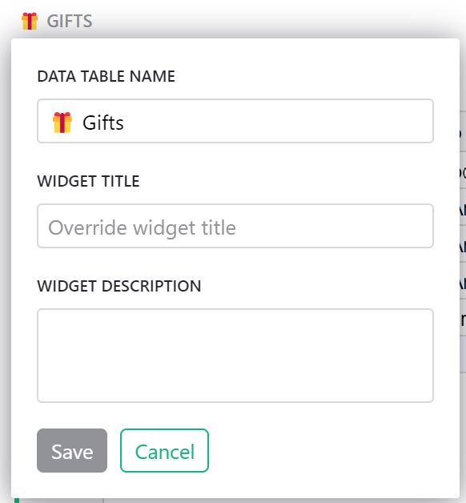*
{: .screenshot-half }

## Configuring field lists

Although different kinds of page widgets look very different, they all represent a list of
records. Any of the widget types can be used to show the same underlying data.

In a **Table**, each record is represented by a row, and columns represent the same kind of value
for each record.

Note that the [raw data page](raw-data.md) lists all data tables.

In a **Card List**, each row of the underlying data is shown as a card. Each column in the data
corresponds to a *field* in this card. When talking about a Card widget, we'll use the term
*"field"*, which conceptually is the same as a *"column"* in a Table widget.

A **Card** is just like a Card List, but shows only one row of data at a time.

In a **Chart**, each row of the underlying data table becomes a graphical element, such as a point
on a line chart, a bar in a bar chart, or a slice of a pie chart. In this context, the columns of
our data table are better known as data *"series"*.

Click on the opener icon () to
open the right panel. Depending on the currently-selected widget, you might see a tab for
configuring a Column, Field, or Series. These are not different in substance, but different terms
make more sense for different widgets.

*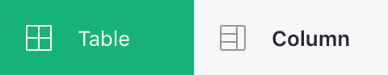*
{: .screenshot-half }

**
{: .screenshot-half }

**
{: .screenshot-half }

*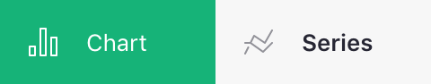*
{: .screenshot-half }

Clicking on the widget tab (highlighted in green in the images above), you'll see subtabs for
"Widget", "Sort & Filter", and "Data". We'll focus on the first one: "Widget". You'll see options
specific to the type of the selected widget, and below that two lists: "Visible Columns" and
"Hidden Columns".

*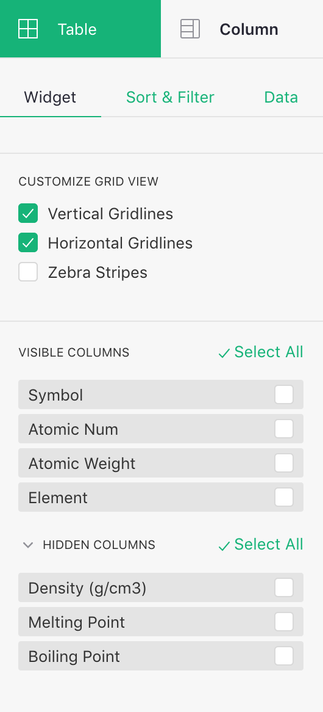*
{: .screenshot-half }

The "Hidden Columns" are the columns available in the data, but not shown in this widget. In a
Card, these lists would show up as "Visible Fields" / "Hidden Fields". In a chart, they show up as
"Visible Series" / "Hidden Series".

These lists allow you to include, exclude, or rearrange fields in a widget. As you move your mouse
over the items in the list, use the "eye" icons that pop up to show or hide them. Alternatively,
you can select several items using the checkboxes, and hide or show them together.

*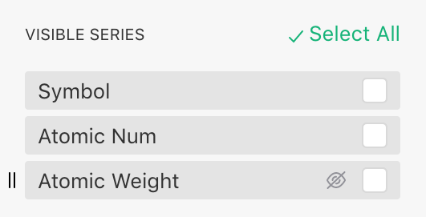*
{: .screenshot-half }

*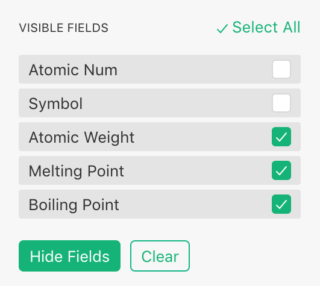*
{: .screenshot-half }

This ordered list of fields can be used to customize any of the page widget types. It has a
particular importance in the [Chart widget](widget-chart.md), where different chart types and options require you to
place series in a certain order in the "Visible Series" list to ensure your data is plotted
correctly.
