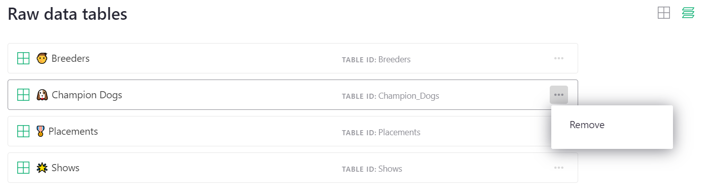
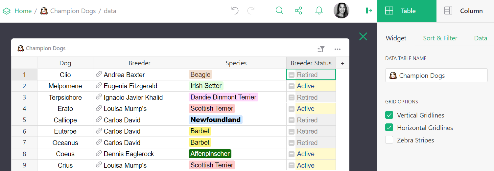
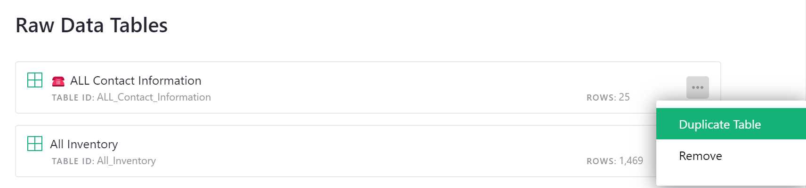
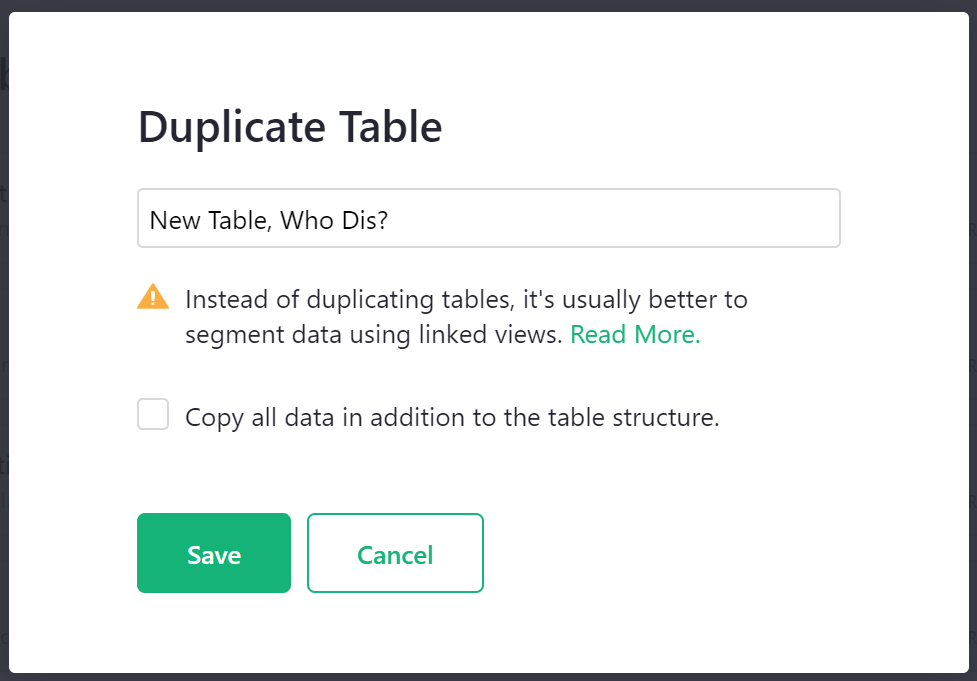
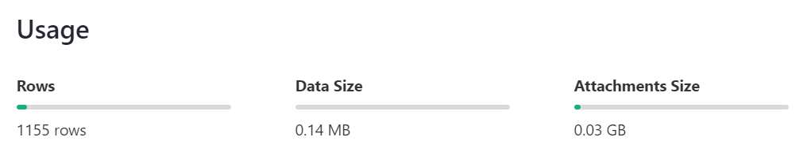

# Raw data

The raw data page is a special page that lists all [data tables](glossary.md#data-table) in your document and summarizes your document's usage statistics.

From your document, navigate to the raw data page by clicking on the 'Raw Data' link in the bottom left of the pages menu.

**
{: .screenshot-half } 

Unlike other [pages](page-widgets.md), the layout in the raw data page cannot be customized. From the list of data tables, you can find the data table's name and id, and remove data. Note that removing a data table from this page *will* delete data and remove it from all pages. This is different from other pages where it is possible to remove a view of data and not delete the data itself. 

Click on a data table to open it. Note that in the creator panel the [widget type](page-widgets.md#page-widgets) cannot be changed. Renaming the widget also renames the data table. Because raw data is intended to show all data, columns cannot be hidden, either. However, columns can be rearranged, deleted, created, and modified. For creators, this view may make it easier to edit data structure, add [formulas](formulas.md), [conditional formatting](conditional-formatting.md), and so on.

## Duplicating Data

Tables can be duplicated from the 'Raw Data' page. Click the three-dot icon to the right of the table you wish to duplicate then select 'Duplicate Table' from the menu.

By default, a duplicated table will only contain the table structure, not the data. If you wish to copy all data in addition to the table structure, be sure to check the box prior to clicking 'Save'. If the original table has any access rules, those rules **will not** be duplicated. Only the document's default rules will apply to the copied table.

**
{: .screenshot-half } 

The duplicate table is a new table that is not linked to the original. Meaning, if you update data in the copy, the original table will not be updated, and vice versa.

Note that instead of duplicating tables, it's usually better to segment data by adding a new column. Let's use expenses as an example. Rather than having separate tables for each month's expenses, it is better to include all data in a single table and create a new column called **Month** to segment rows into months. In general, if you have multiple tables with near identical columns, this is an indicator that the data could all be in the same table. Doing so may make data analysis easier.

## Usage

Usage statistics are summarized beneath the list of data tables. Note that usage applies to the entire document, not individual tables. Learn more about document [limits](limits.md).

