Using References and Lookups in Formulas
=========

[Reference and Reference List columns](col-refs.md) in Grist allow one table to create an explicit reference to another. 
A common example of this is seen in the [Class Enrollment](https://templates.getgrist.com/doc/afterschool-program) template.

On the Staff page, we have a list of staff members. On the classes page, we have a reference column labeled Instructor that 
references the records on our Staff page. 

<span class="screenshot-large">*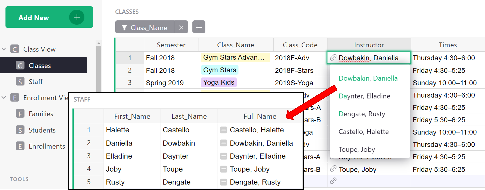*</span>

Keep in mind, it’s not just referencing the Full Name column but the entire record associated with the selected instructor. 

## Reference columns and dot notation

Using a Reference column within a formula can make it easy to get any data from the referenced record. To do this, we use dot notation. It uses the format `$A.B` where `A` is the name of the reference column and `B` is the name of the column in the referenced table that we want to pull data from.

Let’s see this in action on the [Enrollment View](https://templates.getgrist.com/doc/afterschool-program/p/7) page of the Class Enrollment template. Dot notation is used in the Class_Times column of the ENROLLMENTS table, found at the bottom right of the Enrollment View page.

<span class="screenshot-large">*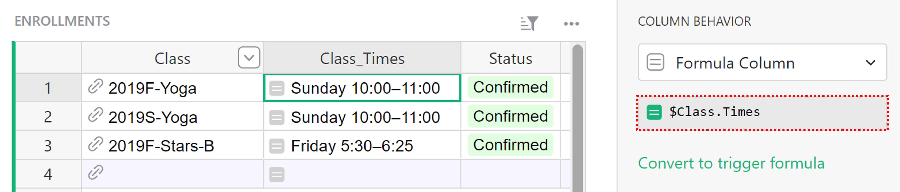*</span>

We can see that the Class_Times column is using a formula with dot notation. Using the format `$A.B` described above, we can figure out that Class is the name of the reference column and Times is the name of the column in the referenced table.

Let’s track this back to where it’s pulling from - since the reference column is Class, we can look at that column’s information to find out what table it is pulling from.

<span class="screenshot-large">*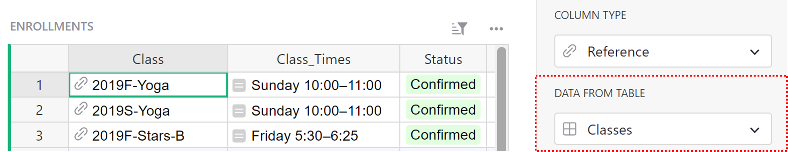*</span>

The Class column references data from the Classes table. Therefore, the Class_Times column is pulling from the Times column of the Classes table.

<span class="screenshot-large">*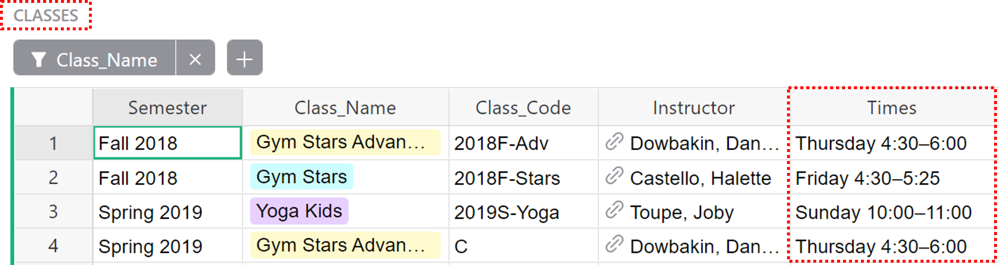*</span>

## Chaining

If the reference lookup returns a reference, this can be chained. 

Perhaps we want to add the Instructor’s phone number to the Enrollments table. We can use the Class reference column to pull the instructor’s information from the Classes table.

<span class="screenshot-large">*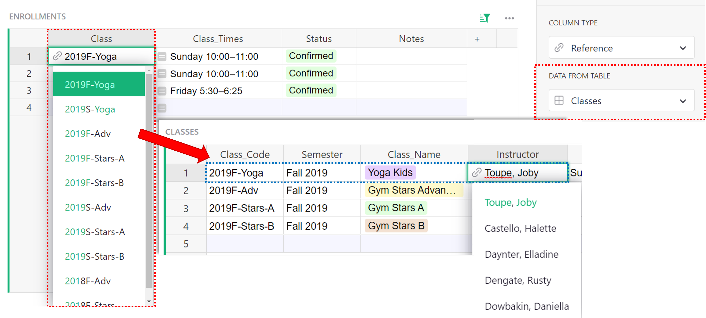*</span>

As you can see in the screenshot above, the instructor column is a reference column itself. If we follow the format from before, our dot notation would be ```$Class.Instructor``` but the Instructor column points to the entire record of the instructor so we need to tell it what information we want from this record, creating a chain.

The instructor column references the Staff table so we navigate there to find out what column we need to pull information from in order to get the phone number. The column that contains the instructor’s phone number is Phone.

<span class="screenshot-large">*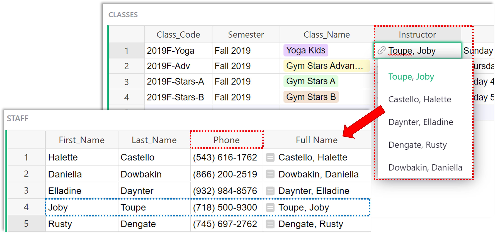*</span>

Putting this all together, our dot notation for the instructor’s phone number would be ```$Class.Instructor.Phone```

<span class="screenshot-large">*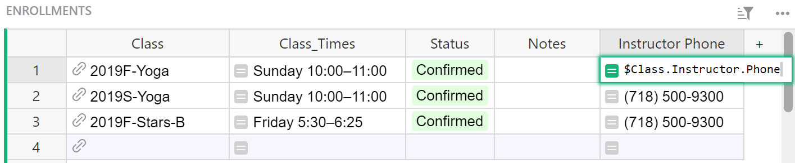*</span>

What happens if we leave our formulas as `$Class.Instructor`? You will see a numeric record ID of the record in the Staff table that the Instructor column points to.

<span class="screenshot-large">*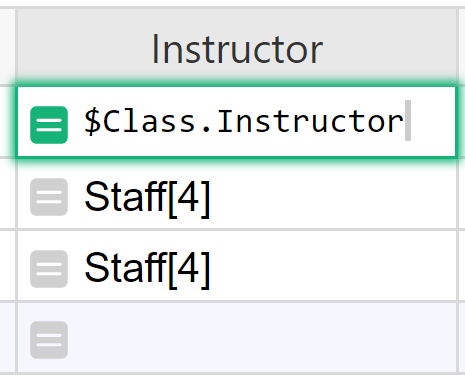*</span>
{: .screenshot-half }

That's what a reference column really stores. If you change the type of this formula column to Reference, you will be able to select a column to show, such as the Full Name. 

<span class="screenshot-large">*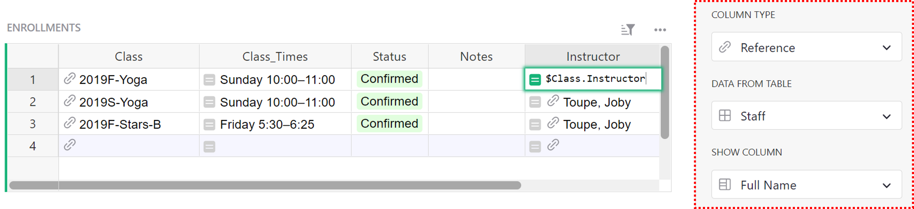*</span>

Another way to see the name is to chain the dot-notation, as we did for phone: `$Class.Instructor.Full_Name`.

<span class="screenshot-large">*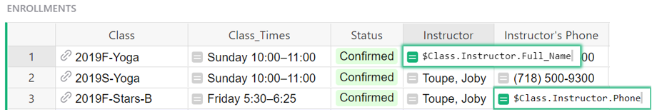*</span>

## lookupOne

Another way to point to a record is using `Table.lookupOne(...)` function. [lookupOne](https://support.getgrist.com/functions/#lookupone) allows you to look up a record by some fields, similar to Excel's VLOOKUP. In fact, Grist's version of VLOOKUP is merely an alias for lookupOne. lookupOne is rarely useful in Grist, because using a Reference type column is usually the preferred solution to connect records. However, on some occasions, lookupOne can be useful. 

One situation is when you have two sets of data which overlap even though they represent something different and perhaps come from different sources. An example of this can be found in our [Event Sponsors + Attendees (References and Lookups)](https://public.getgrist.com/6kTypo2FtSsf/Event-Sponsors-Attendees-References-and-Lookups/m/fork) document which is a modified version of the Event Sponsors + Attendees template, available in our [template gallery](https://public.getgrist.com/p/templates). 

Let's say that you run an event and have a list of registered attendees, as well as Sponsors. Registered attendees are stored in the All Registrations table, perhaps populated via a form integration. 

<span class="screenshot-large">*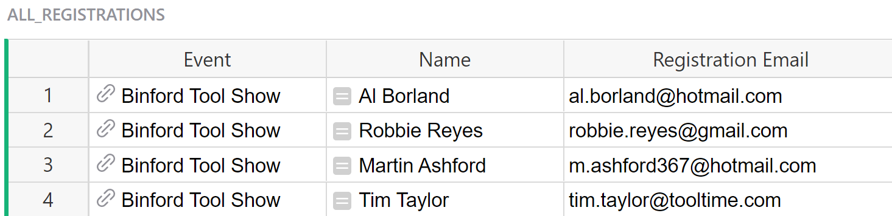*</span>
{: .screenshot-half }

Sponsors are listed in a separate table, with fields related to their sponsorship, and perhaps maintained by another team. 

<span class="screenshot-large">*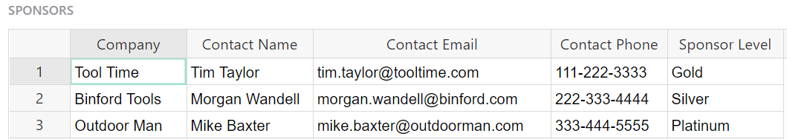*</span>

Both tables contain email addresses which identify attendees and sponsors. Sometimes a sponsor may register to attend the event. In that case, you'll have an Attendee record with an email address that also appears in the Sponsors table. That's useful to know for someone looking at the attendee list. 

You can lookup a record in the sponsors table by email address by using a lookupOne formula. The Sponsor column in the All Registrations table does just that using this formula:

```
Sponsors.lookupOne(Contact_Email=$Registration_Email)
```

This formula is looking to see if a Contact Email from the Sponsors table matches a Registration Email from the All Registrations table. 

The general format for a lookupOne formula is: 
```
[Table_Name].lookupOne([A]=$[B])
```
`[Table_Name]` is the name of the table you want to lookup data in. `[A]` is the column in the table being looked up (named at the beginning of the formula) and `[B]` is the column in the current table / the table you are entering the formula in.

<span class="screenshot-large">*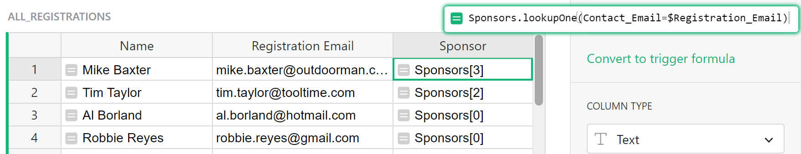*</span>

Such a formula returns a reference. In the screenshot above, you can see the lookup result returns `Sponsors[#]`. The number it returns between square brackets is the record ID of the lookup result. Where it returns `Sponsors[0]`, no match was found. 

It's often a good idea to create a column for the lookup result and change its type to Reference, as you see in the screenshot below. Then, if there is a match, the reference column will point to the entire matched record. Like any reference column, you can select which field from that record to show. In this example, it shows the Company field of the matched record in the Sponsors table.

<span class="screenshot-large">*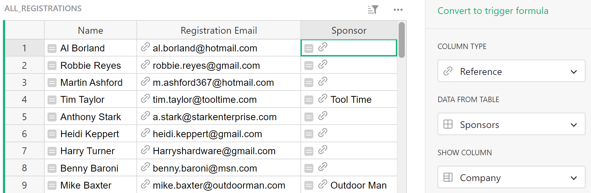*</span>

## lookupOne and dot notation

Because lookupOne is creating a reference to a record, we can use dot notation to look up additional fields in that record.

In the [example](https://public.getgrist.com/6kTypo2FtSsf/Event-Sponsors-Attendees-References-and-Lookups/p/1) above, `Sponsors.lookupOne(Contact_Email=$Registration_Email)` is checking if a Contact Email from the Sponsors table matches a Registration Email from the All Registrations table.

What if we also wanted to look up the sponsor level?

We can add `.Sponsor_Level` to the lookupOne formula, and, if a match is found, look up the value in the sponsor level column for the matched record.

The entire formula would be `Sponsors.lookupOne(Contact_Email=$Registration_Email).Sponsor_Level`.

<span class="screenshot-large">*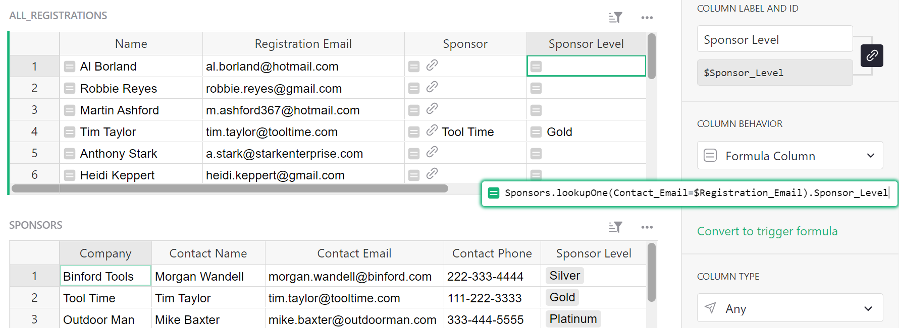*</span>

Now, we have the Sponsor Level listed in the All Registrations table for those attendees whose emails also appear on the sponsor list.

## lookupOne and sort_by ##

When the `lookupOne` function encounters multiple matching results, it returns the first one by row ID. The optional `sort_by` parameter can be used to sort these results by another field, to determine which one would be returned as the first match. You can also prefix the column ID with "-" to reverse the order.

For instance, consider this example from the [Class Enrollment](https://templates.getgrist.com/doc/afterschool-program) template. This template tracks enrollment for extracurricular and other classes - logging information for students, families, and staff. 

On this page, we have a list of students and their respective information.

<span class="screenshot-large">**</span>

Additionally, we have a Families page that outlines the parent of each student and we’d like to find which student in each family is the oldest. So, we would create an oldest student column.

<span class="screenshot-large">*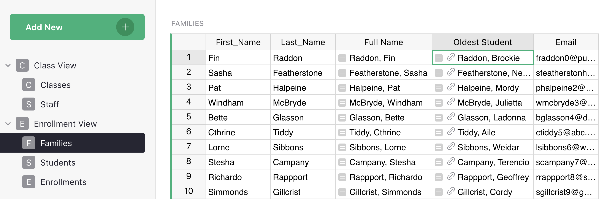*</span>


Then, the following formula would look at the Students table, find the specific students associated with each family, sort them by their birthday, and return the one student with the earliest birthday: 

`Students.lookupOne(Family=$id, sort_by="Birthday")`

In this case, this would return: Raddon, Brockie. 

Alternatively, if we want to find the youngest student, the formula would include "-": 

`Students.lookupOne(Family=$id, sort_by="-Birthday”)`

In this case, this would return: Raddon, Care. 

## Understanding record sets

Sometimes a record may reference multiple records in another table. Multiple references can be made with a Reference List Column. 

A great example of this is seen on the [Habit Tracker](https://templates.getgrist.com/1BR9vm6GPTGX/Habit-Tracker) template. 

On the Habits + Goals page, we have a list of habits and a goal for how often we wish to complete that habit. On the Habit Tracker page, we have a Reference List column labeled Habits Completed that references the records on our Habits + Goals page. 

The only difference between a Reference column and a Reference List column is the ability to select multiple references. This creates a set of records which can be used in formulas.

<span class="screenshot-large">*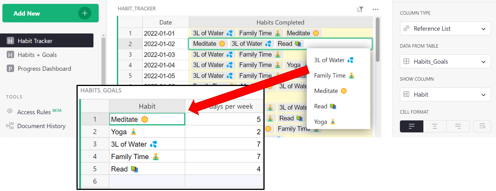*</span>

## Reference lists and dot notation

Similar to references, you can use Dot Notation with reference lists. 

Building on our prior [example](https://public.getgrist.com/6kTypo2FtSsf/Event-Sponsors-Attendees-References-and-Lookups/p/3) of attendees at a conference, suppose we have a list of registrants for an event and want to find the balance for each registrant. To do this, we can use dot notation.

Here, `$Registrants` is a reference list. Our Great Outdoors Expo has 4 registrants. We can see the list of registrants in the Registrants column. This list is a reference to the Name column of the All Registrants table. 

<span class="screenshot-large">*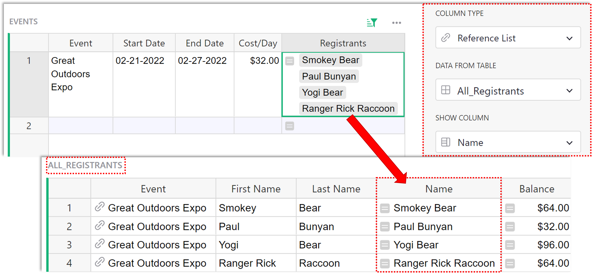*</span>

With a reference list, dot-notation returns a list of all the selected field;

<span class="screenshot-large">*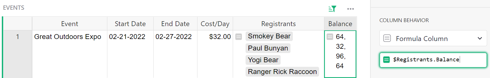*</span>

`$Registrants.Balance` is a list of the Balances for each attendee in the list of `$Registrants`. This follows the format `$[A].[B]` where `[A]` is the name of the Reference List column and `[B]` is the name of the column in the referenced table you wish to pull data from. We'll learn how to find the sum of these balances in [Working with Record Sets](#working-with-record-sets).

## lookupRecords

You can also get a list of references using [lookupRecords](https://support.getgrist.com/functions/#lookuprecords).

The formula for lookupRecords follows this format:

```
[Table_Name].lookupRecords([A]=$[B])
```

`[Table_Name]` is the name of the table you want to lookup data in. `[A]` is the column in the table being looked up (named at the beginning of the formula) and `[B]` is the column in the current table / the table you are entering the formula in.

Suppose we want a list of the events attended by each person in our [Email List](https://public.getgrist.com/6kTypo2FtSsf/Event-Sponsors-Attendees-References-and-Lookups/p/4) table. We can use lookupRecords to do this. First, we need to lookup records where the email listed in the All Registrations table matches an email in this list. Then, find the event associated with each of those records. 

Following the format above, our initial formula is:
```
All_Registrations.lookupRecords(Registration_Email=$Email)
```

<span class="screenshot-large">*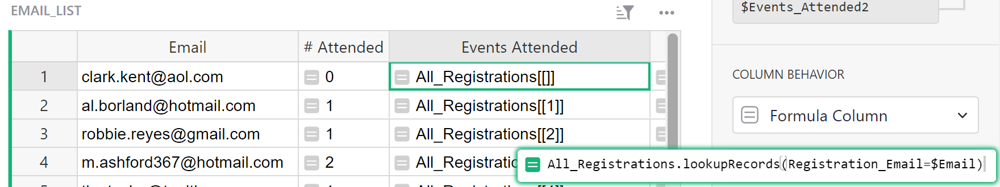*</span>

`All_Registrations.lookupRecords(Registration_Email=$Email)` returns a list of record IDs for each record in the All Registrations table where the Registration Email matches the Email in this row of the Email List table. Next, we need to find the Event associated with each of these records. To do this, we can use dot notation.

`All_Registrations.lookupRecords(Registration_Email=$Email).Event` will return the value from the Event column for each record found.

<span class="screenshot-large">*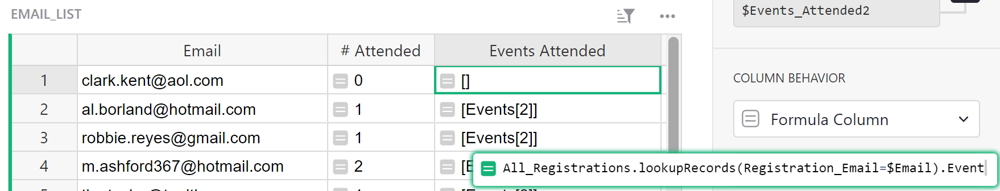*</span>

We saw similar results using the [lookupOne](#lookupone) function. It's helpful to change the column type to Reference List, as you see in the screenshot below. Then, if there is a match, the reference list column will point to the entire record for each match. Like any reference list column, you can select which field you want to show for the matched records. In this example, it shows the Event field of the Events table for each matched record in the Attendees table.

<span class="screenshot-large">*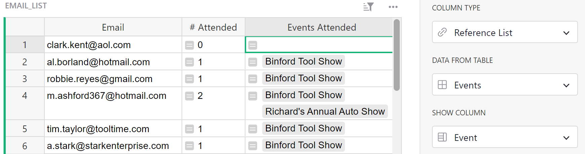*</span>

## Reverse lookups

LookupRecords works a bit differently if a reference exists between two tables. With a reverse lookup, we can use the record ID to find a record. 

Every row has a numeric id (available as `$id` in formulas) that is unique within that table. You can reveal the ID by adding a formula column where formula is `$id`{: .formula}

<span class="screenshot-large">*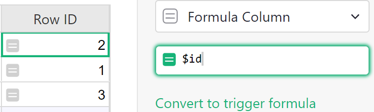*</span>
{: .screenshot-half }

Let's take a look at the Registrants column of the [Events](https://public.getgrist.com/6kTypo2FtSsf/Event-Sponsors-Attendees-References-and-Lookups/p/3) table. 

<span class="screenshot-large">*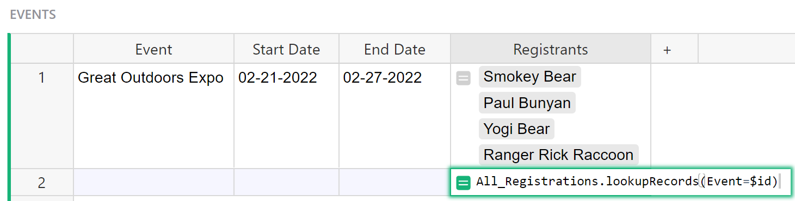*</span>

The formula used here is `All_Registrations.lookupRecords(Event=$id)`. We use the id to find a match because in the All Registrations table, the Event column is a reference column which means its value is a record's id.

Because All_Registrations.Event is a reference column pointing to an Event record in the Events table, we can match the id stored in the reference column to the ids of records in the Events table. That's why the argument in the formula is `Event=$id`.

We use the existing reference, just in reverse - hence the name, Reverse Lookup.

<span class="screenshot-large">*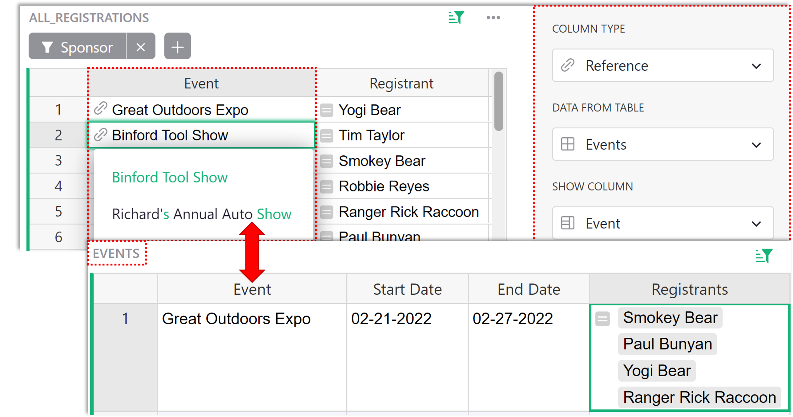*</span>

If you’d like a video walkthrough of a reverse lookup, we have an example in our [Build with Grist Webinar - Trigger Formulas v. Formulas](https://www.youtube.com/watch?v=0qVDPZd2w9I&t=788s).

## Working with record sets

lookupRecords can also be used within other formulas.

`SUM()` can be useful to find a sum of all numbers in a list of records. Once you find your list of records using the lookupRecords function and dot notation, you can use `SUM()` to sum all values returned, like you see in this formula:

```
SUM(Table.lookupRecords(Column_A=$Column_B).Column_C)
```

You can also do this on a reference list because a reference list is the same thing, a list of records.

```
SUM($RefList.Column)
```

In the [Reference lists and dot notation](#reference-lists-and-dot-notation) section, we used the Registrants column and dot notation to find the balance for each person in our list of Registrants. We can use `SUM()` with our prior formula to find the total balance.
```
SUM($Registrants.Balance)
```
<span class="screenshot-large">*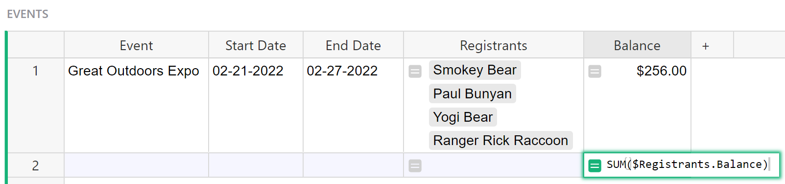*</span>

We can also use lookupRecords to get the list of references, rather than using a reference list column, then find the sum of the balance for all registrants. This method is used in the Ticket Revenue column of the [Events](https://public.getgrist.com/6kTypo2FtSsf/Event-Sponsors-Attendees-References-and-Lookups/p/3) table using the following formula:

```
SUM(All_Registrations.lookupRecords(Event=$id).Balance)
```

`All_Registrations.lookupRecords(Event=$id).Balance` finds all records in the All Registrations table where the Event column matches the ID of the row in this table, Events. Using dot notation, we find the Balance for each of the records found. Then `SUM()` sums the balances of all records found.

<span class="screenshot-large">*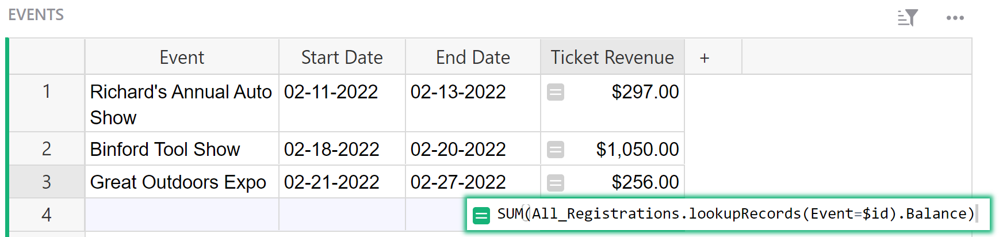*</span>

You can also iterate through a Reference List using a Python `for` loop. An example of this can be seen in the Balance ('for' loop) column in the Events table. When iterating, each element is a Reference so dot-notation can be used here as well. To find the sum of the balance for all registrants, we use the following formula:

```
SUM(person.Balance for person in $Registrants)
```
This does the same thing as our lookupRecords formula we saw above. `$Registrants` is our reference list. For each record (`person`) in our list of Registrants, we find the Balance. Then, sum all balances together. In this formula, `person` is a variable that represents each element in our list and could be replaced with any other variable.

<span class="screenshot-large">*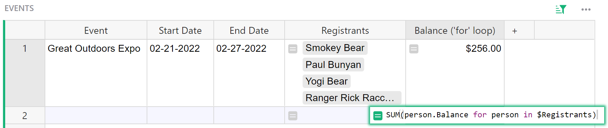*</span>

If you’d like to learn more about [Data Structures and List Comprehension](https://docs.python.org/3/tutorial/datastructures.html#list-comprehensions) in Python 3, [Python.org](http://python.org/) is a great resource.

`len()` can be useful to get the number of items within a list. Once you find your list of records using the lookupRecords function, you can use `len()` to count the number of records returned, like you see in this formula:

```
len(Table.lookupRecords(Column_A=$Column_B))
```

You can also do this on a reference list.

```
len($RefList)
```

We want to see how many events our Sponsors have attended. We can use lookupRecords to do this. The following formula is used in the Events Attended column of the [Sponsors](https://public.getgrist.com/6kTypo2FtSsf/Event-Sponsors-Attendees-References-and-Lookups/p/2) table.

```
len(All_Registrations.lookupRecords(Sponsor=$id))
```

<span class="screenshot-large">*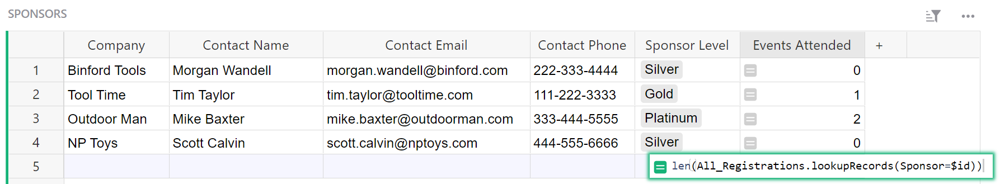*</span>

Let's break down the two parts of this formula, working from the inside out.

`All_Registrations.lookupRecords(Sponsor=$id)` is looking for matches where the record in the Sponsor column of the All Registrations table has the same ID as the record in this row of the Sponsors table. All records in the All Registrations table that match are added to a list of records. Try writing the formula without `len()` to see what Grist returns. It should look something like this.

<span class="screenshot-large">*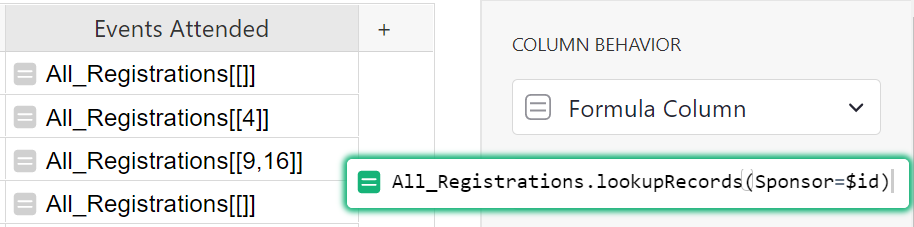*</span>
{: .screenshot-half }

That's a list of records.

`len()` counts how many records are in that list.

<span class="screenshot-large">*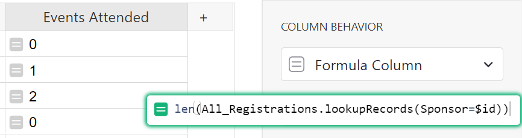*</span>
{: .screenshot-half }

We can also include multiple arguments in a lookupRecords formula. An example of this can be found in the Count column of the Classes table of the [Class Enrollment](https://public.getgrist.com/doc/eW4nqWfK1k3K~8iDuMy8ApPXvzhcemSiYsS~14207/p/6) template. This column shows us how many students are enrolled in each class. The formula used here is:

```
len(Enrollments.lookupRecords(Class=$id, Status="Confirmed"))
```

<span class="screenshot-large">*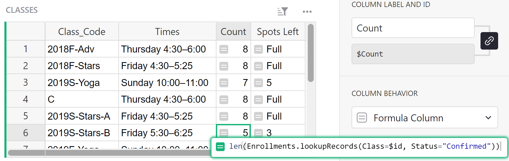*</span>

This lookup uses two fields. It will look for records in the Enrollment table where Status is “Confirmed” and the Class column matches the ID of the row in this table. Because the Class column is referencing the Classes table, we use the record ID `$id` in the lookup.

Finally, `len()` counts the items in the list returned by `Enrollments.lookupRecords(Class=$id, Status="Confirmed")`.

Average, min and max are a few of the other functions that can be used with lookupRecords formulas. See all available functions on our [Function reference](functions.md) page.
