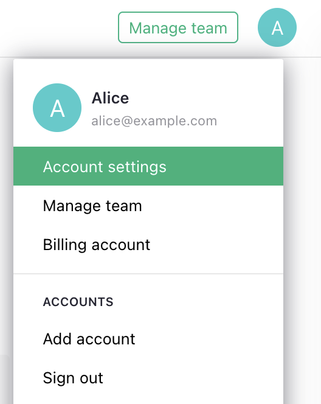
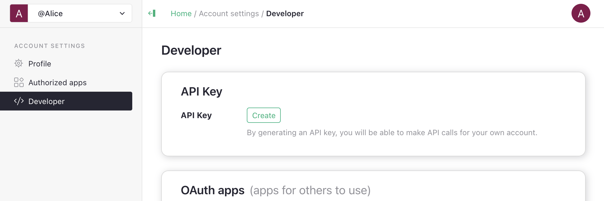

# Grist API Usage

Grist has an API for manipulating documents, workspaces, and team sites.

- [API Reference](api.md) shows documentation of all available endpoints.
- [Interactive API Console](https://docs.getgrist.com/apiconsole) allows you to make API calls using your Grist login.

## Authentication

To access the Grist API, you'll need an API key.  An API key is owned by a single
user, and has the same permissions as that user.

!!! note "Connected apps"
    An API key carries your full account access. For tools that act on your data on your behalf --
    partner products, internal apps, AI agents -- a [connected app](connected-apps.md) is a safer
    choice: it can be authorized for specific documents and revoked individually, for greater
    security, control, and visibility.
    For building such tools, see [OAuth apps](oauth-apps.md).

### API keys

To enable API access for yourself, visit the [Developer page](https://docs.getgrist.com/account/developer)
of your account settings. You can always find this page by clicking your profile picture or
initial on the top right of the screen, and selecting "Account settings":

**
{: .screenshot-half}

The 'Developer' page has a section for API keys:



Click on the "Create" button to create an API Key. Copy it for use when making API calls.

You can revoke your API key by clicking the "Remove" button at any time.
You'll then have the option to create a new one if you wish.

To test your api key, try this from the command-line (substituting
your api key):
```sh
curl -H "Authorization: Bearer <API-KEY-GOES-HERE>" https://docs.getgrist.com/api/orgs
```

This should return a list of organizations, i.e. [team sites](team-sharing.md) you have access to,
and your personal site.

## Usage

To access documents on your personal site via the API, simply continue
using the `docs.getgrist.com` domain.  To access documents and
workspaces on a team site, use `<TEAM>.getgrist.com`.

For example, to list all the workspaces and documents you have access
to on a site, do:

```sh
curl -H "Authorization: Bearer <API-KEY-GOES-HERE>" \
  https://<docs|TEAM>.getgrist.com/api/orgs/current/workspaces
```

When making changes via the API, and passing data via the request
body, be sure to set the `Content-Type` header to
`application/json`. For example, to change the name of a document, you
could do:

```sh
curl -XPATCH \
  -H "Authorization: Bearer <API-KEY-GOES-HERE>" \
  -H "Content-Type: application/json" \
  -d '{"name": "Lesson Plans"}' \
  https://<docs|TEAM>.getgrist.com/api/docs/<DOC-ID-GOES-HERE>
```

For details of the endpoints available, see our [API docs](api.md) or the interactive
[API console](https://docs.getgrist.com/apiconsole).

## API clients

There are two client libraries developed and maintained by Grist Labs:

 * [JavaScript/TypeScript client library](https://www.npmjs.com/package/grist-api)
 * [Python client library](https://pypi.org/project/grist-api/)

There are also several community-created and maintained clients in other flavors:

 * [Pygrister](https://github.com/ricpol/pygrister): an additional Python client, including a CLI tool
 * [grist-js](https://github.com/ben-pr-p/grist-js): a TypeScript client
 * [gorist](https://github.com/CoverWhale/gorist): a Go client
 * [GristCTL](https://github.com/Ville-Eurometropole-Strasbourg/grist-ctl): a Grist API CLI written in Go
 * [vrist](https://github.com/SencilloDev/vrist): a V client
 * [nimGristApi](https://github.com/enthus1ast/nimGristApi): a simple REST client in Nim
 * [grist-client-rs](https://github.com/QazCetelic/grist-client-rs): an in-progress Rust client
 * [gristapi](https://spyrales.github.io/gristapi/): an R client library
