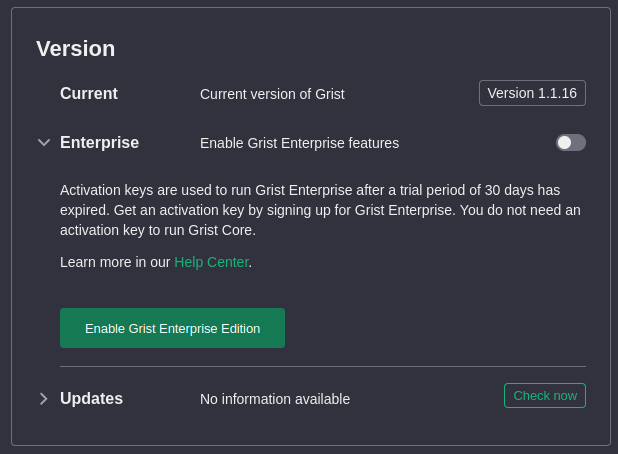
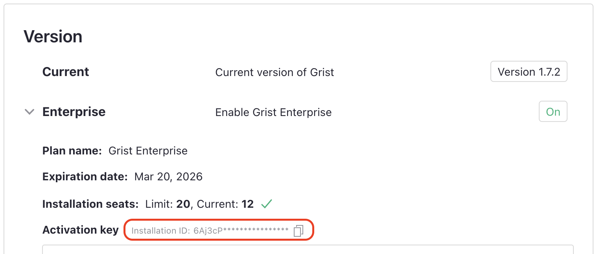

# Self-hosted Grist

[TOC]

## The essentials

There are five flavors of Grist:

  * **SaaS** (Software as a Service): Grist is available as a hosted service
    at [docs.getgrist.com](https://docs.getgrist.com).
    No installation needed. Free and paid plans, with usage limits. Plan details available on our 
    [pricing page](https://www.getgrist.com/pricing/).
  * **Desktop app**: Grist is available as a desktop application, built with Electron.
    It is available for download at [https://github.com/gristlabs/grist-desktop/releases](https://github.com/gristlabs/grist-desktop/releases).
    This desktop application does not need internet and is not tied to any online account or service.
  * **Enterprise**: Grist is available as a licensed application that can be installed by enterprises 
    on their own infrastructure with our support or hosted on dedicated Grist-managed infrastructure. Contains 
    proprietary features developed for enterprises with particular needs. 
  * **Core**: Grist is available as a free application installed
    by citizen developers on their own infrastructure with community support.
    Grist documents created with our SaaS and Enterprise offerings
	can be opened and edited with Core, and vice versa. This establishes
	Grist documents as a reliable format for archiving and interchange.
  * **Grist Builder Edition**: A version of Core pre-packaged for
    cloud providers such as [Amazon Web
    Services](https://aws.amazon.com/marketplace/pp/prodview-tew3ygop5xxy4)
    or [Microsoft
    Azure](https://azuremarketplace.microsoft.com/en-us/marketplace/apps/grist.grist-builder-edition).
    Read more about it
    [here](https://support.getgrist.com/install/grist-builder-edition/).

### What is self-hosted Grist?

Self-hosted (or self-managed) Grist, be it Enterprise or Core, is installed and
configured in much the same way, as described in the following
sections. Grist Builder Edition can be configured the same way, but
includes a default configuration to get started. For clarity, the
sections are tagged with which flavor they apply to, for example:
{: .tag-core .tag-ee }

The full source code for Grist Core is always available at
[github.com/gristlabs/grist-core](https://github.com/gristlabs/grist-core/)
and is under an Apache-2.0 license. You may use and redistribute Core
freely, under the terms of the free software license.
The full source for Grist Enterprise
is also available, at
[github.com/gristlabs/grist-ee](https://github.com/gristlabs/grist-ee/),
under a proprietary license that does not grant any automatic
rights to use or redistribute the software. You can evaluate Enterprise
for 30 days using the instructions in the following sections,
or [sign up for our Grist Enterprise plan](https://www.getgrist.com/pricing)
and get support.

### How do I install Grist? {: .tag-core .tag-ee }

The easiest way to install Grist is as a container. We will
describe how using [Docker](https://www.docker.com/),
but there are many other tools and services for running
containers.

To try Grist out using Docker, make an empty directory for Grist to store material in (say `~/grist`) and then you can do:

```
docker run -p 8484:8484 \
  -v ~/grist:/persist \
  -e GRIST_SESSION_SECRET=invent-a-secret-here \
  -e GRIST_DEFAULT_EMAIL=your-email@example.com \
  -it gristlabs/grist
```

You should then be able to visit `http://localhost:8484` in
your browser. Already you will be able to create and edit Grist
documents, and to open and edit documents downloaded from another
Grist installation (such as our SaaS).

If using some other tool or service, here are the important points:

 * The main image name is `gristlabs/grist`, which is our combined Core and Enterprise docker image.
   The image `gristlabs/grist-oss` also exists, which uses only free and open source code. This image uses only Grist
   Core, and has no enterprise features available.
   (For some tools such as Podman, you may need to prefix these image names with `docker.io/`.)
 * A volume (or mount, or directory) needs to be available at location
   `/persist` within the container. It can be initially empty - Grist
   will populate it. Without this volume, nothing you do will be stored long-term.
 * Port `8484` on the container needs to be exposed. This can be changed
   if you also set the `PORT` environment variable for the container.
 * The environment variable `GRIST_SESSION_SECRET` should be set
   to something secret for the container.

Installed this way, Grist is accessible only to you. Typically you want to
take at least the following steps:

  * [Set up sandboxing](self-managed.md#how-do-i-sandbox-documents) - this is important to
    place bounds on what formulas can do.
  * [Serve from a public host](self-managed.md#how-do-i-run-grist-on-a-server)
    so you can collaborate live with others.
  * Enable an authentication method so users can log in. Often you'll want
    to hook Grist up to an "SSO" (Single Sign-On) service you already use.
	We support some very
    [general authentication methods](self-managed.md#how-do-i-set-up-authentication) that cover many cases,
	and a [special authentication method](self-managed.md#are-there-other-authentication-methods) for custom cases.
  * Consider enabling [snapshot support](self-managed.md#how-do-i-set-up-snapshots) if you want Grist to handle document backups.

#### Grist on AWS and Azure

You can also host Grist on AWS and Azure. Full instructions on these hosting methods are available on the [Grist Builder Edition page](install/grist-builder-edition.md).

### What is the administrative account? {: .tag-core .tag-ee }

On a new Grist installation, the user who logs in with the email
defined by `GRIST_DEFAULT_EMAIL` is the administrator of this Grist
installation. When Grist runs for the first time, it will create an
account set to the value of `GRIST_DEFAULT_EMAIL`. Note that if this
variable is not set, it defaults to `you@example.com`. Changing the
value of `GRIST_DEFAULT_EMAIL` after the first admin user has been
created will effectively revoke administrator permissions from the
first user and assign them to the new email address.

The administrative account has access to the [Installation](admin-panel.md#settings) page in the [Admin Panel](admin-panel.md) where they
may inspect details of the installation or toggle features such as
[telemetry](self-managed.md#how-do-i-control-telemetry) or [Grist
Enterprise](self-managed.md#how-do-i-enable-grist-enterprise).

If [Grist Enterprise](self-managed.md#how-do-i-enable-grist-enterprise) is enabled, the administrative account will also have access to [Admin Controls](admin-controls.md)

### How do I sandbox documents? {: .tag-core .tag-ee }

Grist allows for very powerful formulas, using Python.  We recommend
setting the environment variable `GRIST_SANDBOX_FLAVOR` to `gvisor` if
your hardware supports it (most will), to run formulas in each
document within a sandbox isolated from other documents and isolated
from the network.

```
docker run ...
  -e GRIST_SANDBOX_FLAVOR=gvisor \
  ...
```

To sanity-check that formulas are being evaluated within a sandbox,
you can create a document and then check that this formula
gives an empty result:

```
import glob
glob.glob('/etc/*')
```

Here are some reasons why `gvisor` sandboxing, as configured for
Grist, may fail, and what you can do to diagnose the problem.

#### XSAVE not available

Your processor may not be supported. On `x86_64`, Sandy Bridge
or later is needed. Check that the `XSAVE` processor flag is set.
Here's a quick way to test that:

```sh
grep -q '\bxsave\b' /proc/cpuinfo && echo "XSAVE enabled" || echo "XSAVE missing"
```

#### PTRACE not available

The `SYS_PTRACE` capability may not be available. If running
in docker, you could try explicitly granting it, if you are
comfortable with making it available:

```
docker run ...
  --cap-add=SYS_PTRACE
  ...
```

In some cloud environments such as AWS ECS, you may need to
explicitly list this capability in your container configuration.

### How do I run Grist on a server? {: .tag-core .tag-ee }

We suggest that you become familiar with all the other aspects of
self-management on this page before serving Grist from a public host
(especially [Sandboxing](self-managed.md#how-do-i-sandbox-documents)).
When you do, it is important to tell Grist where it will be served
from, using the `APP_HOME_URL` variable. For example, if you will
be serving from `https://grist.example.com`, let Grist know like
this:

```
docker run ...
  -e APP_HOME_URL="https://grist.example.com" \
  ...
```

You will need to place a "reverse proxy" in front of Grist to
handle "SSL termination" (decrypting encypted traffic) using
a certificate that establishes ownership of the site. If you don't
know what this means, you could try using the
[Grist Omnibus](https://github.com/gristlabs/grist-omnibus) which
packages Grist with a reverse proxy that will
use [Let's Encrypt](https://letsencrypt.org/) to get a certificate
for you automatically.

An important job of such a proxy is to correctly forward
[websocket](https://en.wikipedia.org/wiki/WebSocket) connections. This
amounts to two requirements:

  1. Ensure that the proxy is using HTTP 1.1
  2. Pass the necessary Upgrade, Connection, and Host HTTP headers so
     that an HTTP connection can be upgraded to a websocket connection.

For example, here is a minimal configuration for
[nginx](https://docs.nginx.com/nginx/admin-guide/web-server/reverse-proxy/),
a possible choice for reverse proxy.

```
server {
    server_name grist.example.com;

    location / {
        proxy_pass http://localhost:8484;
        proxy_redirect     off;
        proxy_set_header   Host             $host;
        proxy_set_header   X-Real-IP        $remote_addr;
        proxy_set_header   X-Forwarded-For  $proxy_add_x_forwarded_for;

        # WebSocket support
        proxy_http_version 1.1;
        proxy_set_header Upgrade $http_upgrade;
        proxy_set_header Connection "upgrade";

    }
}
```

This configuration will handle basic HTTP traffic and websockets. It
still requires additional SSL/TLS configuration. A simple option for
self-hosting on a small scale is to use [`certbot` by the
EFF](https://certbot.eff.org/).

### How do I set up a team? {: .tag-core .tag-ee }

Grist has a concept of "team sites" that are independently managed and
named areas containing their own workspaces and documents.  Team sites
can have distinct subdomains (as on our SaaS's [hosted team sites](teams.md)),
or be distinguished by
a special path prefix.  This often does not make sense for self-hosted
installations, where there is a single team.  With a single domain and
a single team, the special path prefix (which looks like `/o/<team-name>`)
is an inelegant waste of space in URLs. So you can direct Grist to
use a single team by setting `GRIST_SINGLE_ORG` ("org" or "organization"
is a synonym for team):

```
docker run ...
  -e GRIST_SINGLE_ORG=cool-beans
```

The name of the team should use only the lower-case characters a-z, the digits
0-9, and the hyphen (`-`).  You may also want to look into
[Custom styling](self-managed.md#how-do-i-customize-styling) to hide any UI elements
you don't need.


#### Changing the value of `GRIST_DEFAULT_EMAIL`

When [using
`GRIST_SINGLE_ORG`](self-managed.md#how-do-i-set-up-a-team), the
single org will also be created initially and owned by the user
configured by `GRIST_DEFAULT_EMAIL`. If you change the value of
`GRIST_DEFAULT_EMAIL`, [the
administrator](self-managed.md#what-is-the-administrative-account) may
temporarily lose access to the team site.

In order to prevent this, before changing `GRIST_DEFAULT_EMAIL` use
[team sharing options](team-sharing.md) to add new owners to the team
site, since apart from initial creation, administrators have no
automatic right to team site membership.

### How do I set up authentication? {: .tag-core .tag-ee }

Authentication can be set up in many ways for Grist Core and Enterprise, using
SAML, OpenID Connect or forwarded headers. Between the two, many popular SSOs can be hooked
up, such as Google or Microsoft sign-ins.

  * [SAML](install/saml.md).
  * [OpenID Connect](install/oidc.md)
  * [Forwarded headers](install/forwarded-headers.md).

For any authentication method, you may want to also consider setting the
following variables:

  * `COOKIE_MAX_AGE`: (optional) expiration date for Grist session
    cookie, when set to `none` session cookie will be in a `Session`
    mode - it should be removed after closing a browser. If set to a
    number, the units of the number are milliseconds.
  * `GRIST_FORCE_LOGIN`: (optional) when set to `true` this will
    instruct Grist to redirect anonymous users to a login page.

For our SaaS, we use a custom authentication system based around AWS
Cognito. Currently, we have no plans to release that as part of Core
or Enterprise.

### Are there other authentication methods? {: .tag-ee }

If users on your site login via WordPress, or via a custom mechanism
you developed, you may want to consider
[GristConnect](install/grist-connect.md), available for Grist Enterprise.

### How do I enable Grist Enterprise? {: .tag-ee }

Grist Enterprise can be enabled by visiting the Installation page in the [Admin Panel](admin-panel.md) and clicking the 'Enable Grist Enterprise Features' toggle.
This will cause Grist to automatically restart.



You should now have an unactivated version of Grist Enterprise, with a 30 day trial period.

Activation keys are used to run Grist Enterprise after a trial period
of 30 days has expired.
Get an activation key by [signing up for Grist Enterprise](https://www.getgrist.com/pricing).
You don't need an activation key to run Grist Core, and can revert back to Core at any time using the toggle in the [Admin Panel](admin-panel.md).

Place the contents of your activation key in an environment variable called
`GRIST_ACTIVATION`, or place it in a directory available to Grist and
provide the full path to the file with the environment variable
`GRIST_ACTIVATION_FILE`. Without the activation key, there will be a
banner stating that Grist is in trial mode. Once the activation key is detected,
this banner will go away. Replacing the activation key will require
restarting Grist.

```
docker run ...
  -e GRIST_ACTIVATION=<activation-key-goes-here> \
  -it gristlabs/grist
```

---

## Customization

### How do I customize styling? {: .tag-core .tag-ee }

The Grist UI has many elements, some of which may not be relevant to you.
For self-hosted installations of Grist,
you can turn off many elements using `GRIST_HIDE_UI_ELEMENTS`.
This is comma-separated list of parts of the UI to hide.
The allowed names of parts are:
`helpCenter,billing,templates,multiSite,multiAccounts`.
The UI elements present are also affected by whether `GRIST_SINGLE_ORG` is set.


```
docker run
  ...
  -e GRIST_HIDE_UI_ELEMENTS=helpCenter,billing,templates,multiSite,multiAccounts \
  ...
```

By default pages of the Grist UI have ` - Grist` added to their title. You can
change this by setting `GRIST_PAGE_TITLE_SUFFIX`:

```
docker run
  ...
  -e GRIST_PAGE_TITLE_SUFFIX=" - Cool Beans" \
  ...
```

You can set the suffix to `"_blank"` to entirely remove it.

You can also override the CSS styling of the site if you set
`APP_STATIC_INCLUDE_CUSTOM_CSS` to `true`.

```
docker run
  ...
  -e APP_STATIC_INCLUDE_CUSTOM_CSS=true \
  ...
```

This will load an extra `custom.css` file. You can find
an example of such a file in the
[Grist Core repository](https://github.com/gristlabs/grist-core/blob/main/static/custom.css).

The file includes most of our global CSS variables for colors, and a
few variables for the logo shown in the top-left corner. There’s
really no limit to what can go in the file, so specifying arbitrary
styles is possible. Note that all CSS rules should use
`!important` to make sure they have the highest precedence. Otherwise,
it’s possible for more specific rules included by our framework to take
precedence.

To override `custom.css`, you can make your own copy and make
sure Grist uses it. If the CSS file is in your current directory, then
do:

```
docker run
  ...
  -v $PWD/custom.css:/grist/static/custom.css
  ...
```

It is possible to direct Grist to load static resources from a CDN by
setting `APP_STATIC_URL`. If you do so, and you are using custom CSS,
you'll need to ensure the custom CSS is available from that base URL.

### How do I list custom widgets? {: .tag-core .tag-ee }

In our SaaS, Grist has a list of pre-built custom widgets available in the UI.


You can have your self-hosted installation offer the same list by
setting the following:

```
docker run
  ...
  -e GRIST_WIDGET_LIST_URL="https://github.com/gristlabs/grist-widget/releases/download/latest/manifest.json" \
  ...
```

This is optional. If you leave the variable unset, documents with
custom widgets will still work fine, but you'll need to enter a full
URL when adding custom widgets, rather than picking a widget from the
gallery.

You can make your own list of widgets available by forking
[github.com/gristlabs/grist-widget](https://github.com/gristlabs/grist-widget)
or by manually preparing a `.json` file on a public server in the same
format as our `manifest.json`.

To customize the appearance of widgets in the gallery, the following
fields may be set in the `manifest.json`:

 - `name`: The widget title.
 - `description`: An optional description shown below the widget title.
 - `authors`: An optional list of one or more widget authors. The
 first author will be shown in the "Developer" field.
 - `lastUpdatedAt`: The date shown in the "Last updated" field.

### How do I set up email notifications? {: .tag-ee }

In Grist SaaS, we send emails when a user is invited to a document or receives a document notification (comment mentions, document changes, etc.).
The same mechanism is available in Grist Enterprise. There is not yet
an equivalent in Grist Core.

Grist uses [Nodemailer](https://nodemailer.com/) for this purpose.
There are two environment variables that need to be configured to
enable it:

  * `GRIST_NODEMAILER_CONFIG`: This is a JSON configuration passed
    verbatim to Nodemailer's `createTransport` method. Refer to [the
    Nodemailer
    documentation](https://nodemailer.com/usage#create-a-transporter)
    for details on what to provide here. Note that this variable
    should contain the JSON itself, not a path to a JSON file.
  * `GRIST_NODEMAILER_SENDER`: This is another JSON configuration
    string for setting the `From:` field of emails sent by Grist. It
    takes the following form:

    ```
    {"name": "Default Name Of Sender",
     "email": "sender.email@example.com"}
     ```

Because these two variables need to be passed in as verbatim JSON,
they may need to be quoted if passed from a shell. For example,

```
docker run \ 
  -e GRIST_NODEMAILER_CONFIG='{"host":"smtp.example.com","port":587,"auth":{"user":"username","pass":"swordfish"}}' \
  -e GRIST_NODEMAILER_SENDER='{"name":"Grist Admin","email":"admin@example.com"}' \
  -it gristlabs/grist
  ...
```

### How do I add more python packages? {: .tag-core .tag-ee }

The set of python packages available for use in formulas is currently
not configurable. You can add packages anyway if you are willing to
build and install your own version of the Grist.

!!! warning "Warning"

    **Grist documents made on an installation with custom python packages 
    will not bring those packages with them if copied to a different installation. 
    Formulas using custom python packages will give errors when those packages are unavailable.**

Create an empty directory, and add the following into it, in a file called
`Dockerfile`:

```
FROM gristlabs/grist  # or grist-oss or grist-omnibus

RUN \
  apt update && apt install -y openssl && \
  python3 -m pip install phonenumbers
```

Replace `phonenumbers` with the python package or packages you want
to install. You can now build your custom Grist image by running a
`docker build` in the directory with `Dockerfile` in it:

```sh
# replace "custom" with a username or organization name.
docker build -t custom/grist .
```

Once done, you can use `custom/grist` in place of `gristlabs/grist(-ee)` in
[How do I install Grist](self-managed.md#how-do-i-install-grist),
and your python library will now be available to import in formalas.

If you want the import done automatically, so you don't have to do it in
formulas, currently that requires a code change to
[sandbox/grist/gencode.py](https://github.com/gristlabs/grist-core/blob/e95b2154051d5a8393bb005af49565d08117106a/sandbox/grist/gencode.py#L173).
If you are comfortable making code changes, then the build instructions
of the [grist-core](https://github.com/gristlabs/grist-core/) repository
are the place to start.

### How do I configure webhooks? {: .tag-core .tag-ee }

It is possible to use webhooks to enable integrations with external
services. The [webhooks documentation](webhooks.md) has further details.

Note that when self-hosting, only external services allowed by the
[`ALLOWED_WEBHOOK_DOMAINS` environment variable](
https://github.com/gristlabs/grist-core?tab=readme-ov-file#environment-variables)
are allowed. [There are security concerns](webhooks.md#security) with
allowing any domain, as internal Grist services may become vulnerable
to manipulation.

---

## Operations

### What are the hardware requirements for hosting Grist? {: .tag-core .tag-ee }

For hosting Grist as a Linux container, here is a known good configuration
for a variety of moderate workloads:

 * 8GB RAM
 * 2 CPUs
 * 20GB disk

Grist is packaged for the following CPU architectures:

 * x86_64 (Sandy Bridge or later if sandboxing is enabled)
 * ARM64

Every Grist document is a separate database, so it is difficult to
state absolute minimum requirements without knowing what documents will be
used. In tests, the [Investment Research template](https://templates.getgrist.com/doc/investment-research)
runs comfortably served from a Grist container with:

  * 100MB RAM without sandboxing enabled.
  * 200MB RAM with sandboxing enabled.
  * 1 CPU.

Memory and CPU requirements will scale with the number of documents
simultaneously in use by your team.

[Sandboxing](self-managed.md#how-do-i-sandbox-documents) is an important issue in serving
Grist. It is achieved using [gvisor](https://gvisor.dev/). Sandboxing depends on
the availability of particular capabilities, and may be unavailable in
environments that deny or lack these capabilities. Grist sandboxing is known
to work in the following environments:

 * Regular unprivileged docker containers with default security settings.
 * AWS EC2 instances.
 * AWS Fargate containers, with `SYS_PTRACE` set in `linuxParameters.capabilities`.

Grist sandboxing has been reported to fail to initialize on older
Intel processors that do not support the `XSAVE` feature (supported by
Sandy Bridge and later).

### What files does Grist store? {: .tag-core .tag-ee }

When installed as a container, Grist expects to have access to a
persistent volume, or a directory shared with the host, in which it
stores everything that needs to last beyond a container restart.
Concretely, if you started Grist exactly as described in
[How do I install Grist](self-managed.md#how-do-i-install-grist),
that directory would be `~/grist`. Here's what you would find there:

 * A subdirectory called `docs`, containing `*.grist` files.
   These are Grist documents. Grist documents are SQLite databases,
   so you can inspect these files with the standard `sqlite3`
   utility. You can also upload them to another installation of
   Grist (such as our hosted service) and view/edit them there.
   If you move or rename these files, Grist will no longer recognize
   them.
   If [snapshot support](self-managed.md#how-do-i-set-up-snapshots)
   is configured, there will be extra files alongside each `.grist` file
   for tracking its storage state.

 * A file called `grist-sessions.db`. This contains information
   to support browser sessions with Grist. It is a SQLite database.
   If [redis is configured](self-managed.md#what-is-a-state-store),
   that is used instead of this file.

 * A file called `home.sqlite3`. This contains information about
   teams, workspaces, and documents (metadata only, such as names,
   rather than document contents such as tables and cells). It is a
   SQLite database. It is called the
   [home database](self-managed.md#what-is-a-home-database)
   and if PostgreSQL is configured that is used instead of this file.

 * If using Grist Omnibus, there are other files, including:

     - An `auth` directory, with a SQLite database for tracking login
       state, and a store of any certificates created.
     - A `param` directory, with secrets invented for the installation.

### What is a "home" database? {: .tag-core .tag-ee }

Grist stores metadata about users, documents, workspaces, etc in a
database called the "home" database. This does not contain the
material inside documents such as tables and columns, but does contain
document names and creation times, for example.  By default, Grist
will create a home database in an Sqlite file within the `/persist`
directory. To use instead a PostgreSQL database, create the
database along with a user with sufficient access to create tables,
and set the following variables:

* TYPEORM_TYPE - set to postgres
* TYPEORM_DATABASE - set to name of database, e.g. home
* TYPEORM_USERNAME - set to postgres username with rights to the database
* TYPEORM_PASSWORD - set to postgres password with rights to the database
* TYPEORM_HOST - set to hostname of database, e.g. grist.mumble.rds.amazonaws.com
* TYPEORM_PORT - set to port number of database if not the default for PostgreSQL

Grist is known to work with PostgreSQL from versions 10 through 16.
Versions 12 and up, however, have enabled by default a JIT compiler that
is known to cause problems with Grist, which expresses itself as every
cell operation taking a few noticeable seconds. For Grist versions before 1.5.0,
PostgreSQL's JIT compiler should be disabled for Grist with the
command-line argument `-c jit=off` or via [other methods of changing
the PostgreSQL
configuration](https://www.postgresql.org/docs/current/config-setting.html#CONFIG-SETTING-CONFIGURATION-FILE).
In a `docker-compose.yaml` file, for example, the JIT compiler can be
disabled like this:

```yaml
  postgres:
    image: postgres:latest
    command: -c jit=off
  # other config follows...
```

As of Grist version 1.5.0, Grist will unconditionally disable JIT
compilation when connecting to PostgreSQL, removing the need to
disable it yourself.

### What is a state store? {: .tag-core .tag-ee }

Grist can be configured to use Redis as an external state cache. For
most Grist functionality, this is optional. It is required for webhook
support, and recommended for snapshot support. To use, just set `REDIS_URL` to something like
`redis://hostname/N` where `N` is a redis database number.

```
docker run
  ...
  -e REDIS_URL="redis://hostname/N"
  ...
```

### How do I set up snapshots? {: .tag-core .tag-ee }

Grist's cloud storage feature allows automatic syncing of Grist
documents and document versions to an S3-compatible bucket
(available for all Grist versions) or to Azure storage (in Enterprise Grist).

Here is an example of running Grist locally, with snapshots stored
in a test MinIO instance:

```sh
# Make a network
docker network create grist

# Start Redis in our network (recommended for snapshots)
docker run --rm --network grist --name redis redis

# Start MinIO in our network
docker run --rm --network grist --name minio \
  -v /tmp/minio:/data \
  -p 9000:9000 -p 9001:9001 \
  -e MINIO_ROOT_USER=grist -e MINIO_ROOT_PASSWORD=admingrist \
   -it minio/minio server /data -console-address ":9001"

# Visit http://localhost:9000 and set up a bucket called grist-docs.
# Make sure to enable versioning on the bucket.

# Hook Grist up to Redis and MinIO
docker run --rm --network grist \
  -e GRIST_DOCS_MINIO_ACCESS_KEY=grist \
  -e GRIST_DOCS_MINIO_SECRET_KEY=admingrist \
  -e GRIST_DOCS_MINIO_USE_SSL=0 \
  -e GRIST_DOCS_MINIO_BUCKET=grist-docs \
  -e GRIST_DOCS_MINIO_ENDPOINT=minio \
  -e GRIST_DOCS_MINIO_PORT=9000 \
  -e REDIS_URL=redis://redis \
  -v /tmp/grist:/persist -p 8484:8484 -it gristlabs/grist
```

Here are flags to make Grist talk to an AWS S3 bucket using the MinIO
client:
```
  ...
  -e GRIST_DOCS_MINIO_ACCESS_KEY=$AWS_ACCESS_KEY_ID \
  -e GRIST_DOCS_MINIO_SECRET_KEY=$AWS_SECRET_ACCESS_KEY \
  -e GRIST_DOCS_MINIO_ENDPOINT=s3.amazonaws.com \
  -e GRIST_DOCS_MINIO_BUCKET=grist-docs \
  ...
```

As per [MinIO specs](https://min.io/docs/minio/linux/developers/go/API.html#:~:text=Default%20value%20is%20us-east,us-east-1).), the default bucket region is `us-east-1`. This default region can be overwritten using the `GRIST_DOCS_MINIO_BUCKET_REGION` flag.

For details, and other options, see [Cloud Storage](install/cloud-storage.md).

### How do I enable external attachments? {: .tag-core .tag-ee }

Follow these steps:

1. Enable snapshots as in the instructions [above](#how-do-i-set-up-snapshots).
2. Set the [environment variable](https://github.com/gristlabs/grist-core/#environment-variables) `GRIST_EXTERNAL_ATTACHMENTS_MODE=snapshots`.
3. Follow the [instructions for enabling external attachments](document-settings.md#external-attachments) for each document that needs them.

### How do I control telemetry? {: .tag-core }

By default, Grist installations do not send detailed information to
any central service, [except for some version
information](#how-do-i-control-automatic-checks-for-new-installed-versions).
It is useful to permit Grist to send more information, to give Grist
Labs some limited insight into your usage, through measurements called
telemetry. This will help guide development, and draw attention to
self-hosted users as a group.

The simplest way for an owner of a Grist installation to opt in to sending
telemetry to Grist Labs is to click the "Opt in to Telemetry" button on
the "Support Grist" banner on the main page of the installation.
If you do not wish to opt in, you can dismiss the banner.
The banner is shown only to the owner of the installation.
The owner of the installation is the user whose email address
matches the `GRIST_DEFAULT_EMAIL` environment variable (if set).

<span class="screenshot-large">**</span>
{: .screenshot-half }

You can control telemetry at any time using the "Support Grist"
page, if you are the owner of the installation.

<span class="screenshot-large">**</span>
{: .screenshot-half }

Rather than using buttons to opt in to telemetry,
you may set the environment variable `GRIST_TELEMETRY_LEVEL` to
`limited`. This has the same effect as the "Opt in to Telemetry"
button. The `GRIST_TELEMETRY_LEVEL` environment variable,
if set, takes priority over any setting made interactively.
Recommended values are `limited` or `off`.

In either case, read [limited telemetry](telemetry-limited.md) for exact details
of what data is sent, and [telemetry overview](telemetry.md) for further explanation.
An interactive method for controlling telemetry is only
available for Grist Core builds currently. In all cases,
the default is to not send telemetry.

### How do I control automatic version checks? {: .tag-core .tag-ee }

The default Docker images for Grist Core and Enterprise come enabled
with a setting to perform weekly update checks and inform the [installation administrator](self-managed.md#what-is-the-administrative-account) if any such updates are available. This
behavior can be disabled from the [Admin Panel](admin-panel.md) via the
'Auto-check weekly' toggle. You can click on
'Check now' at any time to see if a new Grist Docker image is available.  

<span class="screenshot-large">**</span>

In addition, it is also possible to disable automatic checks by
setting the environment variable
`GRIST_ALLOW_AUTOMATIC_VERSION_CHECKING=false` for the Docker image.

On the other hand, the `gristlabs/grist-oss` [Docker image](https://hub.docker.com/r/gristlabs/grist-oss) image has less opinionated defaults. It contains only free and open-source code, without the option to enable Enterprise features from Grist Labs, and has this check disabled. If desired, automatic version checking can be enabled for
this Docker image by setting the environment variable
`GRIST_ALLOW_AUTOMATIC_VERSION_CHECKING=true`.

The automatic version check sends three pieces of information to a service maintained by Grist Labs:

1. The version number of the installation
2. Whether it's a Core or an Enterprise installation
3. An anonymized and unique installation identification number

This anonymized information helps Grist Labs determine how quickly critical upgrades are being taken up by the community. It also gives an anonymized measure of Grist usage, which may help direct developer attention to supporting self-hosting. For administrators, this check can be helpful for staying up to date, especially with special security-related releases which may be issued outside of the usual release cycle.

### How do I upgrade my installation? {: .tag-core .tag-ee }

We currently release new Grist Core and Enterprise images at
approximately weekly intervals. Grist handles any migrations that
may be needed to the documents or databases it uses.
Utilities such as [Watchtower](https://containrrr.dev/watchtower/) can
keep your version of Grist up to date for you. We can also install and maintain self-hosted 
Grist installations for Enterprise users. [Contact us](https://www.getgrist.com/contact/) for more information.

### What is the installation ID? Will it change if I upgrade or move the container? {: .tag-ee #installation-id }

Activation keys used for Grist Enterprise are normally tied to a particular installation ID,
which is a randomly-generated unique identifier for your instance. You can find your
installation ID in the "Version" section of the [Admin Panel](admin-panel.md):



The installation ID is tied to the [home database](#what-is-a-home-database) rather than to the
host machine or container. It will not change if you upgrade the container or move it to another
machine, as long as the application's database remains the same. If the database is Postgres, the
installation ID is preserved across any transition that preserves the data contained by that
database (e.g. backup and restore from backup). If the database is the default SQLite in a persistent
volume, the installation ID is preserved across any transition that preserved the content of that
volume.


### How do I completely remove a user from my instance? {: .tag-ee }

The [installation administrator](self-managed.md#what-is-the-administrative-account) can manage access — including [removing users](admin-controls.md#removing-a-user) — via the [Admin Controls](admin-controls.md) area in the [Admin Panel](admin-panel.md).

### What if I need high availability? {: .tag-ee }

We have developed expertise in hosting very busy Grist installations,
with many users, including how to upgrade with minimal disruption,
and how to scale out to handle heavy load. We would be happy to help
Enterprise clients with needs of this nature.

