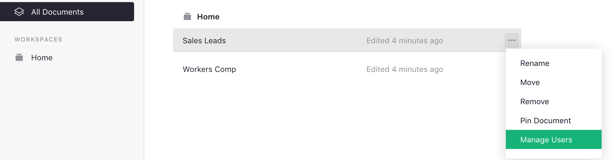
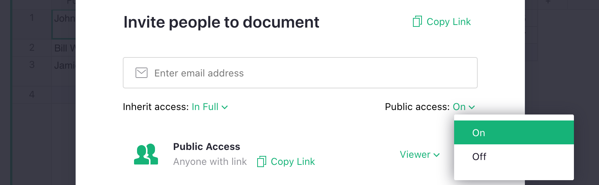
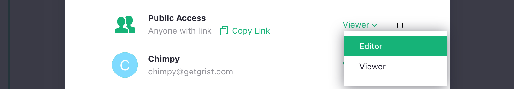

<iframe width="560" height="315" src="https://www.youtube.com/embed/vJpcC3-FHF8?rel=0" frameborder="0" allow="accelerometer; autoplay; encrypted-media; gyroscope; picture-in-picture" allowfullscreen></iframe>

## Sharing

To collaborate in Grist, you can invite other users to access a document. For team plans,
you can also add users to your team site, or to a workspace (see
[Team Sharing](team-sharing.md)).

When the document is open, click on the sharing icon
()
on the top right of the screen. It opens a menu with sharing and export
options. Select "Manage Users".

This option is also available in the Grist home page, when you click the three-dots icon to the right of a document's name.

If the "Manage Users" item is grayed out, it means you don't have permission to
view or manage the sharing settings for this document.

The sharing dialog that opens lists the users that have access to the
document. To add a user, enter that user's email address and hit "Enter" or click
"Invite new member" in the dropdown.

You may select a role for any invited user, and click "Confirm" to save the changes and send any invitations.

## Roles

There are three primary roles supported by Grist:

- **Viewer**: allows a user to view the document but not make any changes to
  it. Some operations like sorting and filtering will work without affecting
  other users of the document. This is the default role when you type in an email address.

- **Editor**: allows a user to view or make changes to the document data, structure, or formulas,
  but not to its sharing settings.

- **Owner**: gives a user complete permissions to the document, including to view and change its
  sharing settings. A document may have one or more owners. If you are able to open the
  "Manage Users" dialog, you have the "owner" role. You may not change your own
  access, but your access may be reduced or removed by another owner.

The option to inherit access does not affect individual plans, and is explained
in the [Team Sharing](team-sharing.md) article.

## Public access and link sharing

If you want to share your document with a wider audience, you can make it publicly accessible.
Open the share menu by clicking on the share icon 
() on top right of the
screen and selecting "Manage Users". Toggle the dropdown next to "Public Access" and select "On":

**

Once you click "confirm", anyone with the link to your document
will be able to view it. They will not be required to have a Grist login.

The "Copy Link" button is handy for link sharing. You can copy the link to the clipboard for
pasting into an email, tweet, or anywhere else.

You can also allow anyone with the link to edit your document. Simply 
switch the role for Public Access to Editor.

**

Note that this allows **anyone** with the link to change
**absolutely anything** in your document, including deleting all the 
data. Should anything go wrong, you may recover previous versions of your 
document in the snapshots section of
[Document History.](./automatic-backups.md#examining-backups)

!!! note "Sharing an Embedded Style View"
    Adding `?embed=true` or `?style=singlePage` to the end of a document's page URL renders the document without the toolbar on top, the page menu on the left or creator panel on the right. `?style=singlePage` can be edited and follows access rules, while `?embed=true` is read-only. To learn more about embedding, see [Embedding Grist](embedding.md)

[Access rules](access-rules.md) may be combined with view-only link sharing, 
i.e. when the Public Access role is set to "Viewer." Read more about 
[Link Keys](access-rules.md#link-keys) to learn how to set rules that
limit which parts of your data users may see when accessing your document
via a particular link.

Access Rules are supported with link sharing when Public Access
is set to "Viewer" or "Editor."

## Real-time user presence

When multiple people work in the same Grist document, changes appear in real time. You’ll also see
who else has the document open, shown as icons in the toolbar:

**
{: .screenshot-half }

For documents that are not shared publicly, users with the **owner** or **editor** role see the
presence of others (including viewers), while users with only the **viewer** role do not.

For a document that's [shared publicly](#public-access-and-link-sharing) (that is, made available
through link-sharing), Grist makes a distinction between _listed users_ (those shown in the
"Manage Users" dialog) and _public users_ (everyone else, whether signed in or not). For privacy
reasons, the display of user presence is subject to the following rules:

- **Listed owners and editors**: see the presence of others. Listed users appear with their names and
  emails, while public users appear as "Anonymous User", even if signed in.
- **Listed viewers**: do not see others' presence.
- **Public users**: do not see others' presence.

This means that you will be visible to others when you visit a document to which you have been
explicitly added, but not when you visit a document that you only have access to through
link-sharing.

## Comments

Comments in Grist allow you to collaborate directly on your data by attaching notes to specific cells in data tables. This makes it easy to ask questions, provide feedback, or share context right where the data lives. Note that only users with either 'Owner' or 'Editor' roles can leave comments, while 'Viewers' can only read comments.

To leave a comment, right-click on a cell then select 'Comment' from the dropdown menu.

**

You can tag another user in your comment by typing `@` followed by the user's name.

**
{: .screenshot-half }

Comments for a document can be viewed by clicking the 'Comments' icon at the upper-right of the page. This opens the panel on the right-hand side of the page. Click the three-dot icon at the top of the panel for filtering options.

**
{: .screenshot-half }

Email notifications for comments can be enabled under [Document Settings](document-settings.md#notifications).

## Suggestions

!!! warning "Note"
    Suggestions are experimental and have many limitations in their current form. They are also subject to change and withdrawal.

Previously, making changes to data in a Grist document was either in real time, or done by copying a document and replacing the original with the new version. If you enable suggestions, you can now manage collaborative changes with a workflow similar to [version control](https://en.wikipedia.org/wiki/Version_control){:target="\_blank"} in computer science. 

With suggestions enabled, users (signed-in or not) automatically open a copy of a document. They make edits to this copy without modifying the original, and then submit these suggestions to be reviewed by the [document Owner](#roles) prior to integration. This workflow can be useful in more sensitive contexts, or for crowdsourcing data easily with additional quality control. 

### Limitations

In their current experimental state, suggestions have the following limitations:

* They only track changes to data (not structure, views, widgets, formulas, or other metadata).
* They only work for documents **without** access rules.
* They only work for documents **without** forms.
* They need to be enabled on a per-document basis.

### Enabling suggestions

To enable suggestions, go to 'Document settings' and check the toggle 'Enable suggestions'. Once this is enabled, even users who don't have a Grist account, will be able to make suggestions. 

For added flexibility, document Owners and Editors can switch between editing and suggesting by clicking 'Suggest changes' in the 'Share' menu.

## Leaving a Document

Non-Owners may look up their access details to a document by clicking on the share icon 
() on top right of the
screen and selecting "Access Details."

From the access details pop up, you may click the trash icon to leave a document.

