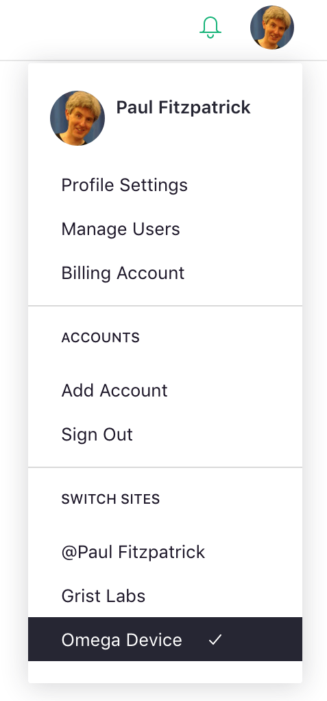
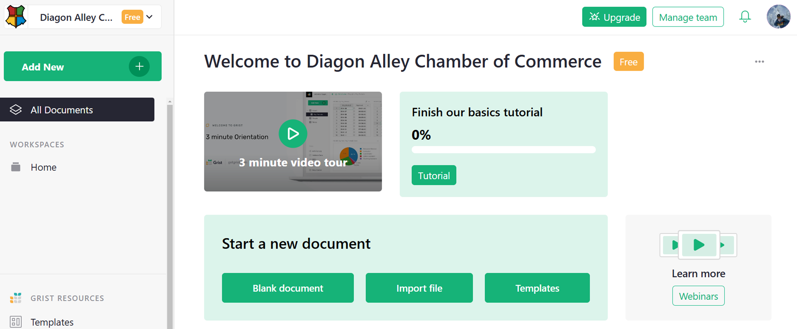
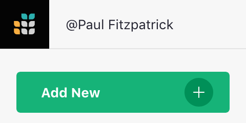
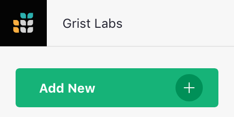
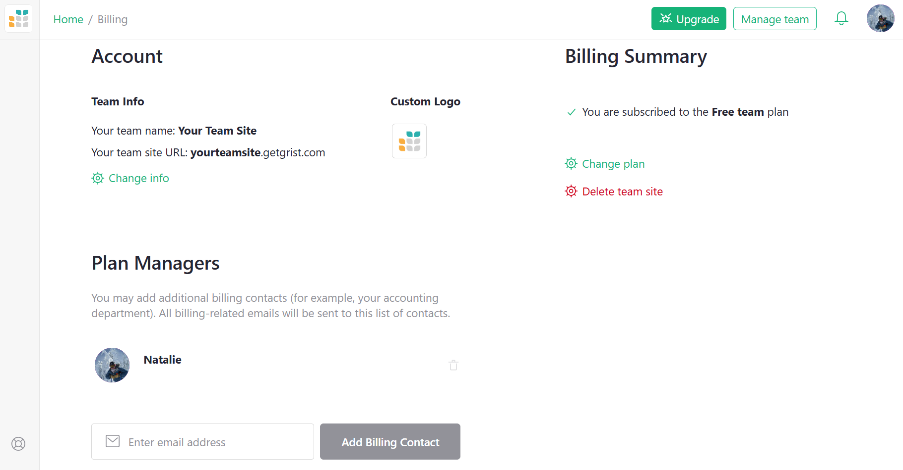

Teams
=========

Team sites are meant for regular collaboration by groups. They store documents at a subdomain of your choice such as `your-team.getgrist.com`. Team sites may be on a free or a paid plan.

The difference between the Free plan and paid plans is the document limits. Documents on a Free plan can have up to 5,000 rows, and include automatic backups for 30 days. While personal sites are only available with the Free plan, team sites may be upgraded to Pro or Business plans. On paid plans, the limits are much higher. See the [pricing page](https://www.getgrist.com/pricing) for more details.

If you have a team site but aren't seeing it, click in the top-left corner to open a drop-down menu of sites to which you have access.

**

Opening the user menu under your profile icon will also list all sites to which you have access.

**
{: .screenshot-half }

Not seeing your team site?  Try selecting the 'Add account' option in the user menu. It's possible the team site might be linked to a different email address.

A fresh team site will look something like this, ready to be filled with
Grist documents and shared with your team.

If a colleague has shared a team site with you, you'll see the same thing,
but depending on the [role](team-sharing.md#roles) they chose for you, some options may be inactive.  If you need those options,
ask your colleague to change your role.

For a team site in which you are an Owner or Editor,
you can [create documents](creating-doc.md) or [workspaces](workspaces.md). When your role is an
Owner, you can immediately start [sharing](team-sharing.md) the site with others.

## Understanding Personal Sites

Sites that begin with the '@' symbol are personal sites. All Grist accounts have a personal site.
Your personal site is named using your name, and is always available at <https://docs.getgrist.com>.
That’s also where you will find personal documents shared with you by others. Each document in a personal site may be [shared](sharing.md) with up to 2 Guests for free.

**
<em class="caption">a personal site</em>
{: .screenshot-half }

**
<em class="caption">a team site</em>
{: .screenshot-half }

## Billing Account

If you created a team site on the Pro or Business plan, or were added to it as a Billing Manager, then you may manage billing information, and edit your team site's name and subdomain from the billing account page. Open the [user menu](glossary.md#user-menu) and click on 'Billing Account' to open a menu that looks like this.

**

Click on the top 'Change' icon to edit your team site name or subdomain. Note, if you change the
subdomain, then any links pointing to your site or documents within your site will need updating.

Team sites can be deleted from the 'Billing Summary' page by clicking 'Delete team site'. Please note that this action cannot be undone and this will remove your site including all documents. Be sure you have created a backup of important data beforehand.
