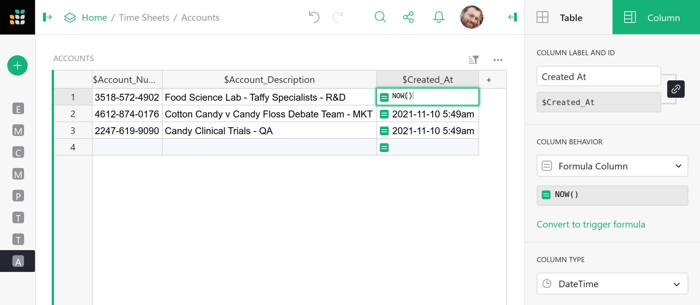
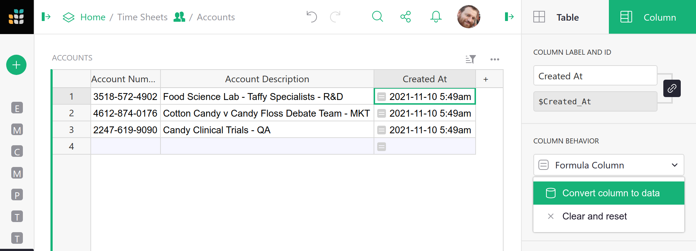
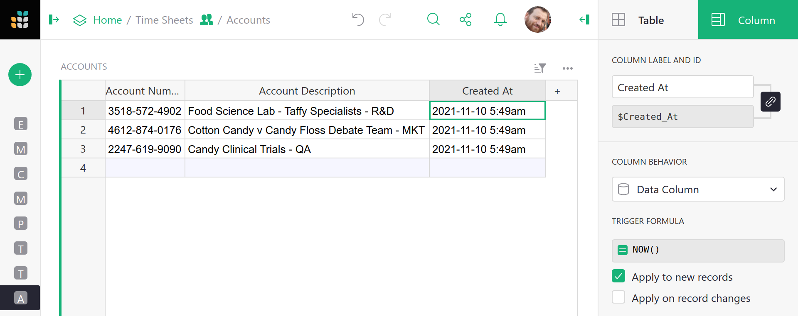
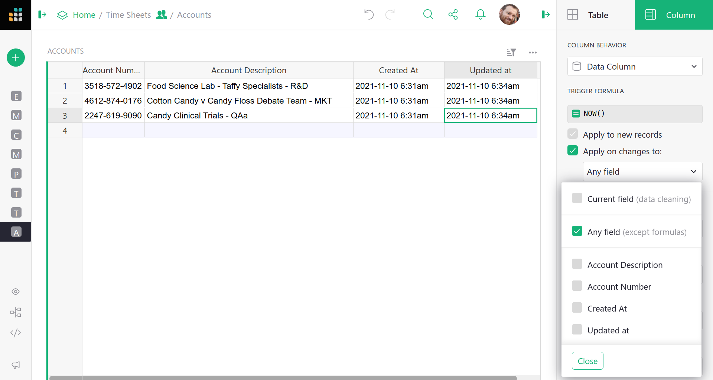
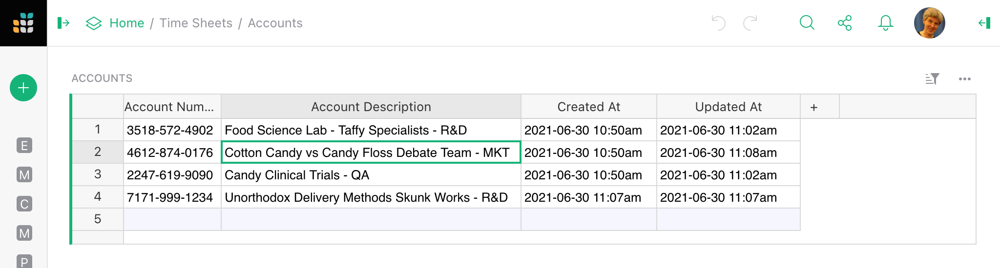

Timestamp columns
===================

Sometimes it is useful to have columns that store when individual records were created
and updated.  This is useful later, for example to sort records by age or freshness.
Grist lets you create such columns easily.

## A "Created At" column

Suppose we want a column that stores when a record was created.
As a first step, add a column called (for example) `Created At` and enter `NOW()`{: .formula} as
its formula.
Set the column type to `DateTime` (see [Making a date/time column](dates.md#making-a-datetime-column))
and choose how you'd like the time and date to be shown.

What we'd like is for the `Created At` value to stay unchanged once set, and to
be calculated only when a record is created.  To make the values stay unchanged
once set, we need to change column behavior from a `Formula Column` to a `Data Column`.
Click on the `Column behavior` drop-down menu, and choose `Convert column to data`:

Now, to calculate values when a record is created, select `Apply to new records`.
And we're done! All new records will have `Created At` set with `NOW()`{: .formula} at the
moment of their creation.

## An "Updated At" column

If we want a column that stores when a record is updated (as opposed to created),
the procedure is similar to that for [a "Created At" column](timestamps.md#a-created-at-column),
but instead of `Apply to new records`,
select `Apply on record changes`.  Then select `Any field` (assuming you want any
change in a record to count as an update) and press `OK`.  You can alternatively
pick and choose which columns to "count" as updates and which to ignore.

!!! note "It is still possible for a user to manually edit cells in the `Created At` and `Updated At` columns. If you don't want that to be allowed, use [access rules](access-rules.md) to forbid it."

Here is an example of the new columns at work. One new record was added, for
`Unorthodox Delivery Methods`, and a created and updated time were set for it
automatically.   Then the description of `Cotton Candy vs Candy Floss` was updated,
and the updated time for that record was set automatically.
It would also be straightforward to add [Created By](authorship.md#a-created-by-column)
and [Updated By](authorship.md#a-created-by-column) columns.

Making the `Created At` and `Updated At` columns as we did here filled them for all
pre-existing rows with the current date and time.  If you'd
rather these be left blank, simply do the `Convert to data column` step before setting a
formula, and then set the formula in the `Optional Formula` area.

