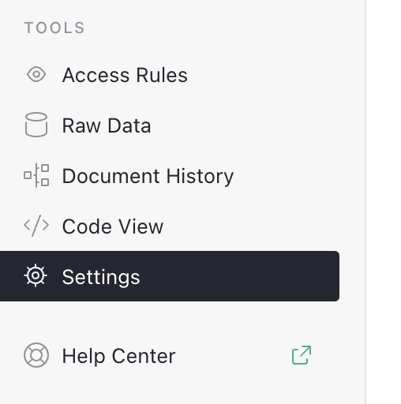
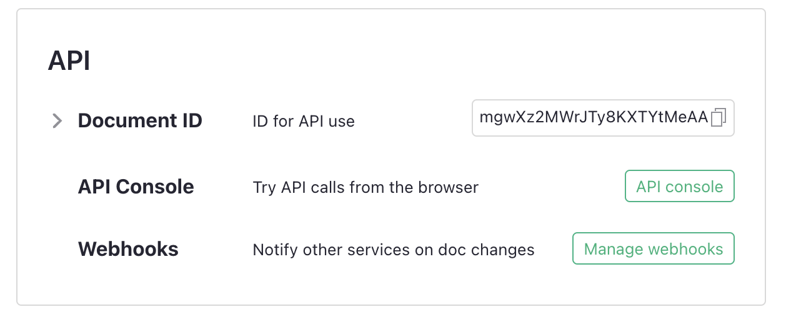

---
description: How to configure webhooks for some external integrations
---

# Webhooks
Webhooks enable you to notify external services whenever rows are
added to a table or if existing rows are modified.

You can configure webhooks from the 'Document Settings' page. Click 'Settings' under the 'Tools' menu found at the bottom of the left-hand navigation panel while viewing a document.

<span class="screenshot-large">**</span>
{: .screenshot-half }

Under the 'API' section of 'Document Settings', click on the
'Manage Webhooks' button.

<span class="screenshot-large">**</span>
{: .screenshot-half }

This will enable you to define webhooks for your document, where each
card in this settings page represents a webhook for your
document.


{: .screenshot-half }

## Configuration

Each webhook has several fields. Some fields are defined by the user,
and other fields are read-only and used to record information about
the processing of the webhook. Not all fields are required.

* **Name**: A short, descriptive name given to the webhook.
* **Memo** (optional): A longer description of the webhook's purpose.
* **Event types**: Whether adding or modifying
  rows triggers a webhook.
* **Table**: The table that will trigger this webhook.
* **Filter for changes in these columns** (optional): A semicolon-separated list of
  column IDs. If an existing row is edited, the webhook will trigger
  only if one of the filtered columns was changed, _and_ if the
  webhook is configured to trigger on modification. If a webhook
  triggers when adding a row, it does not matter which columns are defined
  when the new row is added.
* **Ready column** (optional): A boolean, or [Toggle](col-types.md#toggle-columns), column on the table that
  determines if the row should trigger the webhook or not. When the
  column becomes true, the corresponding row will trigger the webhook.
* **URL**: The remote URL of the service that the webhook will notify
  of added or changed rows. When self-hosting, only external services
  listed by the [`ALLOWED_WEBHOOK_DOMAINS` environment variable](
  https://github.com/gristlabs/grist-core?tab=readme-ov-file#environment-variables)
  are allowed. Note that there are security concerns with allowing any domain, as
  internal Grist services may become vulnerable to manipulation.
* **Header Authorization** (optional): Credentials to be supplied to
  the webhook endpoint in the `Authorization` HTTP header. Not all
  endpoints require credentials. This is a static string. A common
  usage of this field is to provide an API token as required by the
  webhook's URL.
* **Enabled**: Whether the webhook should monitor its configured table
  for changes or not. If the webhook is disabled, no changes to its
  table will trigger it.

The following fields are informational and read-only:

* **Webhook id**: An automatic, internally-generated unique ID for
  the webhook.
* **Status**: A JSON object that summarises the current status of the
  webhook, as well as the results regarding the number of times it has
  been invoked. This includes any potential error messages or statuses
  the webhook may have received when attempting to send a payload to
  the remote address.

## Security

In untrusted [self-hosted environments](self-managed.md), the internal
Grist endpoints can be exposed if any user is allowed to create
documents and configure webhooks. There are two ways to mitigate this
risk:

1. Use the [`ALLOWED_WEBHOOK_DOMAINS` environment
   variable](https://github.com/gristlabs/grist-core?tab=readme-ov-file#environment-variables)
   to list the allowed domains that webhooks can use.

2. Use the [`GRIST_HTTPS_PROXY` environment
   variable](https://github.com/gristlabs/grist-core?tab=readme-ov-file#environment-variables)
   to restrict webhook invocations to go through that proxy, along
   with setting `ALLOWED_WEBHOOK_DOMAINS=*`. In this way, all domains
   are allowed, but the webhooks will send requests through the
   configured proxy, thus safeguarding your internal Grist endpoints.
   This is the configuration that Grist Labs uses in our cloud-hosted
   environment.

In a trusted environment where malicious users are not expected to
exist, setting `ALLOWED_WEBHOOK_DOMAINS=*` alone may be sufficient
without needing to configure a proxy.

## Payloads

When a webhook is triggered, the rows that matched the webhook's
conditions will generate a JSON array as the webhook's payload. Here
is an example payload.

```json
[
  {
    "id": 29,
    "manualSort": 29,
    "Title": "Trophy",
    "URL": "https://example.com/buy/Trophy",
    "Price": 60,
    "Purchase_status": "wishlisted",
    "Currency": "USD",
    "Play_status": "Not started",
    "Box_art": null,
    "Price_CAD_": 82.362
  },
  {
    "id": 24,
    "manualSort": 24,
    "Title": "Dataman",
    "URL": "https://example.com/buy/Dataman",
    "Price": 50,
    "Purchase_status": "own digitally",
    "Currency": "EUR",
    "Play_status": "Finished",
    "Box_art": null,
    "Price_CAD_": 74.71
  }
]
```

Multiple rows can simultaneously trigger the same webhook. In that
case, those rows will be sent together in the same payload. The 'Ready
Column' in the webhook's configuration can be useful for gating which
rows should be sent together.

## Error conditions

If a webhook fails to deliver its payload to the specified URL, it
will keep retrying periodically. The 'Status' column in the webhook
configuration can be useful for diagnosing any such problems, or to
verify that the payloads were delivered successfully.

### Webhook queue

Webhook payloads are delivered according to a batched queue. Attempts
to reach an endpoint are removed from the queue when a successful
delivery happens. In case there is a problem with the webhook
configuration, it can be helpful to purge the webhook's queue. The
'Clear Queue' button in the webhook's configuration page will remove any
pending invocations of the webhook and discard the associated
payloads.
