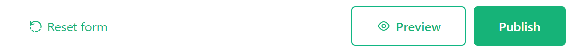

# Page widget: Form

The form widget allows you to collect data in a form view which populates your Grist data table upon submission.

**
{: .screenshot-half }

## Setting up your data

Create a table containing the columns of data you wish to populate via form.

**

## Creating your form

Add a form widget from the "Add New" menu. Select the data table you wish to populate with form data. 

**
{: .screenshot-half }

Then, customize the form to your heart's desire!

By default, the form view will include elements for headers and descriptions as well as all columns (fields) from the underlying data table. 

**

## Adding elements

To add additional form elements, click the + icon at the bottom of the form. From the menu, you can add the following elements:

1. **New Question:** Select a column type to create a new field. "••• More >" will open an expanded menu listing all column types. Adding a new question will add a new column to the underlying data table. This new column is hidden by default in existing table widgets within your document.
2. **Unmapped Fields:** Lists any hidden fields from the underlying data table.
3. **Building Blocks:** Customize further by adding these additional elements!

**

You can remove any element from the form by hovering over the object and clicking the trash icon to delete. You can hide any uneccessary fields from the form by hovering over the object and clicking the x icon.

**

## Configuring fields

You can provide alternative titles for your form fields, rather than use the same column name from the underlying data table. For example, on our form, we have a toggle that is titled "May we contact you?". In the data table, this column is labeled "Ok to Contact?". Field titles can be configured under the "Field" tab of the creator panel.

**

The types of form fields correspond to Grist [column types](col-types.md#specifying-a-type), but
forms offer different options for some types. For example, Choice and Reference types allow
choosing between "Select" (or dropdown) and "Radio" formats, while Choice List columns are shown as
checkboxes.

All fields also support several options or rules:

**
{: .screenshot-half }

#### Required field

Makes the field required. If a user attempts to submit a form without filling in the required field, they will get an alert to fill out the field.

  **
  {: .screenshot-half }

#### Hidden field

This field will not be shown to users. This is often useful in combination with the next option
("Accept value from URL"), or may be used to hide a field temporarily without losing its
configuration.

#### Accept value from URL

Allow the default value for this field to be taken from the URL. To
construct prefilled URLs, add
[URL parameters](https://developer.mozilla.org/en-US/docs/Learn_web_development/Howto/Web_mechanics/What_is_a_URL#parameters)
to the URL in the form `COLUMN_ID=VALUE`, where `COLUMN_ID` is the one shown under the checkbox, and
`VALUE` is the value you'd like to prefill.

Parameters are separated from the form URL by `?`, and from each other by `&`. If your values
include special characeters, they should be
[encoded](https://developer.mozilla.org/en-US/docs/Glossary/Percent-encoding).
Space may be encoded as `+`.

Example: <code>https://public.getgrist.com/forms/n2x1dCRpqF14ymCQqpkCS7/4?**Company_Name**=Grist+Labs&**Role**=Reviewer</code>

For Choice List and Reference List types, you may
include the same column ID multiple times to set multiple checkboxes by default.

Example: <code>...?**Interest**=newsletter&**Interest**=surveys</code>.

## Other building blocks

Header and Paragraph building blocks can be edited either directly in the block or from the creator panel. In the creator panel, you have text alignment options available.

**

For additional formatting, both elements allow the use of Markdown formatting. For help on Markdown formatting, check out the [Markdown Guide](https://www.markdownguide.org/basic-syntax/).

**

!!! note "HTML Formatting"
    HTML tags can be used in Markdown-formatted text. Be sure to separate block-level HTML elements like `
` and `
` from other elements using blank lines.

## Submission options

You also have the option to configure different settings for the "Submit" button. You can change the button label, update the success text which appears after a form is submitted and choose to allow multiple form submissions. You also have the option to select a specific URL to redirect to following submission.

These options are all available under the "Form" tab and "Submission" subtab of the creator panel.

**
{: .screenshot-half }

## Publishing your form

Once you have finished customizing your form, you have the option to preview your form, prior to publishing.

**

Previewing will allow you to see what your form will look like to end users, without making it available for use.

After you have confirmed everything is as you wish, you can publish your form. Note that only users with "OWNER" access have permission to publish a form.

The first time you publish a form, the following informational popup will appear, explaining the permissions a published form grants.

**

Once a form has been published, a button will appear to copy the link to the form. Share this link with end users to fill out your form! You also have the option to unpublish your form. Note that unpublishing the form will disable the share link. Users accessing the form via that link would then see an error.

**

## Form submissions

After sharing the link to your published form, end users can submit data to your Grist document via the form.

**

All submitted data will appear in your underlying data table in your Grist document! Collecting data has never been so easy. 😍

**
