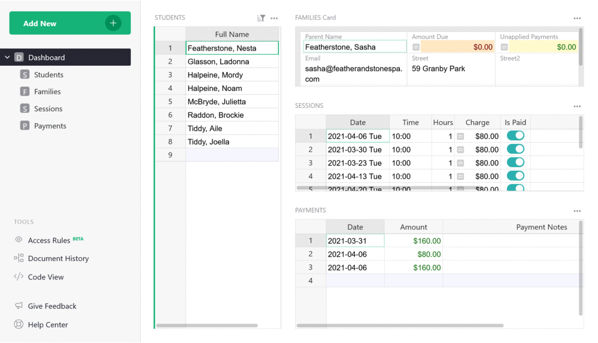
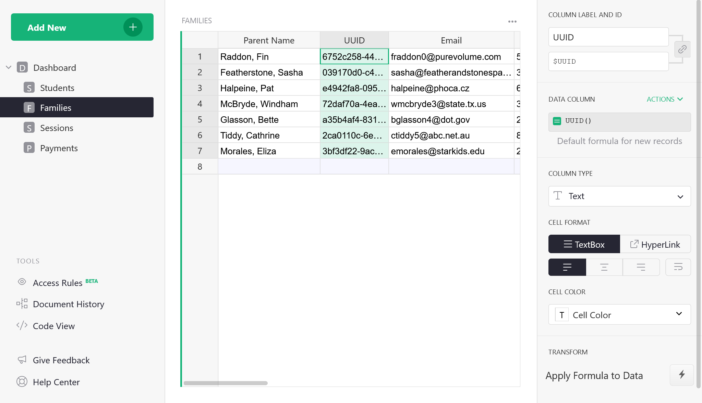
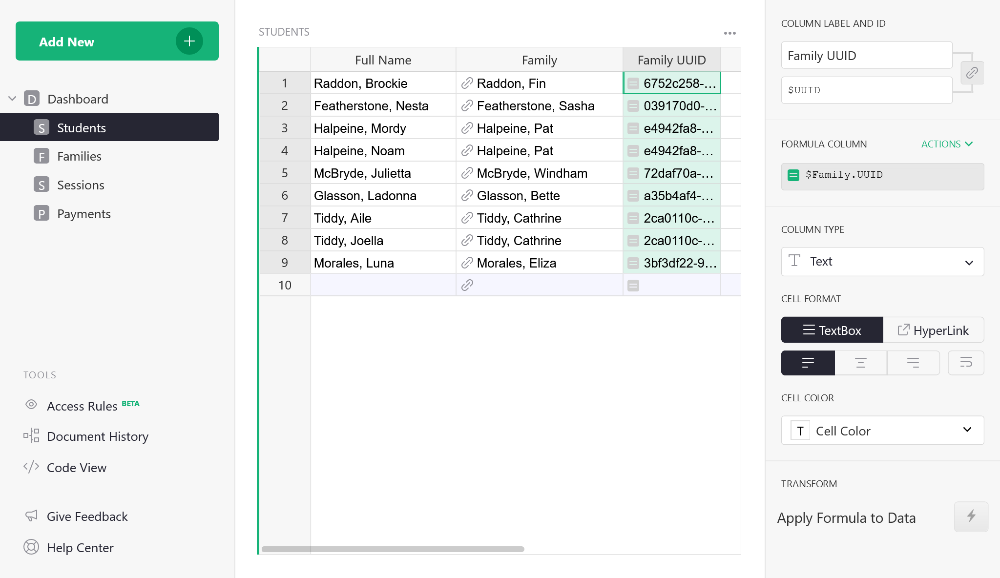
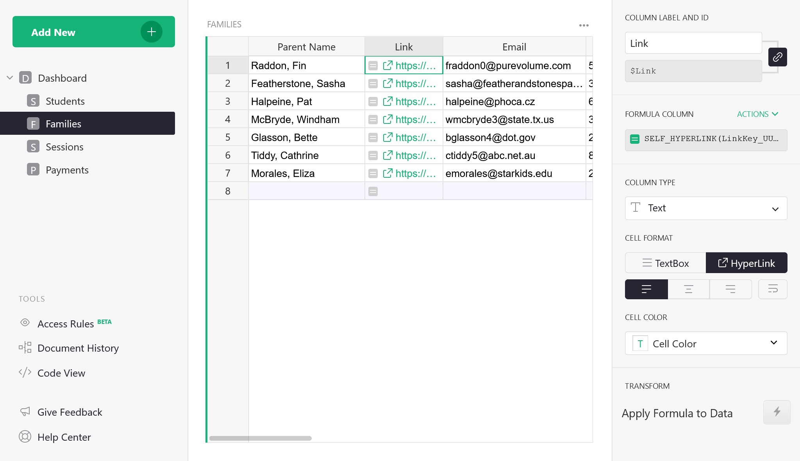

# Creating Unique Link Keys in 4 Steps

In Grist, “link keys” are URL parameters that when combined with the `user.LinkKey` variable in
access rules will determine which data a link recipient is permitted to view.

You can learn to do this in four easy steps.
[We’ve created a simple template](https://public.getgrist.com/cBRGq2QKzTSC/Private-Tutor-LinkKey-Tutorial)
you can copy and edit as you follow along with this guide.

In our example, you are a private tutor who uses Grist to track hours, payments, and client data.
You would like to share session and payment history with parents via a link that only shows their
family's data. A simple way to do that would be to set access rules that limit a link recipient’s
view to just those records tied to their family.

Let's do that now.

*The private tutor can see all data, but a parent can only see their family's data.*
{: .wide-img-caption}

## Step 1: Create a unique identifier

In the family’s table, create a new column in which you will use Grist’s
[`UUID()`](../functions.md#uuid) function to generate and assign a unique key to
each family. Convert the column to the data column to freeze its values, and set the default
formula for new records to `UUID()`. This will ensure that new rows will also be assigned a unique
identifier.

## Step 2: Connect UUID to records in other tables

In the Students, Sessions, and Payments tables, add a column that ties each record to the
referenced family's UUID. Not sure how this works? Brush up on Grist's powerful [reference
columns](../col-refs.md#top).

**Hint:** Try using the formula `$Family.UUID`{: .formula} to get the UUID from the record
that is referenced in the Family column.
{: .wide-img-caption}

## Step 3: Create unique links

In the Families table, create a new column in which you will use Grist’s
[`SELF_HYPERLINK()`](../functions.md#self_hyperlink) function to generate hyperlinks.  Use the
formula `SELF_HYPERLINK(LinkKey_UUID=$UUID)`{: .formula}
to create a link key called "UUID" that sets the URL parameter to a specific `$UUID` within a record.
Convert the column type to Text > Hyperlink.

**How does this work?** The link generated for "Raddon, Fin" is
`.../Private-Tutor-recUUID/p/9?UUID=6752c258-443d-4a2c-800d-1491da265b72`. The “link key” is the
part of the URL that reads `?UUID_=6752c258-443d-4a2c-800d-1491da265b72`.

## Step 4: Create access rules

Use the variable `user.LinkKey` to set a rule for each table that matches the user's URL "link key" to the UUID data within a record.

You did it! This is just the beginning. There's a lot more you can do with link keys. Check out
[another example](../access-rules.md#link-keys) to deepen your
understanding of link keys even more.

**Still need help?** Contact us at <support@getgrist.com>.
