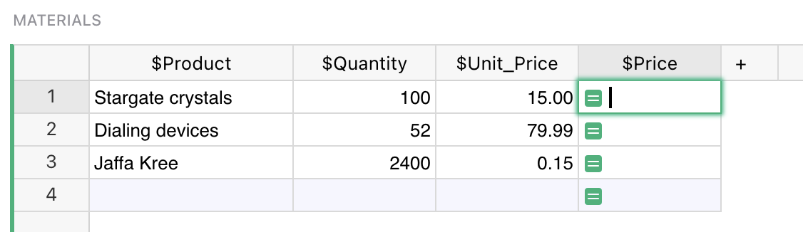
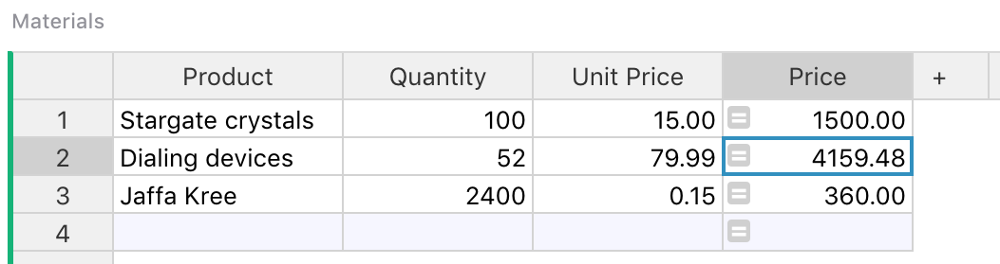
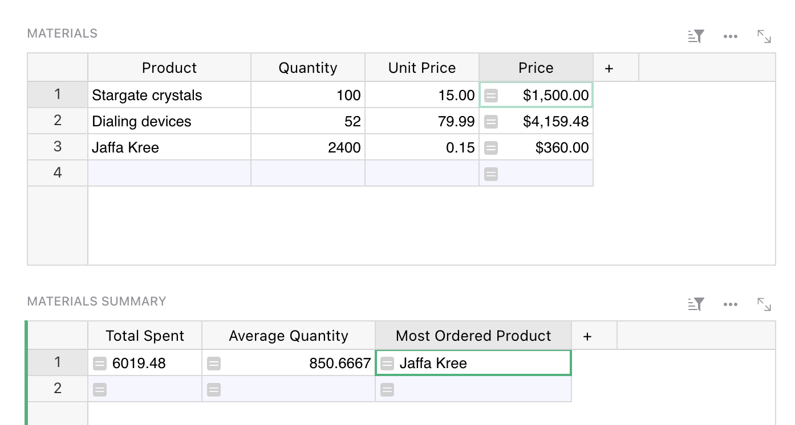
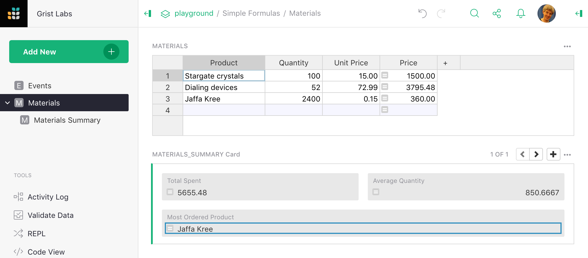
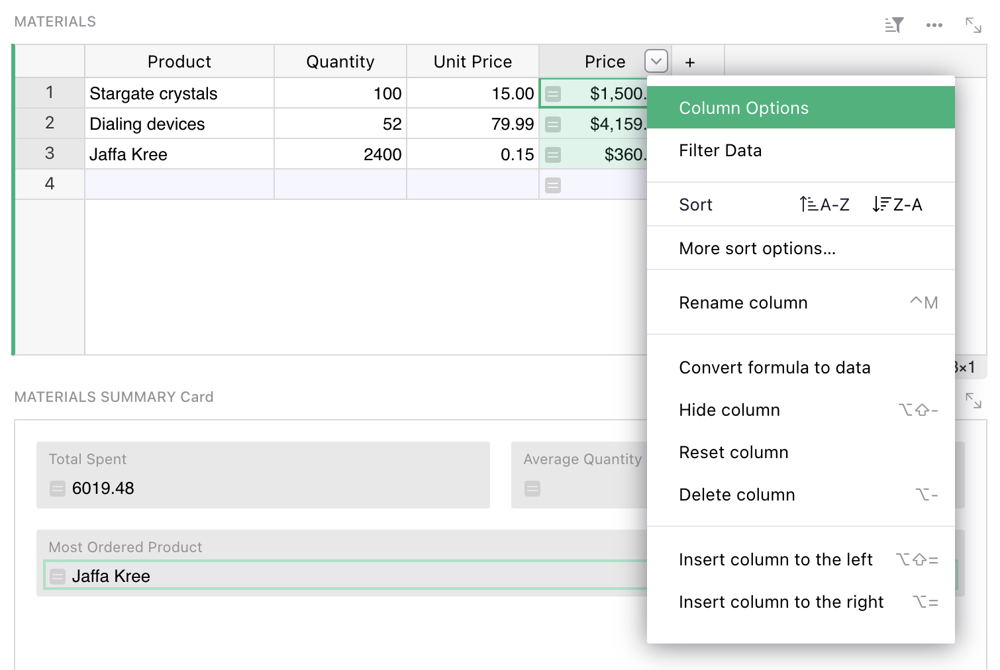
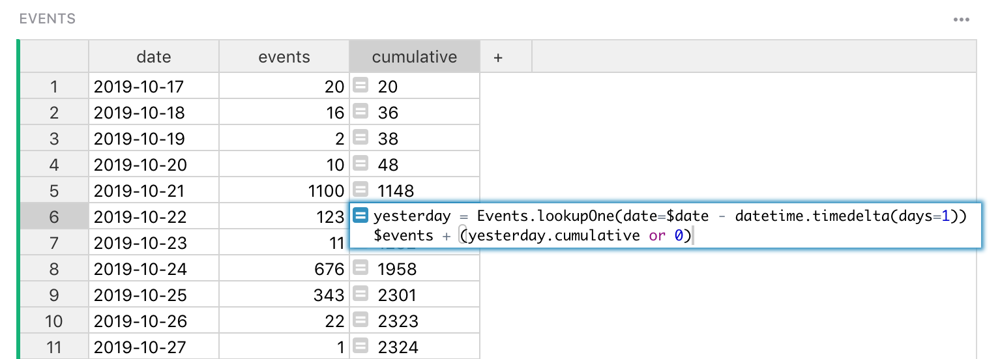

Formulas
=========

Grist has a powerful data engine to help you fill in the cells of your
tables, using formulas.  If you've used spreadsheets before, or
database expressions, you'll be on familiar territory - but there are
some wrinkles you'll want to know about, so hang around.

Let's start with a classic use of spreadsheets.  Suppose you have
a list of products you've ordered, the quantity you ordered,
and the unit price of each.  You've made a column to show
the quantity times the unit price, but want the computer to do
that part for you.


Just select a cell in the column you want to fill, and hit "=" to
tell Grist you want to enter a formula, rather than a value.



Did you notice, when you did that, the labels of the columns changed
a little?  "Product" became "$Product", and "Unit Price"
became "$Unit\_Price".  This is Grist telling you how to
refer to those columns in your formula.  Just type "$Product * $Unit\_Price".
You'll find an auto-complete feature ready to help you.
Or if you don't like typing, click on the Product column, type the
multiplication symbol, and then click on the Unit Price column.
Your formula should look like this:


Now press enter, and your formula is applied to all cells in the
column.



Grist formulas are written in Python, the most popular language for data science.
The entirety of [Python's  standard library](https://docs.python.org/2/library/) is available
to you.  For those with a spreadsheet background, we've also added a suite of Excel-like
functions.  Here's the [full list of functions](functions.md).

If you've worked with spreadsheets before, you may be surprised
that you don't need to specify row numbers, like `B1 * C1`.
In Grist, a single formula applies to a whole column.
You don't have to worry about filling it in for all rows,
and can refer to values in the same row without fuss.

Formulas that operate over many rows
-----------------------------------------

If you are a spreadsheet user, you may find yourself wanting to have
some special rows at the end of your table that have formulas
different to the rest.  In Grist, we'd like you to consider adding a
widget to your page instead.  For common use cases, [Summary
tables](summary-table.md) may be exactly what you need.  Or if you
want to set things up yourself, you can add an extra table widget like
this (see [Page widgets](page-widgets.md) for details):



This is just another table, giving us a place to put formulas outside
of the structure of the Materials table.  For example, if we wanted
to count how many products there are in that table, we could use this
formula:

```py
len(Materials.all)
```

Every table in your document is available by its name in formulas,
as a [UserTable](functions.md#usertable).  This formula uses
the [all](functions.md#all) method to access the rows of the table, but
doesn't do anything with them but count them.

Here's a formula to compute the average price, using the Excel-like function
[AVERAGE](functions.md#average):

```py
AVERAGE(Materials.all.Price)
```

The [all](functions.md#all) method returns a [RecordSet](functions.md#recordset),
which supports iterating over individual columns this way.  Equivalently,
we could use a Python [list comprehension](https://docs.python.org/2/tutorial/datastructures.html#list-comprehensions):

```py
AVERAGE(material.Price for material in Materials.all)
```

If you are not familiar with Python, it is worth following
a tutorial.  There are thousands online, including this
[official one](https://docs.python.org/2/tutorial/index.html).
Python will be useful to you for all sorts of data work, not just Grist.

List comprehension is useful once we're doing anything nuanced.  For example,
here's a formula to list the names of products with a quantity greater than 80:

```py
[m.Product for m in Materials.all if m.Quantity > 80]
```

This is a list comprehension, but now with a conditional.  The result is a list,
which is rendered as text in a cell.

Python can help in other ways in your search for rows.  For example, here's a formula
to find the name of the product with the highest quantity:

```py
max(Materials.all, key=lambda m: m.Quantity).Product
```

Formulas are case-sensitive, with Excel-like functions being all-caps (`MAX`), and
regular Python generally all lowercase (`max`).

For exact matches, there is a shortcut to avoid iteration called
[lookupRecords](functions.md#lookuprecords), or
[lookupOne](functions.md#lookupone) for single matches.
Just pass the the values of columns you require to be matched.
For example, here is a formula to look up the product name of a material
with a quantity of 52:

```py
Materials.lookupOne(Quantity=52).Product
```

For very large tables, it is wise to use lookups as much as you can, rather
than iterating through rows.

Returning to our example document, you can now see how we calculated the
`Total Spent`, `Average Quantity`, and `Most Ordered Product` columns:

Column | Formula
--- | ---
Total Spent | `SUM(Materials.all.Price)`
Average Quantity | `AVERAGE(Materials.all.Quantity)`
Most Ordered Product | `max(Materials.all, key=lambda m: m.Quantity).Product`

Separating out calculations like this from the body of your data
can take some getting used to, but working this way can help
keep your document more organized.  And it brings other advantages.
For example we could switch the formatting of the summary widget
via the side-bar:



If you really want to have a column change its behavior on different rows,
you can just use a conditional.  For example, here is a replacement for
the `Materials.Price` formula that shows a total on a row where the
product name is not set:

```
if $Product:
  return $Quantity * $Unit_Price
else:
  return SUM(m.Price for m in Materials.all if m.Product)
```

Notice that the sum is limited to rows that have the product name set -
otherwise the calculation would include itself in the sum and blow up
(Grist would warn you about a "cyclic dependency").

Code viewer
-------------

Once you have a lot of formulas, or if you have been invited to a document
and want to get an overview of its formulas, there is a code viewer
available with a pure Python summary of the document.


Special values available in formulas
--------------------------------

For those familiar with Python, here are the extra values available to
you in Grist:

 * `rec` is the current row.  The `$column` syntax is shorthand for
   `rec.column`.  The `rec` variable is of type [Record](functions.md#record).
 * `table` is the current table, and is of type [UserTable](functions.md#usertable).
 * Tables in your document are available by their name, and are also of
   type [UserTable](functions.md#usertable).
 * Many extra spreadsheet functions are available, see the full
   [function list](functions.md).

If your table or column has a space in its name, or other characters
that are awkward in Python, those characters are replaced with an
underscore.  Auto-complete may help you if you're not sure.  You
can also control the "ids" of columns and tables in the right side-bar.

Freeze a formula column
--------------------------

If you'd like to save the output of your formula as plain values, you can simply turn off the
formula.  First open the column options in the side-bar:




Now click on the orange formula icon in the side-bar to turn it off:  ➔ :


Notice that there is no ``=`` sign in the column cells any more, showing that it
is no longer a formula.  The cells will no longer change if other cells they used
to depend on change.

You don't lose your formula by turning it off. The formula itself remains and you can
turn it back on. If you modified the values in the column, however, they will be
recalculated by the formula. You can always undo to revert back to the previous state.

The side-bar has lots of other handy settings, such as cell formatting
(number of digits after decimal point, color, etc).  The options apply
just as much to formula columns as to regular columns.

Recursion
----------

Lookups are handy for recursive formulas.  Suppose we have a table counting how many
events we have per day, and want to add a cumulative sum of those event counts.
One way to do that is with a formula like this:

```py
yesterday = Events.lookupOne(date=$date - datetime.timedelta(days=1))
$events + (yesterday.cumulative or 0)
```





For clarity, we've split this formula into two lines.  The first line
makes a variable pointing to the row of the day before.  The second
line computes the value we want in the cell.  Python note: the value
of the last line is automatically returned (you could prefix it with
`return` if you like).

Notice the `yesterday.cumulative or 0` - for the earliest row in the
table, there will be no yesterday.  In this case, `lookupOne` returns
a special empty record, for which `yesterday.cumulative` will be
`None`.

If you'd like to simplify this formula, or find yourself using the
same lookup in multiple formulas, it would be worth making
`yesterday` a [reference column](col-refs.md).  Simply add
a reference column, and give a formula for it that matches how
we defined `yesterday` here.

To actually enter this formula in a cell, you'd use ``Shift+Enter``
to divide the lines.  For longer formulas, you may prefer to use
the side-bar, where a simple ``Enter`` gives you a new line.
Click on the column header, select "Column Options" and edit the
Formula field.

