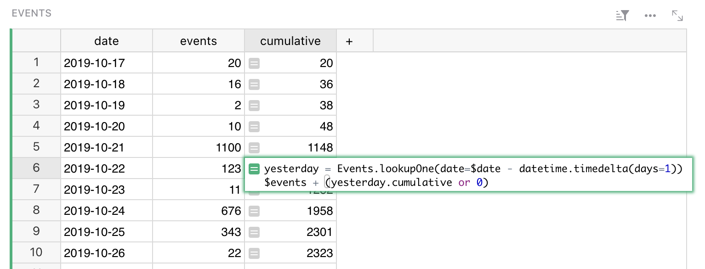
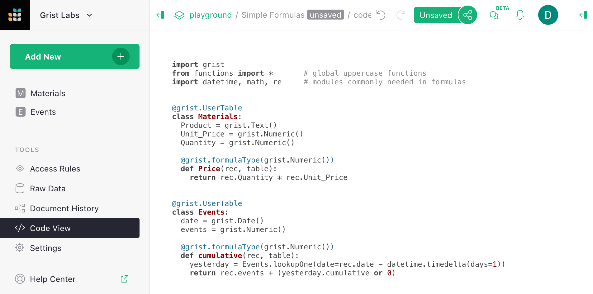
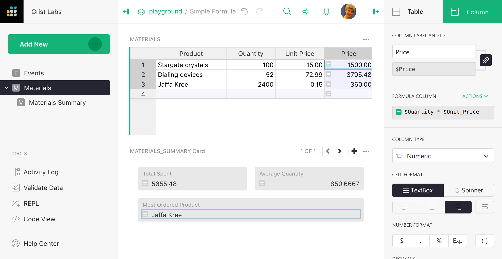
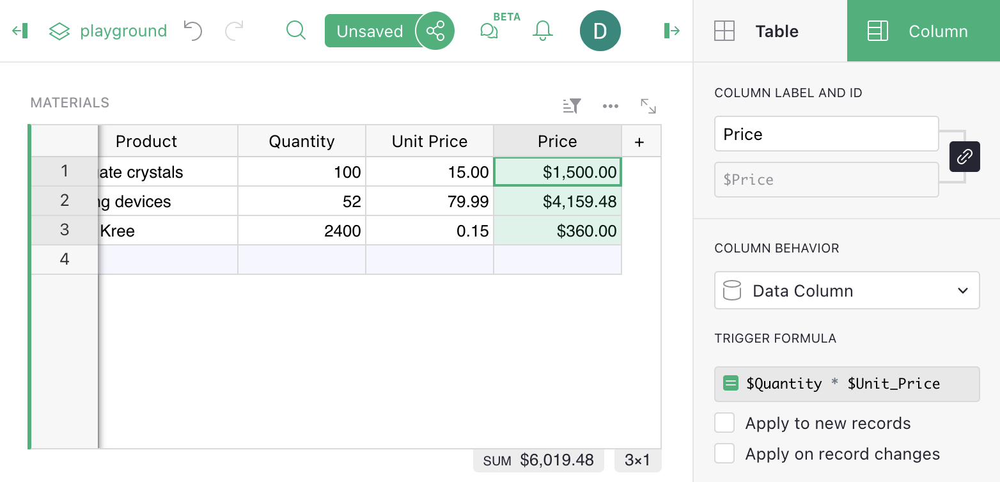

Formulas
=========

Grist has a powerful data engine to help you fill in the cells of your
tables, using formulas.  If you've used spreadsheets before, or
database expressions, you'll be on familiar territory - but there are
some wrinkles you'll want to know about, so hang around.

Let's start with a classic use of spreadsheets.  Suppose you have
a list of products you've ordered, the quantity you ordered,
and the unit price of each.  You've made a column to show
the quantity times the unit price, but want the computer to do
that part for you.


Just select a cell in the column you want to fill, and hit "=" to
tell Grist you want to enter a formula, rather than a value.


Did you notice, when you did that, the labels of the columns changed
a little?  "Product" became "$Product", and "Unit Price"
became "$Unit\_Price".  This is Grist telling you how to
refer to those columns in your formula.  Just type "$Product * $Unit\_Price".
You'll find an auto-complete feature ready to help you.
Or if you don't like typing, click on the Product column, type the
multiplication symbol, and then click on the Unit Price column.
Your formula should look like this:


Now press enter, and your formula is applied to all cells in the
column.


If you've worked with spreadsheets before, you may be surprised
that you don't need to specify row numbers, like `B1 * C1`.
In Grist, a single formula applies to a whole column.
You don't have to worry about filling it in for all rows,
and can refer to values in the same row without fuss.

Grist formulas are written in Python, the most popular language for data science.
The entirety of [Python's  standard library](https://docs.python.org/2/library/) is available
to you.  For those with a spreadsheet background, we've also added a suite of Excel-like
functions.  Here's the [full list of functions](functions.md).

Referring to tables and rows
--------------------------------

Every table in your document is available by its name in formulas.

For example, we could make a second table, and refer to `Materials` from
the [earlier example](formulas.md) as follows.

Here's a formula to count how many rows there are in the Materials table,
using the [all](functions.md#all) method.

```py
len(Materials.all)
```

Here's a formula to compute the average price, mixing the Excel-like function
[AVERAGE](functions.md#average) with a Python [list comprehension](https://docs.python.org/2/tutorial/datastructures.html#list-comprehensions):

```py
AVERAGE(material.Price for material in Materials.all)
```

Here's a formula to list the names of products with a quantity greater than 80:

```py
[m.Product for m in Materials.all if m.Quantity > 80]
```

For exact matches, there is a shortcut called [lookupRecords](functions.md#lookuprecords),
or [lookupOne](functions.md#lookupone) for a single match.  Here is a formula to look up the
product name of a material with a quantity of 52:

```py
Materials.lookupOne(Quantity=52).Product
```

If your table has a space in its name, or other characters that are awkward in Python,
replace those characters with an underscore.  Auto-complete may help you if you're not
sure.

Lookups are handy for recursive formulas.  Suppose we have a table counting how many
events we have per day, and want to add a cumulative sum of those event counts.
One way to do that is with a formula like this:

```py
yesterday = Events.lookupOne(date=$date - datetime.timedelta(days=1))
$events + (yesterday.cumulative or 0)
```





For clarity, we've split this formula into two lines.  The first line
makes a variable pointing to the row of the day before.  The second
line computes the value we want in the cell.  Python note: the value
of the last line is automatically returned (you could prefix it with
`return` if you like).

Notice the `yesterday.cumulative or 0` - for the earliest row in the
table, there will be no yesterday.  In this case, `lookupOne` returns
a special empty record, for which `yesterday.cumulative` will be
`None`.

If you'd like to simplify this formula, or find yourself using the
same lookup in multiple formulas, it would be worth making
`yesterday` a [reference column](col-refs.md).  Simply add
a reference column, and give a formula for it that matches how
we defined `yesterday` here.

To actually enter this formula in a cell, you'd use ``Shift+Enter``
to divide the lines.  For longer formulas, you may prefer to use
the side-bar, where a simple ``Enter`` gives you a new line.
Click on the column header, select "Column Options" and edit the
Formula field.

Once you have a lot of formulas, or if you have been invited to a document
and want to get an overview of its formulas, there is a code viewer
available with a pure Python summary of the document.



Where to put sums and averages and whatnot
------------------------------------------------

Often you'll want to produce summary information from a table.  Grist
can do a lot of that for you with [Summary tables](summary-table.md).
But you may well have something custom in mind, and that's why you are
reading up on formulas.  If you are a spreadsheet user, you may find
yourself wanting to have some special rows at the end of your table
that have formulas different to the rest.  In Grist, we'd like you to
consider adding a widget to your page instead.

For example, suppose we want to compute our total spend, average
order quantity, and other bits and pieces.  We can add an extra table
widget like this (see [Page widgets](page-widgets.md) for details):


Here are the formulas used.  Just as an example, we use some Excel-like
functions (`SUM`, `AVERAGE`) and a Python function (`max`).  Formulas
are case-sensitive, with Excel-like functions being all-caps (`MAX`), and
regular Python generally all lowercase (`max`).

Column | Formula
--- | ---
Total Spent | `SUM(m.Price for m in Materials.all)`
Average Quantity | `AVERAGE(m.Quantity for m in Materials.all)`
Most Ordered Product | `max(Materials.all, key=lambda m: m.Quantity).Product`

Working this way helps keep your document more organized.  You can
also have fun with formatting, for example we could switch the extra
table widget to be formatted as a card:


If you really want to have a column change its behavior on different rows,
you can just use a conditional.  For example, here is a replacement for
the `Materials.Price` formula that shows a total on a row where the
product name is not set:

```
if $Product:
  return $Quantity * $Unit_Price
else:
  return SUM(m.Price for m in Materials.all if m.Product)
```

Notice that the sum is across rows that have the product name set -
otherwise the calculation would blow up and Grist would quirk an
eyebrow at you.

Special values available in formulas
--------------------------------

For those familiar with Python, here are the extra values available to
you in Grist:

 * `rec` is the current row.  The `$col` syntax is shorthand for
   `rec.col`.  The `rec` variable is of type [Record](functions.md#record).
 * `table` is the current table, and is of type [UserTable](functions.md#usertable).
 * Tables in your document are available by their name, and are also of
   type [UserTable](functions.md#usertable).
 * Many extra spreadsheet functions are available, see the full
   [function list](functions.md).

Freeze a formula column
--------------------------

If you'd like to save the output of your formula as plain values, you can simply turn off the
formula.  First open the column options in the side-bar:




Now click on the orange formula icon in the side-bar to turn it off:  ➔ :



Notice that there is no ``=`` sign in the column cells any more, showing that it
is no longer a formula.  The cells will no longer change if other cells they used
to depend on change.

You don't lose your formula by turning it off. The formula itself remains and you can
turn it back on. If you modified the values in the column, however, they will be
recalculated by the formula. You can always undo to revert back to the previous state.

The side-bar has lots of other handy settings, such as cell formatting
(number of digits after decimal point, color, etc).  The options apply
just as much to formula columns as to regular columns.
