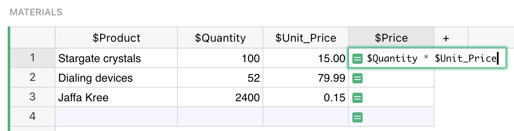

Formulas
=========

Grist has a powerful data engine to help you fill in the cells of your
tables, using formulas.  If you've used spreadsheets before, or
database expressions, you'll be on familiar territory - but there are
some wrinkles you'll want to know about, so hang around.

Let's start with a classic use of spreadsheets.  Suppose you have
a list of products you've ordered, the quantity you ordered,
and the unit price of each.  You've made a column to show
the quantity times the unit price, but want the computer to do
that part for you.


Just select a cell in the column you want to fill, and hit "=" to
tell Grist you want to enter a formula, rather than a value.


Did you notice, when you did that, the labels of the columns changed
a little?  "Product" became "$Product", and "Unit Price"
became "$Unit\_Price".  This is Grist telling you how to
refer to those columns in your formula.  Just type "$Product * $Unit\_Price".
You'll find an auto-complete feature ready to help you.
Or if you don't like typing, click on the Product column, type the
multiplication symbol, and then click on the Unit Price column.
Your formula should look like this:



Now press enter, and your formula is applied to all cells in the
column.


If you've worked with spreadsheets before, you may be surprised
that you don't need to specify row numbers, like `B1 * C1`.
In Grist, a single formula applies to a whole column.
You don't have to worry about filling it in for all rows,
and can refer to values in the same row without fuss.

Grist formulas are written in Python, the most popular language for data science.
The entirety of [Python's  standard library](https://docs.python.org/2/library/) is available
to you.  For those with a spreadsheet background, we've also added a suite of Excel-like
functions.  Here's the [full list of functions](functions.md).

Accessing other tables
-------------------------

Every table in your document is available by its name in formulas.

For example, we could make a second table, and refer to `Materials` from
the [earlier example](formulas.md) as follows.

Here's a formula to count how many rows there are in the Materials table,
using the [all](functions.md#all) method.

```py
len(Materials.all)
```

Here's a formula to compute the average price, mixing the Excel-like function
[AVERAGE](functions.md#average) with a Python [list comprehension](https://docs.python.org/2/tutorial/datastructures.html#list-comprehensions):

```py
AVERAGE(material.Price for material in Materials.all)
```

Here's a formula to list the names of products with a quantity greater than 80:

```py
[m.Product for m in Materials.all if m.Quantity > 80]
```

For exact matches, there is a shortcut called [lookupRecords](functions.md#lookuprecords),
or [lookupOne](functions.md#lookupone) for a single match.  Here is a formula to look up the
product name of a material with a quantity of 52:

```py
Materials.lookupOne(Quantity=52).Product
```

If your table has a space in its name, or other characters that are awkward in Python,
replace those characters with an underscore.  Auto-complete may help you if you're not
sure.

Entering a formula
------------------
Unlike typical spreadsheets, Grist formulas are column-wide. This means that a single formulas
applies to the whole column—you don't have to worry about filling it in for all rows.

To enter a formula into a cell, enter the equal sign ``=`` followed by a python expression.

For example, here we entered an expression ``=2**$foo`` which raises 2 to the power specified in
column ``foo``:


Multi-line formulas
-------------------
Python is a wonderful and powerful language, and it's a shame to restrict it to a single line in a
cell. So Grist doesn't! You can use multiline complex Python expressions for any formulas column.

**In a cell** you can use ``Shift+Enter`` to move the cursor to the next line:


You can also enter your formula **in the sidebar**, where ``Enter`` gives you a new line
automatically:


Paste as values
---------------
If you'd like to save the output of your formula as plain values, you can simply turn off the
formula by clicking on the formula icon in the sidebar:  ➔ :


You'll also notice that the column is no longer a formula by the absense of the leading ``=`` sign
next to each value.

!!! tip "Use the values, keep your formula"
    Note that you don't lose your formula by turning it off. The formula itself remains and you can
    turn it back on. If you modified the values in the column, however, they will be recalculated by
    the formula. You can always undo to revert back to the previous state.
