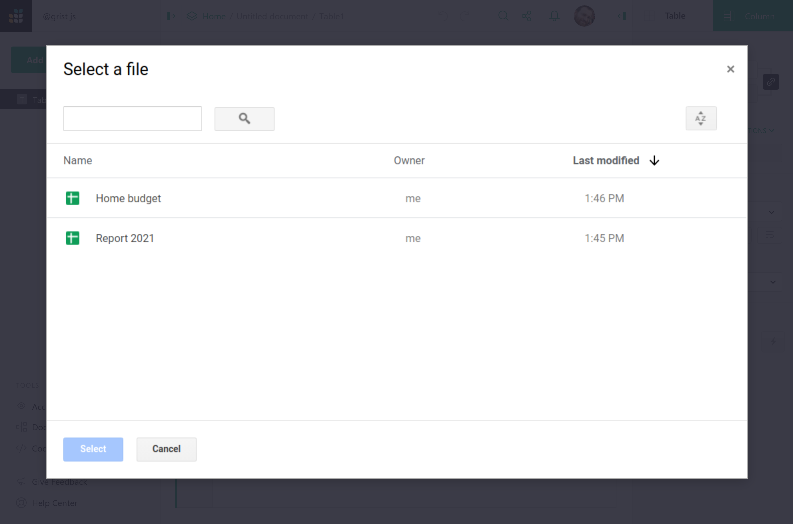

# Importing more data

You can import a file to [start a new Grist document](creating-doc.md), or to
add data to an existing document. Grist supports imports of Excel, CSV, JSON,
tab-separated files and from [Google Drive](imports.md#import-from-a-google-drive).

To start a new Grist document, click the "Add New" button on the home screen
and choose "Import document", as described in [starting a new Grist document](creating-doc.md).

To add to an existing document, open that document, click the "Add
New" button and then "Import from file".  By default, each imported
table is added as a new Grist table, but when examining the preview
dialog for an import, you have an option to change the destination to
an existing Grist table.

You can also import any of the same formats from a URL, using the "Import from URL" option.

## The Import dialog

When you import data into an existing document, Grist opens an import dialog to
show you what will be imported. This dialog offers available import options,
lets you choose whether to create a new table or add to an existing one, and
shows a preview of the data.

The "Import options" link on the top right is sometimes useful when importing
delimited files. Grist guesses the settings to parse the data (such as the
field delimiter), but if it guesses incorrectly, you can adjust the settings.

## Guessing data structure

In all cases, when you import a file, Grist makes guesses about the structure of the file.

For Excel files, Grist treats each sheet as a separated table. For CSV and
other delimited formats, one file becomes one table. For both Excel and
delimited files, Grist tries to detect whether the headers are included and
which line they occur in. If Grist detects there are no headers, it will name
columns as "A", "B", "C", etc.

Grist automatically tries to parse numbers, dates, and boolean fields to detect
the most suitable type for each column. It tries to be lossless: e.g. if it
marks a column as numeric, any text values in it (such as "N/A") will remain in
the imported table, but will be highlighted due to the type mismatch.

You can always rename tables and columns after an import, as well as convert types.

## Import from Google Drive

Importing from a Google Drive is as easy as importing from an Excel file or a 
CSV file. To start, click the "Add New" button and choose "Import from Google 
Drive".

To import, sign in to your Google Account by clicking the "Sign in" button and
following the sign-in process. Grist will ask for a permission to read the file
you will import from Google Drive. We won't read any other files on your
drive — just the single file you choose to import.

Once the file has been chosen, the rest of the process is the same as importing 
from an Excel file. In the [import dialog](imports.md#the-import-dialog) 
you may configure what data to import, and which destination table to add it to.

## Import to an existing table

By default, Grist imports new data as new tables, but the Import dialog allows
you to change the destination and import data into an existing table.

To import cleanly into an existing table, the new data must have column names
that exactly match the column names in the destination table.

This is best suited for importing multiple datasets in the same format. For
instance, you could import a bank statement as a new table, then import more
statements from other months into the same table.

For developers, the [Grist API](rest-api.md) offers a more powerful way to add data
to a Grist document.
