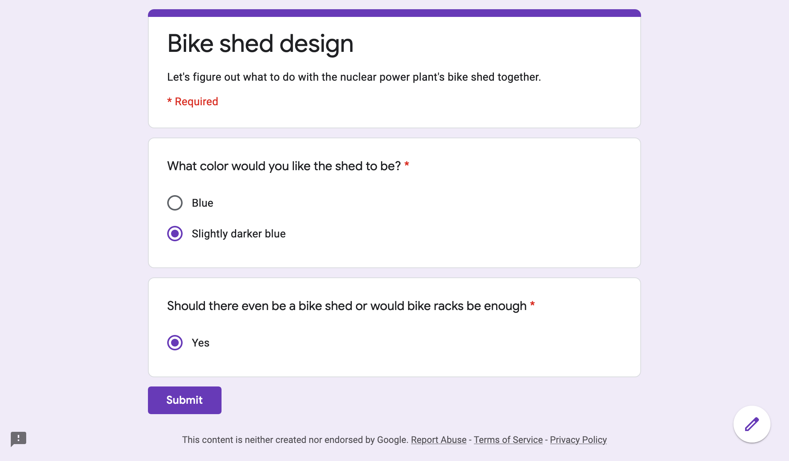
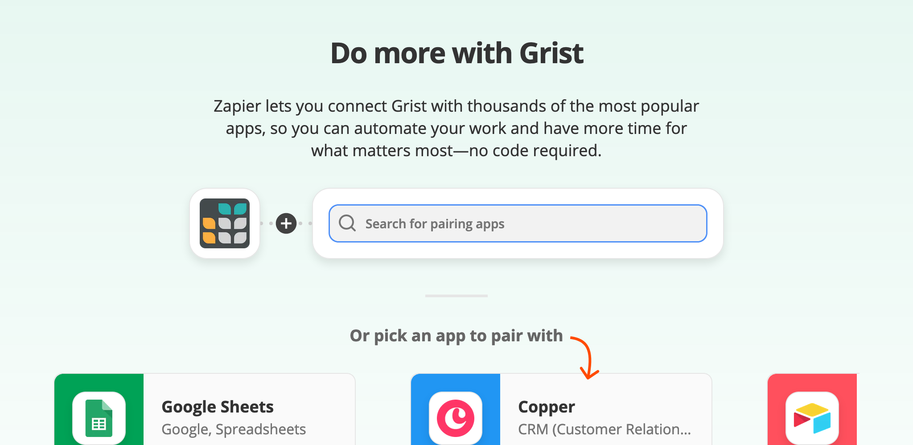
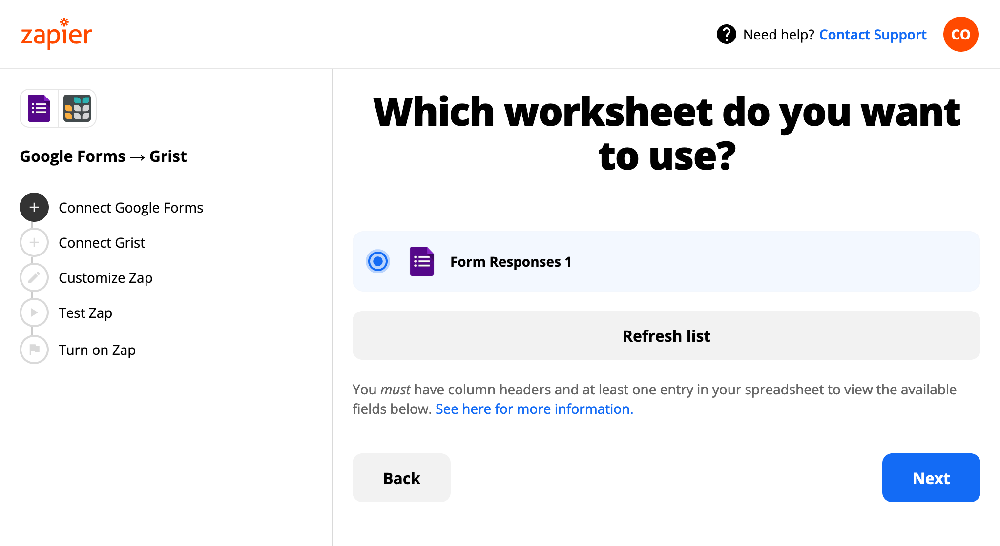
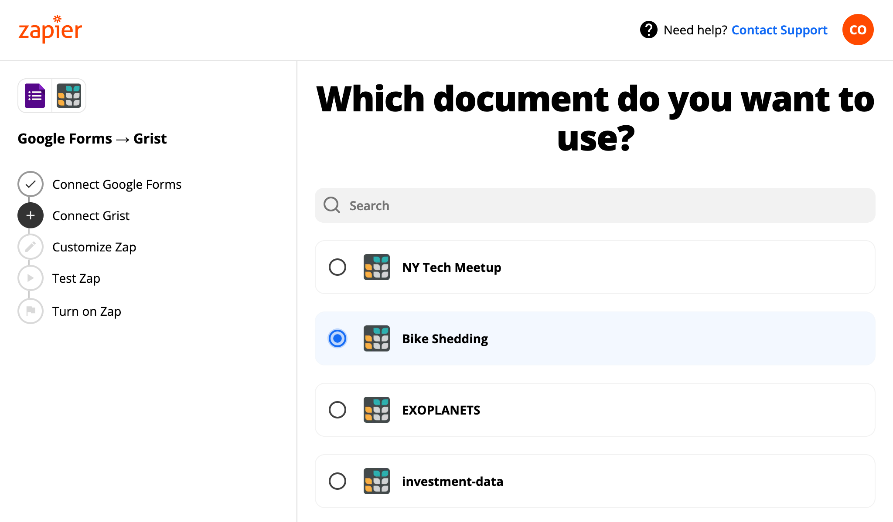
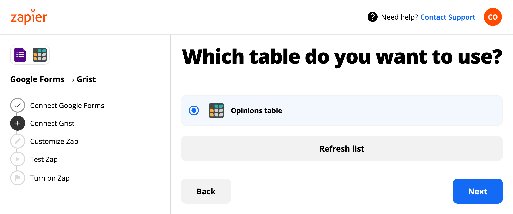
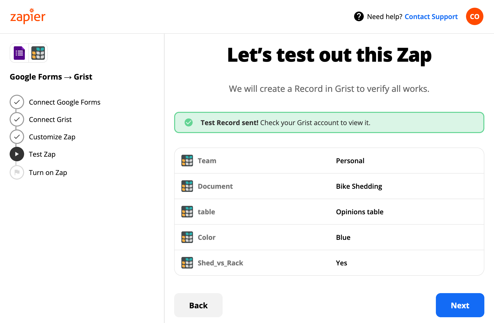
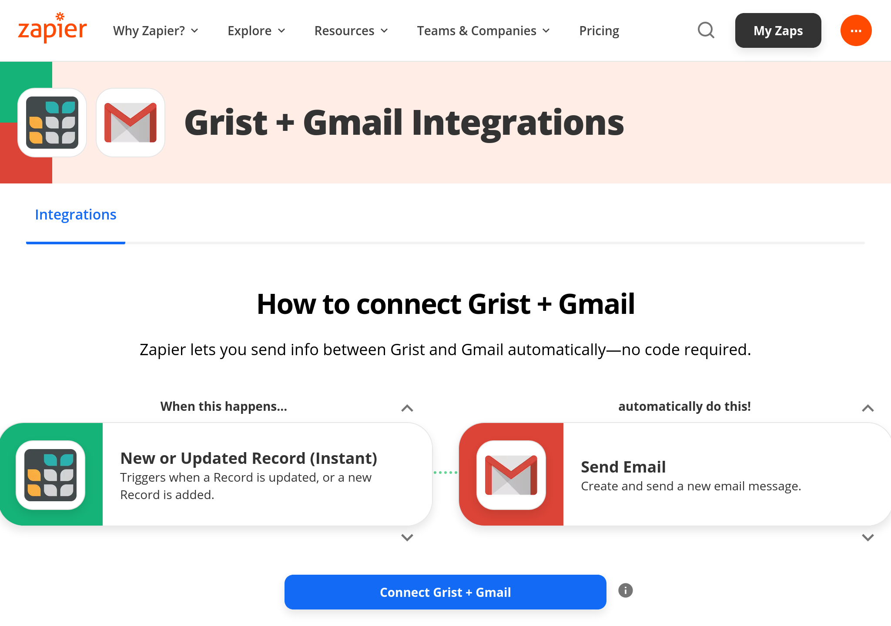

# Integrator Services

Grist can be connected to thousands of other services via integrators with Grist support. These
include:

- [Zapier](https://zapier.com/apps/grist/integrations)
- [Integrately](https://integrately.com/integrations/grist)
- [Pabbly Connect](https://www.pabbly.com/connect/integrations/grist/)
- [KonnectzIT](https://plan.konnectzit.com/feedback/grist-integration)
- [n8n](https://n8n.io/integrations/n8n-nodes-base.grist)

## Configuring Integrators

Each integrator provides its own way to configure the connection between Grist and other services. 

[Pabbly Connect](https://www.pabbly.com/connect/integrations/grist/) has created a few videos walking through how to set up an integration with Grist 
using Pabbly Connect.
[Pabbly Connect Youtube - Grist Playlist](https://www.youtube.com/channel/UCVA5GKy8qpDxQR5xSt_zcJg/search?query=grist)

Included below is a walkthrough of an example of how an integration with Grist can be configured using
[Zapier](https://zapier.com/apps/grist/integrations).

Grist can trigger a workflow whenever there is a new or updated record
in a table, leading to action in another service.  Conversely,
workflows triggered by other services can consult, add, or update
records in Grist tables.

## Example: Storing form submissions

Suppose we have a form for collecting votes on the color of a proposed new bike
shed:



The form is set up using Google Forms (for this example), and we want the
responses to be stored in a Grist document:


One way to make this happen is with [Zapier](https://zapier.com/apps/grist/integrations).
So let's sign in on the Zapier site and then visit the 
[Grist integration page](https://zapier.com/apps/grist/integrations):



We'd like to pair Grist with Google forms. Zapier supports several form providers,
and the overall process for integration is similar for them all.
Just type in the provider you want.  For this tutorial, we're going with Google forms.


Once we've picked the provider to integrate with, we need to pin down exactly what
we want it to do, from the available "triggers" and "actions."
In this case, we choose that when there is a `New Response in Spreadsheet` trigger
for Google Forms, we will do the `Create Record` action in Grist.
We click the build button to start filling in the details:


Since the triggering event for the integration will happen in Google Forms, we
are first asked to give Zapier some access rights to your forms.  Once that
is done, we are prompted to confirm which spreadsheet to use:


Then we specify which worksheet within the spreadsheet to use (easy if there is just one).
For Zapier's benefit in a later step, it is important that there be at least one sample
response already in the spreadsheet.



That's the Google side done.  Now for the Grist side.  We are prompted to
give an API key for Grist, so we [set up an API key](rest-api.md) if we haven't already.
To give precise access rights, we could set up a user account just for the integration,
and give it access to just what it needs, and supply its API key.


Now we confirm the team to use - personal docs or a team site we have access to:


Then we pick the Grist document to send form responses to:



And then we pick the table to use within that document. It should have columns
to store whatever parts of the form we want to keep. It is important to make
this table if it doesn't exist already; it won't be created automatically.
It isn't important to match column names with questions.



Zapier allows for flexible mapping of fields between services.  In our case,
a one-to-one mapping works fine:


Ok!  Now we can click our button to have Zap test our integration.



All going well, we can turn the "Zap" on and leave it run.


Now is the time to try making some submissions, and go have a cup of something.  Free "Zaps"
may run periodically to check for new submissions, so don't expect immediate results in all
cases.  But eventually, you should see the votes pouring in!


## Example: Sending email alerts

We've seen an example of an outside service sending data to Grist.  Now let's
look at an example of Grist sending data to an outside service.  Continuing
our form example, where a Grist document is accumulating votes for a preferred
color: now suppose that every time a new vote comes in we want to send an email
summarizing which option is in the lead.  We write a formula to prepare the text
in a `Text` cell:


Let's return again to the [Grist integration page](https://zapier.com/apps/grist/integrations)
on Zapier.  There are several mail integrations.  For this example, we pick Gmail:


Once we've picked the service to connect, now we choose exactly what we want
it to do.  In this case, we choose that when there is a `New or Updated Record (Instant)`
in Grist, we will `Send Email` in Gmail.  Note the `Instant` there.  Triggers
in Zapier can be either a regular kind where Zapier periodically checks for changes
(this is relatively slow), or a special "instant" kind that needs special support from
the triggering service but is a lot faster. Grist supports either kind of trigger,
and we strongly recommend "instant" if you prefer results in seconds rather than minutes,
and especially if you are the sort to get anxious if someone doesn't respond to your
IMs immediately.




Once we've chosen a Grist account to use as before, we can pick a table within
a document to monitor.


For instant triggers, we can optionally specify a ["readiness" column](integrators.md#readiness-column). If we
leave this blank, anytime a record is created or changed in the selected table,
Grist will notify Zapier about it. If we set it, it should generally be to
a [toggle column](col-types.md#toggle-columns), and Grist will notify Zapier only
for records when that column is turned on. That is handy for records that have many
columns being filled in manually, when we don't want to trigger until they are
complete. For this example, it is fine to leave the readiness column blank.
(For regular non-instant triggers, we would need to pick a specific column to monitor. Ideally this would be an `Updated At` column, see [Timestamp columns](timestamps.md)).


On the Gmail side, we can email to pre-set addresses, or this could be configured
dynamically (we'll see an example of how in a moment):


We choose to set the body of the email to contain "Custom" content, in this case
the `Text` cell we calculated earlier.


And we're done!  Zapier will offer to make a quick test that emails go out
correctly:


Then you can make some votes and watch the system work.  For instant triggers,
results should show up fairly snappily.  Otherwise, Zapier has a "run zap"
functionality to force an integration to update immediately:


And emails should start showing up in the desired inboxes. May the best almost
indistinguishable shade win!


## Readiness column

Grist has a mechanism for alerting other services when data changes
within a document. This serves as the basis for Zapier instant triggers.

Since Grist is a spreadsheet, it is common for records (rows) to be
created empty, and for cells to then be filled in one by one. This creates
an important nuance for notifications. Usually it won't be desirable to
send a notification until the record is in some sense "ready", but when
exactly is that?

Grist lets the user decide for themselves, by creating a [toggle
(boolean) column](col-types.md#toggle-columns) which is turned on when the record is ready. The
column can be set manually, or via a formula. This is called a
readiness column.

For example, if you only want to activate a trigger when columns
called `Name` and `Email` are not empty, your readiness column can
have the following formula:

```python
bool($Name and $Email)
```

You would make the column take effect by supplying it in the
`Readiness column` option described in the
[email alert example](integrators.md#example-sending-email-alerts).

### Triggering (or avoiding triggering) on pre-existing records

The order of steps matters when setting up an integration that uses a
readiness column. If you have existing data, think through whether you
want the integration to affect all existing data or just updates and
new data.

For example, if you are sending data from Grist to Google Sheets using
a Zapier integration, you'll probably want to send your existing data.
In this case, set up and enable your Zap first with an empty readiness column,
then turn on all the readiness cells.

If you want to send a notification only when something is added to Grist,
and not for pre-existing records, make sure your readiness cells are all
turned on prior to enabling the integration, otherwise once they are turned
on notifications will be sent for all of them. That may be a lot!
