# How to analyze and visualize data {: data-toc-label='' }

Grist offers several powerful ways to analyze and visualize data. In this tutorial, you’ll learn how to:

- Create summary tables
- Create and configure charts
- Link charts dynamically

To explain these features, we’ll use the sample document “Investment Research”[^doc_desc] which includes companies and
investments in them up to 2013. Let’s take a look at the
sample document and then we’ll talk about how to build it so that you can apply these tools to
your own data.

[^doc_desc]: Download [crunchbase_companies_ny.csv](/investment-research/crunchbase-companies-ny.csv)
and [crunchbase_investments_ny.csv](/investment-research/crunchbase-investments-ny.csv). The sample data includes only the “companies” and “investments” data, and includes only
New York companies to keep it smaller and faster. The dataset comes
from [Kaggle](https://www.kaggle.com/mauriciocap/crunchbase2013).

## Exploring the example

Open the document “[Investment Research](https://templates.getgrist.com/doc/investment-research){: target="\_blank"}”, found in Examples & Templates in your Grist home page.
The first thing you’ll see is “Overview”. This page contains two charts next to two tables.

- The top left has a pie chart showing the distribution of investments by category. The table next
  to it has the same data in tabular form.
- Below the pie chart is a bar graph showing the total investments raised by year. It is also
  accompanied by the same data in the table next to it in tabular form.

All these charts and tables are examples of “summary tables”, which we’ll describe below.

The next page, “Breakdowns”, also contains two tables and two charts, but these are linked
dynamically and offer much more detailed insight into the data.

- On the top left is a table showing the total funding by year (the same table as we saw on the
previous page). This table serves as a driver for the chart next to it. When you click on a year
in the table, the pie chart updates to show the distribution of investments in that year.

- Similarly, the bottom table shows investments by category. When you click on any category, the
line chart next to it updates to show the history of funding in that category over the years.

Note how powerful this is, and how much insight you can gain from it. For
instance, you can see that Advertising category has been getting a lot of
investment in NY since 2007, but was overtaken by E-commerce in 2013,
while the Fashion category had a major spike in 2011.

On the next page, “Company Details”, we get to see the granular data of this dataset.

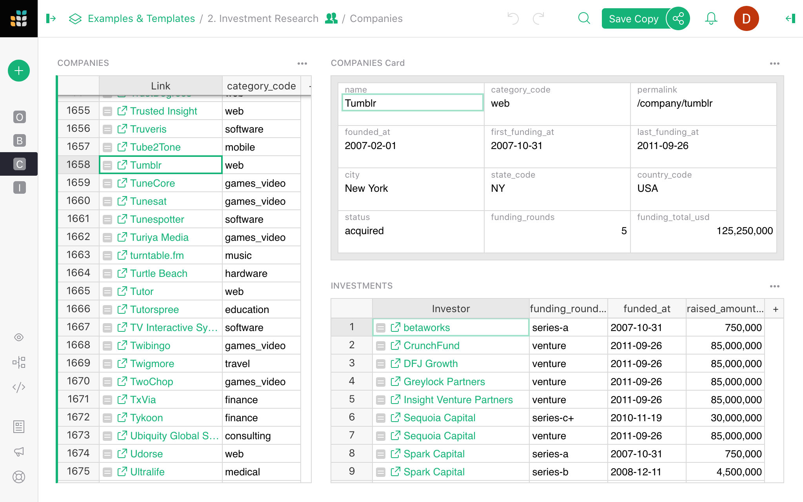

Here, we see a list of companies and the categories they fall into. Each company shown has a link
pointing to its listing on the Crunchbase website. Selecting a company shows a card with its
details, as well as a list of all the investments it has received.

This is where we begin to see the power of Grist. The original dataset is a flat spreadsheet of
companies, and an even bigger spreadsheet of investments. By displaying the data graphically, the
data comes alive, making it powerful and useful.

## How can I make this? {: data-toc-label='' }

With Grist, presenting your own data in graphic form is a few easy steps away. Let’s begin with
the first step.

## Get the data

Let’s import the raw data. We’ll import two CSV files, where each will become its own table. To
follow along, save the files from
[crunchbase_companies_ny.csv](/investment-research/crunchbase-companies-ny.csv)
and
[crunchbase_investments_ny.csv](/investment-research/crunchbase-investments-ny.csv)
to
your computer first. Then, create a Grist document by importing the first file from the home page.

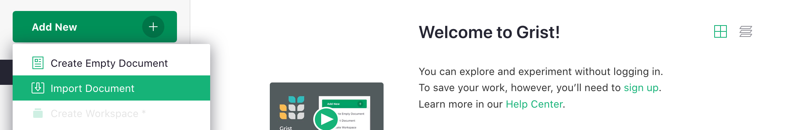

Next, import the second table using the “Add New” button and the “Import from file” option.

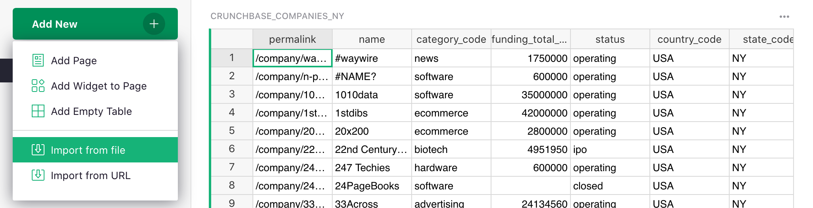

In the import dialog box, finish by clicking “Import” on the bottom left.

The tables you’ve imported will be named “crunchbase_companies_ny” and
“crunchbase_investments_ny”. Click the name at the top of the table to open the dialogue box and
rename each of the tables to “Companies” and “Investments”.

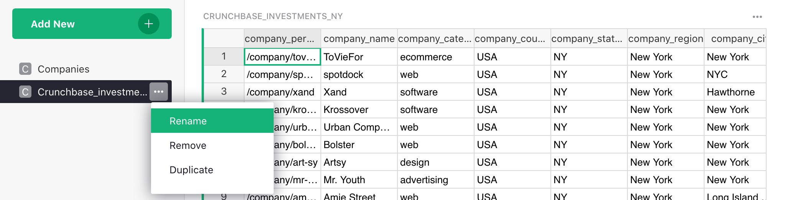

## Make it relational

The power of Grist comes from giving structure to the data.

Take a look at the “Investments” table. Sort by the first column and you’ll notice how much
repetition there is: each row contains the complete company info, which both duplicates the data
in the “Companies” table, and is repeated multiple times when multiple investments apply to the
same company.[^denormalized]

[^denormalized]: Such duplication is commonly seen in spreadsheets. Data in this form is called
  “denormalized”.

The reality is that each investment applies to a single company. Each investment row only needs to
contain a reference to a company, and the data specific to that investment.

To make it so, find a column that identifies a company uniquely. In this dataset, the first
column, “company_permalink”, does it best[^unique_id]. Click on the arrow in the column header and click
“Column Options”. Click on the arrow beside “Text” under the “Column Type” in the dialogue box at
the right of the screen and select “Reference” from the list.

[^unique_id]: If you don’t have a single identifying column, you can construct one with a formula.

*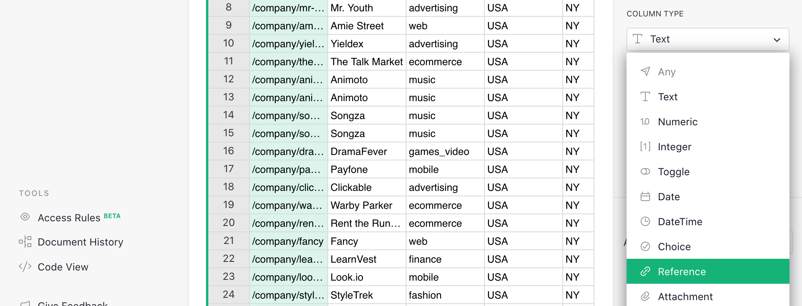*
{: .screenshot-half }

Grist will automatically suggest to make it a “Reference” to the “Companies” table, and to show
the referenced company’s “permalink”. Click “Apply” to save this conversion.

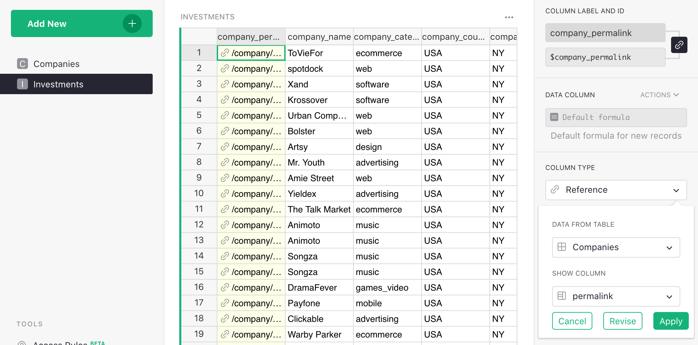

Let’s also rename this column to “Company”.

In Grist, duplicated data is not needed and we recommend removing it. Using the `Option-Minus` (Mac)
or `Alt-Minus` (Windows) shortcut is a quick way to remove columns. After removing the columns from
“company_name” to “company_city”, here’s what’s left:

**

The data you’ve deleted isn’t lost since it was duplicated – it’s still available in the
“Companies” table and can be used in an Investment record’s formula as, e.g.
`$Company.company_xxx`.

In fact, there’s a handy way to create this kind of formula. Let’s create one that we’ll need
later. Click the header of the “Company” column. In the right panel’s Column tab, you’ll see a
section ‘Add Referenced Columns’. Click ‘Add Column’ to add the “category_code” column.

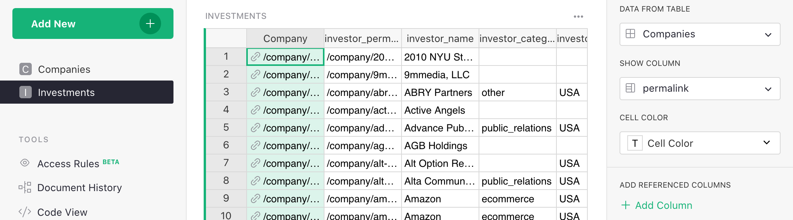

A new column will be added to the table with the formula `$Company.category_code`. For each
investment, it shows the “category_code” of the company linked to its investment record.

## Summarize

The powerful feature you’ve been waiting for is the one that summarizes the data. [Summary tables](summary-tables.md) summarize each numeric column in a data table. We want to find the sum for the `funding_total_usd` column in the Companies table. Check that the column type is set to 'Numeric' and formatted with `$`.

To utilize this,
let’s add a table showing companies grouped by “category_code”.

In the “Add New” menu at the top left, select “Add Page”. In the dialog box, select “Table” and “Companies”, and
then use the summation icon ()
to select the “Group By” columns -- i.e. the columns by which to
summarize.

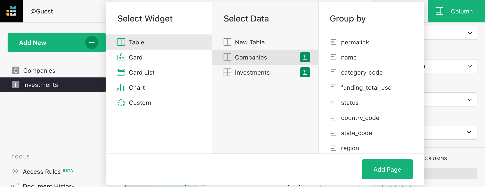

If you don’t select any columns, you’ll just get a single row of totals. If you summarize by
“category_code”, you’ll get a row for each distinct value of “category_code”. Let’s do that and
then click “Add Page”.

This is similar to Excel’s pivot tables. Each row represents the group of records from the source
table (“Companies”) that have a particular value of “category_code”. There is a reminder of that
in the table’s title (“COMPANIES [by category_code]”).

Such summary tables can (and should!) use formulas. The columns you choose when creating the table
are the identifiers of the groups. All other columns are formula columns -- they are calculated.
In formulas, the group of source records summarized by one row is available as the value “$group”.

For example, you’ll see a column created automatically called “count”. If you hit
“Enter”, you’ll see the formula in it -- `len($group)` -- that’s just the number of records in
that group of records, i.e. the number of companies in that category.

For numeric columns in the source table, summary tables automatically get a same-named numeric
column containing a sum, with a formula such as `SUM($group.funding_total_usd)`.

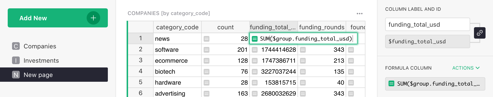

!!! note "A note for Python fans"
    `$group` is a special Python object. It’s an iterable collection of records. Using an
    attribute like `$group.A` is a shorthand for the list of values in the `A` column of all the
    records in the group, i.e. it’s roughly equivalent to `[r.A for r in $group]`.

Sometimes, adding the values doesn’t make sense. E.g. the sum of “founded_year” is meaningless.
It’s best to delete this and any other column we don’t need, which leaves us
with the "funding_total_usd" column.

Since this column contains large numbers, it's a good time to
look at the "Number Format" section of its configuration, and click `,` (or perhaps `$`) to format
numbers to be more readable.

Let’s add a second summary table. Select “Add New” again to “Add Widget to Page”. To get a summary
by year, select the “Investments” table under “Select Data”, and again use its sum symbol (∑) to
select the column by which to summarize: “funded_year” and then click “Add to page”.

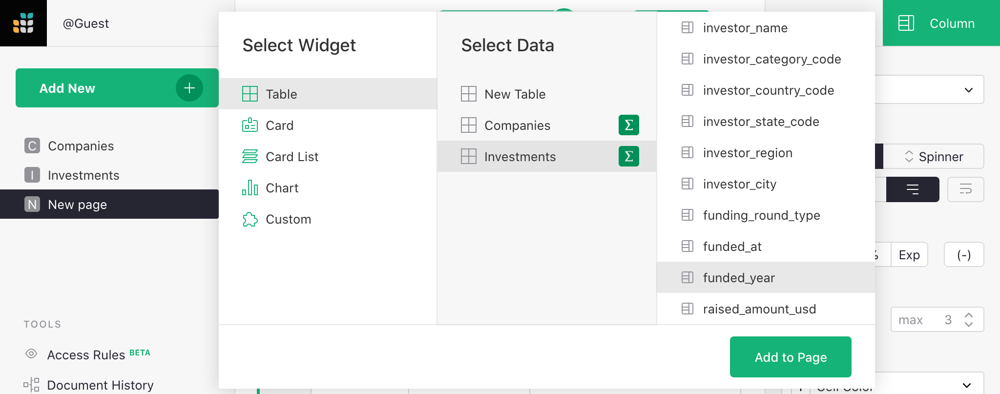

This produces a second summary table that shows a record for each year, with each representing a
group of “Investments” rows for that year. The most useful column is “raised_amount_usd”, adding
all investments made in that year. Let’s delete the unneeded columns.

You’ll notice pink values in “raised_amount_usd”. That’s because Grist guesses the column type to
be an integer.The pink sums are instances where the numbers exceed Javascript’s ability to handle
large integers. To correct for this, the type of the column should be switched to “Numeric” (which
trades off precision for the ability to represent very large and very small numbers). Change the
type to “Numeric“ under “Column options”.

This is again a good time to pick a friendlier number format for the column, and to make it wider to
fit the longer numbers.

## Chart, graph, plot

You can make a chart of any data. To this page, we want to add a graphic version of each summary
table. Select the “Add New” button again, pick “Add Widget to Page”, select “Chart” as the widget,
and the same table (Companies) and summary column (category_code) as before. Then click "Add to Page".

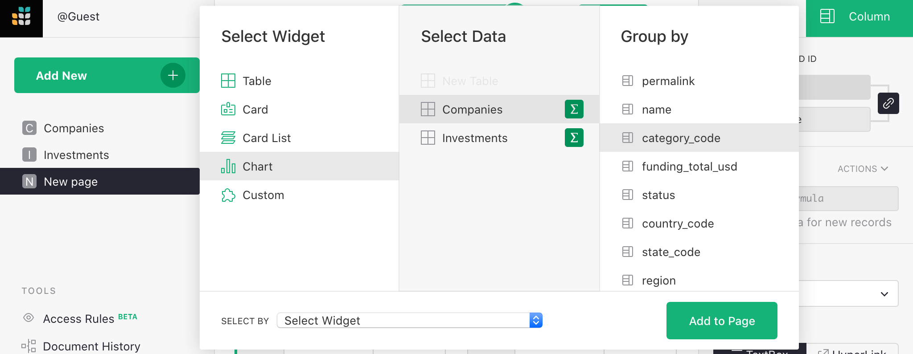

For a chart, you’ll always follow up by customizing it.

Open the right panel, and select “Chart” tab / “Widget” subtab. 

For this first chart, under “Chart type", select “Pie Chart”. To construct this chart, first select a label, and then select a series to summarize in the pie chart.  Since we want the chart to show “category_code” as labels, select this series from the "Label" dropdown. We want to use “funding_total_usd” as values, so this should be listed at the top of the “series” list in the configuration panel. As you move your mouse
over the items in that list, use the double vertical bars that show up to drag and drop a series at the top of the list. Alternatively, you can hide the other series from the list by clicking the trash icon.

Now add a chart showing a trend by year. Add another “Widget to page”, select “Chart” under
“Widget”, select “Investments” under “Select Data”, click summation
() to group by “funded_year”,
and click “Add to Page”.

To customize this chart, stick with the chart type “Bar Chart”. From the "X-Axis" dropdown, select the column to use for the X (horizontal)
axis values. Under 'Series' select a second (and possible additional) column to be values for the Y (vertical) axis.

You can rearrange the sections on the screen into a configuration you'd like to
see for a dashboard. Move your mouse to the top left of each section until you
see a "drag handle" icon. Use that icon to drag each section into the desired
spot relative to other sections. Once you’re finished, rename the page by hovering over the 
page name then clicking the three-dot icon to open the menu. Select "Rename" and rename to “Overview”.

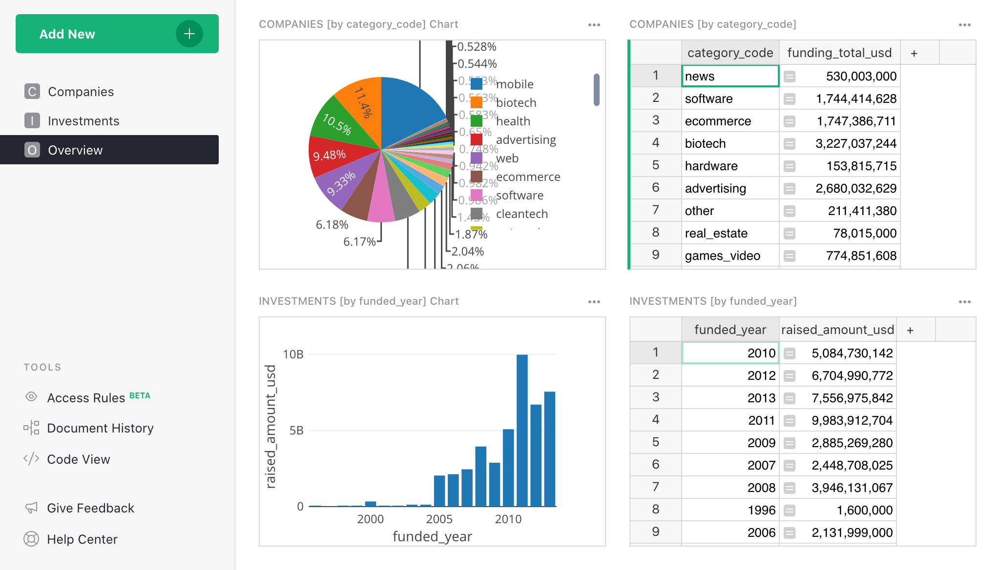

## Dynamic charts

If you’ve read our other tutorials on linking data, this will come naturally. Charts are simply a
different way to show data, and they can be linked in the same way as tables.

For our example, we’ll add a new page with a summary table: select widget “Table”, data “Investments”,
group by “funded_year”, click "Add Page".

Let’s rename this new page “Breakdowns”.

Next, add a widget to this page, selecting widget “Chart”, data “Investments”. For “Group By”,  we
pick *two* columns: “Company_category_code” and “funded_year”. This is why we added the “Company_category_code” column earlier. We can only group investment records by the category code if we have this code for each investment.

The “Select By” dropdown at the bottom left of the dialog box lists widgets already on the screen that
can control the selection of data in the chart we are adding. In “Select By”, choose “INVESTMENTS
[by funded_year]”, and click “Add to Page”.

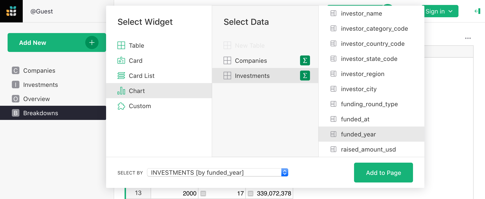

!!! tip ""
    **Note:** If you need to make changes to a widget you already added, such as change its type,
    “Group By”, or “Select By” settings, you can always do so from the “Data” subtab in the widget
    settings, using the “Edit Data Selection” button.

We want to be able to select a year, and then show a pie chart for that year that displays the
total for each category code. The “Select By” option we chose ensures that only the selected
year’s data is used. All that’s left is to change the chart type to “Pie Chart”, and set “Label” to “Company_category_code” and "Series" to “raised_amount_usd”.

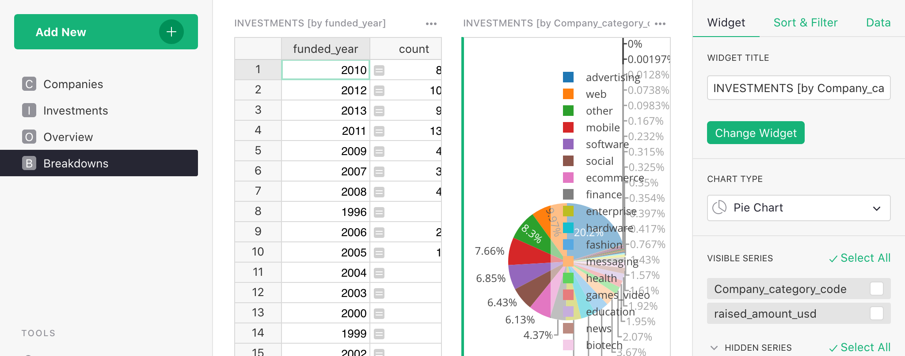

Note: Graphs need more screenspace, so our small screenshots will look better if we close the
side panels by clicking on the opener icons (,
).

Let’s also sort the table by “funded_year”.

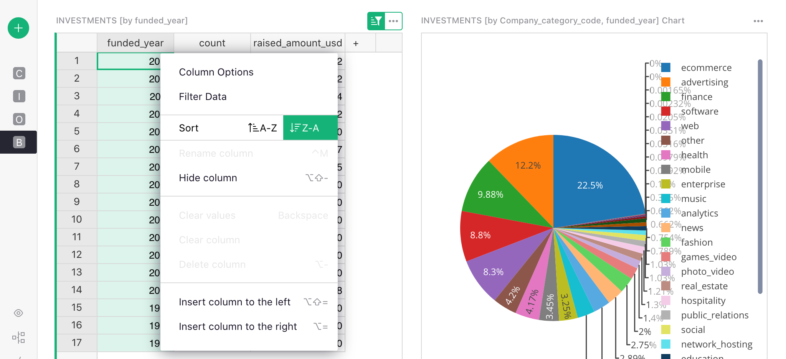

As far as sorting, the highlighted button above the table reminds you that sort settings aren’t
saved automatically. Click the green button and select “Save” to do that.

What’s the result? We can click through the years (or use arrow keys), and see the distribution by
category change.

!!! tip ""
    **Note:** If clicking through the years does not affect the chart, the chart must not be
    linked. You can check and correct it by using the "three dots" menu on top right of the chart,
    clicking "Data selection", and ensuring that "Select By" dropdown is showing "INVESTMENTS [by
    funded_year]".

To complete the example, we will add two more sections to this "Breakdowns"
page. One will be a table listing company categories, and linked to it will be
a chart showing the amount of investment in that category over the years.

To add the table of categories, use "Add Widget to Page", and select "Table" widget, "Investments" data,
grouped by "Company_category_code".

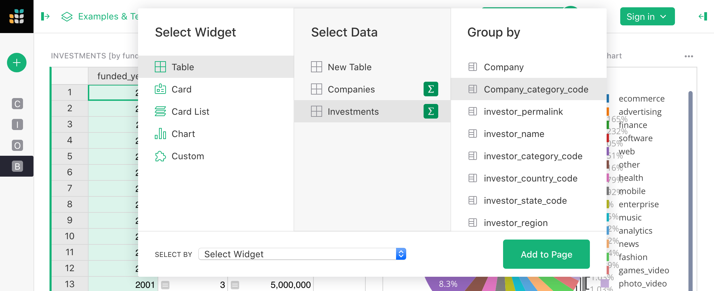

The “funded_year” column in the resulting table is meaningless, and should be deleted.

For the last step, we add another chart. We need to remember to group by both “Company_category_code”
“funded_year”, and to set a suitable “Select By” widget for it. Since there are two
tables on this page, you have a choice of which one will drive the data in this chart. In this
case, pick the widget that we just added: “INVESTMENTS [by Company_category_code]”.

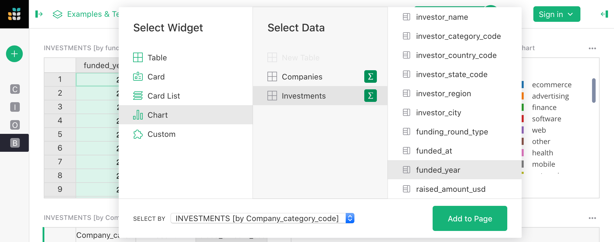

As in the previous section, we configure the chart by selecting “Chart Type” as “Bar Chart”, and
in the “X-Axis” dropdown, selecting “funded_year” and under "Series", selecting 
“raised_amount_usd” and hiding the rest.

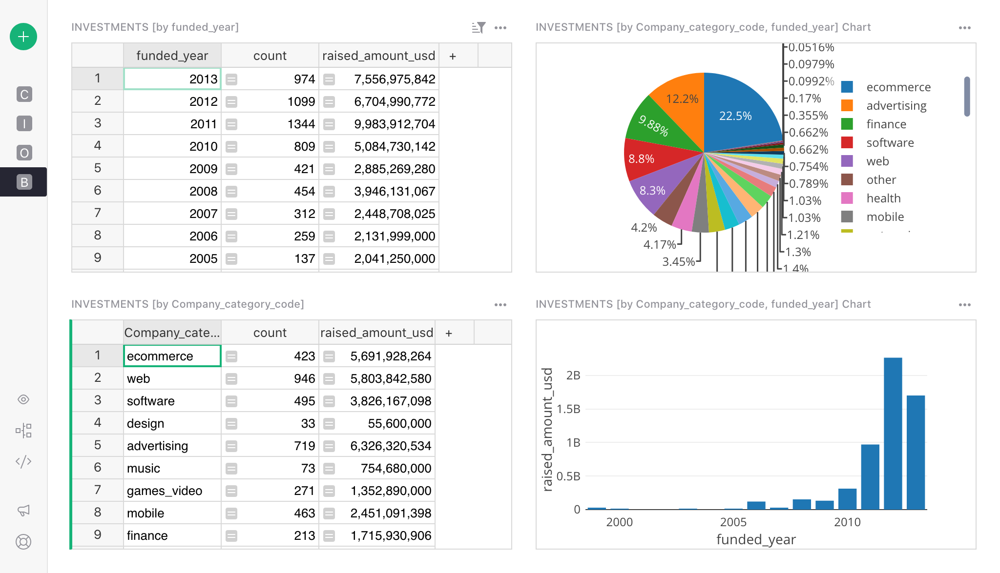

We can now click through the categories, and see the history of investment into each one.

## Next steps

If you’re unfamiliar with how we created the “Company Details” page that’s present in the example,
visit one of these earlier tutorials to learn how: ‘How to build a Lightweight CRM’, or ‘Managing
your Business in Grist’.

That’s it! Now go analyze some data!

