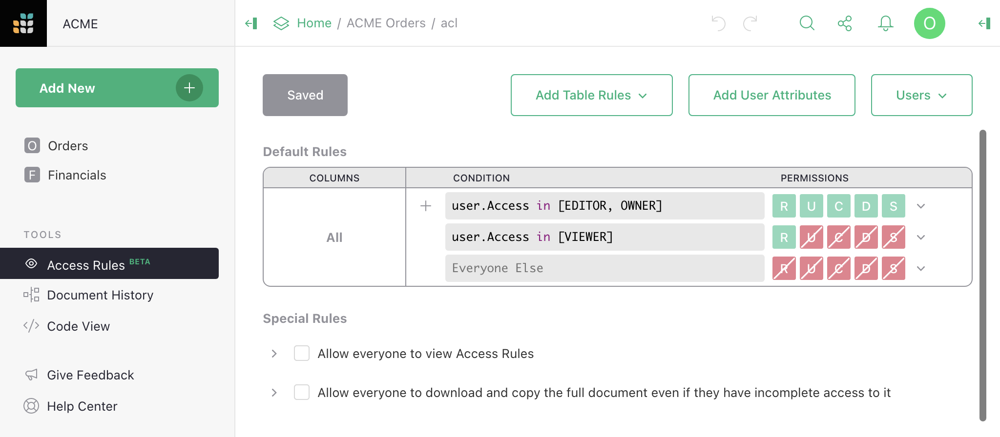

# March 2021 Newsletter

<table class="header" cellpadding="0" cellspacing="0" border="0"><tr>
  <td class="header-text">
    <table class="header-top"><tr>
      <td class="header-image">
        
      </td>
      <td class="header-top-text">
        
Grist for the Mill

        
March 2021
          &#8226; <a href="https://www.getgrist.com/">getgrist.com</a>

      </td>
    </tr></table>
    

      Welcome to our monthly newsletter of updates and tips for Grist users.
    

  </td>
</tr></table>

## Access rules

Grist now offers "access rules" for fine-grained control of who can
see (or edit) which parts of your document at the table, column, and
row level. In December, we invited those interested in early access
to try the feature out. We've made a lot of improvements, and are
now excited to open the feature to the public.

Things to know about access rules:

- Until now, everyone you share a document with sees the same content.  Now, their
  views can be filtered.  For example, a table or column may be visible only
  to certain users.  Or some users may see only rows that meet a condition.

- Until now, all editors and owners of a document could change anything about its
  content.  Now, document owners can control what specific editors can change.
  For example, a table or column may be locked for certain editors.  Or some
  editors may only update, add, or remove rows that meet a condition.

- If you need it, editors can be organized into groups or teams using
  a table within the document itself, and granted permissions
  systematically.

- You can make special links to give ad-hoc view access to pieces of the document,
  including documents shared with the public.

Access rules are marked as a Beta feature, meaning that the design of
access rules is likely to evolve, and sometimes that will require
updates to documents that use them. We won’t make such changes
lightly.

## Quick Tips

- **UUID**

- color select spruced up?

- sql types?

## Learning Grist

- Get started quickly with basic Grist concepts by watching this playlist
  of a few very short introductory videos:
  [Grist Video Series](https://www.youtube.com/playlist?list=PL3Q9Tu1JOy_4Mq8JlcjZXEMyJY69kda44).

- Each of our [Examples & Templates](https://docs.getgrist.com/ws/59/)
  has a related tutorial that shows step-by-step how to build it
  from scratch. Read through one to gain a deeper understanding of how
  various features play together.

- Visit our [Help Center](../index.md) to
  find all of the above, along with the full product documentation.

- Questions or suggestions? Click the
   Give Feedback
  link near the bottom left in the Grist application, or simply email
  <support@getgrist.com>.
