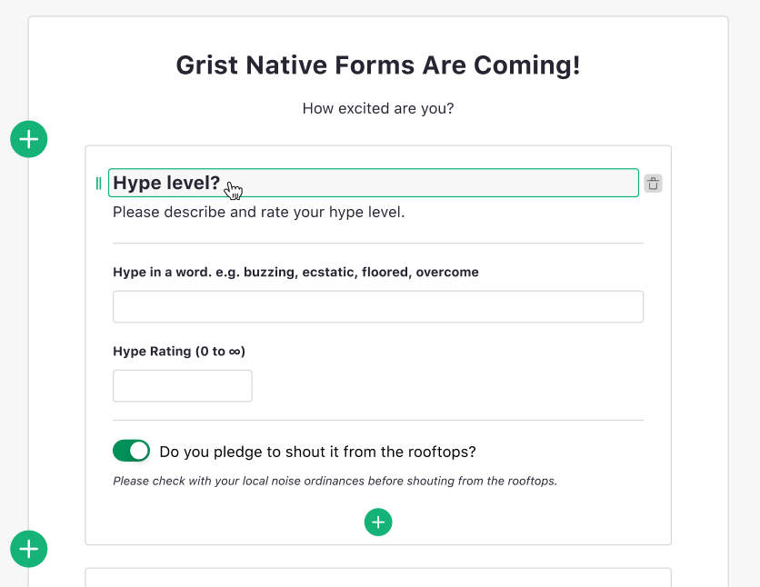
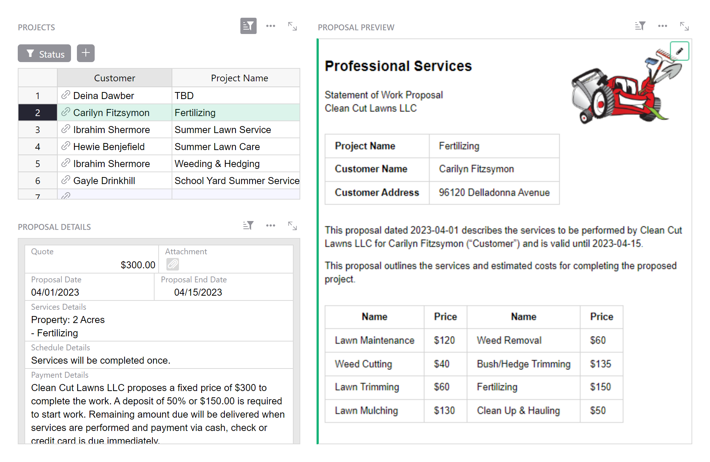

# December 2023 Newsletter

<table class="header" cellpadding="0" cellspacing="0" border="0"><tr>
  <td class="header-text">
    <table class="header-top"><tr>
      <td class="header-image">
        
      </td>
      <td class="header-top-text">
        
Grist for the Mill

        
December 2023
          &#8226; <a href="https://www.getgrist.com/">getgrist.com</a>

      </td>
    </tr></table>
    

      Welcome to our monthly newsletter of updates and tips for Grist users.
    

  </td>
</tr></table>

We’ve published an overview of all that’s gone on during a very busy 2023 for Grist. Check out our [Year in Review](https://www.getgrist.com/blog/grist-2023-year-in-review/){:target="\_blank"} for the full scoop, as well as an abundance of amazing community contributions and a sneak peek at what’s to come in 2024. 🧠

[READ THE YEAR IN REVIEW](https://www.getgrist.com/blog/grist-2023-year-in-review/){:target="\_blank"}
{: .grist-button}

## What's New

### Coming (very) soon: Forms

*Screenshot of the form editor's design.*

Forms are almost here, and we couldn’t be more excited. We’ll release an early version for testing in January, and would love early feedback from users. To provide feedback, join our Discord server.

[JOIN DISCORD](https://discord.gg/MYKpYQ3fbP){:target="\_blank"}
{: .grist-button}

### Beta Testing: Grist on AWS Marketplace

In 2024, we plan to release new options for self-hosted Grist, so that it becomes easier to run (and maintain) on your own infrastructure. Self-hosted Grist can already run almost anywhere, especially when someone has done the work of packaging it for your specific environment. One of the first examples of this was Adrian's [Grist package for Unraid](https://community.getgrist.com/t/grist-now-available-in-unraids-community-application-library/453){:target="\_blank"}, and one of the most recent is Florent's [Grist package for YunoHost](https://community.getgrist.com/t/self-hosting-grist-made-easy-with-yunohost/3692){:target="\_blank"} from just last month. 

At Grist Labs, we have started work on a Grist package for the AWS Marketplace, and are seeking friendly users on the AWS cloud to try it out and give feedback. 

Interested? Please [join our Discord](https://discord.gg/MYKpYQ3fbP){:target="\_blank"} and watch for an announcement in January, and thanks!

### Other improvements

* [Advanced Charts](https://support.getgrist.com/newsletters/2023-10/#beta-feature-advanced-chart-custom-widget){:target="\_blank"} and the [JupyterLite Notebook](https://support.getgrist.com/newsletters/2023-10/#beta-feature-jupyterlite-notebook-widget){:target="\_blank"} are now official custom widgets available in the drop-down.
* In table widgets, you can now hit the spacebar to open the selected row as a record card.

## Community Highlights

* On the [Grist Discord](https://discord.gg/MYKpYQ3fbP){:target="\_blank"}, [@CoverWhale](https://github.com/CoverWhale){:target="\_blank"} shared their early-stage Grist Go client, with the delightful name [Gorist](https://github.com/CoverWhale/gorist){:target="\_blank"}.
* Also on the Discord, [@jperon](https://github.com/jperon){:target="\_blank"} shared a [pug_py widget](https://github.com/gristlabs/grist-widget/pull/113){:target="\_blank"} to help develop custom widgets.
* Translation started for Romanian (thanks @chiuta)! See [here](https://community.getgrist.com/t/translating-grist/2086){:target="\_blank"} for more information on translating Grist.
* We are so impressed with @jperon’s diligence in solving as many [Advent of Code](https://adventofcode.com/){:target="\_blank"} puzzles in Grist as possible. Hero status. Just...just look at this: [https://docs.getgrist.com/cU5y9f2ViVQQ/AOC2023/p/17](https://docs.getgrist.com/cU5y9f2ViVQQ/AOC2023/p/17){:target="\_blank"}
* Meanwhile at Grist...

Working on something cool with Grist? Let us know by posting in the [Showcase forum](https://community.getgrist.com/c/showcase/8){:target="\_blank"}!

## Learning Grist

### Webinar: Markdown Widget Magic 🧙‍♂️

In January, we’ll learn how to use the Markdown widget to create printable PDF files, populated with data from your Grist document. We’ll rebuild our 📝 [Proposals & Contracts Template](https://public.getgrist.com/nyPmvvea8c54/-Proposals-Contracts-Template/m/fork){:target="\_blank"} to show you how it’s done! 

**Thursday January 18 at 4:00pm US Eastern Time.**

{:target="\_blank"}

[SIGN UP FOR JANUARY'S WEBINAR](https://www.getgrist.com/webinars/markdown-widget-magic/?utm_source=support-newsletter&utm_medium=internal&utm_campaign=build-webinar&utm_term=january-2023){:target="\_blank"}
{: .grist-button}

### Multimedia Views

In December, we covered multimedia views and explored even more ways to display your data. Maps and Notepads and Video Players, oh my!

[WATCH DECEMBER'S RECORDING](https://www.getgrist.com/webinars/multimedia-views/){:target="\_blank"}
{: .grist-button}

## Help spread the word
If you’re interested in helping Grist grow, consider leaving a review on product review sites. Here’s a short list where your review could make a big impact. Thank you! 🙏

* [Stackshare](https://stackshare.io/getgrist){:target="\_blank"}
* [Capterra](https://www.capterra.com/p/232821/Grist/){:target="\_blank"}
* [TrustRadius](https://www.trustradius.com/products/grist/){:target="\_blank"}
* [AlternativeTo](https://alternativeto.net/software/grist/about/){:target="\_blank"}

## We are here to support you

**Sprouts Program.** Grist often surprises people with its capabilities. Schedule a **free** Sprouts call with an expert to see if Grist can address your needs. [Learn more.](https://www.getgrist.com/sprouts-program/){:target="\_blank"}

**Have questions, feedback, or need help?** Search our [Help Center](../index.md), [watch video
tutorials](https://www.youtube.com/channel/UCx0ioQrrC-bIrkmZ7ZULr0g/playlists), share ideas in our
[Community](https://community.getgrist.com), or contact us at <support@getgrist.com>.