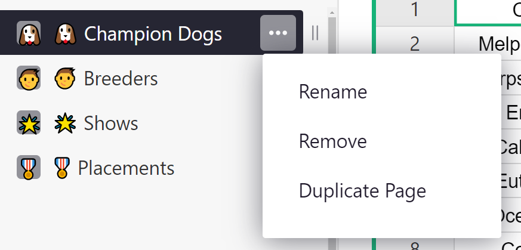
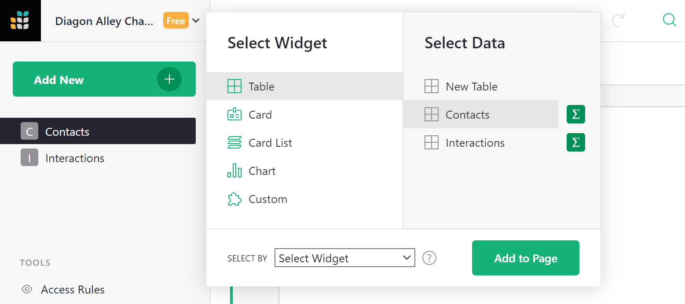

# Page widgets {: data-toc-label='' }

Unlike traditional spreadsheets, in Grist you can create multiple views of the same data, and
display multiple data sets on one page. This allows you to create useful dashboards and custom
applications tailored to your needs.

## Pages

You organize your views of data into "pages". These are listed in the left panel, with collapsible
groups. You may rearrange and group pages in the left panel by dragging to suit your needs.

**
{: .screenshot-half }

You can rename pages using the three-dots menu next to the page name in the list, or by clicking
the page name on top of the screen.

**
{: .screenshot-half }

**
{: .screenshot-half }

Using the opener icon ()
near the top of the left panel, you can collapse the panel to leave only the initials of each page
and give more screen space to the data.

To add a new page, use the "Add New" button, and click "Add Page". At that point, you'll get to
choose the page widget to include in the new page.

## Page widgets

A page contains sections, such as tables or charts, which we call "page widgets". Each page widget
shows data from one table. A page may contain more than one page widget, and you can arrange and
link them to create useful layouts.

Here are the supported kinds of page widgets. The salient features of each one are described
further down.

- **Table**: similar to the spreadsheet grid, and a good way to see many records at once.
- **Card**: shows a single record in a form-like layout, which you can customize.
- **Card List**: using the same layout as a card, displays a scrollable list of records.
- **Chart**: plots data on a chart, with support for a few different chart types.
- **Custom**: an experimental widget enabling developers to create their own data views.

## Widget picker

The menu opened by the "Add New" button has options "Add Page" and "Add Widget to Page". In either
case, you'll see the "page widget picker" where you will select the widget to add:

**

You get to select the type of widget, the table of data to show (or "New Table" to create a new
table). The "summary" icon ()
allows you to [summarize data](summary-tables.md).

When adding a widget to an _existing_ page, you'll also see a "Select By" option, which allows
linking this widget to another one already on the page. This is described in [Linking
widgets](linking-widgets.md).

Once you have widgets, they can be moved around and resized, as described in [Custom
Layouts](custom-layouts.md).

## Changing widget or its data

If you'd like to change the widget or the data shown in it after it's added, you may do so. Click
the three-dots button on the top left of your widget, and select "Widget options". This opens the
right-side panel. Click "Change Widget" there:

**
{: .screenshot-half }

You can then use the same widget picker to change the widget or the data it shows.
