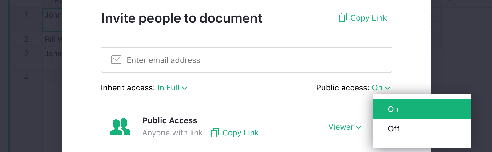

## Public access

If you want to share your document with a wider audience, you can make it publicly accessible.
In the "Share" menu (<span class="grist-icon" style="--icon: var(--icon-Share)"></span>) on top,
select "Manage Users". Then toggle the dropdown next to "Public Access" to "On":

<span class="screenshot-large">**</span>

Once you confirm the change, anyone with the link to your document
will be able to view it. They don't even need to have a Grist login.

The "Copy Link" button is handy to copy the link to the clipboard for
pasting into an email, tweet, or anywhere else.

You can also allow anyone with the link to your document to edit it:
simply switch the role in the Public Access row to Editor.

<span class="screenshot-large">**
</span>

Note that this allows **anyone** with the link to change **absolutely anything**
in your document, including deleting all the data. The snapshots in
[Document History](../automatic-backups.md#examining-backups) should help
if anything goes wrong.

## Embedding Grist

!!! warning "This is an experimental feature"
    The design of this feature is likely to evolve. Keep an eye on our
    [Roadmap](https://github.com/gristlabs/grist-core/projects/1) for updates. 

With public access in place, you may wish to embed your Grist document on your own site.
Let's say you have some financial data you want to share with your stockholders,
share the inventory with retailers or build a dashboard for your own product.

To embed a document you first need to make it [public](sharing.md#public-access) and have
access to your web server in order to place some HTML code in the desired location
(some minimal knowledge of HTML is required).

If your site is hosted on some popular cloud CMS platform (like a blogger or
wordpress) you probably need to edit the layout or a theme
from inside the admin panel or use a third party [plugin](https://wordpress.org/plugins/wp-coder/)
to access the HTML editor features. If you have any problems editing your site,
feel free to ask us or post a question on our [Community Forum](https://community.getgrist.com/).

Once you are decided where to embed your document past this code snippet in your HTML file:

```html
<iframe src="https://templates.getgrist.com/6D8E2h2DQNwS/Task-Management/p/6?embed=true" 
        height="250px" width="100%"
        frameborder="0" onmousewheel="">
</iframe>
```

The `src` attribute points to the URL of the page you want to embed. To get the `URL`
for your document, simply navigate to the page you want to share and
copy the URL from the browser's address bar. Appending `?embed=true` parameter at the end,
tells Grist that it should show only the content of your page, removing any elements that
are not necessary for the embedded version. You may wish to adjust `height` and `width` attributes
to make it look better on your site.

Since this Help Center document is a regular HTML file, we can try it right away!
Below you should be able to see an embedded live table (not a screenshot) from one of our
[examples](https://templates.getgrist.com/6D8E2h2DQNwS/Task-Management/p/6):

<iframe src="https://templates.getgrist.com/6D8E2h2DQNwS/Task-Management/p/6?embed=true" 
        height="250px" width="100%" frameborder="0">
        Loading ...
</iframe>

This is live, readonly view of the Grist page, it gets updated as soon as 
someone edits it. You can, of course, embed any page you wish, including cards view, charts
and any page with multiple sections.

Here are two more examples with a chart and a card list view:

<iframe src="https://public.getgrist.com/42dAvZXMFewH/Funding-Pipeline/p/13?embed=true" 
        height="300px" width="100%" frameborder="0" />
        Loading ...
</iframe>

<iframe src="https://templates.getgrist.com/ihsZTnKTF7Lr/Treasure-Hunt/p/3?embed=true" 
        height="300px" width="100%" frameborder="0" />
        Loading ...
</iframe>


Embedding editable documents is not yet supported, but we are working on it
and will make it available soon. You can track our progress on our 
[Roadmap](https://github.com/gristlabs/grist-core/issues/66).
