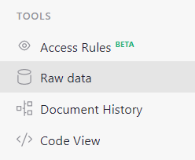
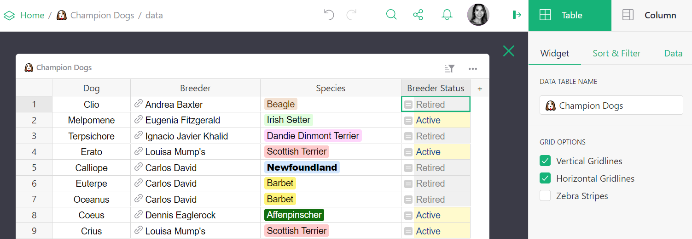

# Raw data page

The raw data page is a special page that lists all [data tables](glossary.md#data-table) in your document and summarizes your document's usage statistics.

From your document, navigate to the raw data page by clicking on the Raw Data link in the bottom left of the pages menu.

Unlike other [pages](page-widgets.md), the layout in the raw data page cannot be customized. From the list of data tables, you can find the data table's name and id, and remove data. Note that removing a data table from this page *will* delete data and remove it from all pages. This is different from other pages where it is possible to remove a view of data and not delete the data itself. 

Click on a data table to open it. Note that in the creator panel the [widget type](page-widgets.md#page-widgets) cannot be changed. Renaming the widget also renames the data table. Because raw data is intended to show all data, columns cannot be hidden, either. However, columns can be rearranged, deleted, created, and modified. For creators, this view may make it easier to edit data structure, add [formulas](formulas.md), [conditional formatting](conditional-formatting.md), and so on.

## Usage

Usage statistics are summarized beneath the list of data tables. Note that usage applies to the entire document, not individual tables. Learn more about document [limits](limits.md).

