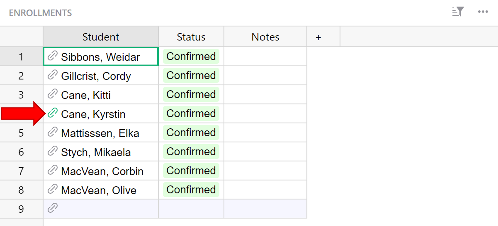
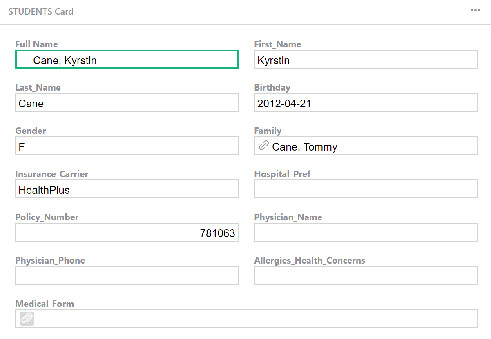

# Record Cards

Record Cards are a quick, easy way to view a record's details. 

To view a record's details as a card, hover over the row number and click the arrow icon that appears. Select 'View as card' from the drop-down menu.

This opens an editable card view of the record's details.

If your table contains a [reference or reference list column](col-refs.md), you can click the link icon to open the linked record's card.

A record card will open to display record data for the referenced record.

## Editing a Record Card's Layout

You can edit a record card's layout from the [Raw Data](raw-data.md) page. Click the card icon to open.

You can drag and drop fields to rearrange, resize and add/delete fields from the view. Learn more about [editing card layouts](widget-card.md#editing-card-layout).

## Disabling a Record Card

You can also disable a record card from the [Raw Data](raw-data.md) page. To disable a record card for a particular table, click the three-dot icon to the right of the table name then select 'Disable Record Card' from the dropdown. 

