Using References and Lookups in Formulas
=========

[Reference and Reference List columns](col-refs.md) in Grist allow one table to create an explicit reference to another. 
A common example of this is seen in the [Class Enrollment](https://templates.getgrist.com/doc/afterschool-program) template.

On the Staff page, we have a list of staff members. On the classes page, we have a reference column labeled Instructor that 
references the records on our Staff page. 

<span class="screenshot-large">**</span>

Keep in mind, it’s not just referencing the Full Name column but the entire record associated with the selected instructor. 

Reference columns and dot notation
---------------

Using a Reference column within a formula can make it easy to get any data from the referenced record. To do this, we use dot notation. It uses the format `$A.B` where `A` is the name of the reference column and `B` is the name of the column of the referenced table that we want to pull data from.

Let’s see this in action on the [Enrollment View](https://templates.getgrist.com/doc/afterschool-program/p/7) page of the Class Enrollment template. Dot notation is used in the Class_Times column of the ENROLLMENTS table, found at the bottom right of the Enrollment View page.

<span class="screenshot-large">**</span>

We can see that the Class_Times column is using a formula with dot notation. Using the format `$A.B` described above, we can figure out that Class is the name of the reference column and Times is the name of the column of the referenced table.

Let’s track this back to where it’s pulling from - since the reference column is Class, we can look at that column’s information to find out what table it is pulling from.

<span class="screenshot-large">*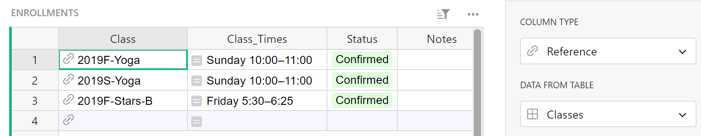*</span>

The Class column references data from the Classes table. Therefore, the Class_Times column is pulling from the Times column of the Classes table.

<span class="screenshot-large">**</span>

Chaining
---------------

If the reference lookup returns a reference, this can be chained. 

Perhaps we want to add the Instructor’s phone number to the Enrollments table. We can use the Class reference column to pull the instructor’s information from the Classes table.

<span class="screenshot-large">**</span>

As you can see in the screenshot above, the instructor column is a reference column itself. If we follow the format from before, our dot notation would be ```$Class.Instructor``` but the Instructor column points to the entire record of the instructor so we need to tell it what information we want from this record, creating a chain.

The instructor column references the Staff table so we navigate there to find out what column we need to pull information from in order to get the phone number. The column that contains the instructor’s phone number is Phone.

<span class="screenshot-large">**</span>

Putting this all together, our dot notation for the instructor’s phone number would be ```$Class.Instructor.Phone```

<span class="screenshot-large">*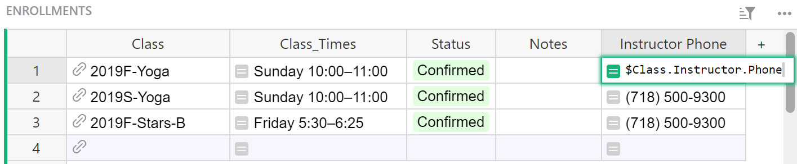*</span>

What happens if we leave our formulas as `$Class.Instructor`? You will see a numeric record ID of the record in the Staff table that the Instructor column points to.

<span class="screenshot-large">**</span>
{: .screenshot-half }

That's what a reference column really stores. If you change the type of this formula column to Reference, you will be able to select a column to show, such as the Full Name. 

<span class="screenshot-large">**</span>

Another way to see the name is to chain the dot-notation, as we did for phone: `$Class.Instructor.Full_Name`.

<span class="screenshot-large">**</span>

lookupOne
---------------

Another way to point to a record is using `Table.lookupOne(...)` function. lookupOne allows you to look up a record by some fields, similar to Excel's VLOOKUP. In fact, Grist's version of VLOOKUP is merely an alias for lookupOne. lookupOne is rarely useful in Grist, because using a Reference type column is usually the preferred solution to connect records. However, on some occasions, lookupOne can be useful. One situation is when you have two sets of data which overlap even though they represent something different and perhaps come from different sources. 

For example, let's say that you run an event and have Attendees, as well as Sponsors. Attendees are stored in one table, perhaps populated via a form integration. 

<span class="screenshot-large">*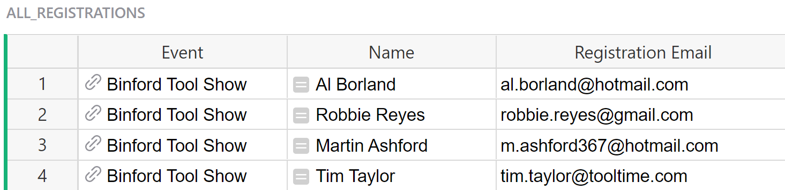*</span>
{: .screenshot-half }

Sponsors are in a separate table, with fields related to their sponsorship, and perhaps maintained by another team. 

<span class="screenshot-large">**</span>

Both tables contain email addresses which identify attendees and sponsors. Sometimes a sponsor may register to attend the event. In that case, you'll have an Attendee record with an email address that also appears in the Sponsors table. That's useful to know for someone looking at the attendee list. You can find a record in the sponsors table by email address by adding a formula in the Attendees table as seen below:

```
Sponsors.lookupOne(Contact_Email=$Registration_Email)
```

This formula is looking to see if a Contact Email from the Sponsors table matches a Registration Email from the Attendees table.

The general format for this formula is: 
```
[Table_Name].lookupOne([A]=$[B])
```
`[Table_Name]` is the name of the table you want to lookup data in. `[A]` is the column in the table being looked up (named at the beginning of the formula) and `[B]` is the column in the current table / the table you are entering the formula in.

<span class="screenshot-large">*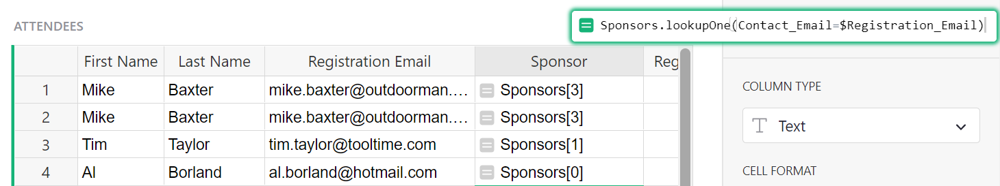*</span>

Such a formula returns a reference. In the screenshot above, you can see the lookup result returns `Sponsors[#]`. The number it returns between square brackets is the record ID of the lookup result. Where it returns `Sponsors[0]`, no match was found. 

It's often a good idea to create a column for the lookup result and change its type to Reference, as you see in the screenshot below. Then, if there is a match, the reference column will point to the entire matched record. As for any reference column, you can select which field from that record to show. In this example, it shows the Company field of the matched record in the Sponsors table.

<span class="screenshot-large">**</span>

lookupOne and dot notation
---------------

Because lookupOne is creating a reference to a record, we can use dot notation to look up additional fields in that record.

In the example above, `Sponsors.lookupOne(Contact_Email=$Registration_Email)` is checking if a Contact Email from the Sponsors table matches a Registration Email from the Attendees table.

What if we also wanted to look up the sponsor level?

We can add `.SponsorLevel` to the lookupOne formula, and, if a match is found, look up the sponsor level column for the matched record.

The entire formula would be `Sponsors.lookupOne(Contact_Email=$Registration_Email).SponsorLevel`.

<span class="screenshot-large">*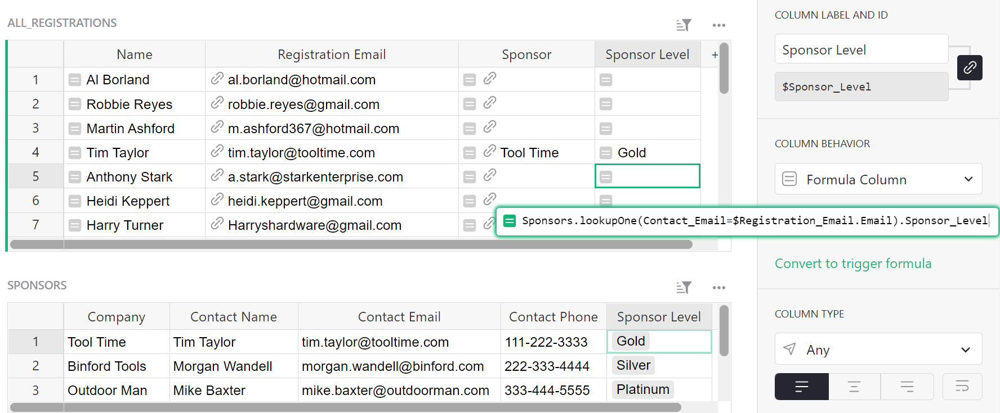*</span>

Now, we have the Sponsor Level listed in the Attendee table for those attendees whose emails also appear on the sponsor list.

Understanding record sets
---------------

Sometimes it is important to deal with a list of references. These can come from a Reference List Column which is a collection rather than a single data item. 

A great example of this is seen on the [Habit Tracker](https://templates.getgrist.com/1BR9vm6GPTGX/Habit-Tracker) template. 

On the Habits + Goals page, we have a list of habits and a goal for how often we wish to complete that habit. On the Habit Tracker page, we have a Reference List column labeled Habits Completed that references the records on our Habits + Goals page. 

The only difference between a Reference column and a Reference List column is the ability to select multiple references.

<span class="screenshot-large">**</span>

Reference lists and dot notation
---------------

You can iterate through a Reference List using a Python `for` loop. When iterating, each element is a Reference so dot-notation can be used here as well. Building on our prior example of attendees at a conference, suppose we have a list of registrants for each event and want to find the total balance of registration fees. We can use the following formula:

```
SUM(person.Balance for person in $Registrants)
```

Here, `$Registrants` is a reference list. Our Great Outdoors Expo has 4 registrants. We can see the list of registrants in the Registrants column. This list is a reference to the Registrant column of the Attendees table. 

<span class="screenshot-large">*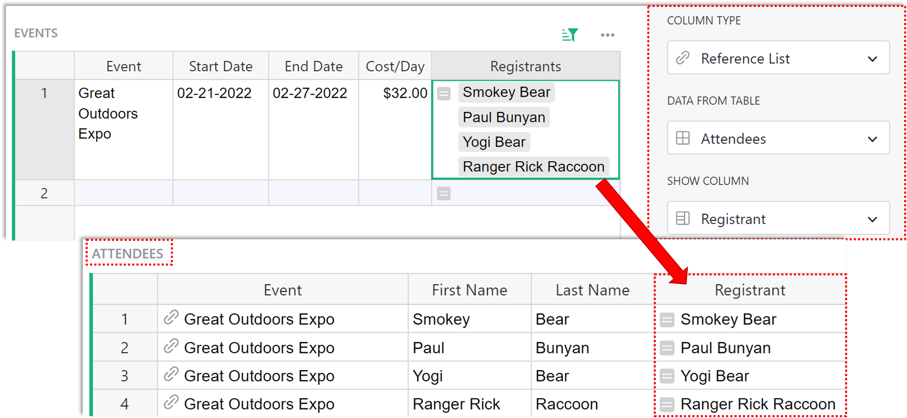*</span>

We want to find the balance for each attendee then sum all balances together.

<span class="screenshot-large">**</span>

Dot-notation works too, but returns a list of all the selected field;

<span class="screenshot-large">**</span>

`$Registrants.Balance` is a list of the Balances for each attendee in the list of `$Registrants`. This follows the format `$[A].[B]` where `[A]` is the name of your Reference List column and `[B]` is the name of the column in the referenced table you wish to pull data from.

<span class="screenshot-large">*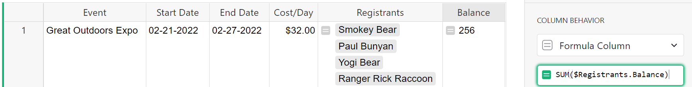*</span>

When we sum these values together, we get the same value as when we used our Python `for` loop.

So `SUM($Registrants.Balance)` and `SUM(person.Balance for person in $Registrants)` are equivalent.

If you’d like to learn more about [Data Structures and List Comprehension](https://docs.python.org/3/tutorial/datastructures.html#list-comprehensions) in Python 3, [Python.org](http://python.org/) is a great resource.

lookupRecords
---------------

You can also get a list of references using [lookupRecords](https://support.getgrist.com/functions/#lookuprecords).

The formula for lookupRecords follows this format:

```
[Table_Name].lookupRecords([A]=$[B])
```

`[Table_Name]` is the name of the table you want to lookup data in. `[A]` is the column in the table being looked up (named at the beginning of the formula) and `[B]` is the column in the current table / the table you are entering the formula in.

In the last section, we used a Reference List column to create a list of registrants. We can use lookupRecords in place of that Reference List column. Following the format above, our formula is `Attendees.lookupRecords(Event=$Event)`. This will get us a list of records where the event in the Attendees table matches the event in this row of the Events table. For our example, the event is Great Outdoors Expo.

<span class="screenshot-large">*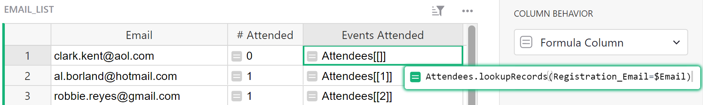*</span>

`Attendees.lookupRecords(Event=$Event)` returns a list of record IDs for each record where the Event listed is Great Outdoors Expo.

We saw similar results using the [lookupOne](#lookupone) function. It can be helpful to create a column for the lookup result and change its type to Reference List, as you see in the screenshot below. Then, if there is a match, the reference list column will point to the entire record for each match. As for any reference list column, you can select which field you want to show for the matched records. In this example, it shows the Registrant field of each matched record in the Attendees table.

<span class="screenshot-large">*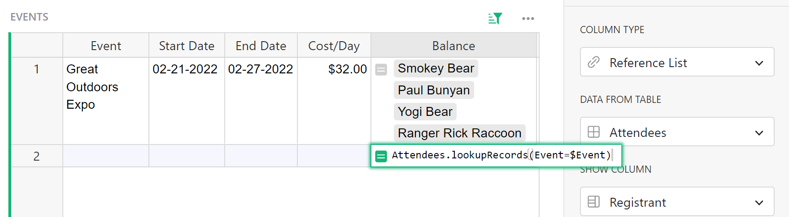*</span>

Working with record sets
---------------

lookupRecords can be used within other formulas. For example, we can use lookupRecords to find the sum of the balance for all registrants, like we did in the [Reference lists and dot notation](#reference-lists-and-dot-notation) section. Here, we will use lookupRecords to get the list of references, rather than using a reference list column.

```
registrants = Attendees.lookupRecords(Event=$Event)
SUM(person.Balance for person in registrants)
```
We recognize the first part of our formula, `Attendees.lookupRecords(Event=$Event)`, which checks the Attendees table for all records where the Event matches the Event in this row, which is Great Outdoors Expo. We assign this list to a variable, `registrants`.

Next, we use our Python `for` loop to find the sum of the balances for each record found in registrants.

<span class="screenshot-large">**</span>

We can also use lookupRecords with dot notation.

```
registrants = Registrants.lookupRecords(Event=$Event)
SUM(registrants.Balance)
```

<span class="screenshot-large">**</span>

`len()` can be useful to get the number of items within a list. Once you find your list of records using the lookupRecords function, you can use `len()` to count the number of records returned, like you see in this formula:

```
len(Table.lookupRecords(Column_A=$Column_B))
```

You can also do this on a reference list because a reference list is the same thing, a list of records.

```
len($RefList)
```

We’ll jump back to our earlier example where we had a list of Attendees and Sponsors - We want to see how many events our Sponsors have attended. We can use lookupRecords to do this. I can create a new column in my Sponsors table called “Events Attended” and add the following formula to pull in that information;

```
len(Attendees.lookupRecords(Registration_Email=$Contact_Email))
```

<span class="screenshot-large">*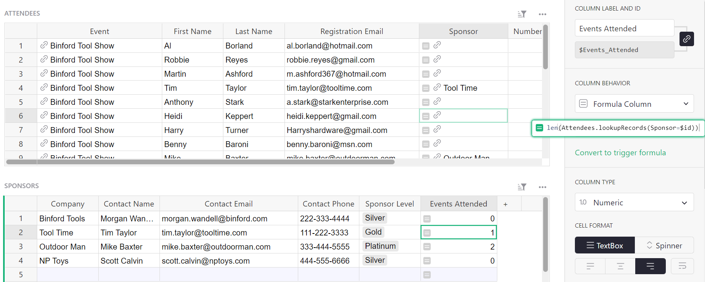*</span>

Let's break down the two parts of this formula, working from the inside out.

`Attendees.lookupRecords(Registration_Email=$Contact_Email)` is looking for matches between the Sponsors table's Contact Email and the Attendees table's Registration Email. All records in the Attendees table that match are added to a list of records. Try writing the formula without `len()` to see what Grist returns. It should look something like this.

<span class="screenshot-large">*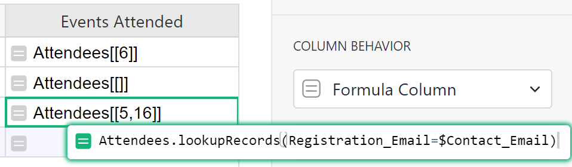*</span>
{: .screenshot-half }

That's a list of records.

`len()` counts how many records are in that list.

<span class="screenshot-large">*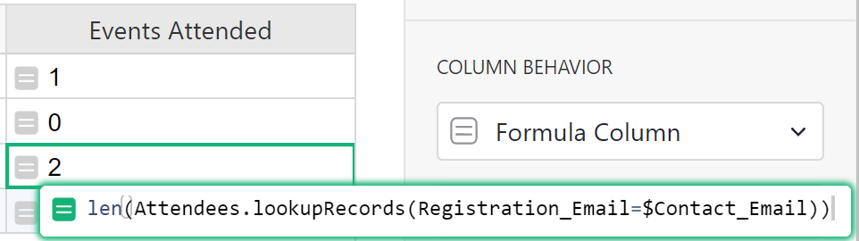*</span>
{: .screenshot-half }

Reverse lookups
---------------

There's another way to write the Events Attended formula by using a reverse reference lookup. 

Here, we use the record ID to find a record. Every row has a numeric id (available as `$id` in formulas) 
that is unique within that table. You can reveal the ID by adding a formula column where formula is `$id`{: .formula}

<span class="screenshot-large">**</span>
{: .screenshot-half }

Since Attendees.Sponsor is a reference column pointing to a Sponsor record, then it actually stores the unique ID of this sponsor. So in a formula for Sponsor, using the lookup below, we will find all Attendees records tied to the current sponsor.

```
len(Attendees.lookupRecords(Sponsor=$id))
```

<span class="screenshot-large">*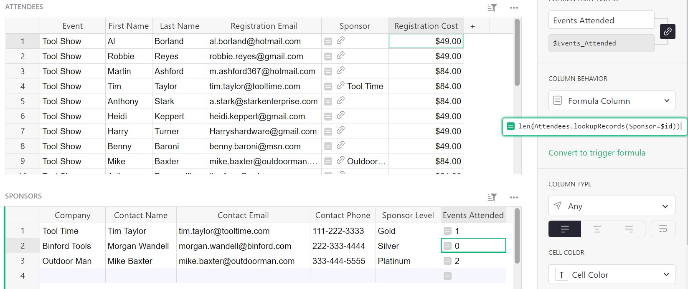*</span>

Breaking down the formula, we are counting the number of records in the Attendees table where the Sponsor column matches the ID of the row in this table (the Sponsor table).

Another example of a reverse lookup can be found in the Count column of the Classes table of the [Class Enrollment](https://public.getgrist.com/doc/eW4nqWfK1k3K~8iDuMy8ApPXvzhcemSiYsS~14207/p/6) template. This column shows us how many students are enrolled in each class. The formula used here is:

```
len(Enrollments.lookupRecords(Class=$id, Status="Confirmed"))
```

<span class="screenshot-large">**</span>

This lookup uses two fields. It will look for records in the Enrollment table where Status is “Confirmed” and the Class column matches the ID of the row in this table. Because the Class column is referencing the Classes table, we use the record ID `$id` in the lookup.

Finally, `len()` counts the items in the list returned by `Enrollments.lookupRecords(Class=$id, Status="Confirmed")`.

If you’d like a video walkthrough of a reverse lookup, we have another example in our [Build with Grist Webinar - Trigger Formulas v. Formulas](https://www.youtube.com/watch?v=0qVDPZd2w9I&t=788s).

Similar to lookupOne, you can use Dot Notation with lookupRecords. Check out the [Private Tutor Billing](hhttps://templates.getgrist.com/cJcSKdUC3nLN/Private-Tutor-Billing) template for a great example of this. On the [Families](https://templates.getgrist.com/cJcSKdUC3nLN/Private-Tutor-Billing/p/8) page, we have a table with quite a few formula columns! We’ll take a look at the Total Paid column for our example. The formula used here is:

```
SUM(Payments.lookupRecords(Family=$id).Amount)
```

<span class="screenshot-large">**</span>

Let’s break this down a bit. Starting with `Payments.lookupRecords(Family=$id)` - this format should look familiar to what we saw in the previous example. The Family column in the Payments table is a reference column pointing to this table. The lookupRecords formula is matching the Family column in the Payments table to the IDs of records in this table.

Now, let’s tack on the dot notation portion to make it `Payments.lookupRecords(Family=$id).Amount` - we are telling it to specifically lookup the Amount for records in the Payments table where the Family column matches the ID of the row in this table. Remember - the Payments table has a reference column that points the the Families table, this is why we can use the `$id`.

Last but not least, we need to `SUM()` all of those amounts together! That gives us the total amount paid for each family.
