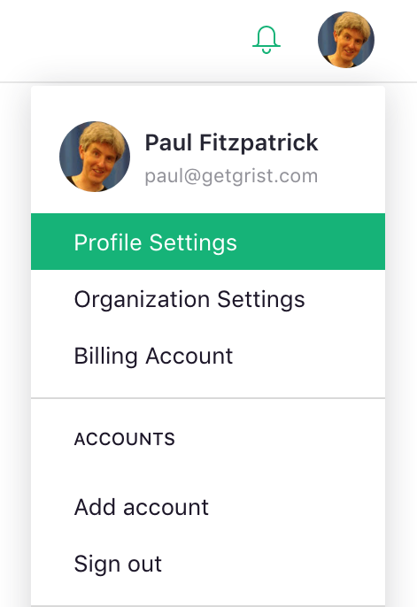
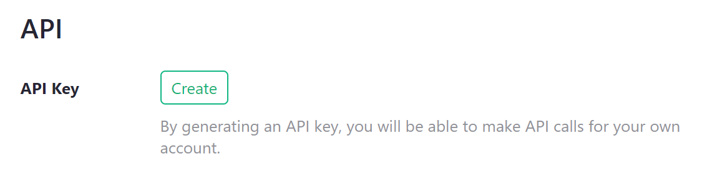

# Grist API

Grist has an API for manipulating documents, workspaces, and team sites.
To access this API, you'll need an API key.  An API key is owned by a single
user, and has the same permissions as that user.  To enable API access for
yourself, click on the circle with your profile picture or initial
on the top right of the screen.  Then select the "Profile Settings"
option.

**
{: .screenshot-half}

This shows a dialog with all of your profile setting options. Scroll down to the "API" section.



Click on the "Create" button to create an API Key.


You can now copy this key for use when making API calls.  To be
clear, copy the key you get when clicking "Create", not the key
in the above screenshot, which isn't a real one.  You can
revoke your API key by clicking "Remove" from Profile Settings at any time.
You'll then have the option to create a new one if you wish.

To test your api key, try this from the command-line (substituting
your api key):
```sh
curl -H "Authorization: Bearer <API-KEY-GOES HERE>" https://docs.getgrist.com/api/orgs
```

This should return a list of organizations, which is what the API calls
[team sites](team-sharing.md) and your personal site.  Your personal site
is accessible at `docs.getgrist.com`.  Team sites are accessible at `<TEAM>.getgrist.com`.

To access documents on your personal site via the API, simply continue
using the `docs.getgrist.com` domain.  To access documents and
workspaces on a team site, use `<TEAM>.getgrist.com`.

For example, to list all the workspaces and documents you have access
to on a site, do:

```sh
curl -H "Authorization: Bearer <API-KEY-GOES-HERE>" \
  https://<docs|TEAM>.getgrist.com/api/orgs/current/workspaces
```

When making changes via the API, and passing data via the request
body, be sure to set the `Content-Type` header to
`application/json`. For example, to change the name of a document, you
could do:

```sh
curl -XPATCH \
  -H "Authorization: Bearer <API-KEY-GOES-HERE>" \
  -H "Content-Type: application/json" \
  -d '{"name": "Lesson Plans"}' \
  https://<docs|TEAM>.getgrist.com/api/docs/<DOC-ID-GOES-HERE>
```

For details of the endpoints available, see our [API docs](api.md).

There are also client libraries available:

 * [JavaScript/TypeScript client library](https://www.npmjs.com/package/grist-api)
 * [Python client library](https://pypi.org/project/grist-api/)
