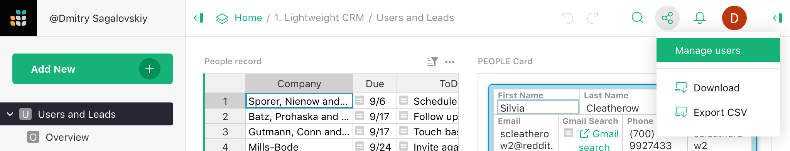
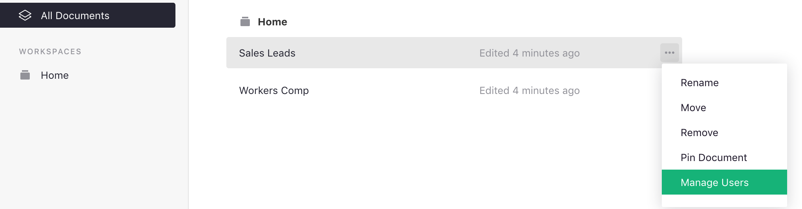

<iframe width="560" height="315" src="https://www.youtube.com/embed/WCF9FpQeEjk" frameborder="0" allow="accelerometer; autoplay; encrypted-media; gyroscope; picture-in-picture" allowfullscreen></iframe>

## Sharing

To collaborate in Grist, you can invite other users to access a document. For team plans,
you can also add users to your team site, or to a workspace (see
[Team Sharing](team-sharing.md)).

When the document is open, click on the sharing icon
()
on the top right of the screen. It opens a menu with sharing and export
options. Select "Manage Users".

This option is also available in the Grist home page, when you click the three-dots icon to the right of a document's name.

If the "Manage Users" item is grayed out, it means you don't have permission to
view or manage the sharing settings for this document.

The sharing dialog that opens lists the users that have access to the
document. To add a user, enter that user's email address and hit "Enter" or click
"Invite new member" in the dropdown.

You may select a role for any invited user, and click "Confirm" to save the changes and send any invitations.

## Roles

There are three primary roles supported by Grist:

- **Viewer**: allows a user to view the document but not make any changes to
  it. Some operations like sorting and filtering will work without affecting
  other users of the document. This is the default role when you type in an email address.

- **Editor**: allows a user to view or make changes to the document data, structure, or formulas,
  but not to its sharing settings.

- **Owner**: gives a user complete permissions to the document, including to view and change its
  sharing settings. A document may have one or more owners. If you are able to open the
  "Manage Users" dialog, you have the "owner" role. You may not change your own
  access, but your access may be reduced or removed by another owner.

The option to inherit access does not affect individual plans, and is explained
in the [Team Sharing](team-sharing.md) article.
