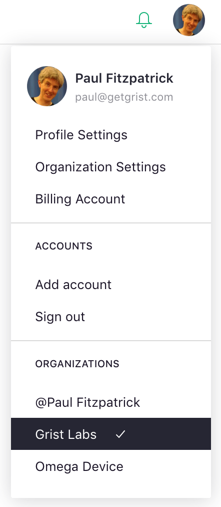
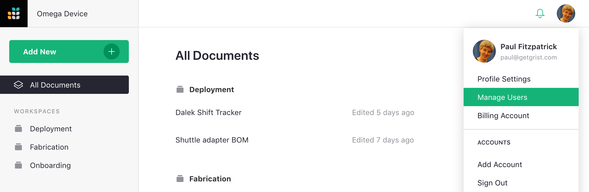

# Team Sharing

We saw how to share individual documents with other users in the
[Sharing](sharing.md) article.  Team sites give your further control,
allowing you to share collections of documents in whole or in part
with others.
Team sites are a paid feature.  To tell whether you have a team site, look at the
top left of the screen.  If you see a name starting with the "@" symbol, this
is a personal site, not a team site.
To use the features in this section, upgrade to a [team plan](https://www.getgrist.com/pricing).

*a personal site*
{: .img-caption }

*a team site*
{: .img-caption }

If you have a team site, but aren't seeing it, click on the circle
with your profile picture or initial on the top right of the screen,
and check the list of sites at the bottom of the menu.

**
{: .screenshot-half }

Not seeing your team site?  Try selecting the "Add account" option in the same menu
if the site might be linked to a different email address.

A fresh team site will look something like this, ready to fill with
Grist documents and share with your team.

If a colleague shared a team site with you, you'll see the same thing,
but depending on the role they chose for you, some options we will
describe in this section may be inactive.  If you need those options,
ask your colleague to change your role.

For a team site you own,
you can [create documents](creating-doc.md), [create workspaces](workspaces.md),
or immediately start sharing the site with others.
To share the site, click on the circle with your profile picture or initial
on the top right of the screen.  Then select the "Manage Users"
option.

You can now invite people just as you did for individual documents in
[Sharing](sharing.md).

Just as for documents, you can invite people as viewers, editors, or owners of the
team site.  All documents within the site will be accessible to those people,
unless you turn off the "Inherit access" sharing option for for the workspaces
they are in (see [Workspaces](workspaces.md)) or for the individual documents.

## Roles

There are three primary roles supported by Grist for team sites:

- **Viewer**: allows a user to view the site, but not make any changes to it.
  A viewer will be allowed to view all workspaces and documents within the site
  unless otherwise specified.

- **Editor**: allows a user to view or make changes to the site and all its workspaces
  and documents (unless otherwise specified).  However, the sharing settings for the
  site, its workspaces, and its documents cannot be changed by an editor.

- **Owner**: gives a user complete permissions to the site's workspaces and documents,
  including their sharing settings.

None of these roles give access to billing information or management.
Billing managers can be added via the "Billing Account" option. 
Click on the circle with your profile picture or initial
on the top right of the screen, and select "Billing Account".
